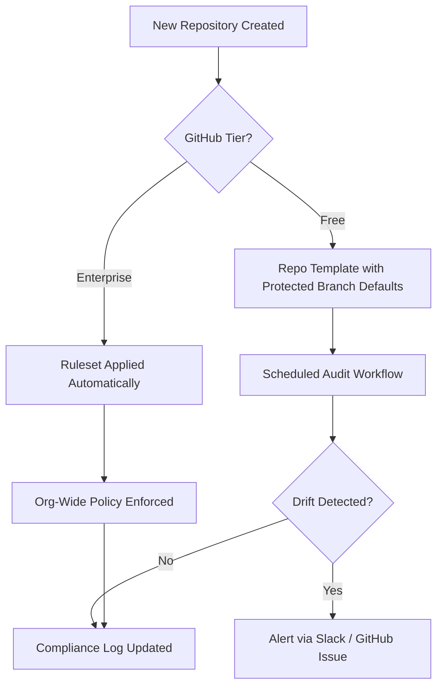

Most teams treat GitHub governance as a settings page. They tick the branch protection box, maybe drop in a CODEOWNERS file, and call it done. Then six months later someone merges directly to `main` at 11pm on a Friday, a secret leaks into a public commit, and suddenly everyone's asking why there was no guardrail.

The real problem isn't missing settings. It's that **governance was never designed as a system** — it was bolted on after the fact.

I've rolled out GitHub governance across dozens of organisations, from 10-engineer startups to regulated financial institutions with 500+ repos. The pattern is always the same: the teams that stay compliant aren't the ones who read the docs most carefully. They're the ones who treat their GitHub config as **living infrastructure** — versioned, automated, and audited.

---

## Branch Protection Is the Foundation, Not the Finish Line

Everyone knows to protect `main`. What most teams miss is that **branch protection is only as strong as its enforcement scope**. The three rules I make non-negotiable on every engagement:

**Required status checks** — CI must pass before merge. Period. For Terraform repos, that means `terraform fmt`, `terraform validate`, and a security scanner like `tfsec`. Configure them explicitly rather than relying on UI defaults:

```yaml
protect-branches:
  required_status_checks:
    contexts:
      - ci/terraform-fmt
      - ci/terraform-validate
      - ci/tfsec-scan
  enforce_admins: true
  required_pull_request_reviews:
    required_approving_review_count: 2
    dismiss_stale_reviews: true
```

**Enforce on admins** — `enforce_admins: true` is the setting teams almost always skip. Admins are the highest-risk actors in a repo. "We trust our admins" is not a governance posture. It's a liability.

**Linear history** — Require squash or rebase merges. A clean commit history isn't aesthetic preference; it's what makes `git bisect` viable and audit trails readable when something goes wrong at 2am.

> **Branch protection without `enforce_admins: true` is governance with an emergency exit left permanently open.**

---

## CODEOWNERS Is Your Accountability Graph

A CODEOWNERS file does one thing well: it makes ownership **explicit and enforced**, rather than tribal knowledge that lives in someone's head and walks out the door when they leave.

The pattern I use is ownership at the directory boundary, not the file level. Teams own domains:

```text
# Platform team owns all CI/CD configuration
/.github/workflows/* @org/platform-team

# Module team owns all reusable modules
/modules/* @org/module-team

# Security team must review any IAM changes
/modules/iam/* @org/security-team
```

Pair this with **required code owner reviews** in branch protection and you've just automated your review routing. No more "did anyone loop in the security team?" conversations in Slack — the platform enforces it before merge.

The gotcha: team-based ownership in CODEOWNERS requires an organisation account. On GitHub Free with private repos, you're limited to individual user references. It works, but it doesn't scale past about 20 engineers before it becomes a maintenance problem.

---

## Enterprise Rulesets vs Free Tier — Know the Gap

This is where I see the most confusion. Teams on GitHub Free often assume they have to manually manage governance repo-by-repo. They don't — but they do have to be intentional about it.

> **GitHub Enterprise Rulesets are organisation-wide policy objects. GitHub Free has no equivalent. The workaround is standardisation through templates, not configuration drift.**

On Enterprise, rulesets enforce branch and tag policies across every repo in an org from a single definition. Tag protection is a common one teams overlook until a junior engineer accidentally deletes a production release tag:

```yaml
name: "Tag Protection"
target: ["MODULE_REPOSITORIES"]
rules:
  - type: TAG_CREATION_RULE
    parameters:
      protected_prefixes:
        - "v"
  - type: TAG_DELETION_RULE
    parameters:
      prevent_deletion: true
```

On Free, you enforce the same intent manually per-repo, and you compensate with two things: a **repo template** that bakes in the right default settings, and a **scheduled audit workflow** that checks for drift. Neither is as clean as rulesets, but together they get you 80% of the way there.



---

## Security Isn't a Tab — It's a Pipeline Stage

I've seen teams treat Advanced Security as something you turn on and forget. **Secret scanning and Dependabot are only useful if someone is actively triaging the alerts.** Enabling them and ignoring them is worse than nothing — it creates the illusion of safety.

For Enterprise, the minimum viable security posture is secret scanning with push protection enabled (blocks commits before they land, not after), Dependabot with auto-PRs for patch updates, and CodeQL on a schedule for critical service repos.

For Free, secret scanning on public repos is free and surprisingly effective. On private repos, Dependabot alerts are your main lever. Configure them deliberately rather than accepting defaults:

```yaml
version: 2
updates:
  - package-ecosystem: "terraform"
    directory: "/"
    schedule:
      interval: "weekly"
    open-pull-requests-limit: 5
```

I've walked into orgs with 200 stale Dependabot PRs that nobody looks at. **A governance control that nobody acts on is worse than no control** — it creates noise that trains engineers to ignore the signal.

---

## Automation Closes the Gap Between Policy and Reality

Policy documents don't enforce themselves. GitHub Actions do.

The pattern I recommend is a **centralised policy action** — a reusable workflow in a governance repo that any team can pull in. For Enterprise teams, this becomes an org-published action that you version and maintain like any other piece of infrastructure:

```yaml
# .github/workflows/compliance-check.yml
jobs:
  policy-check:
    uses: org/governance-actions/compliance-check@v2
    with:
      check-codeowners: true
      check-branch-protection: true
      fail-on-drift: true
```

For Free-tier teams, the same pattern works with a public action or a manually synced workflow file. More friction, but the enforcement logic is identical.

**Scheduled audits** are the other piece most teams skip entirely. A nightly workflow that checks every repo for missing branch protection, absent CODEOWNERS files, or stale admin permissions catches drift before it becomes an incident. It doesn't need to be complex — a GitHub CLI script that posts failures to Slack is a meaningful improvement over finding out at 11pm on a Friday.

---

## Documentation and Ownership Are Governance Too

I'll be blunt: governance documentation is not a wiki page nobody reads. It's the **contract between your platform team and every engineer using the platform.**

Keep governance guidelines in the same repo as the governance tooling. Version it. Review it when policies change. Assign a named **governance champion** per team — not to be the enforcer, but to be the person who can answer "why does this exist?" without filing a ticket and waiting three days.

Onboarding is where governance culture is set or lost. If your onboarding checklist doesn't include "here's how our branch protection works and why it's configured this way", you're creating compliance debt from day one.

---

## Key Takeaways

- **Branch protection without `enforce_admins`** is a governance control with an admin-shaped hole in it — it's the first thing I check and the most common gap I find.
- **CODEOWNERS is your automated accountability graph** — pair it with required reviewer enforcement or it's just documentation masquerading as policy.
- **Enterprise Rulesets vs Free tier** is a real gap — compensate on Free with repo templates and scheduled drift audits, not manual repo-by-repo configuration.
- **Security controls require active triage** — 200 stale Dependabot PRs is worse than no Dependabot; alert fatigue kills the signal.
- **Reusable workflows** are how you scale governance across teams without copy-pasting YAML into 50 repos and hoping nobody modifies it.
- **Scheduled audits** catch configuration drift before it becomes an incident — run them nightly, route failures to Slack, and treat alerts like production pages.
- **Governance documentation lives with the tooling** — versioned, owned, and part of onboarding, not a forgotten Confluence page from 2022.
