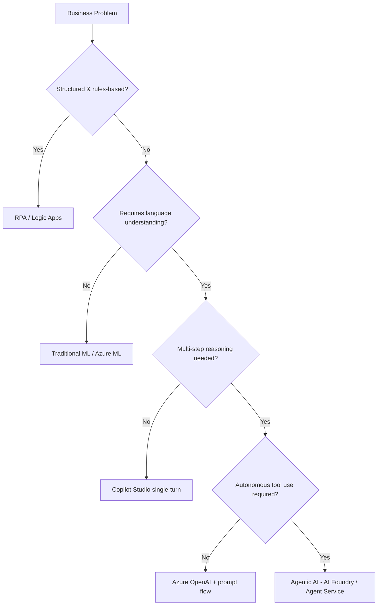
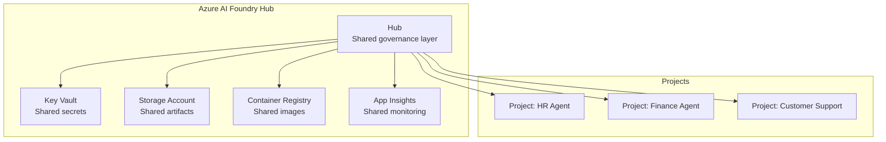
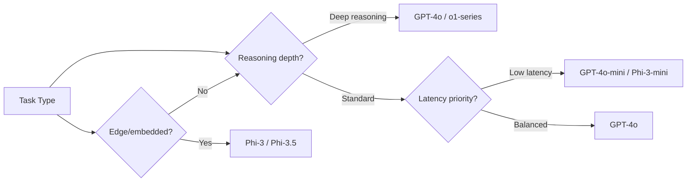
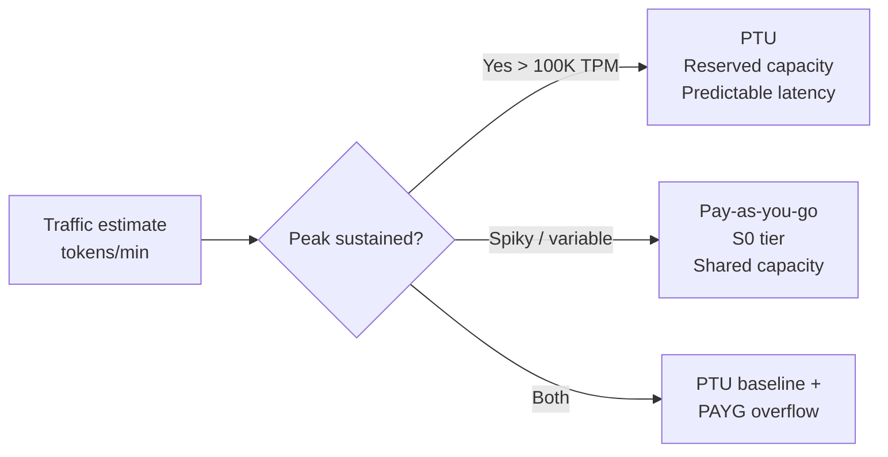
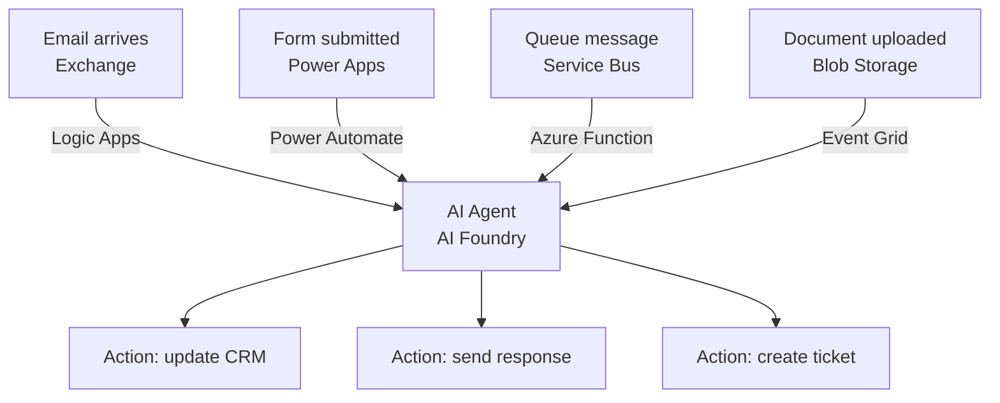

# D1: Plan AI-Powered Business Solutions

> **Exam weight**: 28% · **Questions**: ~17 of 60

## Overview

Domain 1 covers the upfront strategic and architectural decisions for agentic AI initiatives — from identifying the right use cases and mapping them to Azure services, to estimating costs, aligning stakeholders, and satisfying regulatory requirements before a single line of code is written.

---

## Use Case Identification & ROI

### The Agentic AI Decision Framework

Not every automation problem benefits from an AI agent. The decision tree:

### ROI Calculation Factors
- **Cost of current process**: FTE hours × hourly rate × volume
- **Agent cost**: (input tokens × rate) + (output tokens × rate) + Azure AI services
- **Break-even**: typically at >500 repetitive tasks/month
- **Risk discount**: multiply projected savings by (1 - error_rate) for safety margin

### Exam Trap ⚠️

The exam often presents scenarios where Copilot Studio looks like the right answer because it's "no-code." Remember: Copilot Studio is correct for **knowledge worker** tasks with existing Microsoft 365 data. Azure AI Agent Service is correct when you need **custom code execution**, complex multi-agent orchestration, or non-Microsoft data sources.

---

## Azure AI Foundry Architecture

### Hub vs Project

| Concept | Hub | Project |
|---------|-----|---------|
| Scope | Organization-wide | Team/workload |
| Resources | Shared: Key Vault, Storage, ACR | Isolated: endpoints, deployments |
| Access | IT/Governance team | Dev team |
| Cost center | Allocated to projects | Per-project billing |

### Key Hub Services
- **Azure AI Services connection**: one connection = access to all cognitive services
- **Model catalog**: curated list of foundation models (OpenAI, Meta, Mistral, Phi)
- **Compute clusters**: serverless (auto-scale, pay-per-token) vs dedicated (PTU)

---

## Model Selection in AI Foundry

### Model Selection Decision Tree

| Model | Best For | Context | Cost Tier |
|-------|----------|---------|-----------|
| GPT-4o | Complex reasoning, multimodal | 128K | High |
| GPT-4o-mini | High-volume, cost-sensitive | 128K | Low |
| o1-series | Multi-step math/code reasoning | 128K | Very High |
| Phi-3-mini | Edge, low-latency, on-device | 4K | Very Low |
| Phi-3-medium | Balanced local/cloud | 128K | Low |
| Llama 3 | Open-source, fine-tunable | 8K/128K | Variable |

### Make vs Buy: Copilot Studio vs Custom Agent

| Factor | Use Copilot Studio | Use Azure AI Agent Service |
|--------|-------------------|---------------------------|
| Data sources | Microsoft 365, SharePoint, Dataverse | Any (REST, SQL, proprietary) |
| Integration | Power Platform connectors | Azure Functions, custom code |
| Orchestration | Topics-based flow | Code-first, multi-agent |
| Governance | Power Platform DLP | Azure RBAC, custom |
| Code skills | Low-code / no-code | Pro-code required |
| Time to value | Days | Weeks |

### Exam Trap ⚠️

"Copilot Studio uses **topics** (not agents) as its orchestration primitive. If the scenario says 'the solution must call a custom Python function or query a proprietary database,' Copilot Studio's connectors may not be sufficient — Azure AI Agent Service is the right answer."

---

## Capacity Planning

### Provisioned Throughput Units (PTU)

- **PTU**: billed by provisioned unit/hour regardless of usage — best when utilization > 60%
- **PAYG**: billed per 1K tokens — best for dev/test and variable loads
- **Spillover pattern**: PTU primary → PAYG fallback via Azure OpenAI load balancer

### Regional Availability Checklist
- Check model availability per region in AI Foundry model catalog
- EU data residency: use Sweden Central or West Europe
- Asia Pacific: East Asia or Australia East
- Cross-region replication for HA: use Azure Front Door + two regional deployments

---

## Stakeholder Alignment & Compliance

### Responsible AI Checklist (pre-deployment)
1. **Identify** potential harms (use Microsoft RAI Impact Assessment template)
2. **Mitigate** with content filters, human review, rate limits
3. **Document** in a Transparency Note
4. **Monitor** with Azure AI Content Safety + Azure Monitor alerts
5. **Govern** with AI Foundry Hub policies and Azure Policy

### EU AI Act Risk Categories

| Category | Examples | AB-100 Relevance |
|----------|----------|-----------------|
| Unacceptable | Social scoring, real-time biometric surveillance | Out of scope (prohibited) |
| High-risk | HR screening, credit scoring, safety systems | Requires conformity assessment |
| Limited risk | Chatbots, recommendation systems | Transparency obligations |
| Minimal risk | Spam filters, AI in games | No obligations |

### GDPR Considerations for Agents
- Conversation history stored in Cosmos DB must have **TTL policy** (data minimization)
- User data in vector indexes → right to erasure requires **index partitioning by user ID**
- Agent outputs used for profiling → **legitimate interest** or consent required

---

## Integration Patterns

### Event-Driven Agent Trigger Patterns

| Trigger Pattern | Best For | Latency |
|----------------|----------|---------|
| Service Bus queue | High-volume, durable | Seconds |
| Event Grid | File/blob events | Sub-second |
| Logic Apps | Office 365, SaaS | Seconds |
| HTTP direct | Real-time user interactions | <1s |
| Power Automate | Business users, no-code | Seconds |

---

## Cheat Sheet 📋

| Concept | Key Rule |
|---------|----------|
| Hub vs Project | Hub = shared governance; Project = isolated workload |
| PTU vs PAYG | PTU when utilization > 60% and predictable; PAYG for variable/dev |
| Copilot Studio | Use for M365 data + low-code + business users |
| AI Agent Service | Use when custom code, non-Microsoft data, or complex multi-agent |
| EU AI Act HR tool | High-risk → requires conformity assessment |
| Model: GPT-4o-mini | High volume, cost-sensitive, standard reasoning |
| Model: o1-series | Deep reasoning, math/code — NOT for latency-sensitive paths |
| Spillover pattern | PTU primary + PAYG overflow via load balancer |
| Data residency | EU → Sweden Central or West Europe |
| Right to erasure | Partition vector indexes by user ID |
