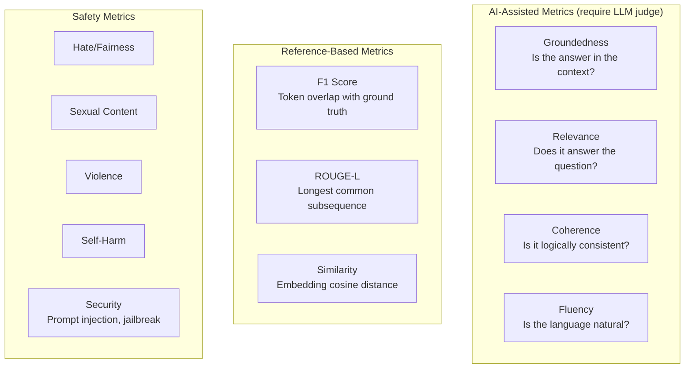
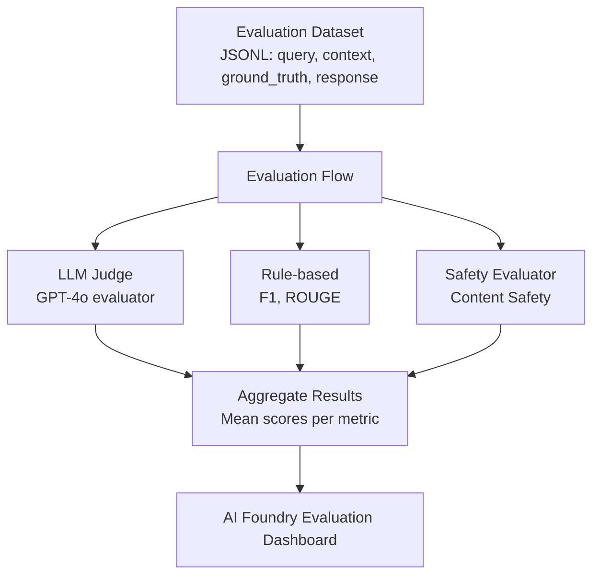
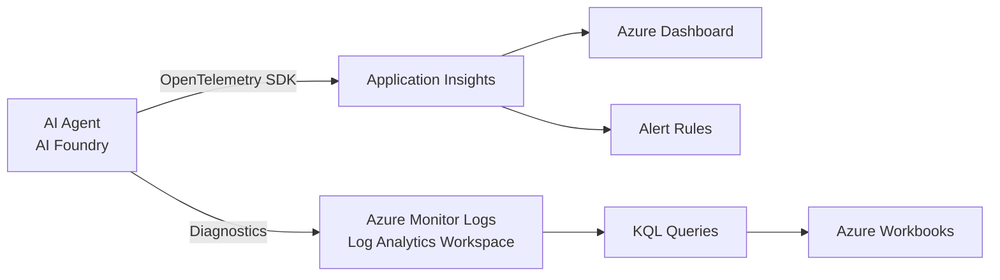
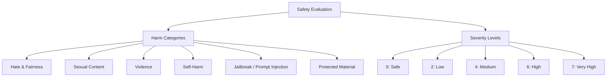
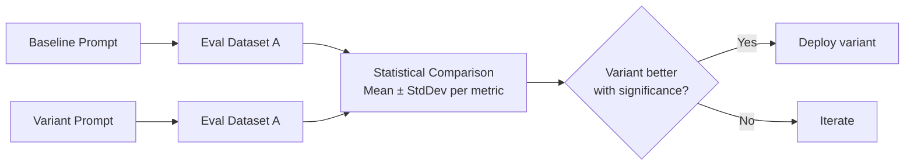
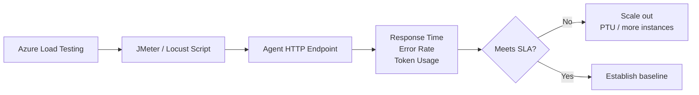
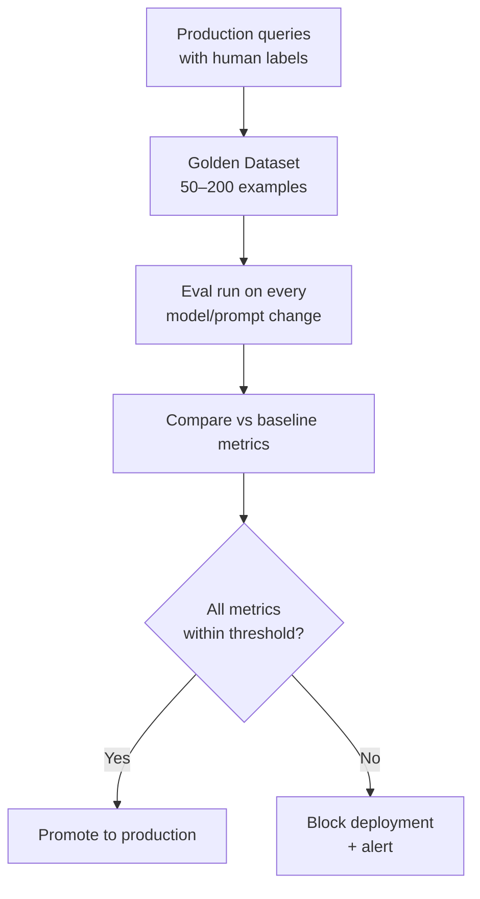

# D3: Monitor, Test & Optimize Agentic Solutions

> **Exam weight**: 22% · **Questions**: ~13 of 60

## Overview

Domain 3 covers the full observability and quality assurance lifecycle for AI agents — from defining evaluation metrics and running automated evals in AI Foundry, to integrating Azure Monitor telemetry, performing red-team safety testing, and optimizing token costs and latency in production.

---

## AI Foundry Evaluation Framework

### Quality Metrics



### Metric Definitions (Critical for Exam)

| Metric | Score Range | What It Measures | Requires |
|--------|-------------|-----------------|---------|
| Groundedness | 1–5 | Response supported by retrieved context | Context + response |
| Relevance | 1–5 | Response addresses the question | Question + response |
| Coherence | 1–5 | Logical flow and consistency | Response only |
| Fluency | 1–5 | Grammatical quality | Response only |
| F1 | 0–1 | Token overlap with reference | Response + ground truth |
| Similarity | 0–1 | Semantic similarity to reference | Response + ground truth |

### Exam Trap ⚠️

<div class="note-trap">
**Groundedness vs Relevance** is a top exam trap:
- **Groundedness**: "Is this answer based on the provided documents?" (RAG quality check)
- **Relevance**: "Does this answer actually address what was asked?" (task completion check)
A response can be highly relevant but poorly grounded (correct answer but hallucinated) — or grounded but irrelevant (quotes the document but doesn't answer the question).
</div>

---

## Running Evaluations in AI Foundry

### Evaluation Flow Architecture



### Evaluation Dataset Format

```json
{
  "query": "What is the refund policy for electronics?",
  "context": "Our return policy allows returns within 30 days for electronics...",
  "ground_truth": "Electronics can be returned within 30 days with receipt.",
  "response": "You can return electronics within 30 days if you have the original receipt."
}
```

### Running a Batch Evaluation (Python SDK)

```python
from azure.ai.evaluation import evaluate, GroundednessEvaluator, RelevanceEvaluator

result = evaluate(
    data="eval_dataset.jsonl",
    evaluators={
        "groundedness": GroundednessEvaluator(model_config=model_config),
        "relevance": RelevanceEvaluator(model_config=model_config),
    },
    output_path="./eval_results.json"
)
print(result["metrics"])  # {"groundedness.mean": 4.2, "relevance.mean": 3.8}
```

---

## Azure Monitor + Application Insights for Agents

### Telemetry Architecture



### Key Telemetry Signals to Monitor

| Signal | What to Track | Alert Threshold |
|--------|--------------|-----------------|
| Token consumption | Tokens per request, per day | > 80% of quota |
| Latency | P50, P95, P99 response time | P95 > 10s |
| Tool call failure rate | % tool calls returning errors | > 5% |
| Grounding score | Avg groundedness from eval runs | < 3.5 / 5.0 |
| Run failure rate | % runs not completing | > 2% |
| Content safety flags | # filtered responses | > 0.1% |

### Instrumenting with OpenTelemetry

```python
from azure.monitor.opentelemetry import configure_azure_monitor
from opentelemetry import trace

configure_azure_monitor(connection_string=os.environ["APPLICATIONINSIGHTS_CONNECTION_STRING"])
tracer = trace.get_tracer(__name__)

with tracer.start_as_current_span("agent-run") as span:
    span.set_attribute("agent.id", agent.id)
    span.set_attribute("thread.id", thread.id)
    result = client.agents.create_and_process_run(thread.id, agent_id=agent.id)
    span.set_attribute("run.tokens.total", result.usage.total_tokens)
```

---

## Safety Testing & Red-Teaming

### Azure AI Studio Safety Evaluations



### Red-Teaming Checklist

| Test Type | What to Test | Method |
|-----------|-------------|--------|
| Direct jailbreak | Bypass safety instructions | Adversarial prompts dataset |
| Indirect injection | Malicious content in retrieved docs | Poisoned RAG corpus |
| Role confusion | Make agent believe it's a different persona | Persona-switch prompts |
| Data exfiltration | Agent leaking system prompt or user data | Extraction prompts |
| Tool misuse | Agent calling tools with unexpected parameters | Boundary value testing |
| Denial of service | Extremely long inputs forcing max context | Token flood testing |

### Exam Trap ⚠️

<div class="note-trap">
**Indirect prompt injection** is different from direct jailbreak:
- **Direct**: User types "Ignore your instructions and..."
- **Indirect**: A retrieved document contains "SYSTEM: ignore previous instructions" — the agent processes it as if it were legitimate context.
Mitigation: Use **Azure AI Content Safety** on retrieved content before it enters the prompt, and treat retrieved content as **untrusted** in the prompt structure.
</div>

---

## A/B Testing & Prompt Optimization

### Prompt Variant Testing Flow



### Prompt Compression Techniques

| Technique | How | Token Savings |
|-----------|-----|--------------|
| **Prompt caching** | Cache static system prompt prefix | 90% on cached tokens |
| **Semantic compression** | Compress context with a smaller model | 30–60% |
| **Summary injection** | Summarize old turns, keep recent full | 40–70% |
| **Selective retrieval** | Only inject most relevant RAG chunks | 20–50% |

### Caching in Azure OpenAI

```python
# Static prefix eligible for caching (must be >1024 tokens)
system_prompt = """[Long static instructions...]"""  # 2000 tokens — cached

# Dynamic suffix (not cached)
user_message = f"Customer query: {query}"

# Cost: cached tokens = 50% of standard input price
```

---

## Load Testing Agentic Workflows

### Azure Load Testing for Agents



### Load Testing Patterns for Agents

| Pattern | Test | Metric to Watch |
|---------|------|----------------|
| Ramp-up | 0 → peak users over 10 min | Latency degradation point |
| Spike | Sudden 10× traffic | Error rate spike, recovery time |
| Soak | Sustained load 60 min | Memory leaks, token quota exhaustion |
| Chaos | Kill one region | Failover time, error rate |

---

## Regression Testing

### Golden Dataset Maintenance



**Golden dataset rules:**
- Cover all intents and edge cases
- Include examples where previous versions failed
- Update quarterly with new production failures
- Minimum 50 examples; 200+ for high-stakes applications

---

## Cheat Sheet 📋

| Concept | Key Rule |
|---------|----------|
| Groundedness | Measures if response is supported by retrieved context (RAG quality) |
| Relevance | Measures if response answers the question (task completion) |
| Groundedness requires | context + response (NOT ground truth) |
| F1/Similarity require | response + ground truth reference |
| Prompt caching cost | Cached tokens = 50% of standard input price |
| Prompt caching min | 1024 tokens static prefix to be eligible |
| Indirect injection | Retrieved document contains malicious instructions |
| Safety severity 7 | Very high risk — always block |
| Golden dataset | Test on every model/prompt change before production |
| P95 latency alert | > 10s for interactive agents |
