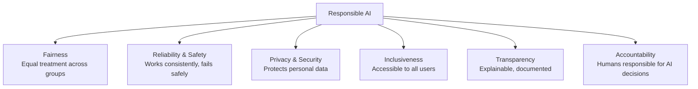
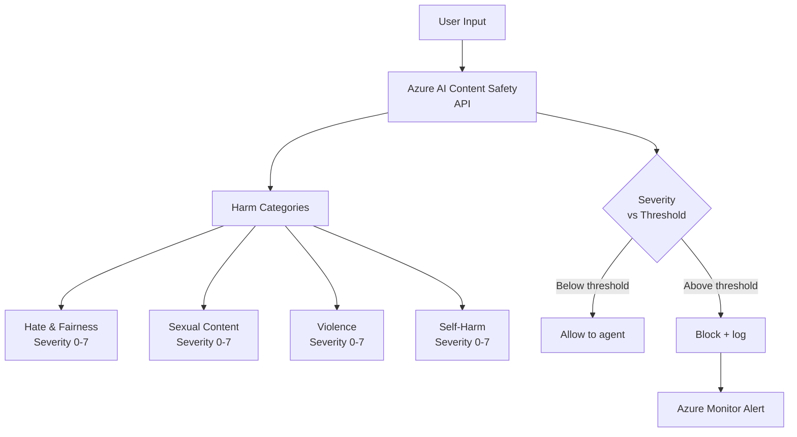
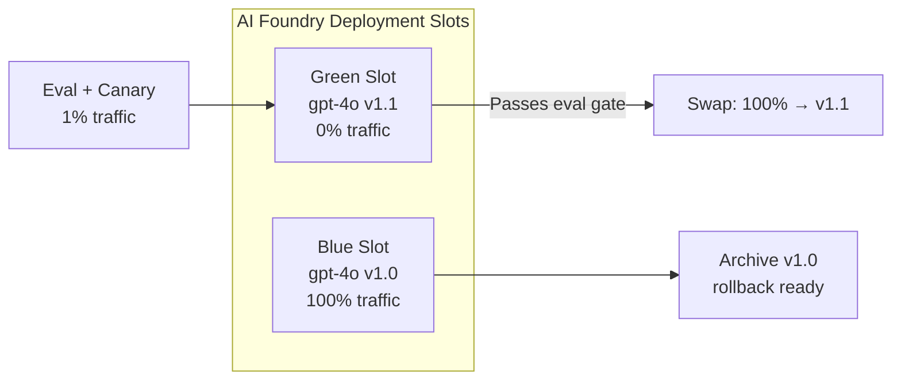
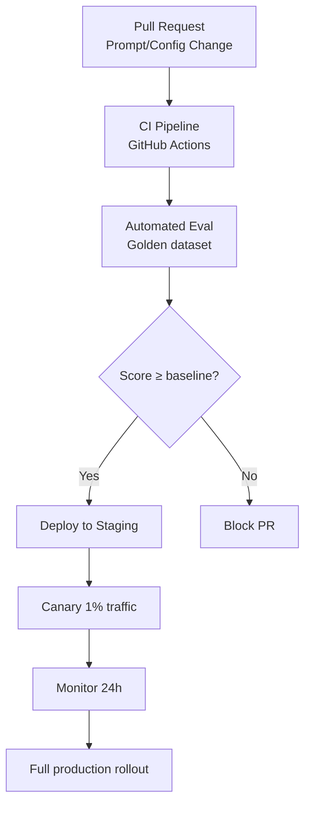
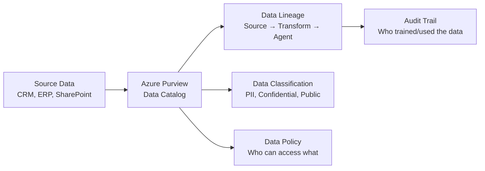
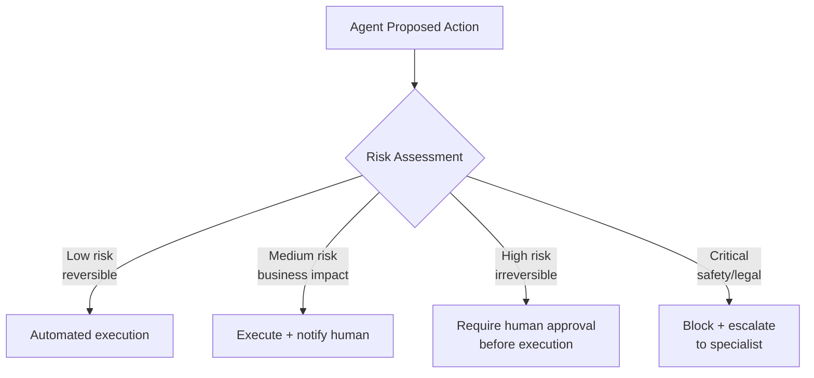
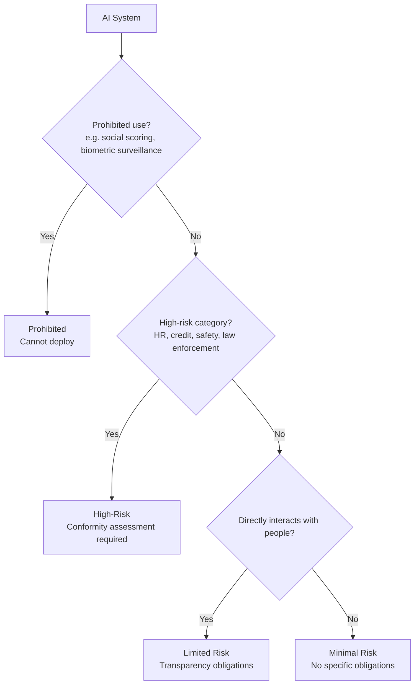
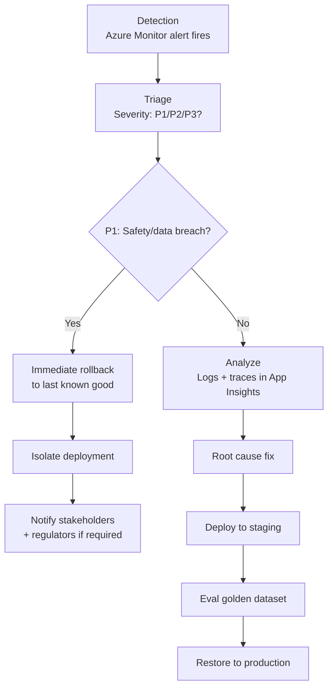

# D4: Lifecycle Management & Responsible AI

> **Exam weight**: 22% · **Questions**: ~13 of 60

## Overview

Domain 4 covers the end-to-end lifecycle of AI agents in production — from responsible AI principles and content safety, to MLOps pipelines for agents, model versioning, data governance, and regulatory compliance. It also tests human-in-the-loop design and incident response procedures.

---

## Microsoft Responsible AI Principles

### The Six Principles



### Operationalizing Each Principle

| Principle | Azure Implementation | AB-100 Exam Pattern |
|-----------|---------------------|---------------------|
| **Fairness** | AI Foundry fairness assessment, demographic parity | Test outputs across gender/race/age groups |
| **Reliability** | Load testing, chaos engineering, fallback agents | Define SLOs, test failure modes |
| **Privacy** | Azure Purview, data masking, TTL on conversations | GDPR compliance, minimal data retention |
| **Inclusiveness** | Accessibility testing, multilingual support | Test with diverse user groups |
| **Transparency** | Transparency Note, model cards, system prompt disclosure | Document what the agent can/cannot do |
| **Accountability** | RBAC audit logs, human oversight gate, signed deployment approvals | Human in approval loop for high-risk actions |

### Exam Trap ⚠️

<div class="note-trap">
The exam tests **accountability vs transparency**:
- **Transparency**: Users know they're talking to an AI and understand what it does.
- **Accountability**: A named human or team is responsible for what the AI does.
An agent that discloses its AI nature satisfies transparency. The human team that deployed it satisfies accountability. These are separate obligations.
</div>

---

## Azure AI Content Safety

### Content Safety Architecture



### Severity Levels

| Level | Severity | Description | Default Action |
|-------|----------|-------------|---------------|
| 0 | Safe | No harmful content | Allow |
| 2 | Low | Potentially sensitive | Allow with logging |
| 4 | Medium | Likely harmful | Block in most contexts |
| 6 | High | Clearly harmful | Always block |
| 7 | Very High | Extreme harm | Always block + alert |

### Custom Blocklists

```python
from azure.ai.contentsafety import ContentSafetyClient
from azure.ai.contentsafety.models import AnalyzeTextOptions

client = ContentSafetyClient(endpoint, credential)

# Analyze text with custom blocklist
request = AnalyzeTextOptions(
    text=user_input,
    blocklist_names=["competitor-names", "pii-patterns"],
    halt_on_blocklist_hit=True  # Stop processing immediately on match
)
response = client.analyze_text(request)
```

### Applying Content Safety to RAG

- Scan **user input** before sending to agent
- Scan **retrieved documents** to prevent indirect injection
- Scan **agent output** before displaying to user
- Log all filtered content to Azure Monitor for audit

---

## Model Lifecycle Management in AI Foundry

### Deployment Slots Pattern



### Model Versioning Rules

| Action | When | Rollback Strategy |
|--------|------|------------------|
| Minor prompt update | Low risk — direct deploy with eval | Redeploy previous prompt version |
| Model version bump (e.g., 1106→0125) | Medium risk — canary 1% first | Swap deployment slot back |
| Foundation model change (GPT-4 → GPT-4o) | High risk — A/B on golden dataset | Keep old deployment 30 days |
| New tool added | Test in staging, eval 100 golden examples | Remove tool from deployment |

### Deployment Governance in AI Foundry



---

## MLOps for AI Agents

### CI/CD Pipeline for Prompt Flows

```yaml
# .github/workflows/agent-deploy.yml
jobs:
  evaluate:
    steps:
      - name: Run evaluation
        run: |
          ai project run \
            --flow ./prompt_flows/invoice_agent \
            --data ./eval/golden_dataset.jsonl \
            --column-mapping query=query context=context \
            --evaluators groundedness relevance
      - name: Check thresholds
        run: python scripts/check_eval_thresholds.py --min-groundedness 3.5

  deploy:
    needs: evaluate
    steps:
      - name: Deploy to AI Foundry
        run: |
          ai project deploy \
            --flow ./prompt_flows/invoice_agent \
            --endpoint invoice-agent-endpoint \
            --deployment-name v2
```

### GitOps for Prompt Management

| Artifact | Source Control | Versioning |
|----------|---------------|------------|
| System prompt | `prompts/system.jinja2` | Git commit SHA |
| Prompt flow | `flows/*.yaml` | Git tag |
| Eval dataset | `eval/*.jsonl` | DVC / Azure ML dataset |
| Model config | `config/model.yaml` | Git commit |
| Safety thresholds | `config/safety.yaml` | Git commit |

---

## Data Governance

### Azure Purview for AI Data Lineage



### Data Governance Requirements for AI Agents

| Requirement | Implementation | Regulation |
|-------------|---------------|------------|
| Data minimization | TTL on conversation logs (90 days default) | GDPR Art. 5 |
| Purpose limitation | Separate indexes per use case | GDPR Art. 5 |
| Right to erasure | Delete user's data from vector index | GDPR Art. 17 |
| Data lineage | Azure Purview scan on training data | EU AI Act |
| Cross-border transfer | Store in EU region for EU citizens | GDPR Ch. 5 |
| Consent management | Explicit consent before conversation storage | GDPR Art. 6 |

---

## Human-in-the-Loop (HITL) Design

### HITL Decision Framework



### Implementing HITL with Power Automate

```python
# Agent detects high-risk action
if action.type == "wire_transfer" and action.amount > 10000:
    # Pause agent, request human approval
    approval_result = await request_approval(
        approver="finance-team@company.com",
        action_description=f"Wire transfer: ${action.amount} to {action.recipient}",
        timeout_hours=4
    )
    if approval_result.approved:
        await execute_action(action)
    else:
        await notify_user("Transaction requires additional review")
```

### Approval Gate Pattern in Power Automate

| Trigger | Approver | Timeout | On timeout |
|---------|----------|---------|------------|
| Amount > $10K | Finance manager | 4 hours | Escalate to CFO |
| Legal document | Legal team | 24 hours | Block action |
| PII data access | Data owner | 1 hour | Deny access |
| External communication | Manager | 2 hours | Hold message |

---

## EU AI Act Compliance

### Risk Classification for AB-100 Exam



### High-Risk AI Requirements

| Requirement | What | Azure Implementation |
|-------------|------|---------------------|
| Conformity assessment | Third-party review before market | AI Foundry compliance documentation |
| Risk management system | Ongoing identification & mitigation | AI Foundry RAI Impact Assessment |
| Data governance | Training data quality controls | Azure Purview lineage |
| Technical documentation | Detailed system description | Model cards + transparency notes |
| Human oversight | Override mechanism | HITL gates, kill switch |
| Accuracy, robustness, cybersecurity | Performance standards | Eval framework, penetration testing |
| Logging | Automatic logging for accountability | Azure Monitor + Log Analytics |

### Exam Trap ⚠️

<div class="note-trap">
**EU AI Act high-risk ≠ "dangerous"**. HR recruitment tools, credit scoring systems, and educational assessment tools are **high-risk** even when they're benign in intent — because they affect fundamental rights (employment, finance, education). The test often presents a "helpful HR chatbot" and expects you to classify it as high-risk.
</div>

---

## Incident Response for AI Systems

### AI Incident Response Flow



### Rollback Decision Matrix

| Issue | Severity | Action | Timeline |
|-------|----------|--------|---------|
| Content safety violation spike | P1 | Immediate rollback | < 15 min |
| Accuracy degradation > 20% | P2 | Canary rollback + investigate | < 1 hour |
| Latency P95 > 30s | P2 | Scale out + investigate | < 1 hour |
| Single tool call failures | P3 | Monitor + fix in next deploy | < 24 hours |
| Prompt injection attempt (blocked) | P3 | Log + review + update blocklist | < 48 hours |

---

## Cheat Sheet 📋

| Concept | Key Rule |
|---------|----------|
| Transparency | Users know they're talking to an AI |
| Accountability | A named human/team is responsible for AI decisions |
| Content Safety severity 4+ | Block in most production contexts |
| Custom blocklist | halt_on_blocklist_hit=True stops processing immediately |
| Blue/green deployment | Deploy to green, test, then swap; keep blue for rollback |
| Golden dataset eval gate | Run on every prompt or model change before promoting |
| GDPR data minimization | TTL on conversation logs (90 days default) |
| GDPR right to erasure | Partition vector index by user ID |
| EU AI Act: HR tools | HIGH risk — requires conformity assessment |
| EU AI Act: chatbot | LIMITED risk — transparency obligations only |
| HITL: irreversible action | Always require human approval before execution |
| P1 incident | Safety/data breach → immediate rollback < 15 min |
