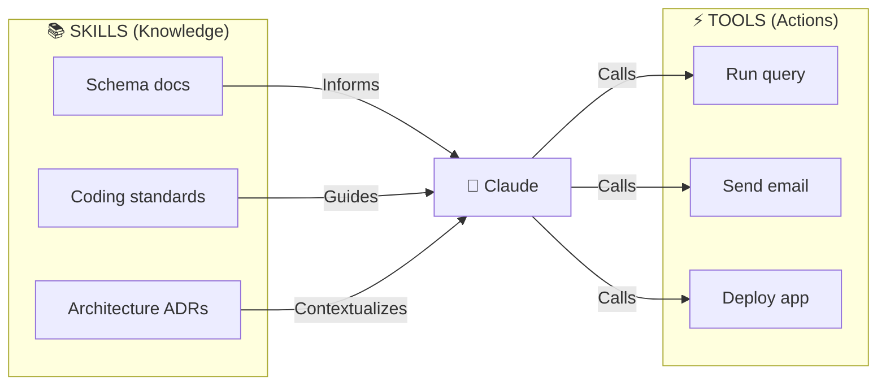
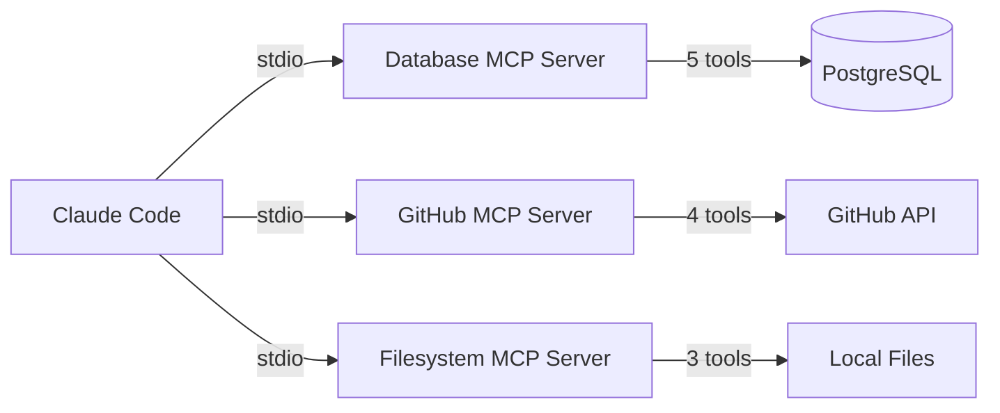
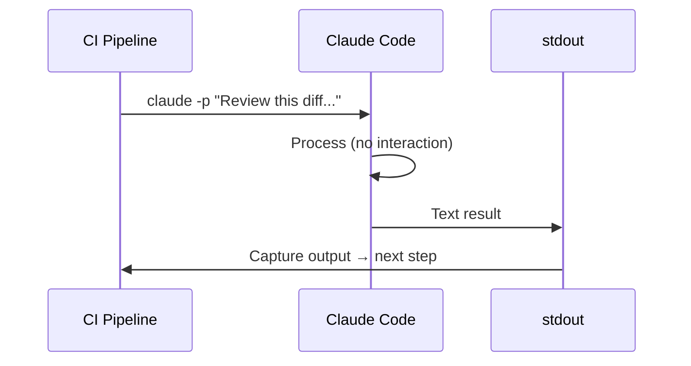
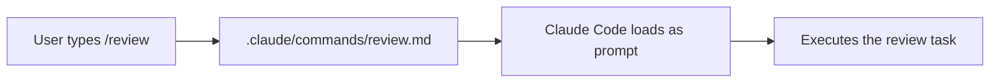

# Domain 2: Claude Code Configuration & Workflows
**Exam Weight: 20%**

---

## The Big Idea

Imagine you join a new team. You open Claude Code. It formats your Python with tabs (you hate tabs). It ignores the team's API naming conventions. A colleague on the same repo gets perfect results. What's different? **Configuration.** Claude Code has a layered configuration system that controls everything — from personal style to file-level rules — and understanding that system is 20% of the CCA-F exam.

<div class="note-important"><strong>Core Principle:</strong> Configuration cascades from broad → specific. The MOST specific rule always wins — like CSS specificity.</div>

---

## 2.1 The 3-Level CLAUDE.md Hierarchy

### 📖 The Story

Picture this: Alex is a senior developer who likes 2-space indentation and Conventional Commits everywhere. Their team at Acme Corp has a monorepo with strict architecture rules. And their React components follow very specific naming patterns that differ from their backend Go services.

Alex needs **three layers** of rules:
- Personal preferences (follow Alex across every project)
- Team/project standards (shared with the whole Acme team)
- File-specific requirements (React files get different rules than Go files)

Claude Code solves this with the **3-Level CLAUDE.md Hierarchy** — and the exam loves to test which level wins conflicts.

### 🧠 Mental Model: CSS Specificity

Think of CLAUDE.md hierarchy exactly like CSS:
- **Global** (`~/.claude/CLAUDE.md`) = browser default stylesheet — weakest
- **Project** (`./CLAUDE.md`) = external stylesheet — medium
- **Scoped** (`.claude/rules/*.md`) = inline style — **strongest, always wins**

```mermaid
graph TD
    G["~/.claude/CLAUDE.md<br/>🌍 GLOBAL<br/>(Lowest Priority)"] --> P["./CLAUDE.md<br/>📁 PROJECT<br/>(Middle Priority)"]
    P --> S[".claude/rules/*.md<br/>🎯 SCOPED<br/>(Highest Priority)"]
    
    style G fill:#1e293b,stroke:#64748b
    style P fill:#1e293b,stroke:#a78bfa
    style S fill:#1e293b,stroke:#22c55e
```

<mark>When rules conflict, the most specific (scoped) ALWAYS wins.</mark>



### The Three Levels in Detail

| Level | Location | Applies To | Use For |
|-------|----------|-----------|---------|
| 🌍 Global | `~/.claude/CLAUDE.md` | All projects on machine | Personal prefs, style |
| 📁 Project | `./CLAUDE.md` | This repo only | Architecture, team rules |
| 🎯 Scoped | `.claude/rules/*.md` | Files matching `path:` glob | File-specific standards |

<div class="note-scribble">Remember: Global is YOUR machine, Project is YOUR REPO, Scoped is YOUR FILES. Person → Team → Precision.</div>

### Level 1: Global — Your Personal Preferences

**Use case: "The Consistent Developer"** — Alex wants Conventional Commits and TypeScript strict mode in every single project, whether it's a weekend hack or Acme's production monorepo.

```markdown
# ~/.claude/CLAUDE.md

- Always use TypeScript strict mode
- Prefer functional components over class components
- Use 2-space indentation
- Never use `any` type
- Commit messages: Conventional Commits format
```

This lives on Alex's machine. The team never sees it. It never goes into version control.

### Level 2: Project — Team-Shared Standards

**Use case: "The Team Onboarding Doc"** — A new hire clones the Acme monorepo. Without reading a wiki, without asking Slack, Claude Code already knows the architecture because `./CLAUDE.md` lives in the repo root.

```markdown
# ./CLAUDE.md (at repo root)

## Architecture
- Monorepo: apps/frontend, apps/backend, packages/shared
- Frontend: React 19 + TanStack Query
- Backend: Express + PostgreSQL
- All API responses: {data, error, meta} shape

## Key Files
- apps/backend/src/repos/ — database access layer
- packages/shared/src/types/ — shared TypeScript interfaces
```

<div class="note-important"><strong>Project CLAUDE.md is version-controlled.</strong> It's committed to the repo — every team member gets the same rules automatically.</div>

### Level 3: Scoped Rules — File-Specific (HIGHEST PRIORITY)

**Use case: "The Polyglot Monorepo"** — Acme's repo has React frontends, Go microservices, and Python ML pipelines. React files need `handleClick` naming. Go files need `errcheck` patterns. Python needs type hints. One project-level rule can't cover all of them.

```markdown
---
path: apps/frontend/**/*.tsx
---
# React Component Standards

- Props interface: {ComponentName}Props
- Use React.memo() for list item components
- Suspense boundaries at route level only
- Event handlers: handleClick, handleSubmit
```

The `path:` frontmatter tells Claude: "Only apply these rules when I'm working on files that match this glob pattern."

### The Frontmatter Trap

This is one of the most commonly tested gotchas on the exam. The YAML frontmatter in scoped rules supports exactly **one key**: `path:`.

```yaml
---
path: src/**/*.ts    # ✅ ONLY valid key
---
```

<div class="note-trap"><strong>TRAP:</strong> The exam will show options like <code>glob:</code>, <code>applies_to:</code>, <code>scope:</code>, or <code>files:</code> as valid frontmatter keys. NONE of these exist. Only <code>path:</code> works.</div>

### Conflict Resolution Walkthrough

Let's say Alex has these three configs:

| Source | Rule |
|--------|------|
| Global | "Use 2-space indentation" |
| Project | "Use 4-space indentation for Python files" |
| Scoped (`path: **/*.py`) | "Use tabs for indentation" |

When Alex edits a `.py` file, Claude uses **tabs** — because scoped rules win. When Alex edits a `.ts` file (no scoped rule matches), Claude uses **2-space** from global (project rule only mentioned Python).

<div class="note-scribble">If the exam asks "which rule applies?" — always check: does a scoped rule's path: glob match the file in question? If yes, scoped wins. Period.</div>

---

## 2.2 Skills vs Tools

### 📖 The Story

Your team lead asks: "I want Claude to know our database schema when writing repository code, AND I want it to be able to run migrations." Two completely different needs:

1. **Knowing** the schema = passive context, like having docs open in a tab
2. **Running** a migration = active execution, like clicking a button that changes the world

Claude Code separates these into **Skills** (knowledge) and **Tools** (actions). The exam will present scenarios and ask you to classify — and the boundary is razor-sharp.

### 🧠 Mental Model: Library Book vs Power Tool

- A **Skill** is a **library book** — you read it, you gain knowledge, the book doesn't change the world
- A **Tool** is a **power drill** — you use it, holes appear in walls, the world changes

<mark>The decision rule: "Does it EXECUTE code at runtime?" → Tool. "Does it INFORM Claude?" → Skill.</mark>



### Classification Practice

| Item | Skill or Tool? | Why |
|------|:---:|---|
| Database schema diagram | 📚 Skill | Informs query writing — no execution |
| Execute SQL query | ⚡ Tool | Runs code against DB — side effects |
| API endpoint docs | 📚 Skill | Context for Claude — read-only knowledge |
| Call an API endpoint | ⚡ Tool | Actually makes HTTP request — side effects |
| Coding standards | 📚 Skill | Guides code generation — no execution |
| Run linter | ⚡ Tool | Executes eslint process — spawns a process |
| Architecture decisions | 📚 Skill | Context for design choices — read-only |
| Deploy to production | ⚡ Tool | Runs deployment pipeline — changes the world |

<div class="note-trap"><strong>TRAP:</strong> "Database schema documentation" is a SKILL (read-only context), not a tool. Even though it's about a database, it doesn't execute anything. Don't be tricked by the subject matter — focus on whether it RUNS code.</div>

### Use Case: Skill File in Action

**"The Schema-Aware Repository Layer"** — You want Claude to write correct SQL whenever it touches files in `apps/backend/src/repos/`. You give it the schema as a scoped skill:

```markdown
<!-- .claude/rules/database-schema.md -->
---
path: apps/backend/src/repos/**/*.ts
---
# Database Schema (Read-Only Context)

## Users Table
| Column | Type | Constraints |
|--------|------|-------------|
| id | uuid | PK, gen_random_uuid() |
| email | text | UNIQUE, NOT NULL |
| role | enum('admin','user') | DEFAULT 'user' |
```

Claude now "knows" the schema whenever it touches repo files. No execution. No side effects. Pure knowledge injection.

<div class="note-scribble">Skills are just markdown files that Claude reads. They live in .claude/rules/ with a path: glob. They're technically the same mechanism as scoped CLAUDE.md rules — just focused on knowledge rather than behavioral instructions.</div>

---

## 2.3 MCP Server Configuration

### 📖 The Story

Your startup uses three external services: a PostgreSQL database, the GitHub API, and a custom internal search engine. You want Claude Code to query all three — not through copy-pasting API docs, but through actual live connections. You need MCP servers.

MCP (Model Context Protocol) servers are the **pluggable backends** that give Claude Code real-world capabilities. Each server exposes tools that Claude can call. And the exam expects you to know exactly how they're configured.

### 🧠 Mental Model: USB Devices

Think of MCP servers like USB peripherals:
- Claude Code is the computer
- Each MCP server is a USB device (printer, camera, storage)
- `stdio` is the USB cable (always the same standard)
- The device driver (`command` + `args`) tells the computer how to talk to it

<mark>Transport is ALWAYS "stdio" for local MCP servers.</mark> The exam may offer "http", "websocket", or "grpc" — these are wrong for local dev tool configurations.



### Configuration in .claude/settings.json

**Use case: "The Multi-Service Workspace"** — Here's how you wire up three MCP servers for a typical full-stack project:

```json
{
  "mcpServers": {
    "database": {
      "command": "node",
      "args": ["./mcp-servers/db-server.js"],
      "transport": "stdio"
    },
    "github": {
      "command": "npx",
      "args": ["-y", "@modelcontextprotocol/server-github"],
      "env": { "GITHUB_TOKEN": "${GITHUB_TOKEN}" },
      "transport": "stdio"
    },
    "filesystem": {
      "command": "npx",
      "args": ["-y", "@modelcontextprotocol/server-filesystem", "./src"],
      "transport": "stdio"
    }
  }
}
```

### Anatomy of an MCP Server Entry

| Field | Purpose | Example |
|-------|---------|---------|
| `command` | Executable to launch | `"node"`, `"python"`, `"npx"` |
| `args` | CLI arguments passed to the command | `["./server.js"]`, `["-y", "@mcp/pkg"]` |
| `env` | Environment variables for the process | `{ "TOKEN": "${MY_TOKEN}" }` |
| `transport` | Communication protocol | Always `"stdio"` |

<div class="note-important"><strong>The <code>env</code> field uses <code>${VAR}</code> syntax</strong> to pull values from the host shell environment. This means secrets stay in your shell profile or CI secrets — never hardcoded in settings.json.</div>

<div class="note-trap"><strong>TRAP:</strong> The exam may show <code>"transport": "http"</code> or <code>"transport": "sse"</code> in a local configuration. For Claude Code local development, the answer is ALWAYS <code>"stdio"</code>.</div>

### Use Case: "The Secrets-Safe Config"

A junior dev hardcodes their GitHub token in `.claude/settings.json` and commits it. **Wrong.**

The correct pattern uses shell variable interpolation:
```json
"env": { "GITHUB_TOKEN": "${GITHUB_TOKEN}" }
```
The `${GITHUB_TOKEN}` resolves from the developer's shell environment at runtime — it's never stored in the file.

<div class="note-scribble">MCP config lives in .claude/settings.json — not CLAUDE.md, not .claude/rules/. Different file, different purpose. settings.json = runtime infrastructure. CLAUDE.md = behavioral rules.</div>

---

## 2.4 Headless Mode (-p Flag)

### 📖 The Story

It's 2 AM. A pull request lands. Your CI pipeline needs to review the diff for security issues — but there's no human at the keyboard. Claude Code needs to run **non-interactively**, read the diff, produce a review, and exit. No prompts, no confirmations, no "press Y to continue."

This is **headless mode**: Claude Code as a CLI tool in automated pipelines. And the exam has a devastating trap about exit codes.

### 🧠 Mental Model: The Silent Consultant

Headless mode turns Claude from an interactive pair programmer into a **consultant you mail a question to**:
- You send a letter (the `-p` prompt)
- They write back (stdout)
- They leave (exit code)
- They never ask clarifying questions



### Usage Patterns

```bash
# Basic: prompt in, text out
claude -p "List all TODO comments in src/"

# Pipe to file
claude -p "Review this code for security issues" > review.txt

# Pipe input TO Claude + prompt
DIFF=$(git diff HEAD~1)
echo "$DIFF" | claude -p "Find bugs in this diff. Output JSON."
```

### Use Case: "The Automated PR Reviewer"

Your team wants every pull request reviewed by Claude before a human looks at it. Here's the GitHub Actions workflow:

```yaml
name: AI Code Review
on: [pull_request]
jobs:
  review:
    runs-on: ubuntu-latest
    steps:
      - uses: actions/checkout@v4
      - name: Claude Review
        run: |
          DIFF=$(git diff ${{ github.event.pull_request.base.sha }} HEAD)
          echo "$DIFF" | claude -p "Review for security issues. Output JSON: {issues: [{file, line, severity, description}]}" > review.json
        env:
          ANTHROPIC_API_KEY: ${{ secrets.ANTHROPIC_API_KEY }}
```

### The Exit Code Trap (Exam Critical!)

This is arguably the **most-tested trap** in Domain 2. Read this carefully:

| Code | Actually Means | What Students Wrongly Think |
|------|-------|----------------|
| **0** | Claude ran the command successfully | ❌ "No bugs found" |
| **1** | Claude command itself FAILED (auth error, bad args) | ❌ "Bugs were found" |

<div class="note-important"><strong>Exit 0 = "Claude successfully completed its task."</strong> If Claude finds 47 critical security bugs, it STILL exits 0 — because it successfully ran the review. Exit 1 means Claude itself crashed (wrong API key, malformed arguments, network failure).</div>

**The analogy:** You ask a doctor to examine a patient. The doctor says "this patient has cancer." Did the *doctor* fail? No — the doctor succeeded at their job. Exit 0. The doctor failing would be: they didn't show up (wrong address, expired license). Exit 1.

<div class="note-trap"><strong>TRAP:</strong> An exam question might say "Your CI pipeline uses Claude to find bugs. Which exit code indicates bugs were found?" The answer is NOT 1. It's 0 — Claude succeeded at finding bugs. The content of stdout tells you WHAT was found. The exit code tells you whether CLAUDE ITSELF worked.</div>

<div class="note-scribble">Think of it this way: exit codes describe the MESSENGER, not the MESSAGE. Exit 0 = messenger delivered successfully. Exit 1 = messenger got lost.</div>

---

## 2.5 Slash Commands

### 📖 The Story

Your team does code reviews every day. Every time, someone types the same 8-line prompt: "Review this file for security issues, check error handling, look for N+1 queries, format as a table..." Tedious. Error-prone. Someone always forgets the performance check.

Slash commands let you save reusable prompts as markdown files. Type `/review` instead of 8 lines. Everyone on the team gets the same thorough review.

### 🧠 Mental Model: Shell Aliases

Slash commands are like bash aliases but for Claude prompts:
- `alias ll='ls -la'` → saves a shell command
- `.claude/commands/review.md` → saves a Claude prompt

<mark>Slash commands live in `.claude/commands/{name}.md` and are invoked as `/{name}`.</mark>



### File Structure

```
.claude/
  commands/
    review.md      → /review
    commit.md      → /commit
    test.md        → /test
    migrate.md     → /migrate
```

The mapping is dead simple: the filename (minus `.md`) becomes the command name. No registration, no config, no manifest. Drop a markdown file, get a command.

### Use Case: "The Consistent Commit Message"

Every developer on your team writes commit messages differently. Some use past tense, some use emoji, some write novels. You standardize with a slash command:

```markdown
<!-- .claude/commands/commit.md -->
Generate a git commit message for staged changes.

Rules:
1. Conventional Commits: type(scope): description
2. Types: feat, fix, refactor, docs, test, chore, perf
3. Scope: primary directory or module
4. Imperative mood, lowercase, no period
5. Multi-concern changes → suggest splitting into multiple commits

Output ONLY the commit message.
```

Now everyone types `/commit` and gets a properly formatted message. No arguments about style.

### Use Case: "The Security-First Review"

```markdown
<!-- .claude/commands/review.md -->
Review current file for:
1. 🔴 Security: injection, XSS, auth bypass, secrets in code
2. 🟡 Errors: unhandled promises, swallowed errors
3. 🔵 Performance: N+1, missing memoization
4. ⚪ Types: any usage, missing return types

Format: Line number + Severity emoji + Fix recommendation
If no issues: "No issues detected" (don't fabricate)
```

<div class="note-scribble">Slash commands are version-controlled (they're in .claude/commands/ in the repo). This means the whole team shares them via git. Unlike global CLAUDE.md which is per-machine.</div>

<div class="note-trap"><strong>TRAP:</strong> Slash commands live in <code>.claude/commands/</code> — NOT <code>.claude/rules/</code> (that's for scoped rules). Don't confuse the two directories. commands = reusable prompts. rules = automatic context injection.</div>

---

## 2.6 Permissions

### 📖 The Story

Your company has four environments where Claude Code runs:
1. **Local dev** — developers using Claude interactively on their laptops
2. **CI review** — Claude reviews PRs automatically in GitHub Actions
3. **Deploy pipeline** — Claude runs deployment scripts
4. **Security audit** — Claude analyzes code for compliance reporting

Each environment needs different **permissions**. You don't want the CI review bot accidentally modifying source code. You don't want the audit tool making network calls to external services. Permissions control what Claude Code is *allowed to do*.

### 🧠 Mental Model: Hotel Key Cards

Think of permissions as hotel key cards:
- **Read** = you can enter the lobby and look around
- **Write** = you can enter your room and rearrange furniture
- **Execute** = you can use the gym equipment (things that DO stuff)
- **Network** = you can use the hotel phone to call outside

Different guests (environments) get different cards.

### Permission Categories

| Permission | Controls | When to Deny |
|------------|----------|----------|
| `read` | File reading, directory listing | Rarely denied |
| `write` | Create, modify, delete files | CI review bots, audits |
| `execute` | Shell commands, scripts | Read-only audits |
| `network` | HTTP requests, API calls | Sandboxed / air-gapped environments |

<mark>The exam tests you on matching environments to permission sets.</mark>

### Environment Presets

| Environment | Permissions | Rationale |
|-------------|------------|-----------|
| 🏠 Local dev | All allowed | Developer needs full capability |
| 🔍 CI review | Read only | Must NOT change code during review |
| 🚀 Deploy | Read + Execute | Run scripts, but don't edit source |
| 🛡️ Audit | Read only | Analysis only — no side effects |

<div class="note-important"><strong>CI review = read-only.</strong> This is the most tested preset. A review bot that can write to files could accidentally modify code during review — a security risk and a correctness issue.</div>

### Use Case: "The Overpowered Review Bot"

A team sets up Claude in CI with full permissions. During a PR review, Claude finds a bug and *automatically fixes it* — modifying the PR branch without the developer's knowledge. Chaos. The fix introduced a regression.

**Lesson:** CI review environments should be **read-only**. Claude reports findings; humans decide what to fix.

<div class="note-trap"><strong>TRAP:</strong> "Deploy" permission includes Execute but NOT Write. This seems counterintuitive — doesn't deploying require creating files? No. Deploy runs existing scripts (execute) that handle the deployment. Claude itself shouldn't be editing source files during a deploy.</div>

<div class="note-scribble">Memory aid: "RWXN" — Read, Write, eXecute, Network. Same concept as Unix file permissions, extended to network access. If you know chmod, you know this.</div>

---

## 📋 Domain 2 Cheat Sheet

| Concept | Key Fact |
|---------|----------|
| Hierarchy winner | Scoped (`.claude/rules/`) > Project (`./CLAUDE.md`) > Global (`~/.claude/CLAUDE.md`) |
| YAML frontmatter | ONLY `path:` is valid. Not `glob`, `scope`, `applies_to`, `files` |
| Skills | Markdown knowledge files (read-only context injection) |
| Tools | Functions with runtime execution (produce side effects) |
| Skill vs Tool test | "Does it EXECUTE?" → Tool. "Does it INFORM?" → Skill |
| MCP config location | `.claude/settings.json` under `mcpServers` |
| MCP transport | Always `"stdio"` for local tools |
| MCP env vars | `${VAR}` syntax — resolved from host shell |
| Headless mode | `claude -p "prompt"` — non-interactive, for CI/CD |
| Exit code 0 | Command completed successfully (NOT "no issues found") |
| Exit code 1 | Claude itself FAILED (auth, bad args, crash) |
| Slash commands location | `.claude/commands/{name}.md` → invoked as `/{name}` |
| Slash commands vs rules | `commands/` = reusable prompts. `rules/` = auto-injected context |
| CI review permissions | Read only — never allow write in review bots |
| Deploy permissions | Read + Execute — no source file edits |

---

## 🧩 Domain 2 Decision Flowchart

Use this when the exam gives you a scenario and asks "where does this belong?"

```mermaid
flowchart TD
    Q["What are you configuring?"] --> B1{"Behavioral rule<br/>or runtime infra?"}
    B1 -->|"Behavioral"| B2{"Who does it apply to?"}
    B1 -->|"Runtime infra<br/>(MCP, servers)"| CF[".claude/settings.json"]
    
    B2 -->|"Just me,<br/>all projects"| GL["~/.claude/CLAUDE.md<br/>(Global)"]
    B2 -->|"Whole team,<br/>this project"| PR["./CLAUDE.md<br/>(Project)"]
    B2 -->|"Specific files<br/>matching a pattern"| SC[".claude/rules/*.md<br/>(Scoped, path: glob)"]
    
    Q --> R{"Reusable prompt<br/>or always-on rule?"}
    R -->|"Reusable<br/>(user invokes)"| CMD[".claude/commands/*.md<br/>(/name slash command)"]
    R -->|"Always-on<br/>(auto-injected)"| SC
    
    style CF fill:#1e293b,stroke:#f59e0b
    style GL fill:#1e293b,stroke:#64748b
    style PR fill:#1e293b,stroke:#a78bfa
    style SC fill:#1e293b,stroke:#22c55e
    style CMD fill:#1e293b,stroke:#3b82f6
```



<div class="note-scribble">When in doubt on exam day: "Is it about RUNNING something external?" → settings.json. "Is it about BEHAVIOR?" → CLAUDE.md hierarchy. "Is it a user-triggered prompt?" → commands/.</div>
