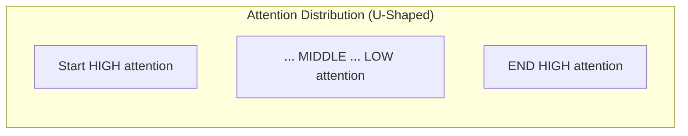
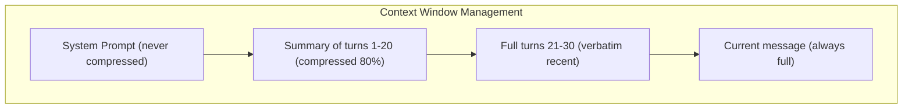
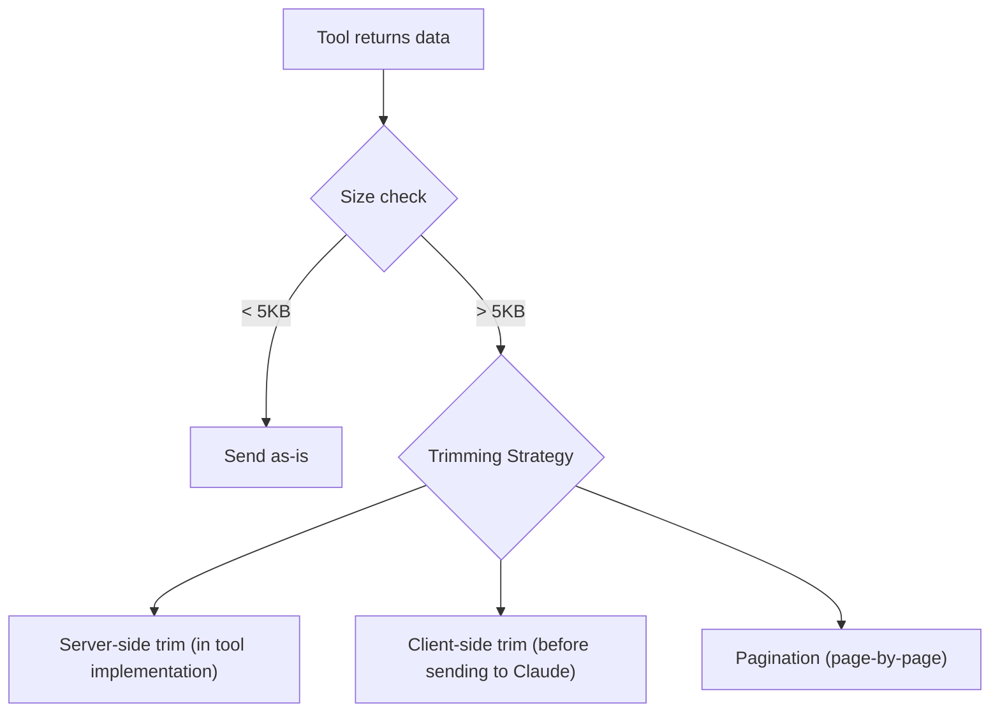
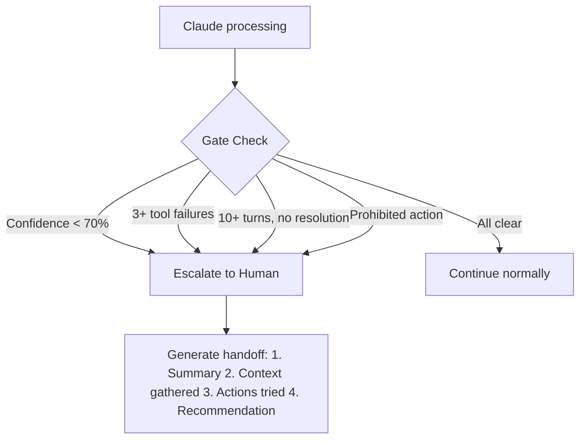
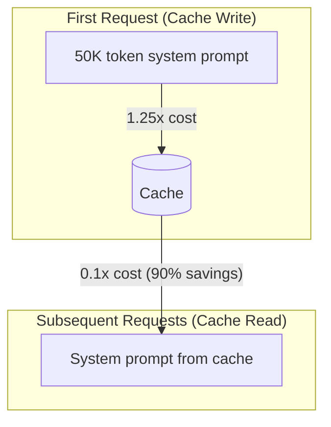
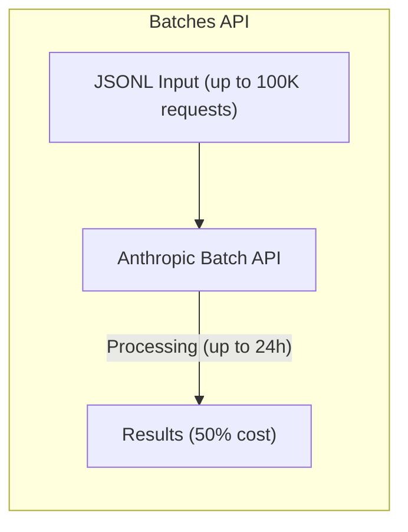
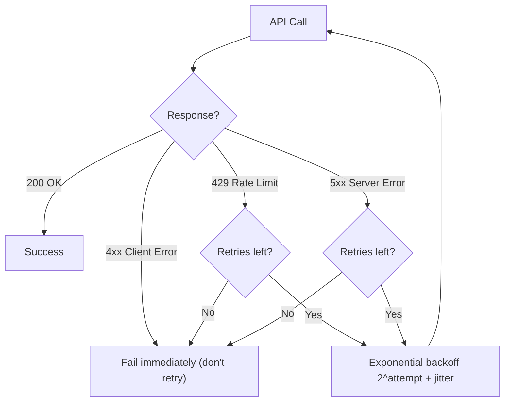

# Domain 5: Context Management & Optimization
**Exam Weight: 15%**

---

## 🧠 The Core Mental Model

> **Context window = a desk.** Too many papers and you can't find anything. The papers at the top and bottom of the stack get noticed; the ones in the middle get buried. Summarize = file the old papers but keep the receipts. Cache = pre-printed name badges at a conference — the first one costs time, the rest are free.

<div class="note-important"><strong>The Three Commandments of Context:</strong> (1) Position matters — start and end get attention; (2) Never lose specific numbers; (3) Pay once, reuse many times via caching.</div>

---

## 5.1 The Lost-in-the-Middle Problem

### 📖 Story: "The Buried Account Number"

A fintech support agent was processing a complex dispute. The system prompt set the tone (message 1). Then came 45 messages of back-and-forth. The customer's account number — `ACC-8827-XR` — was mentioned in message 4. By message 46, when Claude needed to file the dispute, it referenced "the customer's account" but couldn't surface the actual number. It was *buried in the middle*.

The team moved the account number into the system prompt's critical-context block. Problem solved overnight.

<div class="note-scribble">Think of attention like a U-shaped bathtub — water pools at both ends, the middle is dry. That's where info goes to die.</div>

### The U-Shaped Attention Curve



```
Attention Level
 ####                                ####
 ####................................####
 ####................................####
 —————————————-> Position
 START          MIDDLE               END
 (HIGH)         (LOW)                (HIGH)
```

<div class="note-important"><strong>Critical info goes at START and END.</strong> The middle of the context window receives the least attention from the model. This is an empirically observed behavior, not a bug.</div>

### Positioning Strategy Table

| Content | Position | Why |
|---|:-:|-|
| System prompt / role | Start | Highest attention, sets behavior |
| Critical constraints | Start | Must never be forgotten |
| Reference documents | Middle | Searched when needed (acceptable) |
| Current task / query | End | Recency boost for focus |
| Output format | End | Fresh in working memory |

<div class="note-trap"><strong>TRAP:</strong> An exam question may show "critical customer SLA" placed in the middle of a 50K-token document block, with Claude failing to honor it. The fix is NEVER "add more emphasis" — it's repositioning to start or end.</div>

### Use Case: "The Sandwich Technique"

```python
messages = [
    {"role": "user", "content": [
        # Position 1 (Start): Critical context - HIGH attention
        {"type": "text", "text": "<context>Enterprise customer. LTV: $45K. Account: 3 years.</context>"},

        # Position 2 (Middle): Reference bulk - acceptable lower attention
        {"type": "text", "text": "<docs>[... 50K tokens of product documentation ...]</docs>"},

        # Position 3 (End): Current task - HIGH attention (recency)
        {"type": "text", "text": "<task>Explain Enterprise Plus tier benefits. Be concise.</task>"}
    ]}
]
```

**Mental model:** You're writing a memo. Put the TL;DR at the top, the appendix in the middle, and the action item at the bottom. Nobody reads the appendix cover-to-cover — they search it when needed.

---

## 5.2 Progressive Summarization

### 📖 Story: "The Vanishing Order Number"

A support agent processed 30 messages. On message 31, it forgot the customer's order number from message 3. Why? The context window hit capacity. The system summarized old messages — but the junior dev who wrote the summarizer used a generic prompt: *"Summarize the conversation so far."*

The summary said: "Customer had a billing issue with a recent order." The order number `ORD-4829AF01`, the charge of `$147.32`, the date `2025-03-15` — all gone. The customer had to repeat everything. CSAT dropped. The fix was one line in the summarization prompt: **"PRESERVE all IDs, amounts, dates, and commitments VERBATIM."**

<div class="note-important"><strong>NEVER round, approximate, or paraphrase specific data values when summarizing.</strong> Order IDs, dollar amounts, dates, email addresses, error codes — these must survive compression intact.</div>

### Mental Model: Filing Cabinets

> Summarization is filing, not shredding. You keep the receipts (IDs, amounts, dates) and throw away the small talk. If you can't reconstruct the exact transaction from your summary, you've filed wrong.

### The Architecture



### What to Preserve vs Compress

| Always Preserve (Verbatim) | Safe to Compress |
|-|-|
| Order IDs, customer IDs | Pleasantries ("Thanks!", "Sure!") |
| Dollar amounts, dates | Repeated explanations |
| Email addresses, phone numbers | Claude's verbose reasoning |
| Error messages, codes | Already-answered questions |
| Promises/commitments made | Exploratory back-and-forth |
| Technical specs (versions) | "You're welcome" exchanges |

<div class="note-trap"><strong>TRAP:</strong> If an exam question shows a summary that says "customer was charged approximately $150 in March" when the original was "$147.32 on 2025-03-15," that summary is WRONG. The correct answer always preserves exact values.</div>

<div class="note-scribble">The rule is simple: if it has digits or looks like an identifier, copy-paste it into the summary. No exceptions.</div>

### Implementation

```python
def manage_context(messages: list, max_tokens: int = 100000) -> list:
    if count_tokens(messages) <= max_tokens:
        return messages  # No compression needed

    system_prompt = messages[0]
    recent_count = 10
    old_messages = messages[1:-recent_count]
    recent_messages = messages[-recent_count:]

    # Summarize old messages (preserve specifics!)
    summary = client.messages.create(
        model="claude-sonnet-4-20250514",
        system="""Summarize conversation. PRESERVE VERBATIM:
- IDs, order numbers, account numbers
- Dollar amounts, dates, times
- Names, addresses, emails
- Error codes, versions
- Promises made
REMOVE: pleasantries, reasoning, repetition.""",
        messages=[{"role": "user", "content": format_messages(old_messages)}]
    ).content[0].text

    return [
        system_prompt,
        {"role": "user", "content": f"<summary>{summary}</summary>"},
        {"role": "assistant", "content": "Context loaded. Continuing..."},
        *recent_messages
    ]
```

---

## 5.3 Tool Result Trimming

### 📖 Story: "The 10,000-Row Explosion"

A developer built an MCP tool that returned full database query results. One user asked "show me all customers in California." The tool returned 10,247 rows, each with 15 fields. That's ~200K tokens dumped into the context window — exceeding the limit and causing a hard failure. Even if it fit, Claude would lose critical info buried in the middle of those rows.

The fix: return the top 5 results with a `total_count` and a pagination hint. Claude learned to ask for more only when needed.

### Mental Model: The Librarian

> A good tool is like a librarian. You don't dump all 10,000 books on someone's desk. You bring the 5 most relevant ones and say, "I have 10,000 more if these aren't right." Let the user ask for specifics.



### Strategy 1: Server-Side Trim (Best Practice)

```python
@mcp.tool()
def search_products(query: str, limit: int = 5) -> dict:
    results = db.search(query, limit=50)  # Fetch more for ranking

    # Return only what Claude needs
    return {
        "results": [{"id": r.id, "name": r.name, "price": r.price}
                   for r in results[:limit]],
        "total": len(results),
        "message": f"Top {limit} of {len(results)}. Ask for more if needed."
    }
```

### Strategy 2: Pagination

```python
@mcp.tool()
def list_customers(page: int = 1, per_page: int = 10) -> dict:
    """Returns one page at a time. Use page param to navigate."""
    offset = (page - 1) * per_page
    customers = db.customers.find().skip(offset).limit(per_page)
    return {
        "customers": [brief(c) for c in customers],
        "pagination": {"page": page, "total_pages": total // per_page + 1}
    }
```

<div class="note-scribble">Every tool should answer: "What's the MINIMUM Claude needs to decide the next step?" — not "here's everything I know."</div>

---

## 5.4 Escalation Logic

### 📖 Story: "The Bot That Wouldn't Quit"

A customer support agent hit an edge case: the customer's account was in a corrupted state that no tool could fix. The agent tried the `repair_account` tool. Failed. Tried `reset_billing`. Failed. Tried `escalate_ticket`... which called `repair_account` again internally. 14 turns later, the customer was furious, and the agent was still spinning. The team added escalation triggers: after 3 consecutive tool failures OR 10 turns without resolution, auto-escalate to a human with full context.

### Mental Model: The 3-Strikes Rule

> A good agent knows when to tap out. Three strikes (tool failures), ten rounds (turn limit), or a prohibited move (dangerous action) = hand off to a human. Always pass the baton WITH context — what you tried, what failed, what you recommend.



<div class="note-important"><strong>Four escalation triggers:</strong> (1) Confidence < 70%, (2) 3+ consecutive tool failures, (3) 10+ turns without resolution, (4) Prohibited action requested.</div>

### Implementation

```python
ESCALATION_TRIGGERS = {
    "low_confidence": lambda ctx: ctx["confidence"] < 0.7,
    "tool_failures": lambda ctx: ctx["consecutive_failures"] >= 3,
    "stalled": lambda ctx: ctx["turns_without_resolution"] > 10,
    "prohibited": lambda ctx: ctx["action"] in ["delete_account", "refund_over_500"],
}

def check_escalation(context: dict) -> dict | None:
    reasons = [name for name, check in ESCALATION_TRIGGERS.items() if check(context)]
    if reasons:
        return {"escalate": True, "reasons": reasons, "team": classify_team(context)}
    return None
```

<div class="note-trap"><strong>TRAP:</strong> The exam may ask "What should the agent do after 3 consecutive tool failures?" The answer is escalate to a human — NOT "try a different tool" or "increase retry count."</div>

---

## 5.5 Prompt Caching

### 📖 Story: "The $15 Cache That Saved $15K"

A legal-tech startup sent the same 50K-token system prompt (case law, compliance rules, firm policies) with every single API call. With 1,000 calls/hour, they were spending $15/hour just on that static prompt — $360/day, $10K+/month on *unchanging text*.

One engineer added `cache_control: {"type": "ephemeral"}` to the system prompt block. The first call cost 25% more (the cache write). The next 999 calls cost 90% less. Monthly bill dropped from $10K to $1.6K. That single annotation paid for itself in the first hour.

<div class="note-scribble">Caching is the easiest win in the entire Anthropic API. If you send the same big block repeatedly, you're burning money for no reason.</div>

### Mental Model: Pre-Printed Name Badges

> Cache = pre-printed name badges at a conference. Making the first badge costs time (design, print). But once the template exists, stamping out 999 more is nearly free. The badge expires after 5 minutes of no one picking it up (TTL). If someone grabs one every 4 minutes, it stays available forever.



### How to Use

```python
response = client.messages.create(
    model="claude-sonnet-4-20250514",
    system=[{
        "type": "text",
        "text": large_system_prompt,       # 50K tokens
        "cache_control": {"type": "ephemeral"}  # Cache this!
    }],
    messages=[{
        "role": "user",
        "content": [{
            "type": "text",
            "text": reference_docs,         # Another 20K tokens
            "cache_control": {"type": "ephemeral"}  # Cache this too!
        }, {
            "type": "text",
            "text": "What's the return policy?"  # No cache (changes every time)
        }]
    }]
)
```

### Cache Properties — <mark>MEMORIZE for Exam</mark>

| Property | Value |
|----|---|
| TTL | <mark>**5 minutes**</mark> (refreshed on each hit) |
| Minimum block size | <mark>**1024 tokens**</mark> (Sonnet) |
| Max breakpoints per request | <mark>**4**</mark> |
| Cache write cost | **1.25x** normal input cost |
| Cache read cost | **0.1x** normal input cost (90% savings) |
| Scope | Per-model, per-organization |

<div class="note-important"><strong>TTL refreshes on every cache hit.</strong> If requests come in every 4 minutes, the cache lives forever. If there's a 5+ minute gap with no hits, the cache expires and the next request pays the 1.25x write cost again.</div>

<div class="note-trap"><strong>TRAP:</strong> Exam might say "cache TTL is 5 minutes total regardless of usage." WRONG — it's 5 minutes since LAST hit. Continuous usage keeps it alive indefinitely.</div>

### Use Case: "The $15/hr to $1.68/hr Math"

```
Without caching (every request = 50K input tokens):
  100 requests x 50K x $3/MTok = $15/hour

With caching:
  1st request (write): 50K x $3.75/MTok = $0.19
  99 requests (read):  50K x $0.30/MTok x 99 = $1.49
  Total: $1.68/hour --> 89% savings!
```

### Optimal Breakpoint Placement

```
Breakpoint 1: System prompt (rarely changes)     <-- HIGH value
Breakpoint 2: Reference documents (static)       <-- HIGHEST value
Breakpoint 3: Conversation history (grows)       <-- MEDIUM value
Breakpoint 4: Tool definitions (if large)        <-- HIGH value
NO cache: Current user message (changes always)
```

<div class="note-scribble">Rule of thumb: cache what's STATIC, don't cache what's DYNAMIC. If it changes every request, caching wastes the 1.25x write cost.</div>

---

## 5.6 Message Batches API

### 📖 Story: "The Batch That Ran Overnight"

A content team needed to classify 50,000 product descriptions into 12 categories. Real-time API calls at $3/MTok would cost ~$450. They switched to the Batches API — same model, same prompts — at 50% cost: $225. The trade-off? Results came back in ~6 hours instead of real-time. They submitted at 6 PM, had fully classified data by midnight, and saved $225 while the team slept.

### Mental Model: Overnight Shipping vs. Same-Day

> Batches API = choosing ground shipping. Same package arrives, costs half as much, but you wait up to 24 hours. Don't use it when the customer is standing at the counter waiting.



### Key Properties

| Property | Value |
|----|---|
| Max requests per batch | <mark>**100,000**</mark> |
| Cost | <mark>**50% of standard**</mark> API pricing |
| Processing time | Up to <mark>**24 hours**</mark> (usually faster) |
| Results available | **29 days** after completion |
| `custom_id` | <mark>YOUR tracking key</mark> (echoed in results) |

<div class="note-important"><strong>custom_id is YOUR identifier.</strong> You set it per-request in the batch. Anthropic echoes it back in results so you can map outputs to your original inputs. It's not auto-generated — YOU control it.</div>

### When to Use

| Good Fit | Bad Fit |
|-|-|
| Classify 50K documents | Real-time chatbot |
| Generate 10K descriptions | Interactive support |
| Evaluate 5K test prompts | Latency-sensitive API |
| Any task where hours of wait = OK | Need response in seconds |

<div class="note-trap"><strong>TRAP:</strong> Exam question: "A startup needs real-time responses for a chatbot. Which API approach reduces cost by 50%?" If "Batches API" is an option, it's the WRONG answer. Batches are NOT for real-time — they trade latency for cost.</div>

### Implementation

```python
# Step 1: Create JSONL input
requests = []
for i, doc in enumerate(documents):
    requests.append({
        "custom_id": f"doc-{i}",  # YOUR tracking ID - echoed in results
        "params": {
            "model": "claude-sonnet-4-20250514",
            "max_tokens": 1024,
            "messages": [{"role": "user", "content": f"Classify: {doc}"}]
        }
    })

# Step 2: Submit batch
batch = client.batches.create(input_file=jsonl_file)

# Step 3: Get results (custom_id maps back to your data)
results = client.batches.results(batch.id)
for r in results:
    print(f"{r.custom_id}: {r.result}")  # "doc-42": {"type": "succeeded", ...}
```

---

## 5.7 Retry & Rate Limiting

### 📖 Story: "The Retry Loop From Hell"

An engineer's code retried every failed API call. Worked great for 429s (rate limits) — backoff, retry, succeed. Then one day, a malformed request started returning 400 (Bad Request). The code retried it. And retried. And retried. 5 retries x exponential backoff = 63 seconds of waiting for a request that would *never* succeed. Multiply by 10,000 concurrent users. The retry queue grew until the service OOM-crashed. The fix: <mark>never retry 4xx errors</mark> — they mean YOUR request is broken, not the server.

<div class="note-important"><strong>The Golden Rule of Retries:</strong> 429 and 5xx = retry (server's problem). 4xx = do NOT retry (your problem — fix the request).</div>

### Mental Model: Traffic Lights

> 429 = red light at a busy intersection. Wait, try again, you'll get through. 5xx = road construction. Come back in a few minutes. 4xx = you're driving the wrong way on a one-way street. No amount of waiting fixes that — turn around (fix your request).



### Exponential Backoff + Jitter Pattern

```python
import time, random
from anthropic import RateLimitError, APIError

def call_with_retry(client, max_retries=5, **kwargs):
    for attempt in range(max_retries):
        try:
            return client.messages.create(**kwargs)
        except RateLimitError:
            if attempt == max_retries - 1: raise
            delay = 2**attempt + random.uniform(0, 2**attempt * 0.5)
            time.sleep(delay)  # 1s, 2s, 4s, 8s, 16s (with jitter)
        except APIError as e:
            if e.status_code >= 500:  # Server error = retry
                time.sleep(2**attempt)
            else:
                raise  # Client error (400, 401, 403) = don't retry!
```

<div class="note-scribble">Jitter prevents the "thundering herd" — if 1000 clients all back off to exactly 4 seconds, they all slam the server simultaneously at t+4s. Random jitter spreads them out.</div>

### Rate Limit Headers

```
x-ratelimit-remaining-requests: 847   <-- How many requests left
x-ratelimit-remaining-tokens: 62000   <-- Token budget remaining
x-ratelimit-reset-requests: 2025-...  <-- When request limit resets
```

### Key Rules

| Status | Action | Mental Model |
|----|----|------|
| 429 (Rate Limited) | Retry with exponential backoff + jitter | Red light — wait your turn |
| 500-599 (Server Error) | Retry with backoff | Road construction — try later |
| 400-499 (Client Error) | **Do NOT retry** — fix the request | Wrong way — turn around |

<div class="note-trap"><strong>TRAP:</strong> "Your API returns 401 Unauthorized intermittently. What should you do?" The answer is NOT "add retry logic." 401 is a 4xx — it means your API key is wrong or expired. Fix the credential, don't retry.</div>

---

## 5.8 Token Budget Management

### 📖 Story: "The Surprise $800 Bill"

A dev team tested their agent in development with short prompts. Worked great. In production, real users sent long messages with pasted documents. One user pasted a 50-page contract into a single message. The agent processed it (120K input tokens), generated a long analysis (4K output tokens), then the conversation continued for 15 turns — each turn re-sending the growing history. The monthly bill hit $800 before anyone noticed.

The fix: monitor `response.usage` after every call, set budget alerts, and implement progressive summarization when token count exceeds a threshold.

### Usage from API Response

```python
response = client.messages.create(...)
print(response.usage.input_tokens)              # Tokens you sent
print(response.usage.output_tokens)             # Tokens Claude generated
print(response.usage.cache_read_input_tokens)   # Tokens served from cache
print(response.usage.cache_creation_input_tokens)  # Tokens written to cache
```

### Estimation Rule of Thumb

```
1 token ~ 4 characters (English text)
1 token ~ 0.75 words
```

<div class="note-scribble">Quick math: a 2000-word document is about 2,667 tokens. A 10-page PDF is about 5,000-8,000 tokens. A full 200K context window is about 150,000 words — a 500-page book.</div>

<div class="note-important"><strong>Always check response.usage after API calls.</strong> The usage object tells you exactly what you spent. Use it for budget monitoring, alerting, and deciding when to trigger summarization.</div>

---

## 5.9 Updated Caching & Batches (2026)

### 📖 Story: "The Cache That Pre-Warmed Itself"

A SaaS platform served 500 users who all hit the same legal-AI feature. Each request sent a 30K-token system prompt. The first user every morning paid the cache-write cost and experienced ~2 seconds of extra latency. The team added a cache pre-warming call at application startup — `max_tokens: 0` — so the cache was hot before any user arrived. First-user latency dropped by 40%.

### Automatic Caching (Simplest Approach)

Instead of manually placing `cache_control` on individual blocks, add it at the top level:

```python
response = client.messages.create(
    model="claude-opus-4-7",
    max_tokens=1024,
    cache_control={"type": "ephemeral"},  # Top-level: auto-caches last block
    system="You are a helpful assistant.",
    messages=[
        {"role": "user", "content": "My name is Alex."},
        {"role": "assistant", "content": "Hello Alex!"},
        {"role": "user", "content": "What's my name?"},
    ],
)
```

The system automatically places the cache breakpoint on the last cacheable block and moves it forward as conversations grow.

<div class="note-scribble">Auto-caching is the "set it and forget it" option. Manual breakpoints give more control but auto works great for conversational agents.</div>

### Cache Pre-Warming (Latency Optimization)

**Use Case: "Zero-Latency Startup"**

Warm the cache BEFORE users arrive using `max_tokens: 0`:

```python
# Fire at application startup - no output generated, no output tokens billed
prewarm = client.messages.create(
    model="claude-opus-4-7",
    max_tokens=0,  # Zero output = cache write only
    system=[{
        "type": "text",
        "text": "Your large system prompt...(5K+ tokens)...",
        "cache_control": {"type": "ephemeral"}
    }],
    messages=[{"role": "user", "content": "warmup"}],
)
# prewarm.stop_reason == "max_tokens", prewarm.content == []
```

<div class="note-trap"><strong>TRAP:</strong> max_tokens: 0 CANNOT be combined with: streaming, extended thinking, structured outputs, or forced tool_choice. It's also rejected inside the Batches API. Exam loves to test these incompatibilities.</div>

<div class="note-important"><strong>max_tokens: 0 produces no output.</strong> stop_reason will be "max_tokens" and content will be an empty array. You're paying only for the cache write — no output tokens billed.</div>

### 1-Hour Cache Duration

**Use Case: "The Slow-Turn Agent"**

For agents where users take >5 minutes between interactions (think: agentic side-agents doing research, or a human reviewing a document between turns), the default 5-minute TTL causes constant cache misses:

```python
"cache_control": {"type": "ephemeral", "ttl": "1h"}  # 2x base input cost
```

| TTL | Write Cost | Read Cost | When to Use |
|---|-----|-----|-----|
| 5 min (default) | 1.25x | 0.1x | Rapid multi-turn, frequent reuse |
| 1 hour | 2x | 0.1x | Agentic side-agents, slow user turns |

<div class="note-trap"><strong>TRAP:</strong> The 1-hour TTL costs 2x on write (not 1.25x). Reads are still 0.1x. The exam may ask "what's the cost difference between 5-min and 1-hour caching?" — the answer is only the write cost changes.</div>

### Updated Cache Properties (2026) — <mark>Full Reference</mark>

| Property | Value |
|----|---|
| Default TTL | <mark>**5 minutes**</mark> (refreshed on each hit) |
| Extended TTL | <mark>**1 hour**</mark> (at 2x write cost) |
| Min tokens (Opus 4.5+) | <mark>**4,096 tokens**</mark> |
| Min tokens (Sonnet 4.5+) | <mark>**1,024 tokens**</mark> |
| Max breakpoints | <mark>**4 per request**</mark> |
| Cache write cost | **1.25x** (5-min) or **2x** (1-hour) |
| Cache read cost | **0.1x** (90% savings) |

<div class="note-important"><strong>Minimum token sizes differ by model!</strong> Opus requires 4,096 tokens minimum per cached block. Sonnet requires only 1,024. If your cached block is smaller than the minimum, caching silently does nothing.</div>

---

## Cheat Sheet

<div class="note-scribble">Print this page. Stick it on your monitor the night before the exam. These are the numbers they test.</div>

| Concept | Key Fact | Mental Model |
|---|----|------|
| Lost-in-the-middle | Put critical info at START + END; middle gets less attention | U-shaped bathtub |
| Summarization rule | NEVER round/approximate specific values — preserve verbatim | Filing, not shredding |
| Tool result trim | Return summary + pagination, not raw 10K rows | Librarian, not dump truck |
| Escalation triggers | Low confidence, 3+ failures, 10+ turns, prohibited action | 3-strikes rule |
| Cache TTL | 5 minutes (refreshed on hit) | Name badge — unused ones expire |
| Cache minimum | 1024 tokens (Sonnet) / 4096 tokens (Opus) | — |
| Cache breakpoints | Max 4 per request | — |
| Cache savings | 90% on reads (0.1x cost) | First badge costs time, rest free |
| Extended cache | 1-hour TTL at 2x write cost (reads still 0.1x) | — |
| Pre-warming | max_tokens: 0 (no streaming, no thinking, no tool_choice, no batches) | Heating the oven before cooking |
| Batches API | 100K requests, 50% cost, up to 24h processing | Ground shipping |
| Batches custom_id | Your tracking key — echoed back in results | Your label on the package |
| Retry: 429 | Exponential backoff + jitter | Red light — wait |
| Retry: 4xx | Do NOT retry (fix the request) | Wrong way — turn around |
| Retry: 5xx | Retry with backoff | Road construction — try later |
| Token estimate | 1 token ~ 4 chars ~ 0.75 words | — |

---

### Exam Day Quick-Fire

1. **Where does critical info go?** Start and end (never middle)
2. **Summarization loses an order ID — what went wrong?** Missing "preserve verbatim" instruction
3. **Cache TTL expired — why?** No hits for 5+ minutes (or 1hr for extended)
4. **50% cost reduction but async?** Batches API
5. **API returns 400 — retry?** NO. Fix the request.
6. **max_tokens: 0 — what does it do?** Cache pre-warming (no output generated)
7. **Can max_tokens: 0 stream?** NO. Also no thinking, no structured output, no forced tool_choice, no batches.
8. **Minimum cache size for Opus?** 4,096 tokens
9. **How many cache breakpoints max?** 4 per request
10. **custom_id in batches — who sets it?** YOU (the developer), not Anthropic
