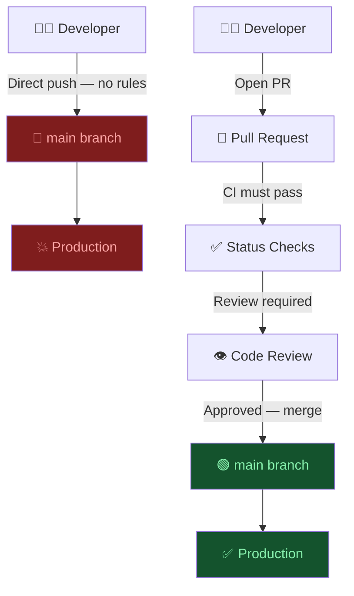
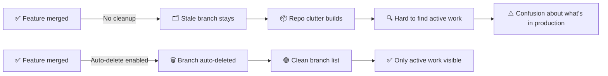

# Domain 1: Branch Management & Protection
**Exam Weight: 33% — Critical Foundation**

---

## 🧠 The Golden Rule

> **"Protect main like a production server. Every unreviewed commit to main is a potential outage."**

<div class="note-important"><strong>Branch protection rules are the single most impactful GitHub security control.</strong> An unprotected main branch means any team member — or a compromised credential — can push breaking code directly to production. Audits repeatedly find this as Critical/High severity.</div>

---

## 1.1 Branch Protection Rules

### The Story: "The Midnight Push"

A team ships a microservices platform. No branch protection rules on main. On a Friday night, an engineer hotfixes a bug directly to main — skipping review. The fix introduces a subtle race condition. By Monday morning, the production database has duplicate records. It takes three engineers two days to untangle it.

The root cause wasn't the bug. It was **nothing stopped the direct push**.



### The 7 Controls Every Protected Branch Needs

| Control | What It Does | Default | Should Be |
|---|---|---|---|
| **Require PR before merging** | Blocks direct pushes to main | Off | **On** |
| **Required reviewers** | Minimum N approvals to merge | 0 | **1–2** |
| **Dismiss stale reviews** | Re-requires approval after new commits | Off | **On** |
| **Require status checks** | CI must pass before merge | Off | **On** |
| **Require branches up-to-date** | Prevents merging stale PRs | Off | **On** |
| **Restrict force pushes** | Prevents rewriting history on main | Off | **On** |
| **Restrict deletions** | Prevents deleting protected branches | Off | **On** |

<div class="note-trap"><strong>EXAM TRAP:</strong> "Dismiss stale reviews" is frequently ignored. If a developer gets approval, then pushes 40 more commits, the original approval still stands — unless stale review dismissal is enabled. Exam questions will describe this exact scenario and ask what's missing.</div>

### CODEOWNERS — Automated Expert Review Assignment

A `CODEOWNERS` file in `.github/` maps file paths to mandatory reviewers. Without it, developers manually assign reviewers (which they often forget).

```
# .github/CODEOWNERS

# Infrastructure — always needs DevOps review
/terraform/           @team-devops
/k8s/                 @team-devops

# Security-critical code
/src/auth/            @security-lead @team-lead
/src/payments/        @security-lead

# Database migrations — always need DBA sign-off
/migrations/          @dba-team

# Default — every PR needs at least one lead review
*                     @team-lead
```

<div class="note-scribble">CODEOWNERS removes the "I forgot to add a reviewer" problem. The moment you open a PR touching /migrations/, the DBA team is automatically requested. It's enforcement, not a reminder.</div>

### Status Check Strategy

Required status checks should cover at minimum:

```yaml
# What you configure as required checks in branch protection:
- build          # Does it compile/build?
- test           # Do all tests pass?
- lint           # Code style/quality gate
- security-scan  # No known vulnerabilities introduced
```

<div class="note-important"><strong>If you require status checks but they're optional in your workflow YAML, they never block a merge.</strong> The check must actually be configured to run on <code>pull_request</code> trigger, AND be listed as required in branch protection settings.</div>

---

## 1.2 Branch Naming Conventions

### The Standard Convention

| Prefix | Purpose | Example |
|---|---|---|
| `feature/` | New functionality | `feature/user-authentication` |
| `fix/` or `bugfix/` | Bug fixes | `fix/login-redirect-loop` |
| `hotfix/` | Critical production fix | `hotfix/payment-null-reference` |
| `release/` | Release preparation | `release/v2.4.0` |
| `chore/` | Non-functional changes (deps, config) | `chore/upgrade-node-18` |
| `docs/` | Documentation only | `docs/api-reference-update` |

### Why This Matters

Without conventions, branches like `johns-stuff`, `temp2`, `FIXME-urgent` accumulate. When someone needs to find who's working on authentication, they grep through 40 branches.

With conventions, one `git branch -r | grep feature/` shows every in-flight feature.

<div class="note-scribble">The naming convention only works if the team commits to it AND automation enforces it. A GitHub Action that rejects PRs from branches not matching the pattern catches violations before they merge.</div>

### Enforcement via GitHub Actions

```yaml
# .github/workflows/branch-naming.yml
name: Branch Naming Convention
on:
  pull_request:
    branches: [main, develop]

jobs:
  check-branch-name:
    runs-on: ubuntu-latest
    steps:
      - name: Validate branch name
        run: |
          BRANCH="${{ github.head_ref }}"
          PATTERN="^(feature|fix|hotfix|release|chore|docs)/.+"
          if ! echo "$BRANCH" | grep -qE "$PATTERN"; then
            echo "Branch '$BRANCH' does not match convention: $PATTERN"
            exit 1
          fi
```

---

## 1.3 Branch Lifecycle Management

### The Stale Branch Problem

Every merged feature branch that isn't deleted is technical debt. In a team of 10, after 6 months, you have 200+ dead branches. `git branch -r` becomes a graveyard.



### Three-Layer Cleanup Strategy

| Layer | Mechanism | When |
|---|---|---|
| **Auto-delete merged** | GitHub setting: "Automatically delete head branches" | Immediately after merge |
| **Stale detection** | GitHub Action scanning branches with no activity >30 days | Weekly scheduled run |
| **Abandoned cleanup** | PR raised if no activity >90 days; branch deleted if no response in 14 days | Monthly |

### Stale Branch Detection Workflow

```yaml
# .github/workflows/stale-branches.yml
name: Stale Branch Cleanup
on:
  schedule:
    - cron: '0 9 * * 1'  # Monday 9am UTC

jobs:
  detect-stale:
    runs-on: ubuntu-latest
    permissions:
      contents: read
      issues: write
    steps:
      - uses: actions/checkout@v4
        with:
          fetch-depth: 0
      - name: Find stale branches
        run: |
          CUTOFF=$(date -d '30 days ago' +%Y-%m-%d)
          git branch -r --sort=committerdate \
            --format='%(refname:short) %(committerdate:short)' \
            | awk -v cutoff="$CUTOFF" '$2 < cutoff && $1 !~ /HEAD|main|develop/ {print $1}'
```

---

## 1.4 Security Risks of Unprotected Branches

### The Risk Matrix

| Risk | Impact | Likelihood (no protection) |
|---|---|---|
| Direct push breaks production | Critical | High |
| Compromised credential → malicious code | Critical | Medium |
| Accidental force-push rewrites history | High | Medium |
| Merge without review introduces vulnerability | High | High |
| Deleted main branch | High | Low |

<div class="note-trap"><strong>EXAM TRAP — "Admin bypass":</strong> By default, admins can bypass branch protection rules. An exam question may describe a scenario where a repository admin accidentally bypasses all controls. The correct fix is enabling "Do not allow bypassing the above settings" in the branch protection configuration — this applies the rules even to admins.</div>

### Signed Commits

For highest-security repositories, require signed commits via GPG or SSH:

```bash
# Developer setup
git config --global commit.gpgsign true

# GitHub: Settings → Branches → Require signed commits
```

This ensures every commit is cryptographically verified to the committing identity — important for compliance (SOC 2, FedRAMP).

---

## Domain 1 Compliance Checklist

| Control | Status Check |
|---|---|
| Branch protection on `main` | Settings → Branches → Branch protection rules |
| Require PR before merging | ✓ Required pull request reviews |
| Required reviewers ≥ 1 | ✓ Required number of approvals |
| Dismiss stale reviews | ✓ Dismiss stale pull request approvals |
| Required CI status checks | ✓ Require status checks to pass |
| Restrict force pushes | ✓ Do not allow force pushes |
| Restrict deletions | ✓ Do not allow deletions |
| Admin bypass disabled | ✓ Do not allow bypassing above settings |
| CODEOWNERS configured | .github/CODEOWNERS exists |
| Auto-delete merged branches | Settings → General → Automatically delete head branches |
| Branch naming convention enforced | Workflow in .github/workflows/ |

<div class="note-important"><strong>The minimum viable protection setup is: require PR + 1 reviewer + at least one CI status check passing.</strong> Everything else is hardening. But that minimum must exist on every team's main branch before anything else.</div>
