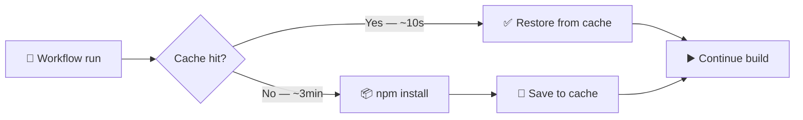
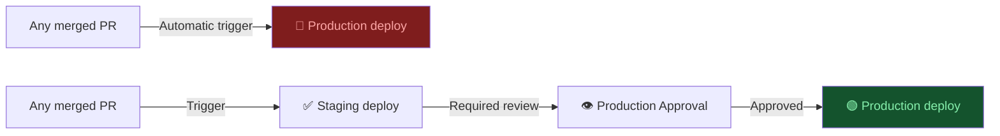

# Domain 2: GitHub Actions & CI/CD
**Exam Weight: 33%**

---

## Core Principle

> **"Automation is only as trustworthy as the security controls around it. A misconfigured workflow is an attack surface, not a safety net."**

<div class="note-important"><strong>GitHub Actions workflows run with access to secrets and repository write permissions.</strong> A single workflow with overly broad permissions, unpinned third-party actions, or injected malicious input can compromise your entire repository — or your production environment.</div>

---

## 2.1 Secrets Management & Permissions

### The Story: "The Leaked Token"

A team uses `GITHUB_TOKEN` to push release artifacts. The workflow has `permissions: write-all` because the engineer copied it from a Stack Overflow answer. An attacker sends a pull request from a fork. The PR modifies the workflow to exfiltrate `secrets.NPM_TOKEN` via a curl request to their server. The PR is merged by a junior developer who doesn't notice the workflow change.

The npm token is now compromised. The attacker publishes a malicious version of the team's popular open-source package.

**Root causes:**
1. `write-all` permissions — gave far more access than needed
2. Unpinned third-party action — could have changed behaviour
3. No protection on `pull_request` from fork access to secrets

### Principle of Least Privilege in Workflows

```yaml
# ❌ WRONG — too broad, dangerous on public repos
permissions: write-all

# ✅ CORRECT — only what this job actually needs
permissions:
  contents: read       # Read repo files
  pull-requests: write # Post PR comments
  issues: write        # Create issues for failures
  packages: read       # Read GitHub Packages
```

### Secrets Hierarchy

| Level | Scope | Use For |
|---|---|---|
| **Repository secrets** | Single repo | Repo-specific keys (staging DB, individual service tokens) |
| **Environment secrets** | Named environment (staging/prod) | Deploy keys with environment protection rules |
| **Organization secrets** | All/selected repos | Shared service accounts, registry credentials |

<div class="note-trap"><strong>EXAM TRAP — `GITHUB_TOKEN` vs repository secrets:</strong> `GITHUB_TOKEN` is auto-generated per workflow run, scoped to the current repo, and expires when the run ends. It should be used for all GitHub API operations. Custom PATs (Personal Access Tokens) stored as repository secrets have fixed expiry and broader scope — use them only when `GITHUB_TOKEN` is insufficient.</div>

### Pinning Third-Party Actions

```yaml
# ❌ DANGEROUS — actions/checkout could be updated with malicious code tomorrow
- uses: actions/checkout@v4

# ✅ SECURE — SHA-pinned, immutable reference  
- uses: actions/checkout@11bd71901bbe5b1630ceea73d27597364c9af683  # v4.2.2
```

<div class="note-scribble">SHA pinning sounds paranoid until a popular action gets compromised — it has happened multiple times in the supply chain attack space. The SHA is the only reference that cannot be moved or overwritten.</div>

---

## 2.2 Dependabot Configuration

### Why It Matters — The Unmaintained Dependency Problem

A service runs with `lodash@4.17.4`. A critical prototype pollution vulnerability (CVE-2021-23337) exists in that version. Nobody on the team knows because there's no automated scanning. It sits unfixed for 14 months. A security audit finds it and the team must drop everything to update.

Dependabot solves this by automatically opening PRs when vulnerable dependencies are detected.

### The `dependabot.yml` File

```yaml
# .github/dependabot.yml
version: 2
updates:
  # JavaScript/Node.js dependencies
  - package-ecosystem: "npm"
    directory: "/"
    schedule:
      interval: "weekly"
      day: "monday"
      time: "09:00"
    open-pull-requests-limit: 10
    labels:
      - "dependencies"
      - "automated"
    reviewers:
      - "team-lead"

  # GitHub Actions themselves
  - package-ecosystem: "github-actions"
    directory: "/"
    schedule:
      interval: "weekly"
    labels:
      - "github-actions"
      - "dependencies"

  # Docker base images  
  - package-ecosystem: "docker"
    directory: "/"
    schedule:
      interval: "weekly"
```

<div class="note-important"><strong>Always include <code>github-actions</code> as a Dependabot ecosystem.</strong> This keeps your workflow action versions updated, which is especially important for security-related actions (code scanning, SARIF uploaders).</div>

---

## 2.3 Workflow Caching Strategy

### The Performance Problem

Every `npm install` downloads hundreds of packages from the internet. On a team with 20 PRs/day, that's 20 × 3 minutes = 1 hour of wasted CI time per day. Across a year: 365 hours. Caching converts this to 10-second cache restores.



### Caching Patterns

```yaml
# Node.js with npm
- name: Cache node modules
  uses: actions/cache@v4
  with:
    path: ~/.npm
    key: ${{ runner.os }}-node-${{ hashFiles('**/package-lock.json') }}
    restore-keys: |
      ${{ runner.os }}-node-

# Python with pip
- name: Cache pip packages
  uses: actions/cache@v4
  with:
    path: ~/.cache/pip
    key: ${{ runner.os }}-pip-${{ hashFiles('**/requirements.txt') }}
    restore-keys: |
      ${{ runner.os }}-pip-

# Docker layer caching via buildx
- name: Set up Docker Buildx
  uses: docker/setup-buildx-action@v3
  
- name: Build with cache
  uses: docker/build-push-action@v6
  with:
    cache-from: type=gha
    cache-to: type=gha,mode=max
```

<div class="note-trap"><strong>EXAM TRAP — Cache key design:</strong> The cache key must include a hash of the dependency lock file (<code>package-lock.json</code>, <code>requirements.txt</code>, etc.). If you cache by branch name only, you'll restore stale caches after dependency updates, causing subtle failures. The hash ensures the cache is invalidated when dependencies change.</div>

---

## 2.4 Vulnerability Scanning (CodeQL / SAST)

### What It Catches

Code scanning (SAST — Static Application Security Testing) finds vulnerabilities in your code before it reaches production:

- SQL injection
- Command injection
- Hardcoded credentials
- Insecure deserialization
- Buffer overflows (C/C++)
- XSS vulnerabilities

### Setting Up CodeQL

```yaml
# .github/workflows/codeql.yml
name: CodeQL Security Scan
on:
  push:
    branches: [main]
  pull_request:
    branches: [main]
  schedule:
    - cron: '0 6 * * 1'  # Weekly Monday 6am UTC

jobs:
  analyze:
    runs-on: ubuntu-latest
    permissions:
      security-events: write
      contents: read

    strategy:
      matrix:
        language: [javascript, python]  # Add your languages

    steps:
      - uses: actions/checkout@11bd71901bbe5b1630ceea73d27597364c9af683

      - name: Initialize CodeQL
        uses: github/codeql-action/init@v3
        with:
          languages: ${{ matrix.language }}

      - name: Perform CodeQL Analysis
        uses: github/codeql-action/analyze@v3
        with:
          category: "/language:${{ matrix.language }}"
```

<div class="note-important"><strong>Add CodeQL as a required status check on your main branch.</strong> This means a PR introducing a SQL injection vulnerability literally cannot be merged until the finding is resolved — not just flagged, but blocked.</div>

---

## 2.5 Reusable Workflows & Composite Actions

### The DRY Problem in CI

When you have 5 repositories and each has its own copy of the same "run tests and deploy" workflow, you end up with 5 slightly different versions. One has caching, one doesn't. One pins actions, two don't. Fixing a security issue means updating 5 files.

**Reusable workflows** solve this: define the workflow once, call it from all repos.

```yaml
# .github/workflows/reusable-test.yml (in shared repo or same repo)
on:
  workflow_call:
    inputs:
      node-version:
        required: false
        type: string
        default: '20'
    secrets:
      NPM_TOKEN:
        required: true

jobs:
  test:
    runs-on: ubuntu-latest
    steps:
      - uses: actions/checkout@11bd71901bbe5b1630ceea73d27597364c9af683
      - uses: actions/setup-node@v4
        with:
          node-version: ${{ inputs.node-version }}
      - name: Run tests
        run: npm ci && npm test
        env:
          NPM_TOKEN: ${{ secrets.NPM_TOKEN }}
```

```yaml
# In any other workflow — calling the reusable workflow
jobs:
  test:
    uses: your-org/shared-workflows/.github/workflows/reusable-test.yml@main
    with:
      node-version: '22'
    secrets:
      NPM_TOKEN: ${{ secrets.NPM_TOKEN }}
```

**Composite actions** are for reusable *steps* (not full jobs):

```yaml
# .github/actions/setup-node-cache/action.yml
name: 'Setup Node with cache'
runs:
  using: composite
  steps:
    - uses: actions/setup-node@v4
      with:
        node-version: ${{ inputs.node-version }}
    - uses: actions/cache@v4
      with:
        path: ~/.npm
        key: ${{ runner.os }}-node-${{ hashFiles('**/package-lock.json') }}
```

---

## 2.6 Environment Protection Rules

### The Problem: Deploying to Prod Without Review



### Configuring Environments

```yaml
# In your workflow
jobs:
  deploy-staging:
    environment: staging  # No protection rules — auto-deploys
    ...

  deploy-production:
    environment: production  # Has required reviewers configured in GitHub UI
    needs: deploy-staging
    ...
```

In GitHub Settings → Environments → `production`:
- Required reviewers: `@team-leads` (any 1 of 3 must approve)
- Wait timer: 5 minutes (gives time to catch runaway deploys)
- Deployment branches: `main` only

<div class="note-trap"><strong>EXAM TRAP:</strong> Environment protection rules only apply when a job explicitly declares <code>environment: production</code>. If your deploy job doesn't reference the environment, the protection rules don't apply — even if you've configured them. The environment name in the YAML must exactly match the name configured in Settings.</div>

---

## Domain 2 Compliance Checklist

| Control | Check |
|---|---|
| Dependabot configured for npm/pip/actions/docker | `.github/dependabot.yml` exists |
| CodeQL scanning on PRs to main | Workflow + required status check |
| Dependency caching in all workflows | `actions/cache` with lock-file hash key |
| Permissions set to minimum required | Per-job `permissions:` block, not `write-all` |
| Third-party actions SHA-pinned | No `@v4` alone — must have SHA comment |
| Environment protection for production | Settings → Environments → required reviewers |
| Workflow status badges in README | `` in README.md |
| No hardcoded secrets in YAML | Secret scanning enabled + workflow review |
| Reusable workflows for shared patterns | `.github/workflows/` has `workflow_call` trigger |
