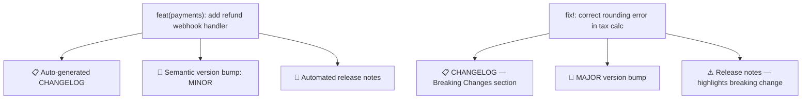
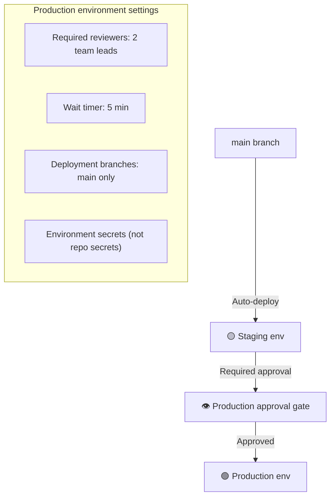

# Domain 3: Repository Security & Governance
**Exam Weight: 34%**

---

## Core Principle

> **"A repository is not just a code store — it's the access control boundary, the audit trail, and the collaboration protocol for your entire team."**

<div class="note-important"><strong>Repository governance gaps compound over time.</strong> No PR template → inconsistent reviews. No CODEOWNERS → wrong people review critical changes. No security policy → vulnerabilities get reported publicly instead of confidentially. Each gap seems minor; together they create a compliance failure.</div>

---

## 3.1 Repository Structure Essentials

### The Files Every Production Repository Needs

| File | Location | Purpose |
|---|---|---|
| `README.md` | Root | What it is, how to run it, how to contribute |
| `LICENSE` | Root | Legal terms for use/modification |
| `.gitignore` | Root | Prevents committing secrets, build artifacts, IDE files |
| `CODEOWNERS` | `.github/` | Auto-assigns reviewers by file path |
| `SECURITY.md` | Root or `.github/` | How to report vulnerabilities confidentially |
| `CONTRIBUTING.md` | Root | How to contribute — workflow, standards, setup |
| `dependabot.yml` | `.github/` | Automated dependency updates |

<div class="note-trap"><strong>EXAM TRAP — The .gitignore gap:</strong> A missing .gitignore is a Critical risk, not a documentation issue. Without it, developers accidentally commit `.env` files, `node_modules/`, AWS credentials in config files, and IDE files containing project secrets. A single accidental secret commit — even if quickly deleted — is a security incident because the commit hash remains in git history.</div>

### A Production-Ready .gitignore

```gitignore
# Environment & secrets — NEVER commit these
.env
.env.*
!.env.example      # The example is OK to commit
*.pem
*.key
*_rsa
*_dsa

# Dependencies
node_modules/
vendor/
__pycache__/
*.pyc
.venv/
venv/

# Build outputs
dist/
build/
*.log
coverage/
.nyc_output/

# IDE & OS files
.DS_Store
Thumbs.db
.idea/
.vscode/*
!.vscode/extensions.json   # This one is useful to share
*.suo
*.user
```

---

## 3.2 Pull Request Templates

### The Story: "The Description-Free PR"

A 2,000-line PR lands in the queue. Title: "Fix stuff." No description. No linked issue. No test plan. A reviewer has to read every line to understand the intent. Did this change the authentication flow? Is that intentional? Why was this configuration changed?

Two hours later, the reviewer gives up and approves it with "LGTM" because the sprint ends today. The next week, the change causes a production incident that takes four hours to diagnose because no one understood the original intent.

### The PR Template That Prevents This

```markdown
<!-- .github/pull_request_template.md -->

## What does this PR do?
<!-- One paragraph describing the change and why -->

## Linked Issue
Closes #<!-- issue number -->

## Type of Change
- [ ] Bug fix (non-breaking)
- [ ] New feature (non-breaking)  
- [ ] Breaking change
- [ ] Refactor (no behaviour change)
- [ ] Documentation update
- [ ] Security fix

## How was this tested?
<!-- Describe the test cases you ran -->
- [ ] Unit tests added/updated
- [ ] Integration tests pass
- [ ] Manual testing: <!-- describe steps -->

## Checklist
- [ ] Code follows team style guidelines
- [ ] Self-reviewed my own code
- [ ] Added/updated tests
- [ ] No hardcoded secrets or credentials
- [ ] Documentation updated (if needed)

## Screenshots (if UI change)
<!-- Before / After -->
```

<div class="note-scribble">The checklist is the most valuable part. It forces the author to consciously confirm they've done each step. "Have I added tests?" is easy to skip when you're in a hurry — checking a box takes the same time but makes the omission visible.</div>

---

## 3.3 Issue Templates

Without issue templates, every bug report is different. Some have reproduction steps, most don't. Triage becomes a game of "go back and ask the reporter for more info" before you can even start fixing.

```yaml
# .github/ISSUE_TEMPLATE/bug-report.yml
name: Bug Report
description: Report a reproducible bug
labels: [bug, triage]
body:
  - type: markdown
    attributes:
      value: "Before opening, search for existing issues."
      
  - type: textarea
    id: description
    attributes:
      label: What happened?
      description: A clear description of the bug
    validations:
      required: true

  - type: textarea
    id: reproduction
    attributes:
      label: Steps to reproduce
      placeholder: |
        1. Go to '...'
        2. Click on '...'
        3. See error
    validations:
      required: true

  - type: textarea
    id: expected
    attributes:
      label: Expected behavior
    validations:
      required: true

  - type: input
    id: version
    attributes:
      label: Version
      placeholder: "v2.3.1"
    validations:
      required: true
```

---

## 3.4 Security Policy (SECURITY.md)

### Why This Exists

Without a `SECURITY.md`, a security researcher who finds a vulnerability in your repository has no confidential channel to report it. They either:
1. Open a public GitHub issue (now the vulnerability is public before you can patch it)
2. Don't report it at all
3. Use it

GitHub's Private Vulnerability Reporting feature + SECURITY.md creates a proper disclosure pipeline.

```markdown
# Security Policy

## Supported Versions

| Version | Security Updates |
|---------|-----------------|
| 2.x     | ✅ Supported     |
| 1.x     | ❌ End of life   |

## Reporting a Vulnerability

**Do not open a public GitHub issue for security vulnerabilities.**

Use GitHub's private vulnerability reporting:
1. Go to the Security tab of this repository
2. Click "Report a vulnerability"
3. Fill in the details

We aim to acknowledge reports within 48 hours and provide a remediation timeline within 7 days.

## What to Include
- Description of the vulnerability
- Steps to reproduce
- Potential impact assessment
- Suggested remediation (if known)
```

<div class="note-important"><strong>GitHub will display a "Report a vulnerability" button on your repository's Security tab only if Private Vulnerability Reporting is enabled in Settings and a SECURITY.md file exists.</strong> Without both, reporters have no confidential channel.</div>

---

## 3.5 Commit Message Standards

### Conventional Commits

The Conventional Commits specification gives commits semantic meaning that tools can parse:

```
<type>(<scope>): <description>

[optional body]

[optional footer(s)]
```

| Type | Meaning | Example |
|---|---|---|
| `feat` | New feature | `feat(auth): add OAuth2 login` |
| `fix` | Bug fix | `fix(api): handle null response from payments endpoint` |
| `docs` | Documentation | `docs: update API reference for v2 endpoints` |
| `chore` | Maintenance | `chore(deps): upgrade axios to 1.7.0` |
| `refactor` | Code restructure, no behaviour change | `refactor(db): extract query builder to separate module` |
| `test` | Tests only | `test(auth): add coverage for token expiry edge cases` |
| `ci` | CI/CD configuration | `ci: add CodeQL scanning workflow` |
| `BREAKING CHANGE` | Breaking API change | `feat!: remove deprecated v1 endpoints` |



<div class="note-trap"><strong>EXAM TRAP — Breaking changes:</strong> A breaking change is indicated by either appending <code>!</code> after the type/scope (<code>feat!</code>) OR by including <code>BREAKING CHANGE:</code> in the commit footer. Either triggers a MAJOR version bump in tools like `semantic-release`. Exam questions test whether you know the correct syntax.</div>

### Enforcing with Commitlint

```yaml
# .github/workflows/commitlint.yml
name: Commit Message Lint
on:
  pull_request:
    branches: [main]

jobs:
  lint:
    runs-on: ubuntu-latest
    steps:
      - uses: actions/checkout@11bd71901bbe5b1630ceea73d27597364c9af683
        with:
          fetch-depth: 0
      - uses: wagoid/commitlint-github-action@v6
```

---

## 3.6 Repository Topics & Discoverability

Repository topics help teams find related repositories across an organization. Without them, searching for "all our Python microservices" requires reading every README.

**Recommended topic taxonomy:**

```
# Technology stack
python, node, react, golang, terraform, kubernetes

# Type of project  
microservice, library, framework, tool, documentation, infrastructure

# Status
active, maintained, deprecated, archived, experimental

# Domain
payments, auth, notifications, data-pipeline, ml-platform
```

Setting these in Settings → General → Topics means `org:your-org topic:microservice topic:python` returns every Python microservice in the organization instantly.

---

## 3.7 Deployment and Access Control

### The Principle: Environments as Security Boundaries



### Deploy Key vs Repository Secret vs Environment Secret

| Type | Scope | Rotation | Use When |
|---|---|---|---|
| Deploy key | Read/write to one repo | Manual | CI needs to clone private dependencies |
| Repository secret | All workflows in repo | Manual | Staging credentials, API keys for all envs |
| Environment secret | Only jobs with matching `environment:` | Manual | Production credentials — require environment protection |
| OIDC (federated identity) | Cloud provider trust | Automatic | AWS/Azure/GCP deploys — **preferred over long-lived keys** |

<div class="note-important"><strong>OIDC (OpenID Connect) federation eliminates long-lived cloud credentials entirely.</strong> Instead of storing <code>AWS_ACCESS_KEY_ID</code> as a secret (which can be exfiltrated), the workflow exchanges a short-lived GitHub Actions token for temporary cloud credentials via the cloud provider's OIDC endpoint. No secret to steal. This is the gold standard for cloud deployments.</div>

---

## Domain 3 Compliance Checklist

| Item | Location | Priority |
|---|---|---|
| `.gitignore` with secrets/artifacts excluded | Root | Critical |
| `LICENSE` file present | Root | High |
| `README.md` with setup and usage | Root | High |
| `SECURITY.md` + private vulnerability reporting enabled | Root / Settings | High |
| `CONTRIBUTING.md` with workflow guide | Root | Medium |
| `.github/pull_request_template.md` | `.github/` | High |
| `.github/ISSUE_TEMPLATE/` with bug + feature templates | `.github/ISSUE_TEMPLATE/` | Medium |
| `.github/CODEOWNERS` mapping file paths to reviewers | `.github/` | High |
| `.github/dependabot.yml` | `.github/` | Critical |
| Repository topics configured | Settings → General | Low |
| Conventional commit standard enforced via commitlint | `.github/workflows/` | Medium |
| OIDC federation for cloud deployments | Workflow `permissions:` block | High |
| Branch protection rules on `main` | Settings → Branches | Critical |
