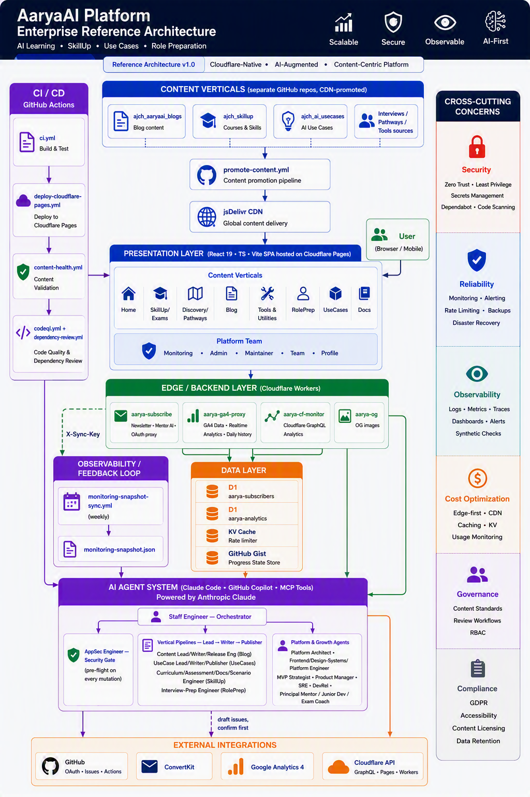

# Enterprise architecture diagram

Full-platform view: content verticals and their CDN promotion pipeline, the React SPA presentation layer, the Cloudflare edge/backend Workers, the data layer, the Claude Code AI agent system, CI/CD, and external integrations. Also embedded in the live [Platform Docs → Architecture](../public/content/platform-docs/architecture.md) page.

For the detail behind specific parts of this picture, see:
- [content-architecture.md](./content-architecture.md) — the multi-repo, CDN-promoted content model
- [agent-framework.md](./agent-framework.md) — the Claude Code subagent/skill system
