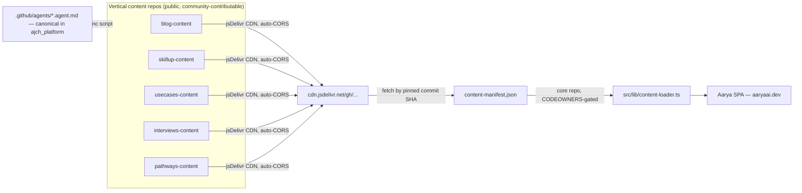
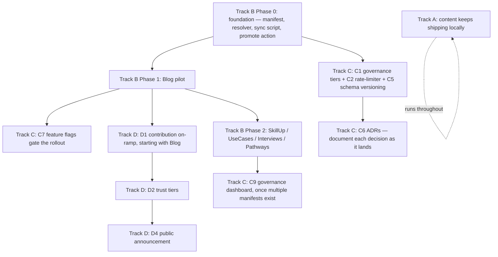

# Aarya AI Platform Refactor — Content Split, Governance & Community Contribution

**Status:** Draft plan, execution started · **Owner:** @ajeetchouksey · **Created:** 2026-08-12 · **Last updated:** 2026-08-23

## Purpose

This document is the single source of truth for a four-part initiative:

1. Keep shipping content on the current single-repo model **while** building the new framework in parallel (no content freeze)
2. Split blog/skillup/usecases/interviews/pathways into independent vertical repos, each with its own governance
3. Tighten organization, governance, and scalability of `ajch_platform` itself (the core platform repo)
4. Open the door for external community contributors to write content without touching `src/` or the build pipeline

Nothing here requires a big-bang cutover. Every phase is additive and independently shippable.

---

## Progress log

Tracks execution against this plan. Update as items land.

| Date | Item | Track | Status |
|---|---|---|---|
| 2026-08-24 | C8 groundwork — `workers/cloudflare-proxy.ts` + `/admin/monitoring` "Cloudflare" tab: per-Worker request/error/CPU stats and zone traffic via Cloudflare's GraphQL Analytics API | C | 🟡 Code shipped, pending `CF_API_TOKEN`/`CF_ACCOUNT_ID`/`CF_ZONE_ID` secrets — the scheduled-issue-on-error-spike half of C8 is still open |
| 2026-08-19/20 | Phase 1 blog pilot shipped — blog, skillup, and usecases promoted to CDN-fetch via `content-manifest.json` | B | ✅ Done |
| 2026-08-19/20 | Track C1 governance tier — `.github/CODEOWNERS` strict-review rule added for `content-manifest.json` | C | ✅ Done |
| 2026-08-12 | `workers/subscribe.ts` given its own `tsconfig.worker.json` (ES2022 lib, `@cloudflare/workers-types`) instead of inheriting the app's DOM-lib config; fixed `KVNamespace`/`BufferSource` type errors | C (adjacent hardening) | ✅ Done — pending `npm install` to fetch the new devDependency |
| 2026-08-12 | Resolved all 3 open questions (interview build-script placement, Pathways/Platform Docs staying in core, Track D announcement readiness criteria) | B / D | ✅ Done |
| 2026-08-12 | C2 rate-limiter consolidation — merged `checkRateLimit` + `checkMentorRateLimit` into one `checkWindowedRateLimit(env, keyPrefix, ip, {max})`. `checkSignalRateLimit` left untouched (structurally different: existence-based dedup lock, not a windowed counter — forcing it into the same shape would add a mode flag, not remove duplication). Zero call-site changes; same KV key format/TTL/thresholds preserved, and the worker build is now green | C | ✅ Done |
| 2026-08-12 | Formalized `schemaVersion` architecture (integer not semver; dual-location in vertical content + manifest; loader hard-checks live fetched content, not just manifest copy) into Track B step 2 and Track C, C5 | B / C | ✅ Done |
| 2026-08-12 | Added Release Plan section — this initiative ships as **v4.0.0**, tracked via `refactor_v4`-labeled issues under a `v4.0.0` milestone | — | ✅ Doc updated — issue/label/milestone creation pending GitHub write-tool access |
| 2026-08-12 | Created `refactor_v4` label, `v4.0.0` milestone (#10), and filed all 5 Phase 0 issues (#389–393) | B | ✅ Done |
| 2026-08-12 | Completed Track B Phase 0 foundation: root `content-manifest.json`, resolver hydration + schema guard, sync script, promotion workflow, and ADR record | B | ✅ Done |
| 2026-08-12 | Added first ADR: `docs/adr/0001-content-split-cdn-fetch.md` | C | ✅ Done |

---

## Guiding architecture decision

Content in `ajch_platform` is already loaded via **runtime `fetch()`** from `public/content/` (confirmed in [src/lib/content-loader.ts](src/lib/content-loader.ts) — not bundled into the JS build). This means the vertical split does **not** require git submodules or a rebuild-on-every-content-change model.

**Chosen architecture: CDN-fetch with a pinned-SHA promotion manifest.**

- Each vertical becomes its own **public** GitHub repo containing only the JSON/MD content (same shape as today's `public/content/{vertical}`)
- Content is served through **jsDelivr's GitHub CDN** (`cdn.jsdelivr.net/gh/{owner}/{repo}@{sha}/...`) — zero build step, zero Pages hosting, automatic `Access-Control-Allow-Origin: *` (no CORS config needed)
- `ajch_platform` holds a `content-manifest.json` mapping `{ vertical: { repo, sha } }` — this is the **only** thing that makes content "live." A vertical repo can have 50 commits sitting on `main`; none of them are visible to the public site until the manifest is bumped
- Pinning to a **commit SHA** (not `@main`/`@latest`) makes every fetch immutable and infinitely cacheable by jsDelivr — no cache-lag problems, and the manifest itself is the auditable "what's live right now" record



---

## Track A — Keep shipping content during the transition

**Goal:** zero content freeze. The migration happens in parallel to normal publishing.

| Step | Detail |
|---|---|
| A1 | Content agents (`content-lead`, `curriculum-engineer`, `docs-engineer`, etc.) keep writing to `public/content/{vertical}` in `ajch_platform` exactly as today, for any vertical not yet migrated |
| A2 | No changes to existing publishing workflows (`release.yml`, `content-health.yml`) until a vertical actually cuts over |
| A3 | `content-loader.ts` gets a **per-vertical base resolver** (Track C, step C4) so migrated and non-migrated verticals can coexist indefinitely — there's no forced "finish the migration by date X" pressure |
| A4 | Blog is the pilot (Track B). Until Blog's migration is verified end-to-end in production, all other verticals stay exactly where they are |

---

## Track B — Split verticals into independent repos

### Phase 0 — Foundation (build once, reuse for every vertical)

1. **Schema validator, portable form.** Take `scripts/validate-content.mjs` and make it copyable as-is (no npm publish step — a private npm registry is unnecessary overhead for one script). It becomes the canonical copy that gets synced into every vertical repo.
2. **`content-manifest.json` schema.** New file in `ajch_platform` root:
   ```
   {
     "blog":       { "repo": "ajeetchouksey/blog-content",       "sha": "…", "schemaVersion": 1 },
     "skillup":    { "repo": "ajeetchouksey/skillup-content",    "sha": "…", "schemaVersion": 1 },
     "usecases":   { "repo": "ajeetchouksey/usecases-content",   "sha": "…", "schemaVersion": 1 },
     "interviews": { "repo": "ajeetchouksey/interviews-content", "sha": "…", "schemaVersion": 1 },
     "pathways":   { "repo": "ajeetchouksey/pathways-content",   "sha": "…", "schemaVersion": 1 }
   }
   ```
   **Schema versioning architecture (decided):** `schemaVersion` is a plain incrementing integer, not semver — there's exactly one producer (the vertical repo) and one consumer (the loader) per vertical, so the only question that matters is binary: does this loader build know how to parse this shape or not. Semver's minor/major distinction has no consumer here.

   The field lives in **two places, different jobs**:
   - The vertical's own `index.json`/`catalog.json` — self-describing source of truth; content is meaningful standalone, independent of the manifest
   - `content-manifest.json` — a promotion-time **snapshot + cross-check**, not the authority. The promote-content Action (step 5) diffs this against the freshly-fetched content's own declared version and hard-blocks the PR on any mismatch

   `content-loader.ts` validates against the **live fetched content's** declared version (not just the manifest's copy) against a hardcoded `SUPPORTED_SCHEMA_VERSIONS` map — defense in depth against a stale manifest.
3. **`content-loader.ts` per-vertical base resolver.**
   ```
   function contentBase(vertical: string): string {
     const entry = manifest[vertical];
     if (!entry) return `${BASE}content/${vertical}/`; // not yet migrated — local path
     return `https://cdn.jsdelivr.net/gh/${entry.repo}@${entry.sha}/`;
   }
   ```
4. **Agent + tooling sync script.** A small Node script (`scripts/sync-vertical-repo.mjs`) that, given a target repo, pulls the canonical `.agent.md` files relevant to that vertical + `validate-content.mjs` from `ajch_platform`'s raw GitHub URLs and commits them into the target repo's `.github/agents/` and `scripts/`. Run manually or via a scheduled workflow per vertical repo.
5. **"Promote content" GitHub Action** in `ajch_platform`. Input: `{ vertical, sha }`. Validates the SHA exists in the vertical repo and passes schema validation (fetches the content at that SHA, runs the validator), then opens a PR updating `content-manifest.json` (never a direct commit — promotion always goes through the same PR review as any other core-repo change).

### Phase 1 — Pilot: Blog *(depends on Phase 0)*

6. Create `blog-content` repo (public), seed with current `public/content/blog/` (62 posts + `index.json`)
7. Run the sync script: copies `content-lead`, `tech-writer`, `release-engineer` agents + `validate-content.mjs` into `blog-content`
8. Set up `blog-content`'s own lightweight CI: a GitHub Action running the synced validator on every PR (no build step needed — it's just data)
9. Set up `blog-content`'s own branch protection ruleset — since this is the pilot and you're the only committer initially, can start permissive and tighten once community contribution opens (Track D)
10. Seed `content-manifest.json.blog` with the initial commit SHA via the promote-content Action; verify `content-loader.ts` fetches correctly through jsDelivr in a preview build
11. Remove `public/content/blog/` from `ajch_platform` once verified live end-to-end
12. Update `.github/CODEOWNERS` — delete the now-obsolete `/public/content/blog/` line, add `/content-manifest.json` with owner-only review (see Track C, step C1)
13. Update `agents-validate.yml` to also pull `blog-content`'s synced agent registry via the GitHub API (cross-repo, public repo — no auth needed for read)

### Phase 2 — Roll out remaining verticals *(each is independent, can run in parallel once Phase 1 is validated)*

14. **SkillUp** (`skillup-content`) — highest complexity: 7 exams, auto-generated `catalog.json`, ~700 questions. Agents: `curriculum-engineer`, `assessment-engineer`, `docs-engineer`, `scenario-engineer`, `exam-coach`
15. **UseCases** (`usecases-content`) — lowest complexity: 16 JSON files, no dedicated agent today (adapt the `content-lead` pattern for a lightweight use-case-writer agent)
16. **Interviews** (`interviews-content`) — self-contained: content + its future `build-interview-*.py` authoring scripts move together (see Resolved Decisions, #1 below — no live CI dependency, so no hybrid-repo concern)
17. **Pathways / Platform Docs** — **not split** (see Resolved Decisions, #2 below) — both stay permanently in `ajch_platform`

### Phase 3 — Steady state

18. Document the full promotion workflow in a new `docs/content-architecture.md`
19. Per-vertical trust tiers finalized: owner-authored verticals get a lighter promotion cadence (you can self-approve); community-contributed verticals require the full review gate (Track D)

---

## Track C — Make the core platform (`ajch_platform`) more organized, governed, scalable

These apply regardless of Track B's pace — they harden what stays behind.

### C1 — Governance tiers (formalize what already exists informally)

| Tier | Scope | Control |
|---|---|---|
| **Code** | `src/`, `workers/`, CI/CD, `.github/agents/` (canonical) | Unchanged: CODEOWNERS (`@ajeetchouksey @ajchava`) + ruleset-protected `main` + PR required |
| **Promotion** | `content-manifest.json` | New, strictest tier — every change is a PR via the promote-content Action, never hand-edited, always owner-reviewed |
| **Content** (per vertical repo) | Each vertical's own files | Independently tunable per repo — see Track D for community-facing tiers |

Update [.github/CODEOWNERS](.github/CODEOWNERS): add `/content-manifest.json @ajeetchouksey @ajchava`, remove per-vertical `public/content/*` lines as each migrates out.

### C2 — Consolidate the Worker's duplicated rate-limiters

Confirmed in [workers/subscribe.ts](workers/subscribe.ts): three near-identical implementations — `checkRateLimit` (subscribe), `checkSignalRateLimit` (engagement signals), `checkMentorRateLimit` (AI mentor). Extract one generic:
```
async function checkRateLimit(env: Env, key: string, opts: { windowMs: number; max: number }): Promise<boolean>
```
Call with different `key`/`windowMs`/`max` per endpoint. Removes drift risk as more endpoints are added (e.g. the future promote-content webhook will need its own rate limit too).

### C3 — Split the Worker's source by concern (without necessarily splitting deployment)

One Worker (`aarya-subscribe`) currently handles subscribe, mentor AI proxy, OAuth, and engagement signals — a bug in one shares blast radius with the others. Minimal fix: split `workers/subscribe.ts` into `workers/subscribe.ts`, `workers/mentor.ts`, `workers/oauth.ts`, `workers/signals.ts`, re-exported from one `workers/index.ts` entry point. Keep single deployment for now; revisit splitting into separate Workers only if one concern (e.g. mentor AI cost/traffic) genuinely needs independent scaling.

### C4 — `content-loader.ts` per-vertical base resolver

Already specified in Track B, Phase 0, step 3 — listed here because it's as much a core-platform scalability change as it is a migration mechanism. This is what lets the platform support N content sources (local + N CDN-fetched verticals) without special-casing.

### C5 — Explicit content schema versioning

Decided (see Track B, Phase 0, step 2 for the full architecture): plain incrementing integer, declared in both the vertical's own content files (source of truth) and `content-manifest.json` (promotion-time cross-check). `content-loader.ts` checks the **live fetched content's** version against a hardcoded `SUPPORTED_SCHEMA_VERSIONS` map and fails loudly (a clear error state in the UI, not a silent crash) on any mismatch — not just trusting the manifest's copy. This is the safety net that makes independent vertical evolution possible without breaking the SPA.

### C6 — Architecture Decision Records

New `docs/adr/` folder. One file per significant decision, e.g.:
- `0001-content-split-cdn-fetch.md` — this document's core decision (CDN-fetch over submodules)
- `0002-engagement-event-architecture.md` — the `ContentFeedback`/`GrowthPrompt` event-bus decoupling done this session
- `0003-mode-plan-orchestrator-agents.md` — the 9-agent `mode: plan` rollout

Format: Context → Decision → Consequences, ~20-40 lines each. Cheap to write, compounds in value as the platform and its contributor base grow.

### C7 — Feature flags for staged rollout

New `public/content/feature-flags.json`, fetched at runtime like everything else. Lets any feature (including this migration itself) ship dark, roll out progressively per vertical, and be killed without a redeploy. First real use: `{ "blogContentSplit": true }` gates whether `content-loader.ts` uses the CDN path or the legacy local path for blog — a true progressive-rollout switch for Track B itself.

### C8 — Observability baseline

Currently: GA4 pageviews + `console.error` logs only visible via `wrangler tail`. Add: a scheduled Worker (or GitHub Action calling the Cloudflare API) that checks recent error-log volume and opens a GitHub issue if it spikes — consistent with the platform's existing pattern of agents auto-filing issues. This becomes important once the Worker is also the sole gate for content promotion (Track B) — an outage there blocks all content publishing, not just subscribe/mentor features.

### C9 — Governance dashboard

Consolidate `/admin/reactions`, `/admin/mvp`, `/admin/monitoring`, `/admin/issues` visibility into one `/admin/platform-health` view: ruleset/CODEOWNERS status, open CodeQL/Dependabot alerts, Worker error rates (from C8), and — once Track B ships — content-manifest freshness per vertical (commits-behind count for each pinned SHA).

---

## Track D — Open verticals to community contribution

**Goal:** external contributors can write blog posts, exam questions, use cases, etc., through normal GitHub PRs against a vertical repo, without ever touching `src/`, the build pipeline, or `ajch_platform`'s protected `main`.

### D1 — Contribution on-ramp per vertical

Each vertical repo gets:
- A `CONTRIBUTING.md` explaining the content schema (generated from the same JSON schema the validator checks), with a worked example
- The synced schema-validator running as a required CI check on every PR — contributors get instant, actionable feedback without waiting for a human review pass
- A PR template matching the vertical's content type (e.g. blog post checklist: frontmatter fields, image requirements, word count guidance)

### D2 — Trust-tiered promotion

Not all verticals need the same review weight:
- **Owner-authored verticals** (content still primarily written by you via agents): lighter promotion cadence, can self-merge the manifest bump
- **Community-open verticals** (once you're ready to invite outside contributors — likely Blog first, given it's the pilot and lowest-risk content type): every PR into the vertical repo requires your review before merge (already default via that repo's own branch protection), **and** the promote-content step remains a separate, explicit action — so even an approved-and-merged community PR sits inert until you deliberately promote it. Two independent gates: (1) is this content good, (2) is this content live.

### D3 — Recognition & incentive loop

Ties back to work already shipped this session:
- The `admin/reactions` "Platform Signal Analytics" section (helpful-vote counts per content) becomes a natural **contributor leaderboard input** — most-helpful community-contributed posts get surfaced
- The `GrowthPrompt`/engagement work already nudges readers toward LinkedIn/GitHub — extend the messaging once Track D is live to specifically invite "want to write the next one?" for high-performing content types
- Consider a `CONTRIBUTORS.md` in each vertical repo, auto-updated from merged PR authors (a simple GitHub Action, well-precedented pattern)

### D4 — Announcement sequencing

Recommended order, once Phase 1 (Blog) is fully validated in production:
1. Quietly run Blog as owner-only for 2-4 weeks post-migration to confirm the CDN-fetch + promotion pipeline is solid under real traffic
2. Open Blog to community PRs first (lowest schema complexity, most approachable for new contributors)
3. Publish a "How to contribute an article" post *on the blog itself* (dogfooding — the announcement channel is the product)
4. Expand to UseCases next (moderate complexity, high value — real-world architecture examples are a strong draw for contributors), then SkillUp once the exam-question schema and quality bar are well-documented

---

## Release plan

This entire initiative (Tracks A–D) ships under a single **v4.0.0** milestone — current version is `3.4.0` ([package.json](package.json)), and this refactor is significant enough (architecture change, new governance model, new community-facing surface) to warrant a major bump per semver.

**Workflow (matches the platform's standard pattern used throughout this session — issue → branch → PR → merge):**
1. Every discrete work item below gets its own GitHub issue, labeled `refactor_v4`
2. Issues are grouped under a `v4.0.0` milestone for tracking
3. Each issue is implemented on its own branch, PR'd, reviewed via CODEOWNERS, merged
4. Once all `refactor_v4` issues are closed, `sre` agent cuts the `v4.0.0` release (CHANGELOG, tag, GitHub Release)

**Planned issues (Phase 0, to be filed):**
- [#389](https://github.com/ajeetchouksey/ajch_platform/issues/389) — `content-manifest.json` schema + schemaVersion architecture (Track B Phase 0, step 2)
- [#390](https://github.com/ajeetchouksey/ajch_platform/issues/390) — `content-loader.ts` per-vertical base resolver + schema version check (Track B Phase 0, step 3 / Track C, C4 + C5)
- [#391](https://github.com/ajeetchouksey/ajch_platform/issues/391) — `scripts/validate-content.mjs` — portable/canonical form (Track B Phase 0, step 1)
- [#392](https://github.com/ajeetchouksey/ajch_platform/issues/392) — `scripts/sync-vertical-repo.mjs` — agent + tooling sync script (Track B Phase 0, step 4)
- [#393](https://github.com/ajeetchouksey/ajch_platform/issues/393) — Promote-content GitHub Action + CODEOWNERS update (Track B Phase 0, step 5 / Track C, C1)

All 5 are labeled `refactor_v4` and assigned to milestone [v4.0.0 (#10)](https://github.com/ajeetchouksey/ajch_platform/milestone/10).

---

## Sequencing across all four tracks



**Do first (highest leverage, lowest risk):**
1. Track C, C2 (rate-limiter consolidation) — small, immediate, no dependencies
2. Track B, Phase 0 (foundation) — unlocks everything else in Track B and Track D
3. Track C, C6 (start ADRs now, retroactively for decisions already made this session)

**Don't start until Blog pilot is proven:**
- Any Phase 2 vertical migration
- Any Track D community on-ramp work

---

## Relevant files (for implementation, when this plan is executed)

- `content-manifest.json` — new, root of `ajch_platform`
- `src/lib/content-loader.ts` — per-vertical base resolver + schema version check
- `src/lib/content-manifest.ts` — runtime manifest hydration + supported-version guard
- `scripts/validate-content.mjs` — becomes the canonical synced copy
- `scripts/sync-vertical-repo.mjs` — new, agent + tooling sync
- `.github/workflows/promote-content.yml` — new promotion workflow for pinned-SHA content promotion
- `workers/subscribe.ts` — rate-limiter consolidation, concern-based file split
- `.github/CODEOWNERS` — add `content-manifest.json`, remove migrated verticals' old lines
- `.github/workflows/agents-validate.yml` — extend to cross-repo agent registry aggregation
- `.github/workflows/content-health.yml` — scope down to manifest-freshness once verticals migrate
- `docs/adr/` — new folder
- `docs/content-architecture.md` — new, written once Phase 1 completes

## Resolved decisions (formerly "open questions")

### 1. Interviews vertical — build script placement

**Correction to earlier assumption:** `scripts/build-interview-*.py` does not currently exist. The `interview-prep-engineer` agent's own spec references it as a planned pattern mirroring `scripts/build-ccaf-expand.py` (a one-off content-generation script), but none have been created yet.

This simplifies the decision: these builder scripts are **one-time authoring tools** the agent runs manually to generate JSON, not a live CI/build-time dependency (there is no ongoing pipeline that re-runs them on every deploy — the generated JSON is committed as static content, same as hand-written files). Since there's no runtime coupling to `ajch_platform`'s build:

**Decision:** `scripts/build-interview-*.py` (and any future `build-{vertical}-*.py` authoring scripts) move into `interviews-content` alongside the content they generate. The "hybrid concern" flagged earlier does not apply — this is a self-contained authoring tool operating only on that vertical's own files, no different from how `content-lead`/`tech-writer` hand-edit blog posts.

### 2. Pathways / Platform Docs — stay in core, permanently

Confirmed sizes: `public/content/pathways/` is a single `catalog.json` file. `public/content/platform-docs/` is 6 markdown files + 1 index (`agent-ecosystem.md`, `architecture.md`, `content-schema.md`, `gap-map.md`, `release-notes.md`, `subscription-architecture.md`).

**Decision:** neither splits out.
- **Platform Docs** describes `ajch_platform`'s own internals — architecturally this belongs *with* the platform, not as an independently-contributable vertical. There's no meaningful community-contribution angle for internal architecture documentation the way there is for blog posts or use cases.
- **Pathways** is a single catalog file — the repo-per-vertical overhead (branch protection, CI, CODEOWNERS, promote-content wiring) has near-zero payoff at this size. Revisit only if Pathways grows into a large, independently-curated multi-track library — at that point it can reuse the already-proven Blog pattern.

### 3. Track D announcement timing — readiness criteria, not a fixed date

Since Track B hasn't executed yet, a calendar date would be a guess. Instead, here are the **objective readiness criteria** that, once all met, mean it's time to open Blog to community contributors:

- [ ] Blog pilot has run live via CDN-fetch + manifest for **≥ 14 days** with zero manifest rollbacks
- [ ] Zero P0/P1 errors traced to the CDN-fetch path in that window (measurable once Track C, C8 observability lands; until then, manual `wrangler tail` monitoring)
- [ ] At least **3 real promotion cycles** completed — proves the write → PR → merge → promote → verify-live workflow holds up repeatedly, not just once by luck
- [ ] `CONTRIBUTING.md` + PR template + schema validator CI are live and tested — deliberately submit one intentionally-broken test PR to confirm the validator catches it before opening to the public
- [ ] Once all four are met: publish the "How to contribute" post (Track D, D4 step 3) and flip `blog-content`'s branch protection to accept external PRs

---
