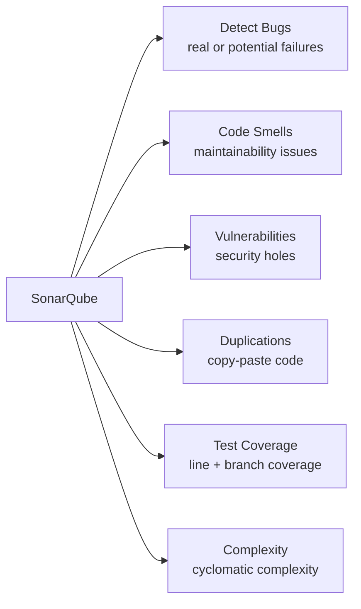
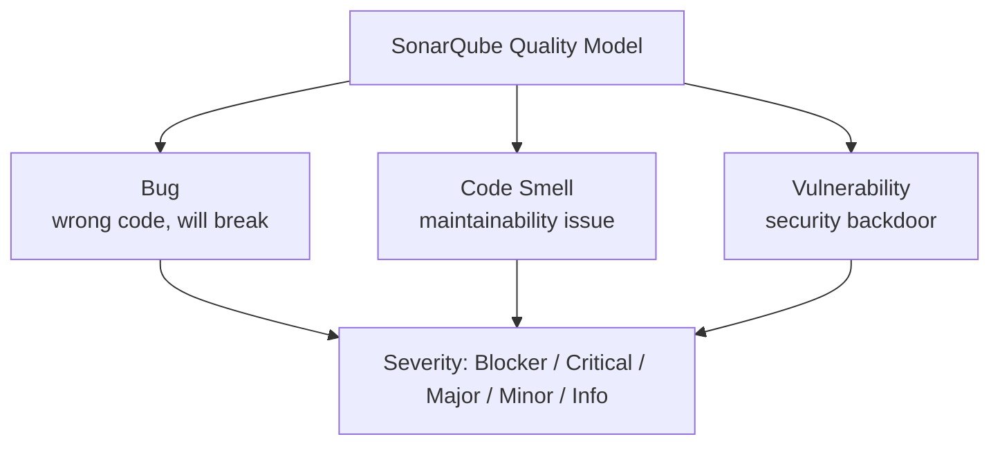
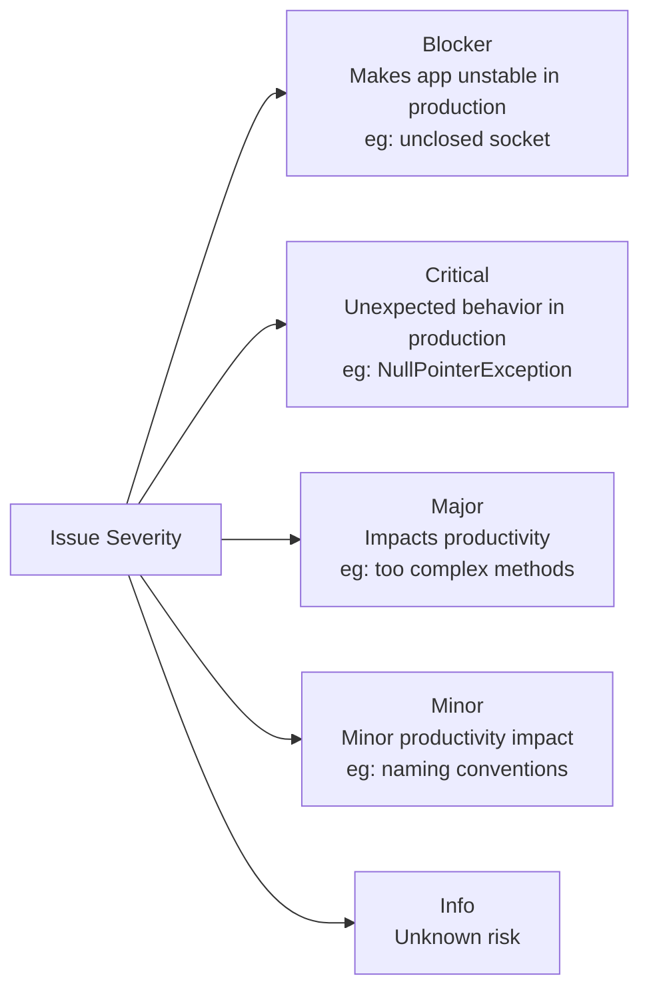
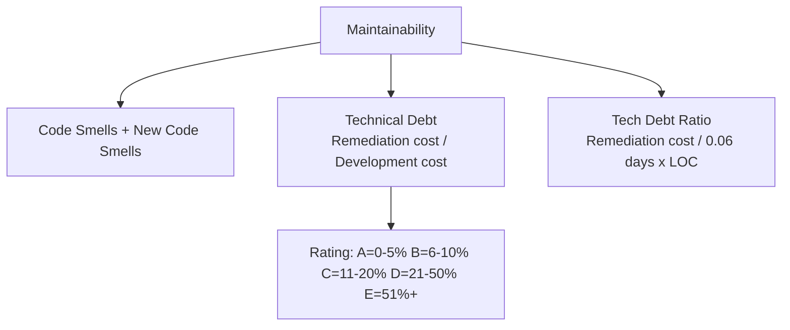
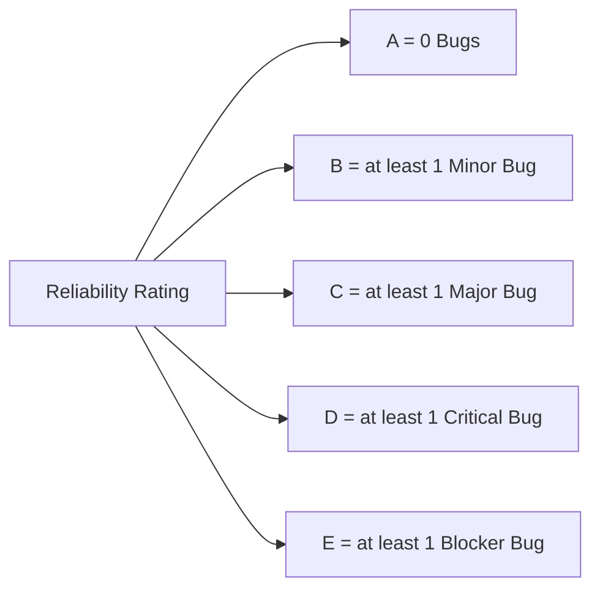
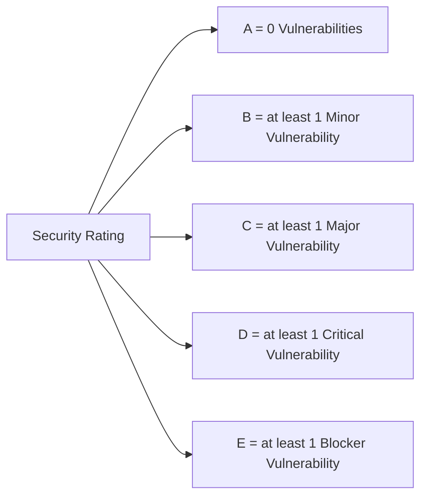
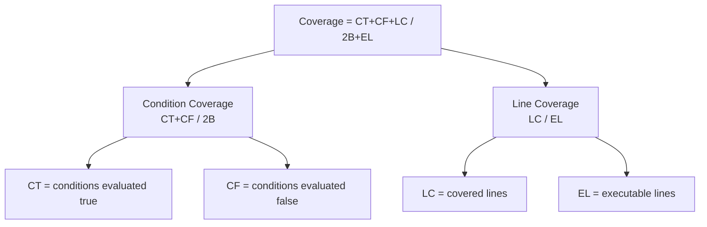
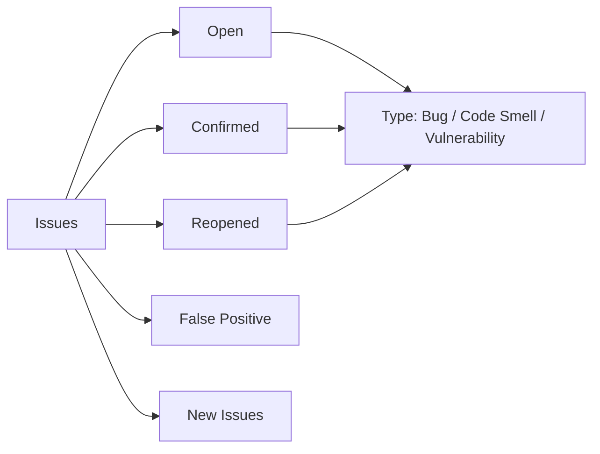

Tool assessment is very important and one of the most critical task in DevOps.
In this post I will walk you through the SonarQube code quality capabilities and how it works.

**CodeQuality**

Code quality management is a topic that has seen a tremendous increase of attention and demand.  The increasing awareness of Technical Debt issues at all levels of the IT landscape is one of the factors at play, as well as increasing adoption of Agile techniques. Perhaps most importantly, most developers at a personal level want to develop better code, and are looking for ways to improve their output on a continual basis. 

<!--more-->

# SonarQube - Code Quality

SonarQube helps you in

## SonarQube Architecture

SonarQube has 3 main components

**Analyzer:**  A client application that analyzes the source code to compute snapshots.

**Database:** 	Database stores	
-   configuration
-   snapshots

**Server:**  Web interface that is used to browse snapshot data & make configuration changes.	

> ***Snapshots***: A set of measures and issues on a given component at a given time. A snapshot is generated for each analysis.

## Quality Model

**Bug:**

An issue that represents something wrong in the code. If this has not broken yet, it will, and probably at the worst possible moment. This needs to be fixed. Yesterday.

or you can say *"Any deviation from rule set is a Bug"*

**Code smell:**

A **maintainability-related issue** in the code. Leaving it as-is means that at best maintainers will have a harder time than they should making changes to the code. At worst, they'll be so confused by the state of the code that they'll introduce additional errors as they make changes.

**Vulnerabilities:**

A **security-related issue** which represents a potential backdoor for attackers

Coding Rule: A good coding practice. Not complying to coding rules leads to quality flaws and creation of issues in SonarQube. Coding rules can check quality on files, unit tests or packages.

**Component**: A piece of software (project, module/package, file) or a view or a developer.

**Issue**: When a component does not comply with a coding rule, an issue is logged on the snapshot.  An issue can be logged on a source file or a unit test file. There are 3 types of issue:

-   *Code Smell*: an issue affecting your maintainability rating, preventing you to inject changes as fast as when you start from scratch.
-   *Bug*: an issue highlighting a real or potential point of failure in your software.
-   *Vulnerability*: an issue highlighting a security hole that can be used to attack your software

**Leak Period**:  The period for which you're keeping a close watch on the introduction of new problems in the code. Typically this is since the previous_version, but if you don't use a Maven-like versioning scheme you may need to set a relatively arbitrary time period such as 21 days or since a specific date. 

**Measure**: The value of a metric for a given component at a given time.

**Metric**: A type of measurement. Metrics can have varying values, or measures, over time. Examples: number of lines of code, complexity, etc.

-   *qualitative*: gives a quality indication on the component (ex: density of duplicated lines, line coverage by tests, etc.)
-   or *quantitative*: does not give a quality indication on the component (ex: number of lines of code, complexity, etc.)

## Severity

**Critical**: Operational/security risk: This issue might lead to an unexpected behavior in production without impacting the integrity of the whole application. Ex: NullPointerException, badly caught exceptions, lack of unit tests, etc.

**Blocker**: Operational/security risk: This issue might make the whole application unstable in production. Ex: calling garbage collector, not closing a socket, etc.

**Minor**: This issue might have a potential and minor impact on productivity. Ex: naming conventions, Finalizer does nothing but call superclass finalizer, etc.

**Major**:This issue might have a substantial impact on productivity. Ex: too complex methods, package cycles, etc.

**Info**: Unknown or not yet well defined security risk or impact on productivity. 

## Maintainability

-   Code Smells
-   New Code Smells
-   Technical Debt
-   Technical Debt on new code

**Technical Debt Ratio**: Ratio between the cost to develop the software and the cost to fix it. The Technical Debt Ratio formula is:

> *Remediation cost / Development cost*

Which can be restated as:

> *Remediation cost / (Cost to develop 1 line of code * Number of lines of code)*

The value of the cost to develop a line of code is 0.06 days.

**Maintainability Rating**:
Rating given to your project related to the value of your Technical Debt Ratio. The default Maintainability Rating grid is:

**A**=0-0.05, **B**=0.06-0.1, **C**=0.11-0.20, **D**=0.21-0.5, **E**=0.51-1
The Maintainability Rating scale can be alternately stated by saying that if the outstanding remediation cost is:

- <=5% of the time that has already gone into the application, the rating is **A**
- between 6 to 10% the rating is a **B**
- between 11 to 20% the rating is a **C**
- between 21 to 50% the rating is a **D**
- anything over 50% is an **E**

## Reliability

-   Bug
-   New Bug

**Reliability Rating**:

**A** = 0 Bug 

**B** = at least 1 Minor Bug

**C** = at least 1 Major Bug

**D** = at least 1 Critical Bug

**E** = at least 1 Blocker Bug

**Reliability remediation effort**
Effort to fix all bug issues. The measure is stored in minutes in the DB. *An 8-hour day is assumed when values are shown in days*.

## Security

-   Vulnerabilities
-   New Vulnerabilities

**Security Rating**:

**A** = 0 Vulnerability

**B** = at least 1 Minor Vulnerability

**C** = at least 1 Major Vulnerability

**D** = at least 1 Critical Vulnerability

**E** = at least 1 Blocker Vulnerability

**Security remediation effort**
Effort to fix all vulnerability issues. The measure is stored in minutes in the DB. *An 8-hour day is assumed when values are shown in days*.

## Test Coverage

**Tests Condition coverage**

> *Condition coverage = (CT + CF) / (2B)*

where 
**CT** = conditions that have been evaluated to 'true' at least once, **CF** = conditions that have been evaluated to 'false' at least once, **B** = total number of conditions*

**Test Line coverage** 
> Line coverage = LC / EL
 
 where 
**LC** = covered lines (lines_to_cover - uncovered_lines), 
**EL** = total number of executable lines (lines_to_cover)

**Test Coverage**

> *Coverage = (CT + CF + LC)/(2B + EL)*
 
where 
**CT** = conditions that have been evaluated to 'true' at least once, **CF** = conditions that have been evaluated to 'false' at least once, **LC** = covered lines = lines_to_cover - uncovered_lines, 
**B** = total number of conditions
**EL** = total number of executable lines (lines_to_cover)

**Unit test success density (%)**

> *Test success density = (Unit tests - (Unit test errors + Unit test failures)) / Unit tests * 100*

## Issues

-   Issue
-   New Issues
-   False positive issues
-   Open issues
-   Confirmed issues
-   Reopened issues

## QualityGate
- **Quality Gate Status**:
State of the Quality Gate associated to your Project. Possible values are : ERROR, WARN, OK
- **Quality Gates Details**: For all the conditions of your Quality Gate, you know which condition is failing and which is not.

## SonarQube Rules
https://rules.sonarsource.com/

## Q&A

**Drill down into security- What aspects/rules it covers** 
Vulnerability(security) rules cover the most of security standard  CWE, SANS Top 25, and OWASP Top 10.

**How easy is to create and distribute rules**

Profiles can be created and you can create custom profile where you can add rules which cover quality model rules
