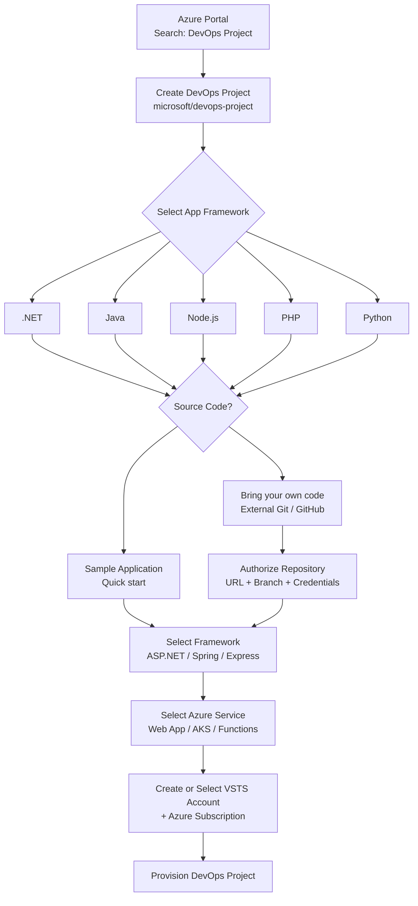
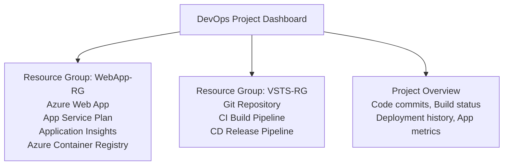
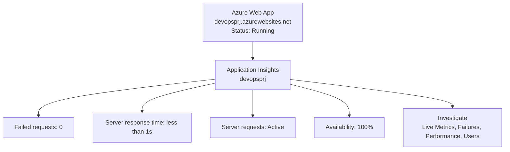

*DevOps Project - Another exciting feature is now available in public preview.*

Build any Azure application, on any Azure service, in less than five minutes.

I see this as an extension of Azure Web App with additional features. Its useful quick starting point, when your team do not have much experience in DevOps practices.  

<!--more-->

> Key benefits of a DevOps Project:

*   Get up and running with a new app and a full DevOps pipeline in just a few minutes
*   Support for a wide range of popular frameworks such as.NET, Java, PHP, Node, and Python
*   Start fresh or bring your own application from GitHub
*   Built-in Application Insights integration for instant analytics and actionable insights
*   Cloud-powered CI/CD using Visual Studio Team Services (VSTS)

> Behind the scene

By completing a few quick steps, now you have a DevOps Project which includes:

*   Git repository with application code. You can start building your application right away by cloning the application code locally and using an IDE of your choice
*   The necessary Azure resources. For example
*   An Azure DevOps Project

        Web App for Containers or Web App on Windows
        Application Insights
        Azure Container Registry
        Automated CI/CD pipeline

*   Application deployments will be done through continuous integration/continuous deployment (CI/CD) capabilities of Visual Studio Team Services.
*   With an auto-generated and fully integrated CI/CD pipeline, your apps are updated each time your source code changes.
*   The right CI definition to build an application written in the framework of your choice. For example, an Express.js application which runs tests, updates npm packages and publishes the artifact.
*   CD definition which deploys to Azure service you selected.
*   Complete end to end traceability from code change to deployment. For example, if a bug is fixed you can track what code change fixed the bug and when that code change got deployed to production.
*   Application Insights integration for monitoring your application to: 
        Help you diagnose issues and understand how application is getting used by your end customers

> Step by Step

*Search for DevOps Project and create project*

*Deployment and Resource groups*

You can see the build and release progress

```mermaid
flowchart LR
  SRC["Get Sources\ndevops / master branch"] --> PH["Phase 1: Hosted VS2017"]
  PH --> T1["NuGet Restore"] --> T2["Build Solution\n**/*.sln"] --> T3["Test Assemblies"]
  T3 --> T4["Publish Symbols Path"] --> T5["Publish Artifact: drop"]
  T5 --> CD["CD Release Pipeline\ndevopsprj-CD"]
  CD --> ENV["Environment: Production\nDeploy Azure Web App"]
  ENV --> DONE["Release Succeeded\nhttps://devopsprj.azurewebsites.net"]
```

Once the deployment is completed, Web App and App insight data is available

> Watch video for more details

   
        

