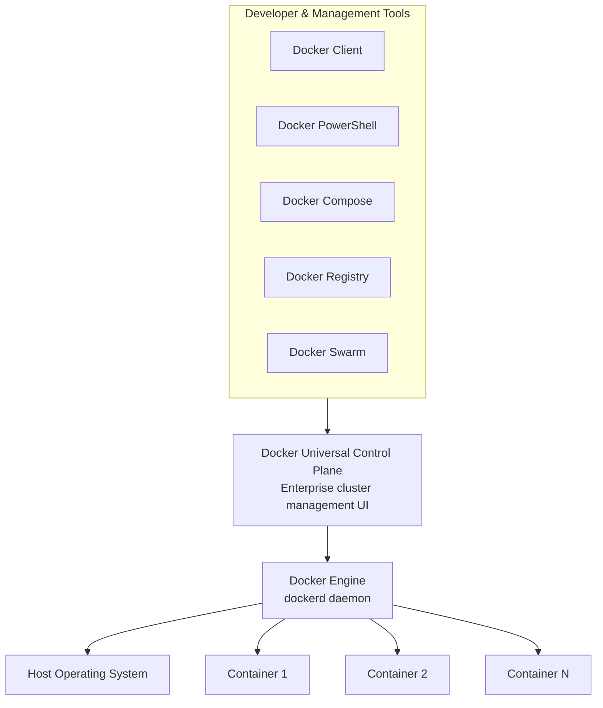
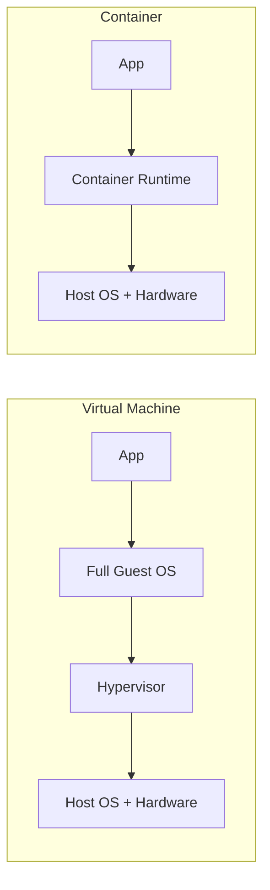
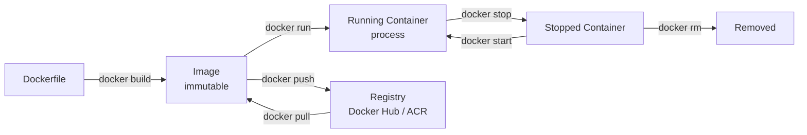

# Docker

What is Docker? The standard answer, I always got from audience is Docker is  a Container. If you think the same then you are in trap. 

***Docker is not a container. Docker provide tools and techniques to build the container.***

Docker is an open-source project for automating the deployment of applications as portable, self-sufficient containers that can run on any cloud or on-premises. Docker is also a company promoting and evolving this technology with a tight collaboration with cloud, Linux and Windows vendors, like Microsoft.

Or in other words, Docker is a way to package up an app/service and push it out in a reliable and reproducible way. So, you can say that **Docker is a technology, but also a philosophy and a process**.

Container also help on **Drift Management**. when using Docker, you won’t get the typical developer’s statement **“it works on my machine”**. But you can simply say **“it runs on Docker”** because the packaged Docker application can be executed on any supported Docker environment and it will run the way it was intended to do it on all the deployment targets (Dev/QA/Staging/Production, etc.).

> ## High level Architecture

> ### Docker Engine

 Deployed across the developer laptops and test infrastructure allows the containers to be portable across environments.

> ### Docker Swarm

Is a clustering and scheduling tool for Docker containers. It turns a pool of Docker hosts into a single, virtual Docker host. Because Docker Swarm serves the standard Docker API, any tool that already communicates with a Docker daemon can use Swarm to transparently scale to multiple hosts.

> ### Docker Registry

A Registry is a hosted service containing repositories of images which responds to the Registry API. The default registry (from Docker as an organization) can be accessed using a browser at Docker Hub or using the Docker search command.

> ### Docker Compose

Compose is a tool for defining and running multi container applications. With compose, you define a multi-container application in a single file, then spin your application up in a single command which does everything that needs to be done to get it running.

> ### Docker PowerShell

In order to use Windows Containers, you just need to write PowerShell commands in the Dockerfile.

> ### The Docker client

Is the primary way that many Docker users interact with Docker. When you use commands such as docker run, the client sends these commands to dockerd, which carries them out. The docker command uses the Docker API. The Docker client can communicate with more than one daemon.

> ### Docker Universal Control Plane (UCP)

Is the enterprise-grade cluster management solution from Docker. You install it on-premises or in your virtual private cloud, and it helps you manage your Docker swarm and applications through a single interface.

> ## Summary
**Container vs VM — at a glance:**

**Container lifecycle:**

*   Container based solutions provide important benefits of cost savings because containers are a solution to deployment problems cause by the lack of dependencies in production environments, therefore, improving DevOps and production operations significantly.

*   Docker is becoming the “de facto” standard in the container industry, supported by the most significant vendors in the Linux and Windows ecosystems, including Microsoft. In the future Docker will be ubiquitous in any datacenter in the cloud or on-premises.

*   A Docker container is becoming the standard unit of deployment for any server-based application or service.
