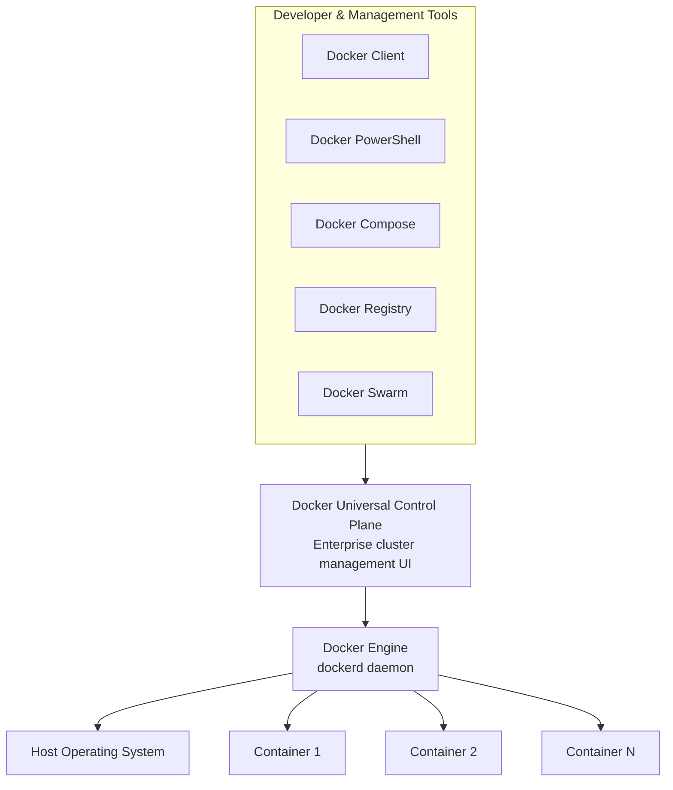
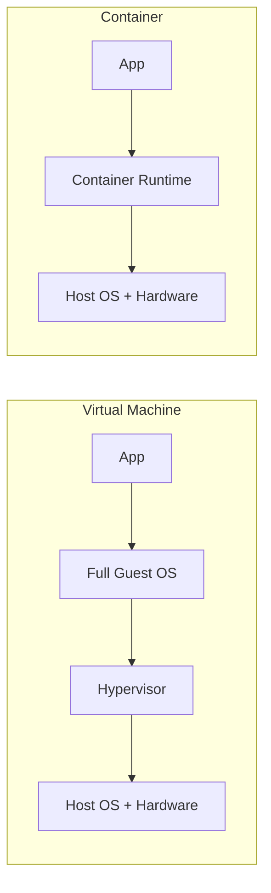
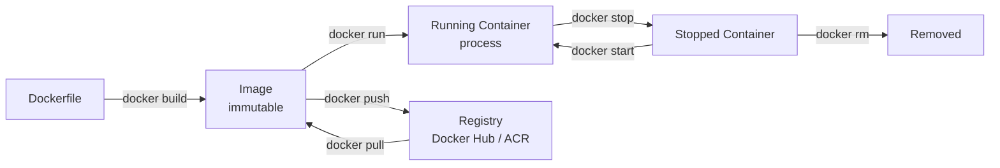

# Docker Overview

Here’s the most common misconception I hear: *“Docker is a container.”*

It’s not. **Docker is the platform that creates, ships, and runs containers.** Conflate the two and you’ll spend your first few months confused about what Docker actually does versus what a container is.

Docker is an open-source project for automating the deployment of applications as portable, self-sufficient containers that run on any cloud or on-premises environment. Behind the project is also a company — Docker Inc. — that drives the technology forward in tight collaboration with cloud providers and OS vendors including Microsoft, making Windows containers a first-class citizen.

---

## Why This Matters: Killing Configuration Drift

One of the most practical benefits Docker brings is eliminating the classic *“it works on my machine”* problem.

When you package an application as a Docker container, the environment travels with the code. Dev, QA, Staging, Production — the container runs identically everywhere it’s deployed. No surprise failures when code reaches production because a dependency is missing or a config value differs.

> **You stop saying “it works on my machine.”**
> **You start saying “it runs on Docker.”**

---

## High-Level Architecture

At its core, Docker’s architecture has three tiers: the tools you interact with, an enterprise control plane, and the engine that runs the containers.

### Docker Engine

The core runtime — the `dockerd` daemon — deployed across developer laptops and production infrastructure alike. Because the same Engine runs everywhere, containers built locally are genuinely portable to any Docker host without modification.

### Docker Client

The primary interface for developers. Commands like `docker run`, `docker build`, and `docker ps` go through the client, which forwards them via the Docker API to `dockerd`. The client can connect to remote daemons, not just local ones.

### Docker Compose

Define a multi-container application in a single `docker-compose.yml` file, then bring the entire stack up with one command. Think of it as an ARM template for container topology — services, networking, volumes, and environment variables all described in one place.

### Docker Swarm

A clustering and scheduling layer that turns a pool of Docker hosts into a single virtual host. Because Swarm speaks the standard Docker API, existing tooling scales transparently across multiple hosts without code changes.

### Docker Registry

A hosted service containing repositories of images. The default public registry is Docker Hub. Organisations typically run a private registry — Azure Container Registry, for example — to keep images close to their deployment infrastructure and behind access control.

### Docker Universal Control Plane (UCP)

The enterprise cluster management UI. Install it on-premises or in your VPC to manage your entire Docker Swarm and application portfolio from a single interface.

### Docker PowerShell Module

For Windows Server environments, the Docker PowerShell module lets you manage images, containers, and registries through familiar PowerShell syntax — useful when scripting infrastructure or working in environments where the CLI isn’t the primary tool.

---

## Container vs VM — and Why Both Still Exist

Containers and VMs aren’t the same, and they don’t replace each other. They solve different problems at different layers of the stack.

A VM virtualises hardware — each VM carries a full guest OS, which is why they’re gigabytes in size and take minutes to boot. A container virtualises at the OS level, sharing the host kernel. That’s why containers are megabytes in size and start in seconds.

The trade-off: VMs give stronger isolation (separate kernels). Containers give density and speed.

---

## Container Lifecycle

Start with a `Dockerfile`. Build an immutable image. Run containers from that image. Stop them, remove them, or push the image to a registry so any other host can pull and run exactly the same thing. Immutable images, disposable containers — that’s the model.

---

## Key Takeaways

- **Docker is a platform**, not a container — it builds, ships, and runs containers
- **Containers bundle code and environment together**, eliminating the “works on my machine” class of problems
- **VMs and containers complement each other** — VMs for strong isolation, containers for density and speed
- **Docker Hub** is the public default registry; organisations typically use a private registry like ACR for production workloads
- **Dockerfile → Image → Container** is the core mental model — learn it early, use it constantly

---

*Next in this series: [Docker Definitions and Taxonomy](/blog/docker-2) — the complete glossary of terms you’ll encounter every day.*
