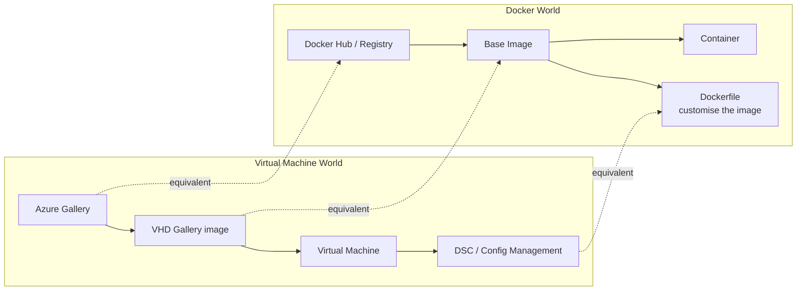
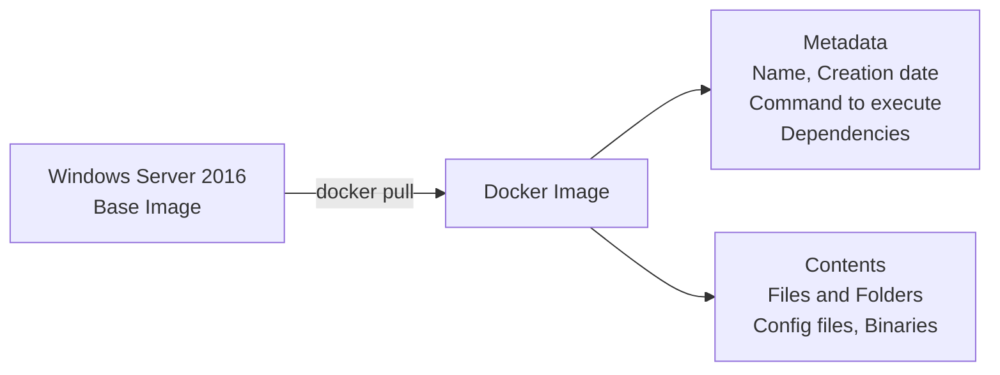
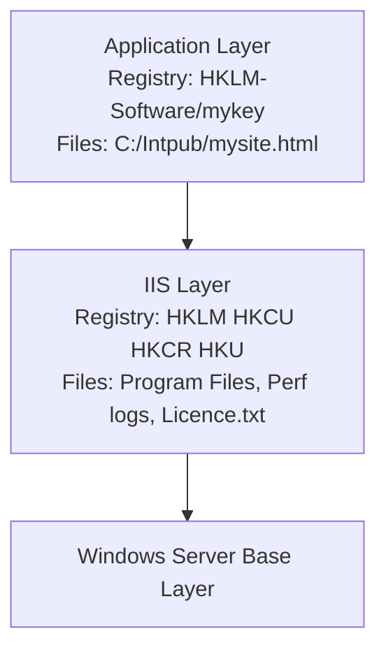
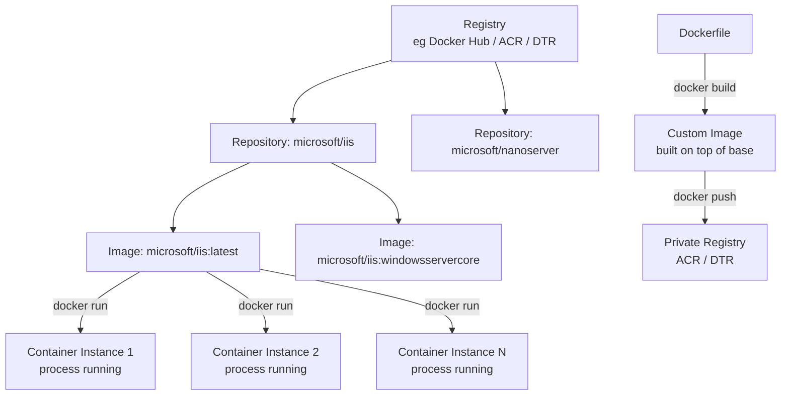

# Docker Definitions and Taxonomy

Terminology is where Docker trips people up early. Words like *image*, *container*, *registry*, and *repository* sound interchangeable until you realise they have precise, distinct meanings — and conflating them causes real confusion when you’re debugging or designing systems.

This post is a reference. Read it once end-to-end, then bookmark it.

If you’re new to containers, read [Container - It’s all about Application](/blog/container) and [Docker Overview](/blog/docker-1) first — this post assumes you know what a container is.

---

## The VM Analogy (Useful, but Don’t Overstretch It)

If you come from a VM background, these mappings help you get oriented quickly. Just don’t take the analogies too literally — containers and VMs have fundamentally different isolation models.

**VM ↔ Docker concept mapping:**



With that map in mind, here are the terms — in the order you’ll encounter them.

---

## Core Concepts

### Docker Image


An image is the foundation everything else is built on. Formally: **an ordered collection of root filesystem changes and the corresponding execution parameters for use within a container runtime.**

In practice: it’s the packaged, immutable snapshot of your application and all its dependencies. It has no state. It never changes once built. You can run a thousand containers from the same image, on a thousand different hosts, and they all start identically.

Images are built in layers — each `Dockerfile` instruction adds a layer on top of the previous one. On Windows, layers live under `C:\ProgramData\docker\containers`. To pull an image from Docker Hub:

```PowerShell
docker pull microsoft/iis
```


### Container

A container is a **runtime instance of a Docker image**. The same image can spawn multiple containers simultaneously, each running as an isolated process with its own filesystem, networking, and process tree.

> **One container contains one thing** — a single process like a service or web app. It’s a 1:1 relationship between a container and a concern.

Scale a service by spinning up more containers from the same image. Run a batch job with different parameters? Multiple containers, same image, different environment variables.



### Tag

A label applied to an image in a repository to distinguish versions. `microsoft/iis:latest` and `microsoft/iis:windowsservercore` are the same repository, different tags. Tags are how you version and differentiate image variants.

### Dockerfile

A plain-text file containing instructions to build a Docker image. Each instruction adds a layer. The Dockerfile is your repeatable, version-controlled recipe for building an environment:

```PowerShell
docker build -t <image-tag> <dockerfile-path>
```

### Build

The process of executing a Dockerfile to produce an image. `docker build` takes the Dockerfile and a build context (the directory containing files the build references), pulls the base image if needed, applies each instruction as a new layer, and tags the result.
---

## Registry, Repository, and Hub

These three are consistently confused. Here's how they nest:




### Repository

A collection of related images — all variations of a single thing, differentiated by tag. `microsoft/iis` is a repository. `microsoft/iis:latest`, `microsoft/iis:windowsservercore`, and `microsoft/iis:nanoserver` are the images within it.

### Registry

A hosted service that contains one or many repositories and exposes the Registry API. The default public registry is Docker Hub. Organisations run private registries for access control, network proximity, and compliance requirements.

### Docker Hub

Docker’s public registry — [hub.docker.com](https://hub.docker.com). The GitHub equivalent for container images. It provides public and private image hosting, automated builds from GitHub and Bitbucket, webhooks, build triggers, and official vendor-maintained base images.

### Azure Container Registry (ACR)

A private registry, network-close to your Azure deployments, integrated with Azure Active Directory for access control. Use ACR when you need tight control over image distribution and reduced pull latency into AKS, ACI, or App Service.

### Docker Trusted Registry (DTR)

Docker’s enterprise-grade on-premises image storage — part of Docker Datacenter. Install it behind your firewall for maximum security and auditability in air-gapped or regulated environments.

---

## Orchestration and Clustering

### Compose

A tool for defining and running multi-container applications. You describe the entire stack in a `docker-compose.yml` file — services, networks, volumes — and bring it up or tear it down with a single command. Compose is to containers what an ARM master template is to Azure resources.

### Cluster

A pool of Docker hosts exposed as a single virtual Docker host, enabling scale-out across many machines. Docker Swarm, Kubernetes, Mesosphere DC/OS, and Azure Service Fabric are all cluster implementations. If you’re using Swarm specifically, call it *a swarm* rather than *a cluster*.

### Orchestrator

A layer above the cluster that manages images, containers, and hosts at scale. Responsibilities include running, distributing, scaling, and healing workloads across nodes, plus networking, load balancing, service discovery, and high availability. Kubernetes, Docker Swarm, and Azure Service Fabric are all orchestrators.

---

## Developer Tooling

### Docker for Windows and Mac

The local development environment for building and running containers on developer machines. Docker for Windows provides both Windows and Linux container environments (via Hyper-V). Docker for Mac uses Apple’s Hypervisor framework and `xhyve`. Both replaced the older Docker Toolbox, which relied on Oracle VirtualBox.

### Docker PowerShell Module

For Windows Server environments, the Docker PowerShell module provides cmdlets for managing images, containers, and registries — useful when scripting infrastructure or working in environments where PowerShell is the primary management interface.

---

## Why Image Immutability Matters

The design principle underpinning all of this is **immutability**. An image never changes once built. You can version it, tag it, push it to a registry, pull it anywhere, and know with certainty what you’re running.

> The power of images and registries is the ability to store static, immutable application bits — including all OS and framework dependencies — so they can be versioned and deployed in multiple environments as a consistent, reproducible unit.

Good reasons to run a private registry:

- Tight control over where images are stored and who can pull them
- Reduced network latency between registry and deployment nodes
- Full ownership of your image distribution pipeline
- Integration with your internal development and release workflows

---

## Key Takeaways

- **Image** = immutable snapshot of your app and its dependencies, built in layers
- **Container** = running instance of an image — ephemeral, isolated, one concern per container
- **Repository** = collection of image variants (same app, different tags)
- **Registry** = hosts one or many repositories; Docker Hub is the public default
- **ACR** = private Azure registry, integrated with AAD, network-close to your deployments
- **Compose** = multi-container stack definition; **Swarm / Kubernetes** = cluster + orchestration
- **Immutability** is the design principle that makes the whole model reliable and reproducible

---

*Next in this series: [My First Docker Container](/blog/docker-3) — put this terminology to work and build a real Windows container step by step.*

