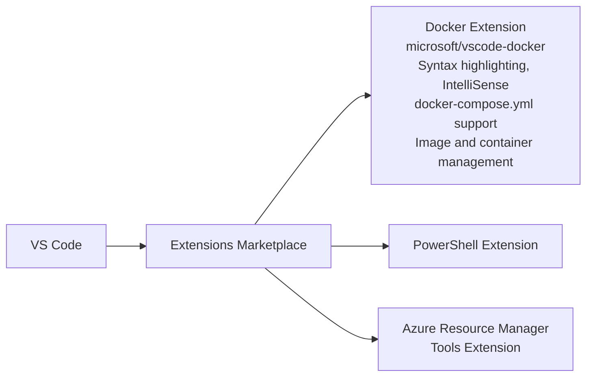
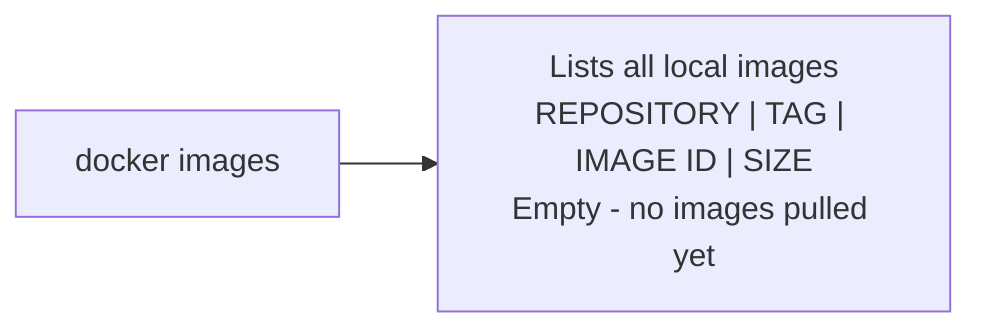
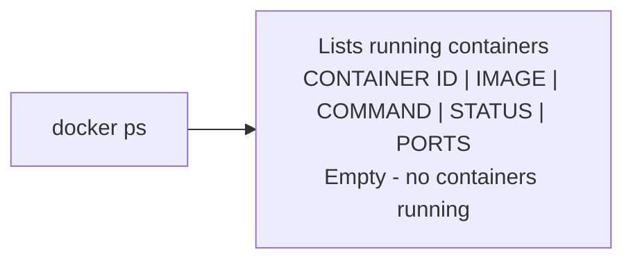
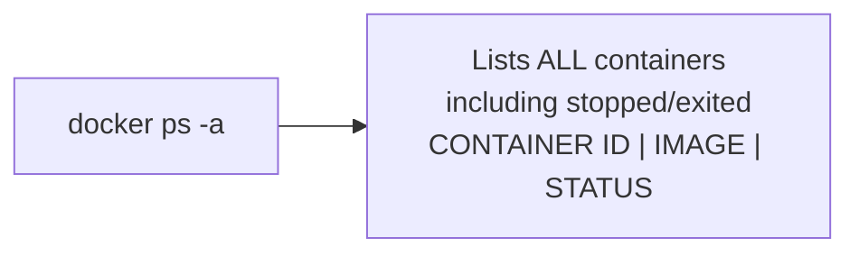
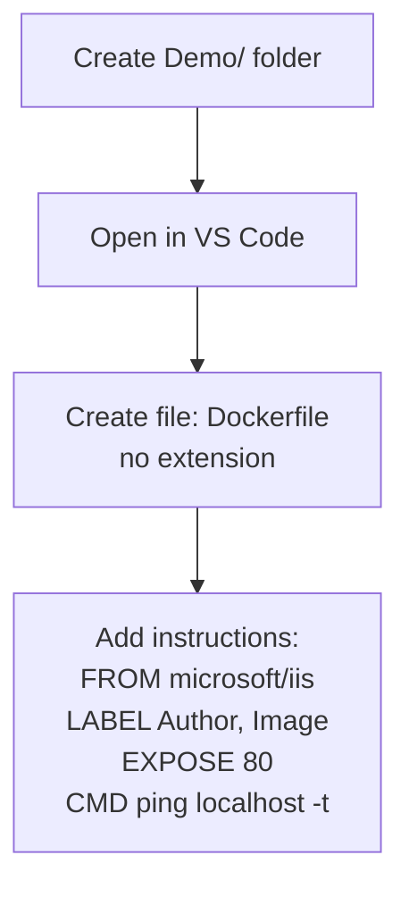
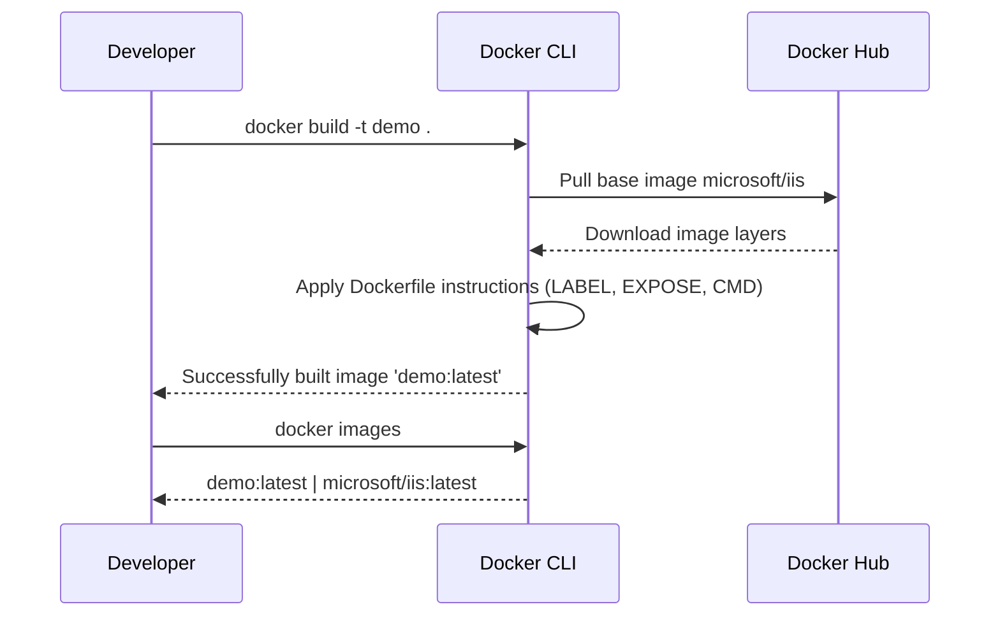
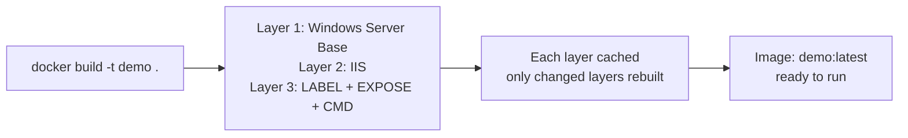
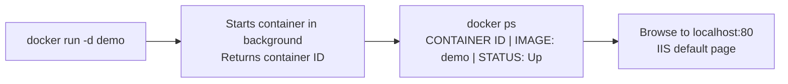
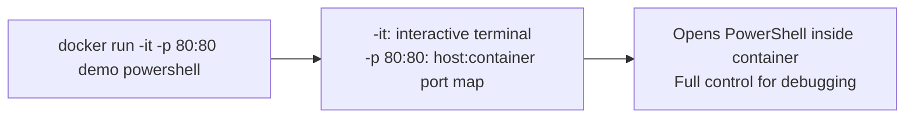

This post will walk you through, how I have built my first Docker container.

# Prepare the environment 

If you already have Windows 10 or Windows server 2016 machine. [Download code](https://github.com/AjeetChouksey/IaCLab/blob/master/Containers/DockerforWindows/dockerforwindows.ps1) to configure Docker environment.

If you would like to have a new VM 
[Get the code from here](https://github.com/AjeetChouksey/IaCLab/tree/master/201-VM-Docker-VSCode). This will create Windows server 2016 VM with Docker, VS Code, git and chrome.


## Let's discuss some basic docker commands, before we start

*   **docker version**:
This command will give you the both server and client version. [Click here for more details](
https://docs.docker.com/engine/reference/commandline/version/)

*   **docker images**: will show all top-level images, their repository and tags, and their size. [Click here for more details](https://docs.docker.com/engine/reference/commandline/images/)

*   **docker ps and docker ps  -a**: List containers. ps -a - it will list * all your exited and currently running containers. Any images shown being used inside any of containers are a "used image". [Click here for more details](https://docs.docker.com/engine/reference/commandline/ps/#description)

*   **docker rm**: Remove one or more containers. [Click here for more details](https://docs.docker.com/engine/reference/commandline/rm/)

*   **docker rmi <<image_id>> --force**: Remove one or more images. [Click here for more details](https://docs.docker.com/engine/reference/commandline/rmi/)

*   **docker build**: Build an image from a Dockerfile.  [Click here for more details](https://docs.docker.com/engine/reference/commandline/build/)

*   **docker run**: Docker runs processes in isolated containers. A container is a process which runs on a host. The host may be local or remote. When an operator executes docker run, the container process that runs is isolated in that it has its own file system, its own networking, and its own isolated process tree separate from the host.
  [Click here for more details](
https://docs.docker.com/engine/reference/run/)

*   **docker start**: Start one or more stopped containers.  [Click here for more details](
https://docs.docker.com/engine/reference/commandline/start/)

*   **docker stop**: Stop one or more running containers. [Click here for more details](
https://docs.docker.com/engine/reference/commandline/stop/)

*   **docker system df**:View the space used by Docker.  [Click here for more details](
https://docs.docker.com/engine/reference/commandline/system_df/)

*  [Docker Engine command line references](https://docs.docker.com/engine/reference/commandline/docker/#child-commands)

*  [Handy Docker commands for local development - Part 1 - by Andrew Lock](https://andrewlock.net/handy-docker-commands-for-local-development-part-1/)

* [Handy Docker commands for local development - Part 2 - by Andrew Lock ](https://andrewlock.net/handy-docker-commands-for-local-development-part-2/)

# Let's create our first windows container 

To start with VS Code, Install Docker extension. In addition to this you can also install the PowerShell, Azure Resource Manager Tools extensions.



## Lab 1 - Objective

*  **Step 1**: Create docker file and use default IIS server image from docker hub.
* **Step 2**: Build container
* **Step 3**: Run container 

let's run some basic command 

``` docker
docker images
```



``` docker
docker ps
```



``` docker
docker ps -a
```



### Step 1: Dockerfile

*   Create a folder - Demo
*   Open this folder in VS Code
* Create a file without extension (file name - dockerfile) and save it.



``` docker
FROM microsoft/iis

LABEL Author="Ajeet Chouksey"
LABEL Image="IIS"

EXPOSE 80

CMD ["ping localhost -t"]
```
**FROM**

*The FROM instruction initializes a new build stage and sets the Base Image for subsequent instructions. As such, a valid Dockerfile must start with a FROM instruction*. 

*Refer [Docker HUB](https://hub.docker.com), and search for available images*.

**LABEL**

*The LABEL instruction adds metadata to an image. A LABEL is a key-value pair. To include spaces within a LABEL value, use quotes and backslashes as you would in command-line parsing.*
*An image can have more than one label. You can specify multiple labels on a single line.*

``` docker
LABEL Author="Ajeet Chouksey"
LABEL Image="IIS"
```
or
``` docker
LABEL Author="Ajeet Chouksey" \
Image="IIS"
```

**EXPOSE**

*The EXPOSE instruction informs Docker that the container listens on the specified network ports at runtime. You can specify whether the port listens on TCP or UDP, and the default is TCP if the protocol is not specified.*

*The EXPOSE instruction does not actually publish the port. It functions as a type of documentation between the person who builds the image and the person who runs the container, about which ports are intended to be published. To actually publish the port when running the container, use the -p flag on docker run to publish and map one or more ports, or the -P flag to publish all exposed ports and map them to high-order ports.*

**CMD**

*The main purpose of a CMD is to provide defaults for an executing container.*


``` docker
docker build -t demo .
```
### Step 2: BUILD

*The docker build command builds Docker images from a Dockerfile and a “context”. A build’s context is the set of files located in the specified PATH or URL. The build process can refer to any of the files in the context. For example, your build can use a COPY instruction to reference a file in the context.*






### Step 3: RUN

```docker
docker run -d demo
```



Or run interactively with port mapping and a shell:
```docker
docker run -it -p 80:80 demo powershell
```



in next post, we will build and run the container and try to customize IIS site. We will also use the Azure Container Registry and Azure Container Instance to host and run the container.

---
Please do let me know your thoughts/ suggestions/ question in ***disqus*** section.

---