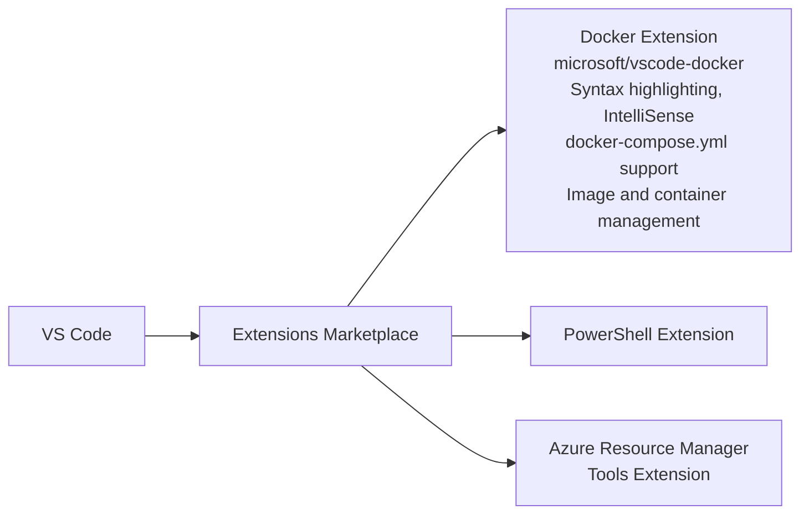
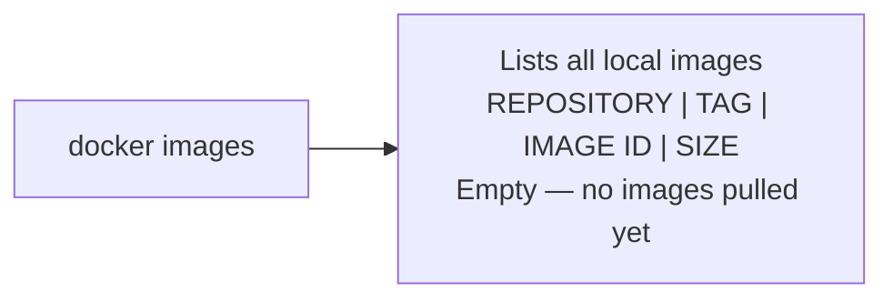
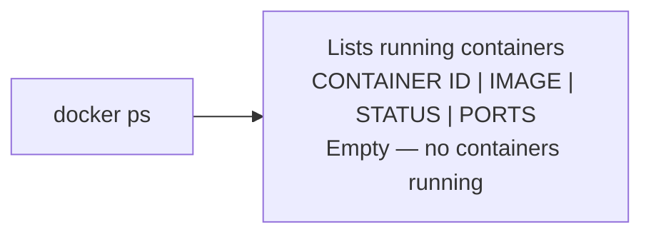
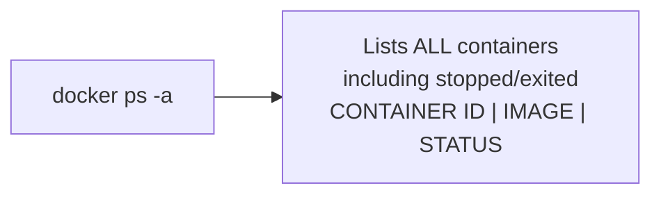
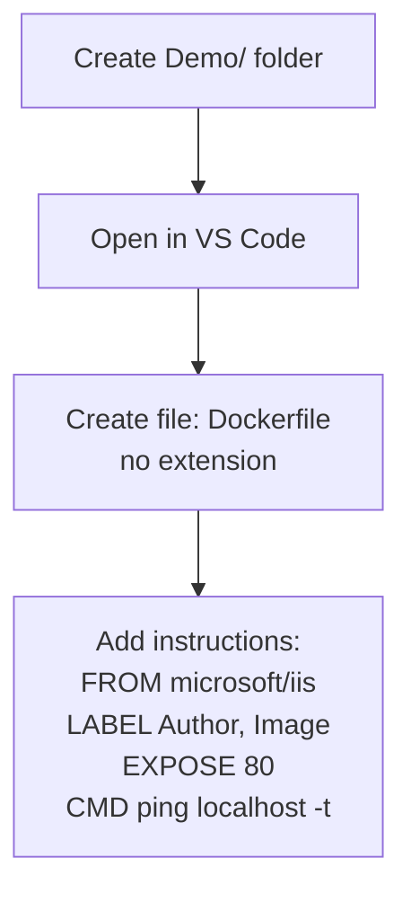
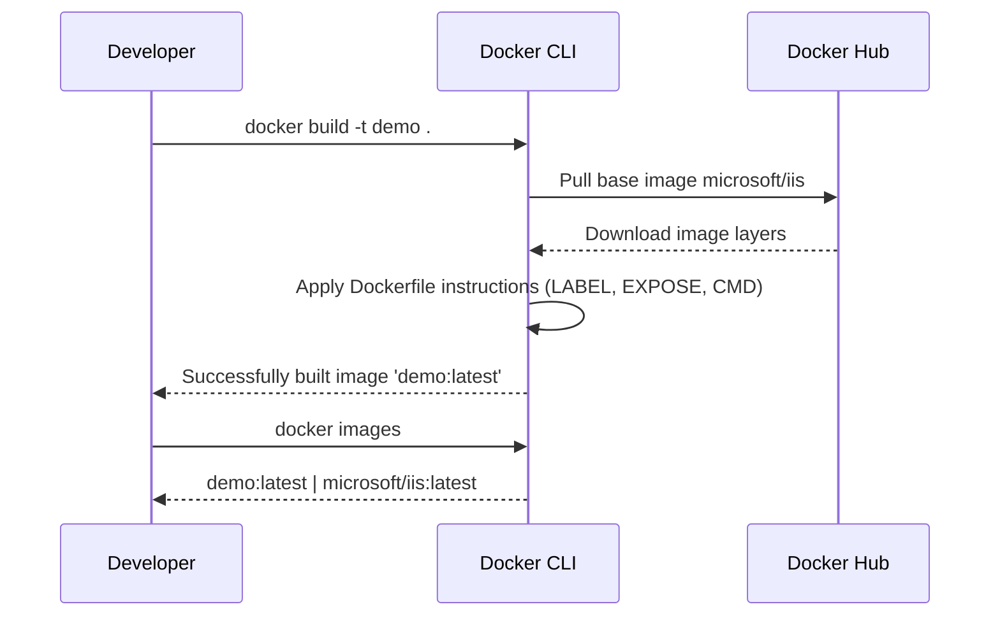
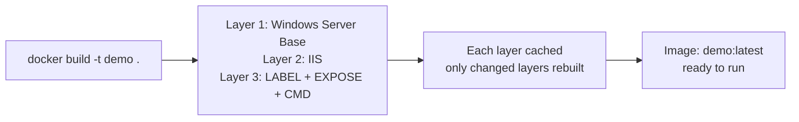
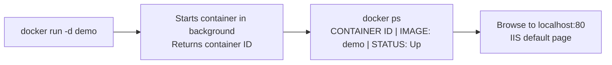
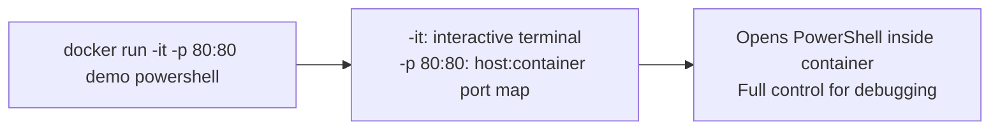

# My First Docker Container

This post walks through building and running your first Windows container from scratch. By the end you'll have a running IIS container built from a Dockerfile you wrote — and you'll understand what every command actually does.

---

## Setting Up the Environment

Before writing any code, you need a machine with Docker installed.

**Already have Windows 10 or Windows Server 2016?**  
[Download this PowerShell script](https://github.com/AjeetChouksey/IaCLab/blob/master/Containers/DockerforWindows/dockerforwindows.ps1) to configure Docker automatically.

**Need a fresh VM?**  
[Use this ARM template](https://github.com/AjeetChouksey/IaCLab/tree/master/201-VM-Docker-VSCode) to provision a Windows Server 2016 VM with Docker, VS Code, Git, and Chrome pre-installed.

---

## Docker Commands You'll Use

Before the lab, here's a quick reference for every command we'll run:

| Command | What it does |
|---------|-------------|
| `docker version` | Shows client and server daemon version |
| `docker images` | Lists all locally available images |
| `docker ps` | Lists running containers |
| `docker ps -a` | Lists all containers including stopped ones |
| `docker build` | Builds an image from a Dockerfile |
| `docker run` | Creates and starts a container from an image |
| `docker start` / `docker stop` | Start or stop an existing container |
| `docker rm` | Remove one or more containers |
| `docker rmi <image_id> --force` | Remove one or more images |
| `docker system df` | Show disk space used by Docker |

Reference: [Docker Engine CLI](https://docs.docker.com/engine/reference/commandline/docker/#child-commands) · [Handy commands part 1](https://andrewlock.net/handy-docker-commands-for-local-development-part-1/) · [Part 2](https://andrewlock.net/handy-docker-commands-for-local-development-part-2/)

---

## Setting Up VS Code

Install the following VS Code extensions before starting:



---

## Lab: Build and Run a Windows IIS Container

**Goal:** Write a Dockerfile, build an IIS image, run a container from it.

### Step 1: Check Your Starting State

Before building anything, verify your local environment is clean:


``` docker
docker images
```



``` docker
docker ps
```



``` docker
docker ps -a
```



### Step 2: Create the Dockerfile

1. Create a folder called `Demo`
2. Open it in VS Code
3. Create a new file named `Dockerfile` — no extension



Add these instructions to your Dockerfile:

``` docker
FROM microsoft/iis

LABEL Author="Ajeet Chouksey"
LABEL Image="IIS"

EXPOSE 80

CMD ["ping", "localhost", "-t"]
```

**What each instruction does:**

**`FROM`** — Every Dockerfile starts here. Sets the base image all subsequent instructions build on. A valid Dockerfile must have exactly one `FROM` as its first instruction. Browse [Docker Hub](https://hub.docker.com) to find available base images.

**`LABEL`** — Adds key-value metadata to the image. You can specify multiple labels using backslash continuation:

``` docker
LABEL Author="Ajeet Chouksey" \
      Image="IIS"
```

**`EXPOSE`** — Documents that the container listens on port 80 at runtime. This is documentation, not a firewall rule — it doesn’t publish the port. To actually publish it, use `-p 80:80` on `docker run`.

**`CMD`** — The default command to execute when a container starts. `ping localhost -t` keeps the container alive so we can interact with it.

### Step 3: Build the Image

``` docker
docker build -t demo .
```

`docker build` reads the Dockerfile and the build context (`.` = current directory), pulls the base image from Docker Hub, applies each instruction as a new cached layer, and tags the final image.



One of Docker’s most powerful features is layer caching. Each instruction creates a cached layer, and Docker only rebuilds layers that have actually changed — so iterative builds after the first are fast:



### Step 4: Run the Container

**Background (detached) mode — start and return immediately:**

``` docker
docker run -d demo
```



**Interactive mode with port mapping — open a shell inside the container:**

``` docker
docker run -it -p 80:80 demo powershell
```



The `-p 80:80` flag maps port 80 on the host to port 80 inside the container. This is what actually publishes the `EXPOSE 80` declared in the Dockerfile — `EXPOSE` only documents intent, `-p` makes it real.

---

## What’s Next

In the next post we’ll build on this foundation: customising the IIS site content inside the container, pushing the image to **Azure Container Registry**, and running it in **Azure Container Instance** — no local Docker host required.

---

## Key Takeaways

- **`FROM`** sets the base image — pulled from Docker Hub or a private registry
- **`LABEL`** adds metadata; **`EXPOSE`** documents ports (does not publish them)
- **`docker build`** executes the Dockerfile layer by layer with caching — only changed layers rebuild
- **`-d`** runs detached (background); **`-it`** runs interactively with a terminal
- **`-p host:container`** is what actually makes a port accessible from outside the container

---

*Related: [Container - It’s all about Application](/blog/container) · [Docker Overview](/blog/docker-1) · [Docker Definitions and Taxonomy](/blog/docker-2)*


