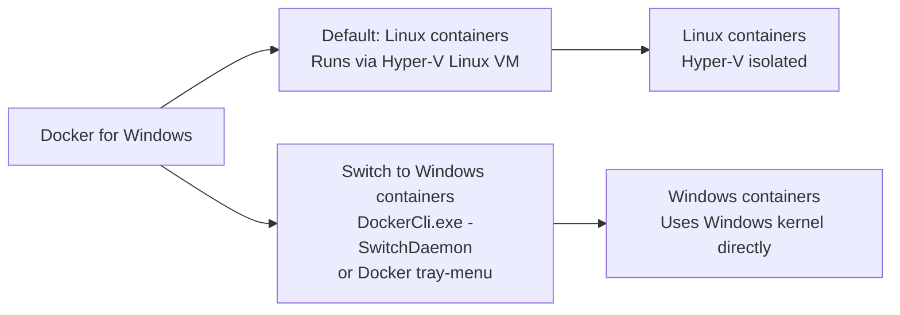

An integrated, easy-to-deploy development environment for building, debugging and testing Docker apps on a Windows PC. Docker for Windows is a native Windows app deeply integrated with Hyper-V virtualization, networking and file system, making it the fastest and most reliable Docker environment for Windows.

Win 10 OS: Base machine must have Windows 10 Anniversary Edition or Creators Update (Professional or Enterprise).
<!--more-->
Following PS will automatically detect the OS version and configure Docker accordingly. 

[Get code to install and configure docker for windows](https://github.com/AjeetChouksey/IaCLab/tree/master/Containers/DockerforWindows)

After installation Docker for Windows defaults to running Linux containers. Switch to Windows containers using either the Docker tray-menu or by running the following command in a PowerShell prompt 

```PowerShell
& $Env:ProgramFiles\Docker\Docker\DockerCli.exe -SwitchDaemon
```


Following PS will give you the installed version
```PowerShell
docker version
```
Will discuss more about containers in upcoming posts.

---
Please do let me know your thoughts/ suggestions/ question in ***disqus*** section.

---