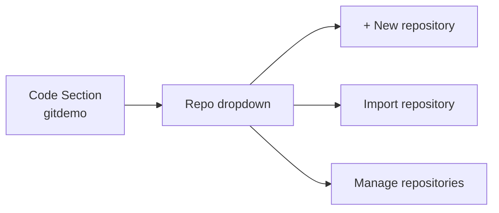
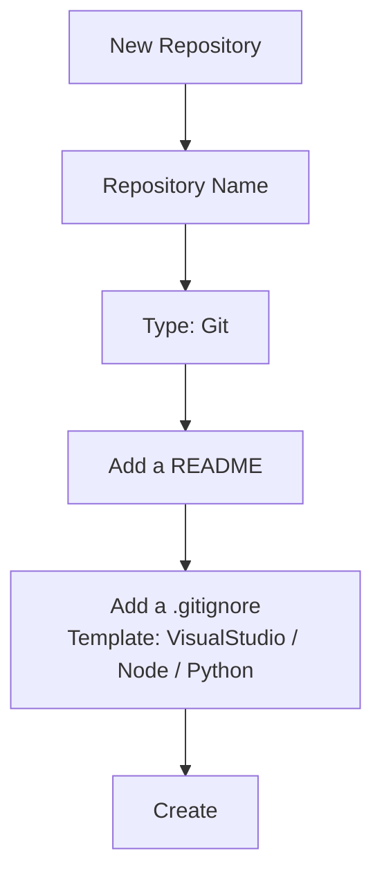
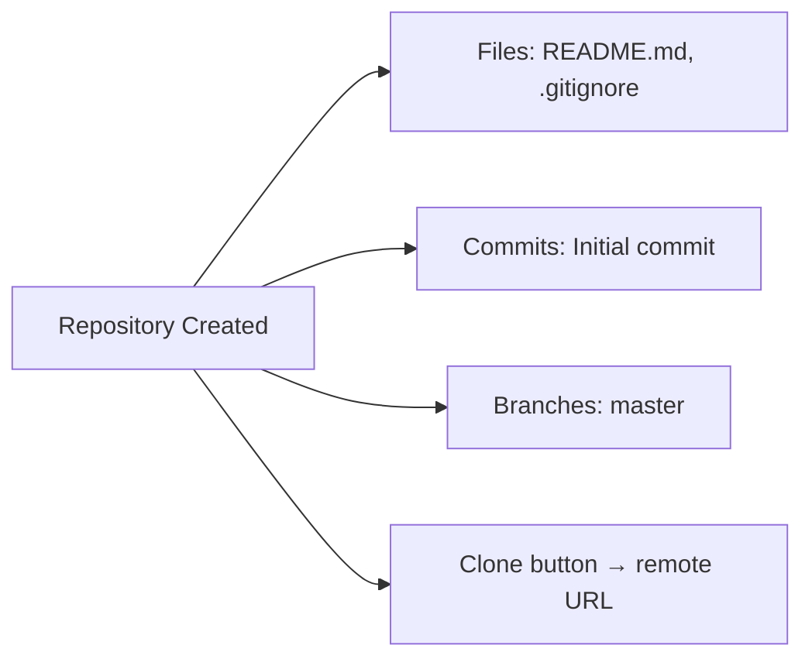
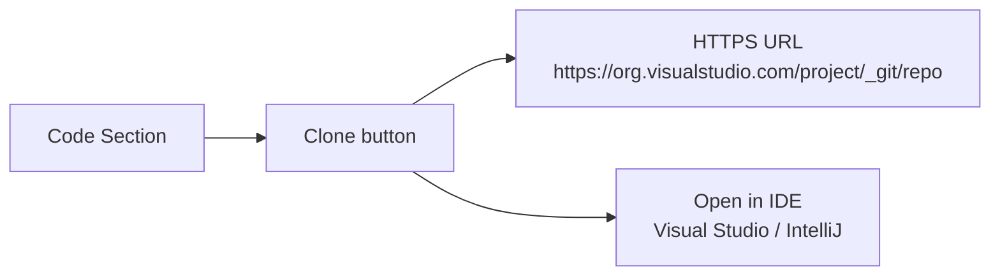
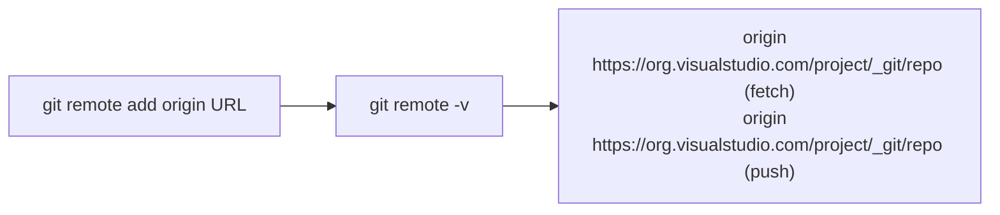

Depending upon the requirement you can have one or more repo inside your project. You can create repos by using
	
	1. 	Web (VSTS)
	2.	CLI
	3.	Visual Studio
	4.	IntelliJ
	5. 	Xcode
	6.	Eclipse	
	
<!--more-->

## Create repo using Web

Navigate to code section -> click on project  -> New repository



Add a .gitignore file





A new empty git repo is now created in your team project. 

## Create local repo using CLI

1.	 [Download git for Windows] (https://git-scm.com/download/win)
2.	Open git bash or git cmd. Navigate to path where you would like to create repo.

```PowerShell
	git init .
```
## Cloning Repo

Get remote repo URL



Use following cmd to clone remote repo

```PowerShell
git remote add origin  <<URL>>
```




*See git related post for  workflow, branches, authentication and pull request.*

---
Please do let me know your thoughts/ suggestions/ question in ***disqus*** section.

---