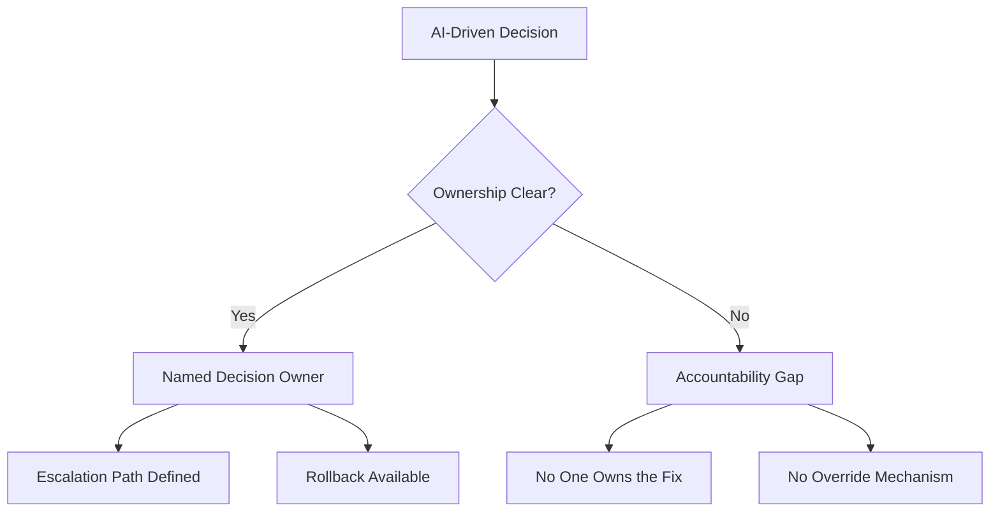

## Most AI Failures Start with Good Intentions

> "Most AI failures don't start with bad models. They start with good intentions and no guardrails."

In cloud and platform engineering, we don't go live without answering basic questions: Who owns this system? Who is on call? What happens when it fails?

Yet with AI, many organizations ship capability without shipping accountability.

## AI Quietly Changes How Decisions Are Made

AI doesn't just automate tasks. It quietly changes how decisions are made.

When ownership is unclear, risk doesn't show up as an outage. It shows up as:

- Decisions no one feels responsible for
- Automation without escalation paths
- "The model did it" replacing human accountability

## What Engineering Rigor Demands

From an **engineering lens**, any system that influences decisions needs:

- Clear decision boundaries
- Outcome monitoring (not just uptime)
- Rollback and override as first-class features

From an **operating-model lens**, the same system needs:

- A named decision owner
- Explicit error tolerance
- Clear escalation when outcomes are wrong

## Speed Without Responsibility Is Just Risk

Responsible AI isn't about slowing teams down. It's about ensuring speed doesn't outrun responsibility.

## The Reflection Test

If this AI-driven decision were wrong tomorrow, could you clearly explain:

1. **Who owns the fix?**
2. **How it would be corrected?**

If you can't answer both, you don't have guardrails — you have hope. And hope is not an operating model.