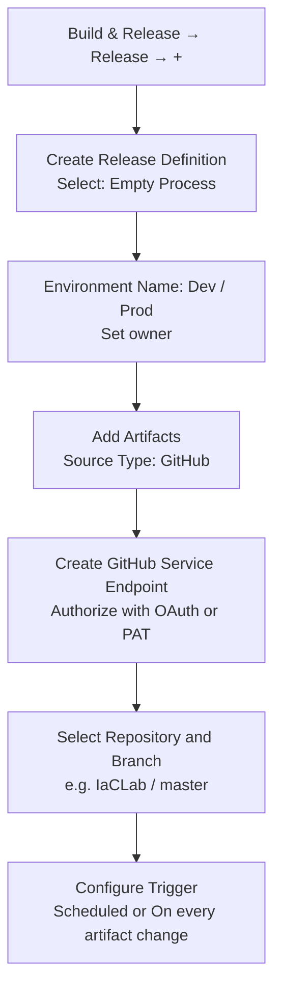
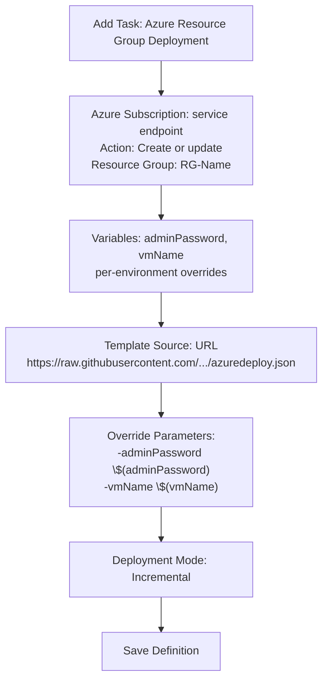
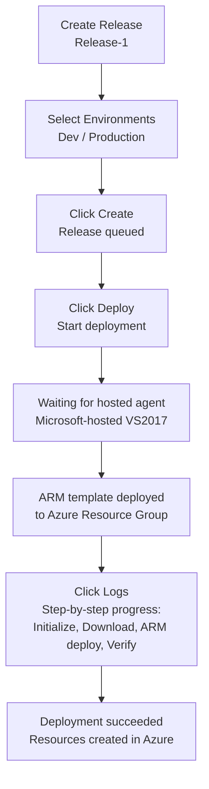

In this post we will discuss, how to setup CD for IaC. IaC code is hosted in GitHub repo.

[Before we start please refer](http://www.azure365.co.in/devops/GitwithVSTS)

<!--more-->

*   Go to Build and Release menu, click on Release  in sub menu. Choose the "+" icon to create a new release definition.Create release definition dialog, select the Empty Process.

Let's add deployment task, search for Azure Deployment.

Create release for deployment

