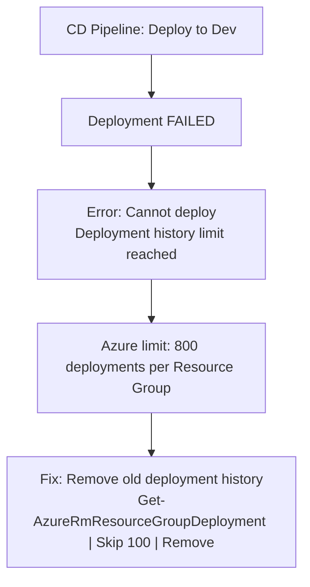

Recently, I have faced an issue, where our CD pipeline start failing (in Dev Envrionment, few second back things were working fine).

We found that, there is no issue with code but it was due to resource deployment history quota against resoruce group. 

Deployment histories are very important. They not only help to keep track of changes but also useful for audit and compliance purposes.
<!--more-->

As per MS documentation, RG can only keep the history of the last 800 deployments. You can not deploy/re-deploy anything once the deployment history reaches 800. 


**Error**




To solve this we need to use a simple but very useful PS

```PowerShell

$resourceGroup = 'your-resource-group'`

Get-AzureRmResourceGroupDeployment -ResourceGroupName $resourceGroup `

| Select-Object -Skip 100 `

| Remove-AzureRmResourceGroupDeployment

```
**skip will ensure to keep latest deployments (in this case latest 100)**.

This PS only delete the deployment history and does't has any impact on deployment, they will remain untouched. 
