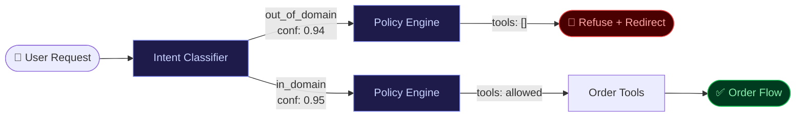

> **"Your AI assistant has no idea what its job is — and that's your fault."**


<p style="text-align:center; font-size:0.75rem; color:#64748b; margin-top:-0.75rem;">Image generated with Microsoft Designer (AI)</p>

---

## 2:10 PM on a Tuesday

Someone opens a food-ordering assistant and types: *"Can you write me a Python script to parse a CSV file and detect duplicate rows?"*

The assistant answers. Full Python script. Imports, logic, comments. The order never happens.

Support tickets spike within the hour. Audit flag raised. Screenshot shared on social media.

Here is the part that matters: **the model did nothing wrong.** It responded helpfully to a text prompt — exactly as designed. The failure was upstream. Nobody enforced a boundary.

<mark>Intent routing is not a UX enhancement. It is a safety and reliability control plane.</mark>

This pattern has repeated across industries — food ordering, banking, HR portals, customer service. A domain bot turns into a general helper not because the model misbehaved, but because the architecture left the door open.

---

## What Actually Broke

When the bot answered that Python question, four things had already failed:

- Domain policy lived in a Confluence doc, not in executable runtime logic.
- The router accepted "helpful" responses when intent confidence was mediocre.
- The tool inventory exposed non-ordering utilities in the same session.
- No deterministic refusal path existed for out-of-scope requests.

<div class="note-important"><strong>Root cause:</strong> Not model quality. Boundary policy missing at the router level. Fix the architecture, not the prompts.</div>

---

## How Drift Happens (It Is Always Gradual)

Six months earlier, the sprint review: *"Users ask all kinds of things — let's keep the bot flexible."* Small coding help gets added as an experiment. Then quick transformations. Then a new model ships with broader reasoning and nobody revisits the capability boundary.

By quarter end, the ordering bot is a confused multitool. Nobody planned it. Nobody approved it. It just drifted.



<div class="note-scribble">If your bot can do "a little bit of everything," it will do the wrong thing at the worst possible time — in front of an auditor, a journalist, or a customer who screenshots it.</div>

---

## The Fix: Guard, Route, Contain

Three layers. Not one. Three.

**Guard** — Classify every request before any tool is touched. Apply a confidence threshold. Low confidence → ask a clarifying question, never guess.

**Route** — In-domain traffic goes to the ordering workflow only. That workflow sees only ordering tools. Nothing else is in scope for that turn.

**Contain** — Everything else gets a deterministic policy response. Not "let me try." A fixed, tested, versioned refusal with a redirect.

```ts
export function routeMessage(cls: { intent: string; confidence: number }) {
  if (cls.confidence < 0.82) {
    return { action: "clarify", tools: [] };
  }

  const ordering = ["create_order", "modify_order", "track_order", "cancel_order"];
  if (ordering.includes(cls.intent)) {
    return { action: "order_flow", tools: ["menu_lookup", "cart_update", "order_submit"] };
  }

  // Out-of-domain: no tools, no generation, deterministic response.
  return { action: "refuse_redirect", tools: [] };
}
```

Notice `tools: []` on the out-of-domain path. The generation layer never runs. There is no opening for improvisation.

<mark>Capability is what tools are exposed now — not what your system prompt says in theory.</mark>

<div class="note-trap"><strong>TRAP:</strong> "Best effort for moderate confidence" sounds reasonable. It is a boundary leak. Uncertainty is the moment to clarify — not the moment to guess and execute.</div>

---

## Seven Controls, In Order

| # | Control | What It Prevents |
|---|---------|-----------------|
| 1 | **Intent Gate** | Tools run before classification |
| 2 | **Capability Allowlist** | Non-domain tools visible in session |
| 3 | **Policy Refusal Layer** | Soft, improvised refusals |
| 4 | **State-Machine Flow** | Free-roam conversation derailing the transaction |
| 5 | **Server-Side Enforcement** | Model output bypassing policy |
| 6 | **Abuse Controls** | Jailbreak attempts succeeding |
| 7 | **Monitoring + Red-Team Loops** | Silent boundary regression after a deploy |

<div class="note-important"><strong>Order matters.</strong> Intent gate first. Server-side enforcement backs it up. Monitoring catches the rest. Layered defence — not a single prompt at the end of the chain.</div>

---

## What Leaders Keep Getting Wrong

**Guardrails are not UX copy.** "We updated the system prompt to be clearer" is not a fix. A policy engine with versioned rules that execute before generation — that is a fix.

**Refusal ≠ bad UX.** The right refusal is 35 words: what this assistant is, what it cannot do, and one next step. Users forgive boundaries. They do not forgive being misled.

**Never "general model first, constraints later."** Once a broad capability ships, users build workflows around it. Expectations calcify. Removing it creates churn. Start narrow. Earn expansions with data.

**Own the boundary metric.** When product owns prompts, platform owns infra, and security owns policy — nobody owns end-to-end boundary health. Assign one accountable owner. One person whose job it is to notice when `false_allow_rate` creeps up.

---

## The One Line

**If your bot can do anything, your business cannot trust it to do one thing well.**

Build the fence first. Open the gate deliberately — with data, with telemetry, with tests that would have caught last Friday's incident before it shipped.
