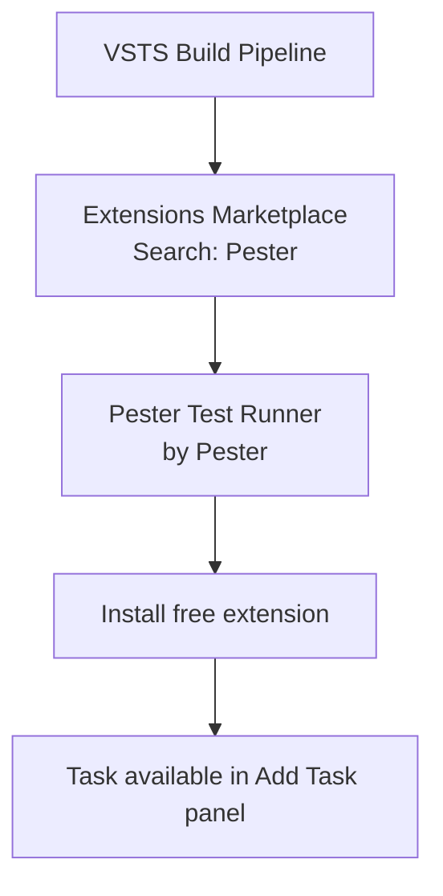
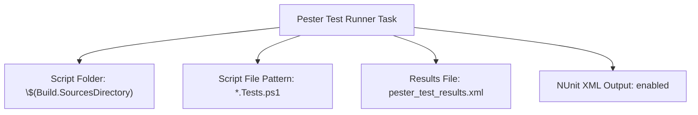
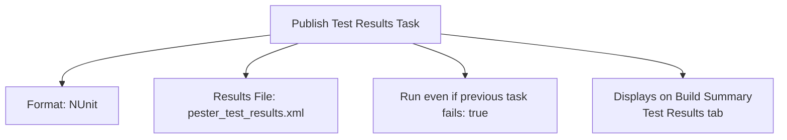
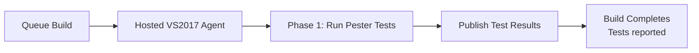
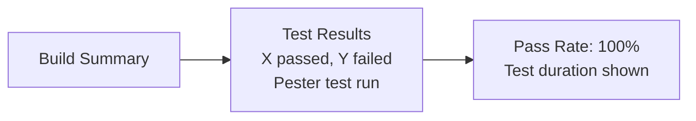
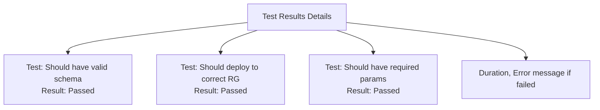

In this post, I will walk you through how to include pester test as part of your CI pipeline in VSTS.

Read more about [IaC Unit Test using Pester Test](http://www.azure365.co.in/devops/IaCUnitTestPester)

<!--more-->

**1. Add Pester Test Runner task from VSTS market place**

**2.  Mention the script folder and script file**

**3.Pester support out put as NUnit. Configure Publish test result task to display test report in VSTS build dashboard.**

**4. Execute the build**

**5.  Test result in Build summary.**

**5.  More details about test results.**

