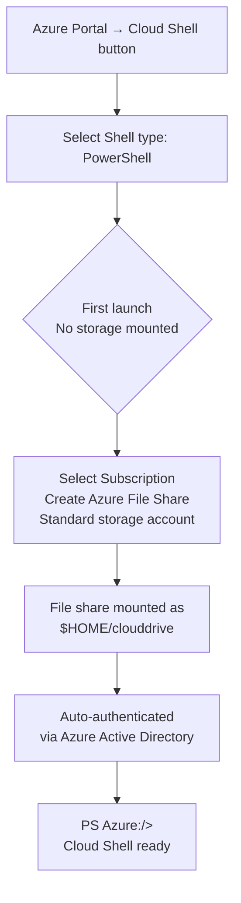
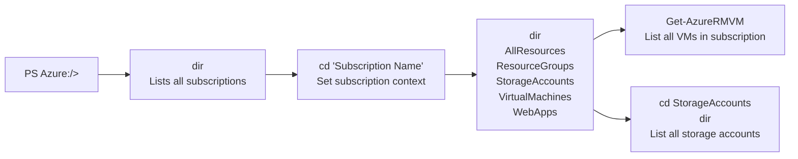
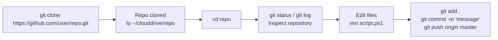
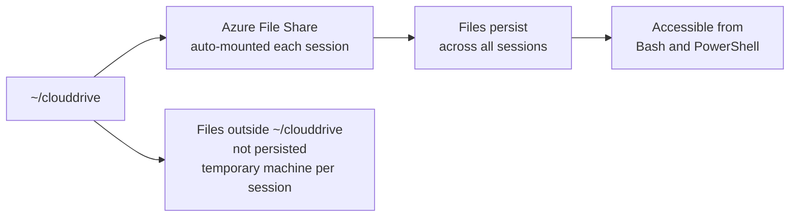
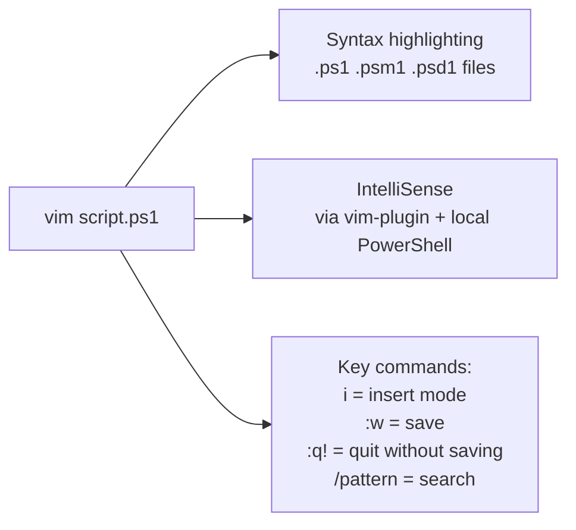
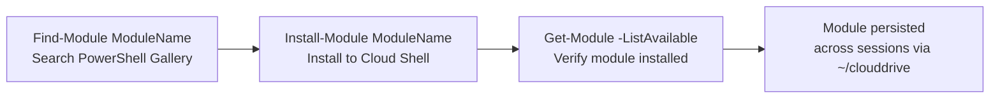

PowerShell in CloudShell is now available in public preview.

### CloudShell:
Azure Cloud Shell is a browser-based shell experience to manage and develop Azure resources. Cloud Shell offers a browser-accessible, pre-configured shell experience for managing Azure resources without the overhead of installing, versioning, and maintaining a machine yourself. 

<!--more-->

### Advantages:
-   Shell access from virtually anywhere: Connect to Azure using an authenticated, browser-based shell experience that is hosted in the cloud and accessible from virtually anywhere. Azure Cloud Shell is assigned per unique user account and automatically authenticated with each session. Combined with Azure portal’s familiar GUI experience, Cloud Shell adds the power and flexibility of using a modern command-line experience.

-   Choose your preferred shell experience: Microsoft routinely maintains and updates Cloud Shell, which comes equipped with commonly used CLI tools including Linux shell interpreters, PowerShell modules, Azure tools, text editors, source control, build tools, container tools, database tools and more. Cloud Shell also includes language support for several popular programming languages such as Node.js, .NET and Python.

-   Common tools and programming languages included: Microsoft routinely maintains and updates Cloud Shell, which comes equipped with commonly used CLI tools including Linux shell interpreters, PowerShell modules, Azure tools, text editors, source control, build tools, container tools, database tools and more. Cloud Shell also includes language support for several popular programming languages such as Node.js, .NET and Python.

-   Persist your files in attached cloud storage: Cloud Shell attaches an Azure File share to persist your data. On first use, Cloud Shell will prompt to create a file share in Azure File storage (or attach an existing one) to persist your data across sessions and Cloud Shell will automatically re-attach it for subsequent sessions.

### Windows and Linux together
in the back their are bunch of container with PowerShell (Windows) and Bash (Linux). As you connect, Azure go and figure out the respective VM and figure out the container. Please make a note that thier is not cost for these container. Cloud Shell billing is based only on the Azure File storage used to persist your data. Your total cost depends on how much you store, the volume and type of storage transactions and outbound data transfers, and which data redundancy option you choose. 

Cloud Shell provisions machines on a per-request basis and as a result machine state will not persist across sessions. Since Cloud Shell is built for interactive sessions, shells automatically terminate after 20 minutes of shell inactivity.

-   Cloud Shell runs on a temporary machine provided on a per-session, per-user basis
-   Cloud Shell times out after 20 minutes without interactive activity
-   Cloud Shell can only be accessed with a file share attached
-   Cloud Shell uses a the same file share for both Bash and PowerShell
-   Cloud Shell is assigned one machine per user account
-   Permissions are set as a regular Linux user (Bash)

Here we have option to increase the font size as well as resize the Window.
More than PowerShell on Windows

To persist files across sessions, Cloud Shell walks you through attaching an Azure file share on first launch. Once completed, Cloud Shell will automatically attach your storage (mounted as $home\clouddrive) for all future sessions. Since each request for Cloud Shell is allocating a temporary machine, files outside of your $home\clouddrive and machine state are not persisted across sessions.

### Let's Start:

Login to Azure portal and select CloudShell. In Cloud Shell drop down select PowerShell.
If you are doing this first time, You need to create a storage account (which is standard storage account)

PowerShell in Cloud Shell securely and automatically authenticates account access for the Azure PowerShell.

After succesfull authentication you will see Azure as a drive  in your Shell prompt.
 
    PS Azure:/>


### Azure Drive
PowerShell has a concept of namespaces. Azure drive enables easy discovery and navigation of Azure resources such as Compute, Network, Storage etc. like filesystem navigation. You can continue to use the familiar Azure PowerShell cmdlets to manage these resources. Any changes made to the Azure resources, either made directly in Azure portal or through Azure PowerShell cmdlets, are instantly reflected in the Azure drive.

### Use Git
Clone git repo

### Cloud Drive

### Rich PowerShell script editing

When you use VIM to edit PowerShell files (.ps1,.psm1,.psd1), you automatically get syntax highlighting and IntelliSense support. IntelliSense support is implemented via a vim-plugin that interacts with a local instance of

### Extensible model

Using PowerShellGet, you can easily install (and update) custom modules and scripts from the PowerShell Gallery. After installation, your modules are automatically persisted across Cloud Shell sessions.

### Pricing
https://docs.microsoft.com/en-in/azure/cloud-shell/pricing

### Supported browsers
Cloud Shell is recommended for Chrome, Edge, and Safari. While Cloud Shell is supported for Chrome, Firefox, Safari, IE, and Edge, Cloud Shell is subject to specific browser settings.

---
Please do let me know your thoughts/ suggestions/ question in ***disqus*** section.

---