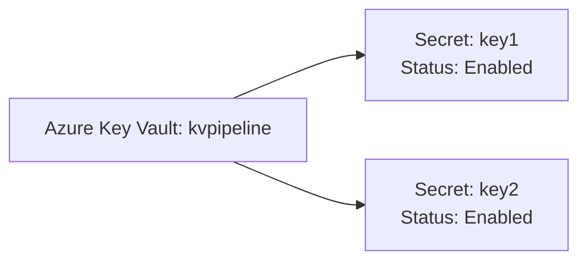
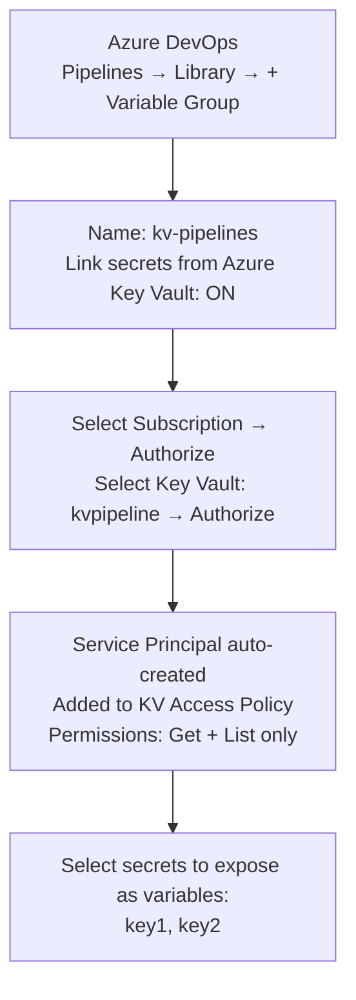
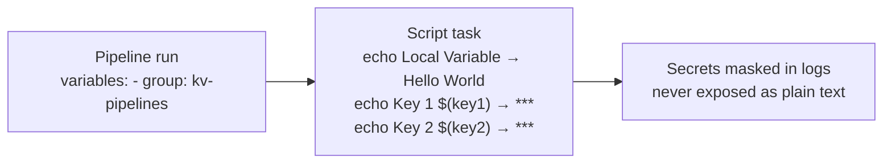
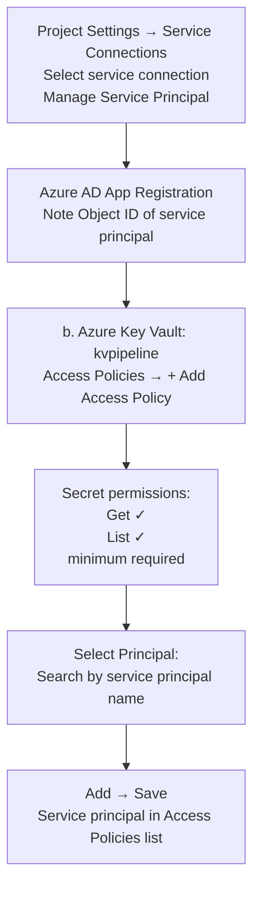
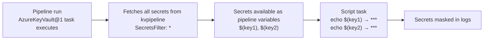

## Secure secretes in Azure DevOps Pipelines using Azure Key Vault  

Security is an integral part of the Application Life Cycle Management and must be implemented right from the beginning. Its everyone's responsibility to ensure security compliance in every process and each phase.

In this post, I will talk on how to ensure security in terms of ***Key, Secrete, Certificate*** management as part of your Azure DevOps pipelines (YML based). 

<!--more-->

## Problem Statement

CI CD pipeline pushes your app into different environments, but as a good DevSecOps architect, you wanted to ensure **separation of concern and responsibilities**. *If secrets are stored in code in an appsettings.json file, for example, then you're creating a security risk*.

## Follow Separation of Concern principal

To ensure security compliance and less management overhead, you need to store sensitive information into a different component.  By design, this component is responsible for storing and securely retrieving information. 

### Store Sensitive Information away from Pipeline

Azure Key Vault allows you to manage the separation of concern using industry-standard security practices.

Some of the features are:

- **Secrets Management** - Azure Key Vault can be used to Securely store and tightly control access to tokens, passwords, certificates, API keys, and other secrets.

- **Key Management** - Azure Key Vault can also be used as a Key Management solution. Azure Key Vault makes it easy to create and control the encryption keys used to encrypt your data.

- **Certificate Management** - Azure Key Vault is also a service that lets you easily provision, manage, and deploy public and private Transport Layer Security/Secure Sockets Layer (TLS/SSL) certificates for use with Azure and your internal connected resources.

- **Store secrets backed by Hardware Security Modules** - The secrets and keys can be protected either by software or FIPS 140-2 Level 2 validated HSMs.

> read more about [**Azure Key Vault**](https://docs.microsoft.com/en-in/azure/key-vault/general/overview).

### Let's Start

You can choose one of the following approaches to integrate Azure Key Vault with pipelines.

- [**Variable groups**](#variables-groups)

- [**Azure Key Vault Task**](#azure-key-vault-task)

### Variable Groups

The variable groups store values that you want to control and make available across multiple pipelines.

Variable groups are also used to store secrets and other values that might need to be passed into a YAML pipeline. Variable groups are defined and managed in the Library page under Pipelines.

1. Create a Key Vault and add Secrets



2. Create a variable group and link the Key Vault (steps 2-5)



6. Create Pipeline [*for this demo, I have chosen the default starter pipeline.*]

```YML
# Starter pipeline
# Start with a minimal pipeline that you can customize to build and deploy your code.
# Add steps that build, run tests, deploy, and more:
# https://aka.ms/yaml

trigger:
- master

pool:
  vmImage: 'ubuntu-latest'

steps:
- script: echo Hello, world!
  displayName: 'Run a one-line script'

- script: |
    echo Add other tasks to build, test, and deploy your project.
    echo See https://aka.ms/yaml
  displayName: 'Run a multi-line script'
```

To integrate the pipeline with a Variable group, you need to add the variables section in the pipeline code.

> Learn more [variables in YML pipelines](https://docs.microsoft.com/en-us/azure/devops/pipelines/process/variables?view=azure-devops&tabs=yaml%2Cbatch)

```YML
# Starter pipeline
# Start with a minimal pipeline that you can customize to build and deploy your code.
# Add steps that build, run tests, deploy, and more:
# https://aka.ms/yaml

trigger:
- master

pool:
  vmImage: 'ubuntu-latest'
# variables to support local and Variable group
variables:
  - group: kv-pipelines
  - name: local
    value: 'Hello World'
    
steps:

- script: |
    echo Local Variable
    echo $(local)
    echo Secure value from KV
    echo Key 1 $(key1)
    echo Key 2 $(key2)
  displayName: 'Variables'

```

While defining the variable's name, you have to ensure that they are not repeated. In the case of duplicate keys, the last one has precedence over others.

Once you define the keys, Azure DevOps will take care of getting them from respective sources. Any values coming from Key Vault will not be displayed as simple text at any point in time and can only be updated by the users who have RBAC permission inside Key vault access policies.

#### Pipeline Output



### Azure Key Vault Task

Unlike the previous approach, you are not creating a variable group and link Key Vault manually (steps #2 to #5).

**You have to make the following changes:**

a. Go to Azure DevOps Project Settings - Service Connection - Select Service Connection - Manage Service Principal



c. The following task will link the Azure Key Vault with the pipeline. The subsequent task can refer to the keys.

```YML
steps:
- task: AzureKeyVault@1
  inputs:
    azureSubscription: 'Visual Studio Professional with MSDN' 
    KeyVaultName: 'kvpipeline'
    SecretsFilter: '*'
```

#### Complete Code

```YML
# Starter pipeline
# Start with a minimal pipeline that you can customize to build and deploy your code.
# Add steps that build, run tests, deploy, and more:
# https://aka.ms/yaml

trigger:
- master

pool:
  vmImage: 'ubuntu-latest'
# variables to support local and Variable group
variables:
  - name: local
    value: 'Hello World'
    
steps:
- task: AzureKeyVault@1
  inputs:
    azureSubscription: 'Visual Studio Professional with MSDN '
    KeyVaultName: 'kvpipeline'
    SecretsFilter: '*'

- script: |
    echo Local Variable
    echo $(local)
    echo Secure value from KV
    echo Key 1 $(key1)
    echo Key 2 $(key2)
  displayName: 'Variables'
```

#### Pipeline Output



I recommend the second approach as its part of the Pipeline code. It's very useful especially when you have to move the pipeline to other DevOps organizations or projects.

I hope this post will help you understand how to leverage Azure Key Vault with Azure Pipeline.
Do let me know if you have any questions or suggestions using Disqus.