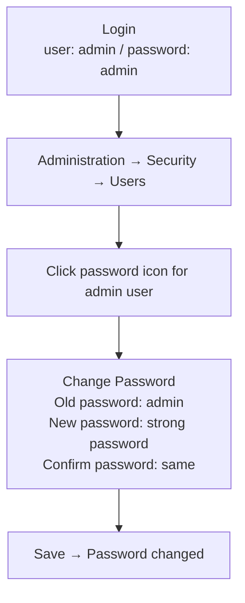
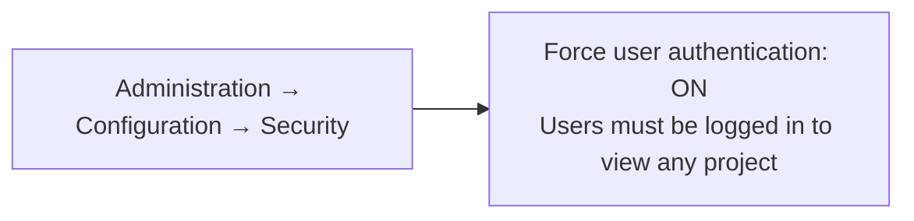
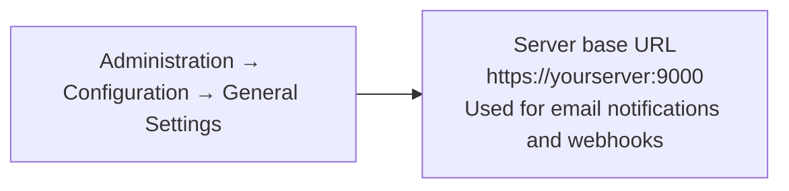
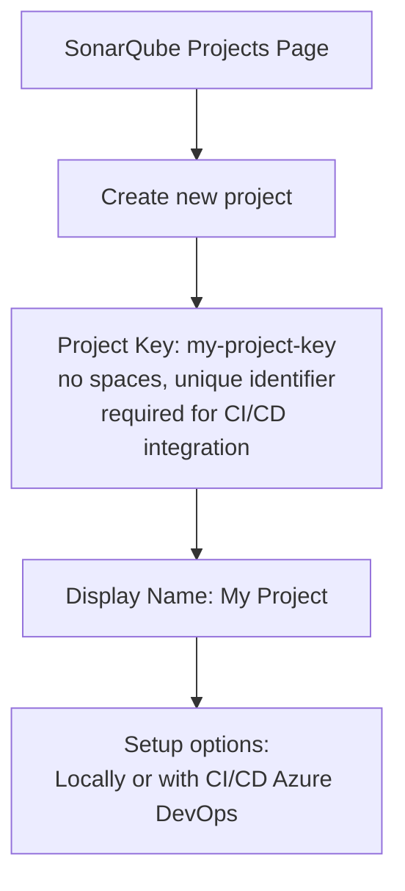
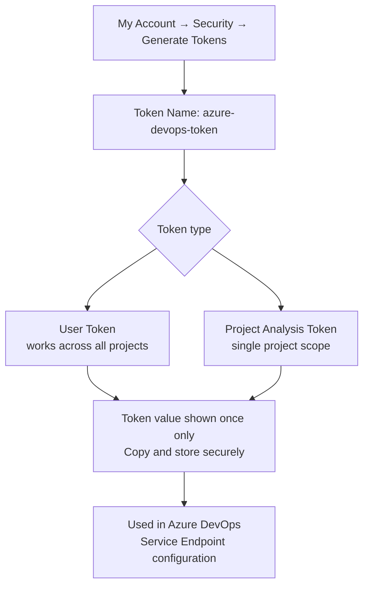
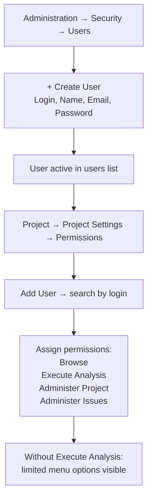

In this post, I will walk you through some of the best practices that helps you to complete post deployment configuration of SonarQube.

<!--more-->

### Change Admin Password

> ***First Thing First***

Post-deployment login into SonarQube using following default credentials for SonarQube.
  
- user:  **admin**
- password: **admin**

After login, go to the administration and select security - users

#### Force authentication

After enabling the force security option no one able to see the project's analysis summary without login.

#### Configure Server base URL

### Create Project

SonarQube provides 2 ways to create a project.

### Configure Tokens

> **Recommanded**

If you want to enforce security by not providing credentials of a real SonarQube user to run your code scan or to invoke web services, you can provide a User Token as a replacement of the user login. This will increase the security of your installation by not letting your analysis user's password going through your network.

These tokens are used to create Service endpoint with Azure DevOps.

Administrator - My Account - Security

### Create and Add Users

#### Create User

SonarQube allows creating local users

*Menu options are limited now*.

## Configure with AAD

Refer [sonar-auth-aad](https://github.com/hkamel/sonar-auth-aad/wiki/Setup) document to configure AAD authentication for SonarQube.

## Work with Azure DevOps Pipeline

Refer [MS Documentation](https://docs.sonarqube.org/latest/analysis/scan/sonarscanner-for-azure-devops/) to configure SonarQube server with Azure DevOps pipeline.

## Other Readings

* [SonarQube Tool Assessment- 1 (understand reporting)](http://www.azure365.co.in/devops/3PDevOps-4)
* [SonarQube Tool Assessment- 2 (understand plan and pricing)](http://www.azure365.co.in/devops/3PDevOps-5)
