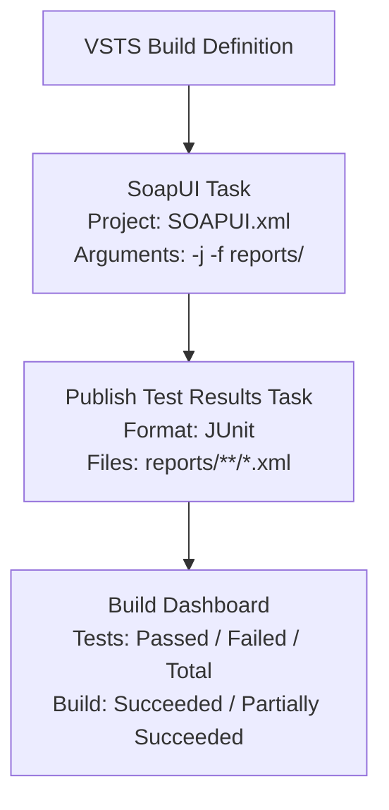
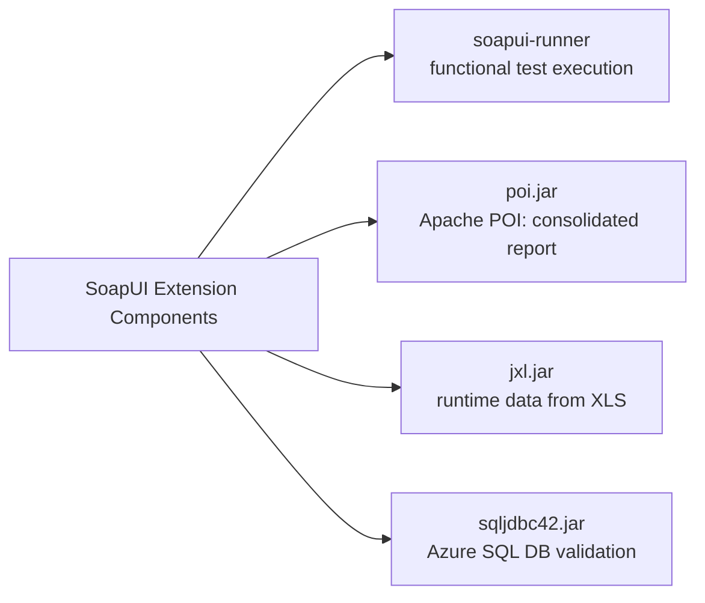

## SOAP UI

SoapUI is the world's leading Functional Testing tool for SOAP and REST testing. With its easy-to-use graphical interface, and enterprise-class features, SoapUI allows you to easily and rapidly create and execute automated functional, regression, and load tests. In a single test environment, SoapUI provides complete test coverage - from SOAP and REST-based Web services, to JMS enterprise messaging layers, databases, Rich Internet Applications, and much more. 

<!--more-->

## SoapUI extension for VSTS

This extension can be used to run SoapUI script or to make SoapUI available for other tasks (as an environment variable).

[SoapUI](https://www.soapui.org/) version used is version 5.4

# Usage
- [Get the extstion form VSTS market place](https://marketplace.visualstudio.com/items?itemName=AjeetChouksey.soapui) 

- You will have 2 task. SOAPUI or SoapUI-Include

- In your build definition add the task "SoapUI"
  - Either select your project (and [arguments](https://www.soapui.org/test-automation/running-functional-tests.html))
    - If you add the argument -j (default value), this task will produce junit reports, which you can then send to VSTS/TFS using task "[Publish Test Results]. use -f to mention where you report will be extracted.
    
    (https://docs.microsoft.com/en-us/vsts/build-release/tasks/test/publish-test-results)"

- or "SoapUI-Include"
  - This will create an environment variable called SOAPUI_EXE that you can use in the following tasks.

SOAP UI Task

## What is additional in this extension 
- POI.jar (Apache POI to generate consolidated report),
- jxl.jar (to fetch data at runtime from input xls) and
- SQLJDBC42.jar (to establish connection to Azure SQL DB for validations).

These jars doesn’t come as part of standard sopaui jars.

## Availability

This extension is publicly available on VSTS Marketplace: https://marketplace.visualstudio.com/items?itemName=AjeetChouksey.soapui#overview

The build number is automatically incremented on each commit by the VSTS Build task by a pattern like "0.0.$(Build.BuildId)". See https://www.visualstudio.com/en-us/docs/build/define/variables#predefined-variables for reference.

# Sample File:

You can use SOAPUI.xml
Download from https://raw.githubusercontent.com/AjeetChouksey/vsts-extensions/master/SoapUI/SOAPUI.xml

## License

This extension is published under MIT license. See [license file](https://github.com/AjeetChouksey/vsts-extensions/blob/master/SoapUI/LICENSE).