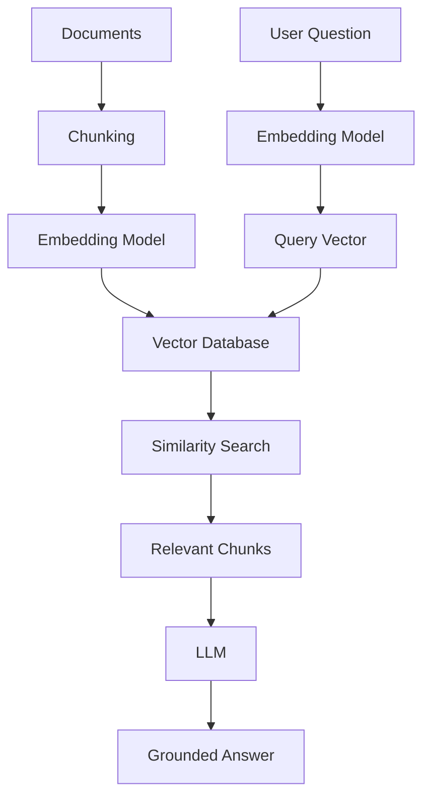

An LLM without a knowledge layer is a brilliant employee on their first day. Confident. Articulate. Completely unaware of anything specific to your organisation.

Vector databases fix that. They are the memory layer that makes AI systems actually useful in enterprise contexts — enabling RAG pipelines, AI assistants, agents, and semantic search to retrieve relevant information at query time rather than hallucinate from stale training data.

If you are building or evaluating any AI system that needs to access your documents, policies, code, or knowledge bases, understanding vector databases is not optional. It is foundational.

---

## The Problem with Traditional Search

Imagine asking your internal AI assistant:

> How do I onboard a new application to our cloud platform?

A traditional database runs a keyword query. It looks for exact matches: *onboard*, *application*, *cloud platform*. If your documentation says:

> Application deployment process for cloud environments

— the keyword search may return nothing. The words do not match, even though the meaning is identical.

This is not a minor inconvenience. It is a structural limitation. Keyword search finds words. It cannot find meaning.

Vector databases solve this at the architectural level — not by improving the keyword index, but by replacing it entirely.

---

## What Embeddings Are (and Why They Matter)

Before you can understand a vector database, you need to understand embeddings.

An **embedding** is a numerical representation of content — text, images, code, audio — produced by an AI model. The key property is that semantically similar content produces mathematically similar numbers.

```text
"Dog"      → [0.23, 0.84, 0.51, ...]
"Puppy"    → [0.24, 0.82, 0.49, ...]
"Airplane" → [0.91, 0.12, 0.77, ...]
```

"Dog" and "Puppy" are close together in vector space. "Airplane" is far away. The model has learned the relationships between concepts and encoded them as geometry.

This is what enables semantic search. You are not matching strings — you are measuring distance between meanings.

---

## What a Vector Database Does

A **Vector Database** is a specialised database built to store, index, and search these embeddings at scale. Its job is to answer one question efficiently:

> Given this query vector, which stored vectors are most similar?

Instead of:

```sql
SELECT * FROM documents WHERE keyword = 'cloud';
```

You ask:

```text
Find the content most semantically similar to this question.
```

The database performs a similarity search across millions or billions of stored vectors and returns the closest matches in milliseconds. The results are not exact-match hits — they are the most relevant pieces of content regardless of how the words were phrased.

---

## How It Fits Into a RAG Pipeline

Vector databases are the retrieval engine inside every [RAG and Agentic RAG system](/blog/rag-vs-agentic-rag). Here is the full **Semantic Retrieval Pipeline** — the end-to-end flow from document ingestion to grounded answer:



Two separate flows converge at the vector database. Your documents go in at indexing time. Your user's question arrives at query time. The database is the point where they meet.

The LLM generates the answer. The vector database finds the knowledge. Neither can do the other's job.

---

## Traditional Database vs Vector Database

| Capability | Traditional Database | Vector Database |
|---|---|---|
| Search type | Keyword / exact match | Semantic similarity |
| Match logic | Words must match | Meaning must be close |
| Best data type | Structured data | Unstructured data |
| Query style | SQL filters | Nearest-neighbour search |
| Finds | Matching strings | Related concepts |
| AI workload fit | Limited | Purpose-built |

This is not a "better vs worse" comparison — they solve different problems. Most production systems use both: a relational or document store for structured data and transactions, a vector database for semantic retrieval. Hybrid search, which combines keyword and vector retrieval, is increasingly the default for enterprise deployments.

---

## Why This Matters for Enterprise AI

Without a vector database in the stack, your AI system is operating blind to everything your organisation actually knows.

LLMs are trained on public data up to a cutoff. They know nothing about your internal architecture docs, your support ticket history, your compliance policies, your product manuals, or your team's accumulated knowledge. Without retrieval grounding:

- Answers are drawn from training weights, not your documents
- Knowledge becomes stale the moment your content changes
- Enterprise data sits in silos the model cannot reach
- Hallucination risk is structural, not incidental

With a vector database in the pipeline:

- Queries retrieve relevant content at request time — no retraining required
- Your internal knowledge becomes searchable and AI-accessible
- Responses are grounded in actual documents, with citation possible
- Hallucination risk drops because the model has real context to reason from

> The question is not whether your enterprise AI needs a memory layer. It is whether you have built one yet.

---

## Common Use Cases

### Enterprise AI Assistants

Employees ask questions about policies, technical runbooks, HR processes, internal tools, and product information. The assistant retrieves relevant documents before generating a response. The answer is grounded in what the organisation actually says, not what the model guesses.

### RAG Applications

RAG is the primary production pattern for grounded AI systems. The vector database is the retrieval engine that supplies context to the model. If you are building [RAG or Agentic RAG](/blog/rag-vs-agentic-rag), you are building with a vector database.

### AI Agents

Agents operating within the 4-Layer Agent Stack — Trigger, Reasoning, Action, Validation — query the vector database continuously during the Reasoning layer to supply relevant context as they plan and execute tasks. Engineering agents, support agents, security investigation agents, and operations assistants all depend on fast semantic retrieval.

### Code Search

AI coding assistants use semantic search to retrieve similar functions, relevant API documentation, and design patterns based on intent. "Show me how we handle auth in other services" finds related code even when the exact variable names differ.

### Recommendation Engines

Vector similarity drives content recommendations: related articles, learning paths, similar products, relevant courses. Two items are "similar" if their embeddings are close — regardless of whether they share any keywords.

---

## Vector Database Options

### Open Source

- **Qdrant** — high-performance, Rust-based, strong filtering support
- **Chroma** — lightweight, developer-friendly, good for local prototyping
- **Milvus** — cloud-native, designed for billion-scale workloads
- **Weaviate** — built-in vectorisation, GraphQL API, strong enterprise features

### Managed and Cloud

- **Azure AI Search** — hybrid search (vector + keyword), semantic reranking, enterprise RBAC, native Azure integration; the default choice for Azure-based enterprise systems
- **Pinecone** — fully managed, low operational overhead, strong developer experience
- **MongoDB Atlas Vector Search** — vector search alongside document storage; good for teams already on MongoDB
- **Elasticsearch** — adds vector search to an established enterprise search platform

Choose based on your operational maturity, scale requirements, hybrid search needs, and whether you need native integration with your cloud platform or existing data infrastructure.

---

## Key Takeaways

- A vector database stores and searches **embeddings** — numerical representations of meaning — rather than keywords
- It is the retrieval engine behind every RAG pipeline, AI assistant, and semantic search system
- Without it, LLMs answer from training data alone — which knows nothing about your organisation
- With it, your internal knowledge becomes searchable, AI-accessible, and grounded at query time
- The **Semantic Retrieval Pipeline** — chunk, embed, index, retrieve, generate — is the foundational pattern for grounded enterprise AI

> LLMs are the brain. Vector databases are the memory. RAG is the bridge that connects them.

The shift from chatbots to AI copilots to autonomous agents is underway in enterprise technology. Vector databases are not a detail in that shift — they are the infrastructure layer it runs on.

---

## Further Reading

**On this platform:**
- [RAG vs Agentic RAG: From Search & Answer to Reason & Act](/blog/rag-vs-agentic-rag) — how vector databases power both RAG patterns, and when to graduate from one to the other
- [Notes: Retrieval-Augmented Generation](/notes) — structured study notes on RAG, embeddings, and vector search for the CCA-F exam
- [Notes: AI Architecture Fundamentals](/notes) — covers the 4-Layer Agent Stack, Context Budget Rule, and grounding patterns

**Explore the platform:**
- Browse all [AI Engineering posts](/blog?category=AI+Engineering) for related deep dives
- Visit [/notes](/notes) for concise exam-ready summaries on embeddings, chunking strategies, and similarity search
