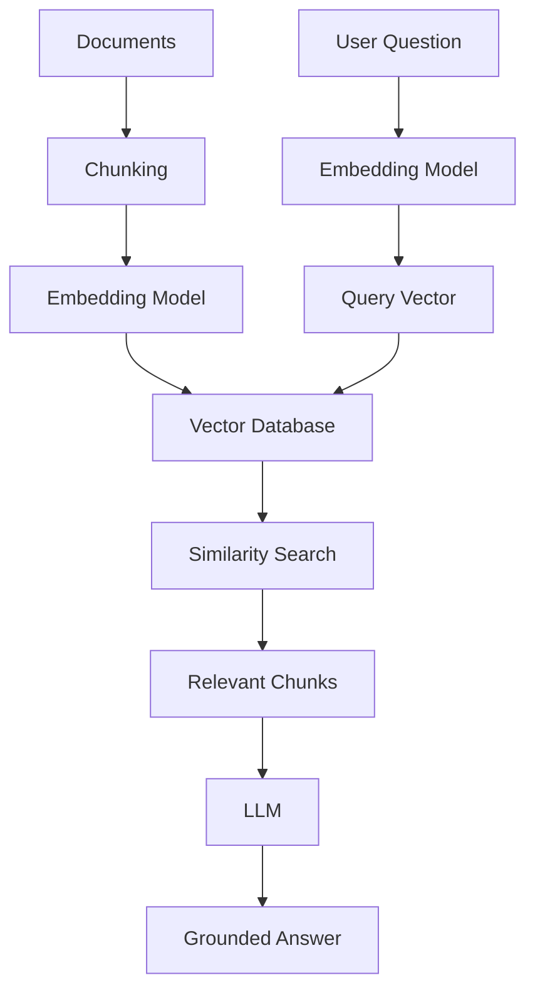

Your AI assistant just told an employee that the company's parental leave policy allows six months of paid leave.

It allows three.

The model didn't hallucinate from thin air — it just didn't have access to the actual document. It answered from training data and guesswork, because nothing in the pipeline gave it the real answer at query time.

That's the problem vector databases solve. Not perfectly, not magically — but structurally. They are the memory layer that makes enterprise AI useful instead of dangerous.

---

## The Search Problem Is Not What You Think

When someone asks your internal assistant "how do I onboard a new application to the cloud platform?", a traditional keyword search looks for those words in your documents. If the actual document title is *Application Deployment Process for Cloud Environments* — no match. The words don't line up. The document doesn't surface.

This isn't a search tuning problem. It's an architectural one.

Keyword search finds **words**. What you need is something that finds **meaning**.

---

## What Are Embeddings?

Before you can understand vector databases, you need this one concept.

An **embedding** is what you get when an AI model converts content — text, code, images, audio — into a list of numbers. The key property is that *similar content produces similar numbers*.

```text
"Dog"      → [0.23, 0.84, 0.51, ...]
"Puppy"    → [0.24, 0.82, 0.49, ...]
"Airplane" → [0.91, 0.12, 0.77, ...]
```

"Dog" and "Puppy" are close together in vector space. "Airplane" is far away. The model has encoded the *relationship between concepts* as geometry — and you can now measure the distance between meanings the same way you'd measure the distance between points on a map.

That's semantic search. Not string matching — distance measurement.

---

## What a Vector Database Does

A **vector database** is built to store, index, and search these embeddings at scale. One job: given a query vector, find the stored vectors that are most similar.

Instead of:

```sql
SELECT * FROM documents WHERE keyword = 'cloud';
```

You ask:

```
Find the content most semantically similar to this question.
```

The database performs a nearest-neighbour search across millions or billions of vectors and returns the closest matches — in milliseconds, regardless of how the words were phrased. "Onboarding a new application" finds "deployment process for cloud environments" because their meanings are geometrically close, even though their words don't overlap.

> **Key insight:** Vector databases don't search your documents. They search the *meaning* of your documents. That distinction is everything when your users ask questions in natural language and your documents were written by engineers.

---

## How It Fits Into a RAG Pipeline

Vector databases are the retrieval engine inside every [RAG and Agentic RAG system](/blog/rag-vs-agentic-rag). The full pipeline looks like this:



Two flows converge at the vector database. Your documents go in at indexing time. Your user's question arrives at query time. The database is where they meet.

The LLM generates the answer. The vector database finds the knowledge. Neither can do the other's job.

---

## Traditional vs Vector: The Real Difference

| Capability | Traditional Database | Vector Database |
|---|---|---|
| Search type | Keyword / exact match | Semantic similarity |
| Match logic | Words must match | Meaning must be close |
| Best for | Structured data | Unstructured content |
| Query style | SQL filters | Nearest-neighbour search |
| Finds | Matching strings | Related concepts |
| AI workload fit | Limited | Purpose-built |

These aren't better vs worse — they solve different problems. Most production systems use both. A relational store handles structured data and transactions. A vector database handles semantic retrieval. Hybrid search, combining keyword and vector retrieval, is increasingly the default for enterprise deployments.

---

## Why It Matters for Enterprise AI

Without a vector database in the stack, your AI system is operating blind to everything your organisation actually knows.

LLMs are trained on public data up to a cutoff. They don't know your architecture docs, your support ticket history, your compliance policies, or your product manuals. Without retrieval grounding:

- Answers come from training weights, not your documents
- Knowledge goes stale the moment your content changes
- Enterprise data stays siloed and unreachable
- Hallucination risk is structural, not incidental — there's nothing else to answer from

With vector search in the pipeline:

- Queries retrieve relevant content at request time — no retraining needed
- Your internal knowledge becomes AI-accessible and searchable
- Responses are grounded in actual documents, with citation possible
- The model has real context to reason from instead of guessing

> The question isn't whether your enterprise AI needs a memory layer. It's whether you've built one yet.

---

## Where You'll Use It

**Enterprise AI assistants** — employees asking about policies, runbooks, HR processes, internal tools. The assistant retrieves the relevant documents before generating the answer. The difference between a grounded response and a hallucinated one is whether vector search ran.

**RAG applications** — RAG is the primary production pattern for grounded AI. The vector database is the retrieval engine. If you're building [RAG or Agentic RAG](/blog/rag-vs-agentic-rag), you're building with a vector database.

**AI agents** — agents query the vector store continuously during reasoning. Engineering agents, support agents, security investigation agents, operations assistants — all depend on fast semantic retrieval to supply context as they plan and act.

**Code search** — "show me how we handle auth in other services" finds related implementations even when variable names differ. Intent-based retrieval, not text matching.

**Recommendations** — vector similarity drives related articles, learning paths, product suggestions. Two items are "similar" if their embeddings are close, regardless of shared keywords.

---

## Which One to Use

**Open source:**
- **Qdrant** — high-performance, Rust-based, strong metadata filtering
- **Chroma** — lightweight, great for local development and prototyping
- **Milvus** — cloud-native, designed for billion-scale workloads
- **Weaviate** — built-in vectorisation, GraphQL API, solid enterprise features

**Managed and cloud:**
- **Azure AI Search** — hybrid search (vector + keyword), semantic reranking, enterprise RBAC, native Azure integration — the default choice if you're on Azure
- **Pinecone** — fully managed, minimal operational overhead, strong developer experience
- **MongoDB Atlas Vector Search** — vector search alongside document storage; good if you're already on MongoDB
- **Elasticsearch** — adds vector search to an established enterprise search platform

Pick based on your scale requirements, operational maturity, hybrid search needs, and how tightly you need to integrate with your existing data infrastructure.

---

## The One Thing to Take Away

> LLMs are the brain. Vector databases are the memory. RAG is the bridge that connects them.

The shift from chatbots to copilots to autonomous agents is happening now in enterprise technology. Vector databases aren't a detail in that shift — they're the infrastructure layer the whole thing runs on.

---

## Further Reading

- [RAG vs Agentic RAG: From Search & Answer to Reason & Act](/blog/rag-vs-agentic-rag) — how vector databases power both patterns, and when to move from one to the other
- [Study Notes: Retrieval-Augmented Generation](/notes) — concise exam-ready summaries on RAG, embeddings, and vector search for CCA-F
- Browse all [AI Engineering posts](/blog?category=AI+Engineering) for related deep dives
