# Agent Ecosystem

Aarya — My AI Learning Hub is maintained by a **24-agent multi-agent system** orchestrated by the Staff Engineer agent. Every change to the platform — code, content, or infrastructure — flows through this system.

## Orchestration Model

```mermaid
graph TD
    SE["Staff Engineer\n(Orchestrator)"] --> PM["Product Manager\nIssue Gate"]
    SE --> APPSEC["AppSec Engineer\nSecurity Gate"]
    SE --> PA["Platform Architect\nUI / routing / deploy"]
    SE --> CL["Content Lead\nBlog pipeline"]
    SE --> CE["Curriculum Engineer\nExam content"]
    SE --> SRE["SRE\nRelease / CI / CHANGELOG"]
    SE --> DR["DevRel\nCommunity / social"]
    SE --> PD["Platform Docs\nPlatform documentation"]
    SE --> IPE["Interview Prep Engineer\nInterview content"]
    SE --> DM["Delivery Manager\nSprint ceremonies"]
    SE --> AIR["AI Researcher\nModel & tool research"]
    CL --> TW["Tech Writer\nDraft content"]
    CL --> RE["Release Engineer\nPublish content"]
    PA --> FE["Frontend Engineer\nComponent work"]
    PA --> DSE["Design Systems Engineer\nUX audit"]
    PA --> PE["Platform Engineer\nInfra / tooling"]
    PA --> PDE["Platform Dev Expert\nsrc/lib · types · scripts"]
    PA --> TE["Test Engineer\nunit · integration · E2E"]
    CE --> AE["Assessment Engineer\nMCQ generation"]
    CE --> DE["Docs Engineer\nStudy notes"]
```

## Agent Roles

| Agent | Version | Scope |
|-------|---------|-------|
| Staff Engineer | v2.4.0 | Orchestrator — routes all requests, enforces guardrails |
| Product Manager | v1.1.0 | Issue Gate — GitHub issues as work units, RICE scoring, sprint planning |
| AppSec Engineer | v1.1.0 | Security Gate — OWASP/secret/schema validation |
| Platform Architect | v3.2.0 | UI, routing, deployment architecture |
| Frontend Engineer | v1.0.0 | React components, Tailwind, accessibility |
| Design Systems Engineer | v1.1.0 | Brand consistency, UX audit, `src/components/ui/` library |
| Platform Engineer | v1.0.0 | Infra, CI/CD tooling, scripts |
| Platform Dev Expert | v1.0.0 | `src/lib/`, `src/types/`, build scripts, data-flow logic |
| Test Engineer | v1.0.0 | Unit tests, integration tests, E2E (Playwright), coverage config |
| SRE | v1.2.0 | Releases, versioning, CHANGELOG, monitoring |
| Content Lead | v1.0.0 | Blog pipeline orchestrator |
| Tech Writer | v1.0.0 | Drafts blog posts and articles |
| Release Engineer | v1.0.0 | Publishes content to `public/content/blog/` |
| Curriculum Engineer | v1.0.0 | Exam questions, notes, scenarios — orchestrates Assessment Engineer + Docs Engineer |
| Assessment Engineer | v1.0.0 | MCQ generation, schema-validated question JSON |
| Docs Engineer | v1.0.0 | Domain study notes with Deep Dive standard |
| Interview Prep Engineer | v1.0.0 | Interview Commander — JD packs, canonical Q&A bank, industry context |
| Platform Docs | v1.0.0 | Platform-facing documentation (this file) |
| DevRel | v1.0.0 | Community posts, social content (LinkedIn, Twitter/X) |
| Delivery Manager | v1.0.0 | Sprint ceremonies, backlog grooming, velocity commentary |
| AI Researcher | v1.0.0 | AI model evaluation, paper synthesis, tooling radar |
| QA Engineer | v1.0.0 | Diagram validation, test coverage |
| Principal Mentor | v1.0.0 | Socratic teaching, concept explanation, exam trap highlights |
| Pair Programmer | v1.0.0 | Collaborative implementation, multi-role study |
| Junior Dev | v1.0.0 | Student simulation (101/201/301 levels) |

## Guardrails

Every agent in the system has hard-coded constraints:

- **Scope lock** — each agent writes only to its declared path(s). Cross-boundary writes are blocked.
- **Security Gate** — AppSec Engineer runs pre-build and post-build on every change.
- **Issue-first** — Product Manager must create or find a GitHub issue before any build work starts.
- **Human approval** — no agent merges to `main` without explicit human review.
- **Version gate** — all agent files are validated by `agents-validate.yml` on every push.

## Standard Flow

1. Human request → **Staff Engineer**
2. → **Product Manager**: Issue Gate
3. → **AppSec Engineer**: Security pre-flight
4. → **Domain Agent**: implements the change
5. → **Content Sync**: `scripts/sync-stats.py` if any `public/content/` files changed
6. → **AppSec Engineer**: post-build audit
7. → **Design Systems Engineer**: UX audit (if `.tsx` files changed)
8. → **QA Engineer**: diagram validation (if `.md` files with mermaid blocks changed)
9. → **Product Manager**: mark issue Done
