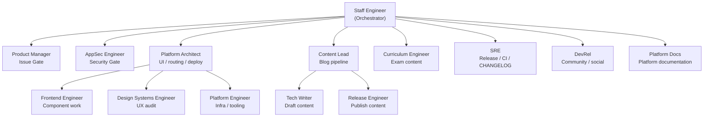

# Agent Ecosystem

Aarya — My AI Learning Hub is maintained by a **21-agent multi-agent system** orchestrated by the Staff Engineer agent. Every change to the platform — code, content, or infrastructure — flows through this system.

## Orchestration Model

## Agent Roles

| Agent | Version | Scope |
|-------|---------|-------|
| Staff Engineer | v2.3.0 | Orchestrator — routes all requests, enforces guardrails |
| Product Manager | v1.0.0 | Issue Gate — GitHub issues as work units |
| AppSec Engineer | v1.0.0 | Security Gate — OWASP/secret/schema validation |
| Platform Architect | v1.0.0 | UI, routing, deployment architecture |
| Frontend Engineer | v1.0.0 | React components, Tailwind, accessibility |
| Design Systems Engineer | v1.0.0 | Brand consistency, UX audit |
| Platform Engineer | v1.0.0 | Infra, CI/CD tooling, scripts |
| SRE | v1.0.0 | Releases, versioning, CHANGELOG, monitoring |
| Content Lead | v1.0.0 | Blog pipeline orchestrator |
| Tech Writer | v1.0.0 | Drafts blog posts and articles |
| Release Engineer | v1.0.0 | Publishes content to `public/content/` |
| Curriculum Engineer | v1.0.0 | Exam questions, notes, scenarios |
| Platform Docs | v1.0.0 | Platform-facing documentation (this file) |
| DevRel | v1.0.0 | Community posts, social content |
| Docs Engineer | v1.0.0 | Developer-facing docs (READMEs, ADRs) |
| QA Engineer | v1.0.0 | Diagram validation, test coverage |
| Principal Mentor | v1.0.0 | Code review, mentoring Junior Dev |
| Pair Programmer | v1.0.0 | Collaborative implementation |
| Junior Dev | v1.0.0 | Simple tasks, learning exercises |
| AI Researcher | v1.0.0 | AI model evaluation, research |
| Assessment Engineer | v1.0.0 | Quiz/assessment tooling |

## Guardrails

Every agent in the system has hard-coded constraints:

- **Scope lock** — each agent writes only to its declared path(s). Cross-boundary writes are blocked.
- **Security Gate** — AppSec Engineer runs pre-build and post-build on every change.
- **Issue-first** — Product Manager must create or find a GitHub issue before any build work starts.
- **Human approval** — no agent merges to `main` without explicit human review.
- **Version gate** — all agent files are validated by `agents-validate.yml` on every push.

## Standard Flow

1. Human request → **Staff Engineer**
2. → **Product Manager**: Issue Gate
3. → **AppSec Engineer**: Security pre-flight
4. → **Domain Agent**: implements the change
5. → **Content Sync**: `scripts/sync-stats.py` if any `public/content/` files changed
6. → **AppSec Engineer**: post-build audit
7. → **Design Systems Engineer**: UX audit (if `.tsx` files changed)
8. → **QA Engineer**: diagram validation (if `.md` files with mermaid blocks changed)
9. → **Product Manager**: mark issue Done
