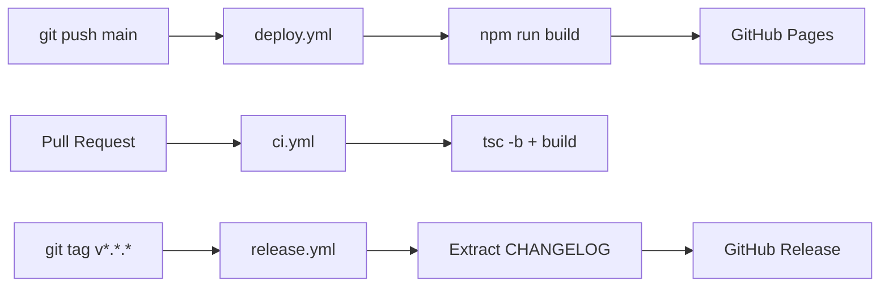

# Platform Architecture

Aarya — My AI Learning Hub is a fully static, client-side SPA built with React 19, TypeScript (strict mode), and Vite. There is no server-side rendering and no backend API. All content is served as static files from `public/content/`.

## Tech Stack

| Layer | Technology |
|-------|-----------|
| Framework | React 19 + TypeScript strict |
| Build tool | Vite 6 with HMR |
| Styling | Tailwind CSS v4 (utility-first) |
| Routing | React Router v7 (browser history) |
| Markdown | react-markdown + remark-gfm + rehype-raw |
| Diagrams | Mermaid.js (lazy-loaded per page) |
| Auth | GitHub OAuth (client-side token exchange) |
| Hosting | GitHub Pages via GitHub Actions |
| CI/CD | GitHub Actions (deploy, validate, release pipelines) |

## Repository Layout

```
src/
  app/            Router and app entry
  features/       Feature modules (one per domain)
    blog/         Blog index + post pages
    exams/        Exam catalog + quiz + notes + scenarios
    interview/    Interview Prep — catalog, pack, question pages
    home/         Landing page and Learn page
    profile/      Team / maintainer profile
    tools/        Developer Tools hub
  components/     Shared UI components + ui/ design-system library
  lib/            Content loaders, auth, analytics, search, utilities
  types/          TypeScript interfaces for content models
  data/           Static seed data (maintainer profile)

public/content/   All static content (fetched at runtime)
  blog/           Blog manifest + Markdown posts
  exams/          Exam registry + question banks + notes
  interviews/     Interview Prep — bank, competencies, role packs
    bank/         questions.json + competencies.json
    roles/        Per-role pack.json + jd.md
  skillup/        SkillUp multi-cert catalog + per-exam questions
  agents/         Agent registry JSON (auto-generated)
  platform-docs/  This documentation
  stats.json      Auto-generated platform statistics

scripts/          Python maintenance scripts
workers/          Cloudflare Worker (OG meta handler)
.github/
  agents/         24 .agent.md files + specialist .md files
  workflows/      CI/CD workflows
```

## Content Model

All content lives as static JSON and Markdown files under `public/content/`. The SPA fetches them at runtime using the `BASE_URL` prefix set by Vite (important for GitHub Pages subdirectory hosting).

### Content Types

| Type | Format | Location | Description |
|------|--------|----------|-------------|
| Blog posts | `.md` | `blog/posts/` | Full articles, rendered with react-markdown |
| Blog manifest | `.json` | `blog/index.json` | Post list with metadata (slug, title, date, tags) |
| Exam registry | `.json` | `exams/index.json` | Exam configs with domain lists and file paths |
| Questions | `.json` | `questions/*.json` | MCQ banks (one file per exam domain) |
| Notes | `.md` | `notes/*.md` | Study notes (one per exam domain) |
| Scenarios | `.json` | `scenarios/*.json` | Scenario-based practice questions |
| Agents | `.json` | `agents/registry.json` | Agent metadata (auto-generated by freeze_registry.py) |
| Platform stats | `.json` | `stats.json` | Live counters (auto-generated by sync-stats.py) |

## Content Loading Pattern

`src/lib/content-loader.ts` is the single gateway for all content fetches. Every loader uses a shared `fetchJSON<T>()` / `fetchText()` helper:

```typescript
async function fetchJSON<T>(path: string): Promise<T> {
  const res = await fetch(`${BASE}${path}`);
  if (!res.ok) throw new Error(`Failed to load ${path}: ${res.status}`);
  return res.json() as Promise<T>;
}
```

Exported loaders: `loadBlogManifest`, `loadBlogPost`, `loadExamRegistry`, `loadQuestionsForExam`, `loadNoteForExam`, `loadScenariosForExam`, `loadPlatformStats`.

## Deployment Pipeline



### Workflow Summary

- **`deploy.yml`** — Triggered on push to `main`. Runs `npm run build` then deploys `dist/` to GitHub Pages.
- **`ci.yml`** — Triggered on PRs. Runs `tsc -b` and `npm run build` as a build gate.
- **`release.yml`** — Triggered on version tags (`v*`). Extracts CHANGELOG section for the tag and creates a GitHub Release.
- **`agents-validate.yml`** — Validates all `.agent.md` frontmatter on every push.
- **`analytics-sync.yml`** — Syncs GA4 pageview data on a schedule.
- **`dependency-review.yml`** — Reviews dependency changes on PRs for security vulnerabilities.
- **`codeql.yml`** — CodeQL static analysis scan on push and PR.
- **`stale.yml`** — Marks stale issues and PRs after inactivity.

> All workflow files use `actions/checkout@v5.1.0` and `actions/setup-node@v5` (node24 runtime).

## Stats Pipeline

`scripts/sync-stats.py` regenerates `public/content/stats.json` after any content write. It reads:

- `blog/index.json` → non-draft post count
- `exams/index.json` → total question count, available exam count
- `public/content/notes/*.md` → note file count
- `public/content/scenarios/*.json` → scenario count
- `agents/registry.json` → agent count
- `src/App.tsx` → tool sub-route count (regex match on `/tools/*`)

The home page (`HomeV2.tsx`) loads `stats.json` on mount and uses the values to populate the proof-bar stat cards dynamically.

Run manually:

```bash
python3 scripts/sync-stats.py
```

## URL Structure

| Route | Page |
|-------|------|
| `/` | Home |
| `/skillup` | SkillUp Exam Catalog |
| `/skillup/:examId` | Exam Home |
| `/skillup/:examId/quiz` | Quiz |
| `/skillup/:examId/notes` | Study Notes |
| `/skillup/:examId/scenarios` | Scenarios |
| `/interview` | Interview Prep Catalog |
| `/interview/:roleId` | Interview Pack (Q&A list) |
| `/interview/q/:id` | Interview Question Detail |
| `/blog` | Blog Index |
| `/blog/:slug` | Blog Post |
| `/horizons` | Horizons Learning Paths |
| `/horizons/:track/:slug` | Pathway Article |
| `/tools` | Developer Tools Hub |
| `/tools/:toolId` | Individual Tool |
| `/subscribe` | Newsletter Subscribe |
| `/contribute` | Community Contributions |
| `/docs` | Platform Docs (this page) |
| `/team` | Team |
| `/analytics` | Analytics |
| `/profile` | User Profile |

## Multi-Agent System

The platform is maintained by a **24-agent multi-agent system** orchestrated by the Staff Engineer agent. All changes go through:

1. **Issue Gate** — Product Manager finds or creates a GitHub issue before any build work
2. **Security Gate** — AppSec Engineer validates file paths and inputs pre- and post-build
3. **Domain Agent** — implements the change in the appropriate area of ownership
4. **Content Sync** — `sync-stats.py` runs after any content write to update `stats.json`
5. **UX Gate** — Design Systems Engineer audits `.tsx` changes for brand/accessibility compliance
6. **Diagram Gate** — QA Engineer validates Mermaid blocks in `.md` files

See [Agent Ecosystem](./agent-ecosystem.md) for full agent role descriptions.
