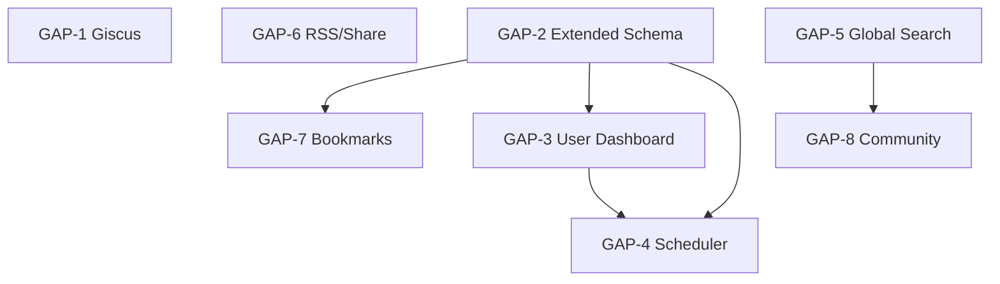

# Vision vs Current Reality — Gap Map

Aarya — My AI Learning Hub is a functional v1 platform. This document maps the delta between the intended full product vision and what exists today. Each gap is numbered GAP-N, assigned a severity (High / Medium / Low), an estimated effort, a sprint slot, and ownership mapping to the multi-agent system.

## Executive Summary

8 gaps have been identified across 3 categories — **Engagement** (GAP-1, GAP-6, GAP-7, GAP-8), **Personalisation** (GAP-2, GAP-3, GAP-4), and **Discovery** (GAP-5). Gaps are ordered by sprint priority, not by category.

## Current State Snapshot

| Layer | What exists |
|-------|-------------|
| Exam engine | CCAF + AB-100 question banks, quiz loop, localStorage progress |
| Blog | Markdown posts, tag filter, date sort |
| Study notes | Markdown per domain, MermaidDiagram renderer |
| Auth | GitHub OAuth (device flow), token in localStorage |
| Progress sync | Dual-layer: localStorage + GitHub Gist (`ccaf-progress.json`) |
| Platform docs | Architecture, content schema, agent ecosystem, release notes |
| Agent system | 23-agent multi-agent system, versioned .agent.md files |
| Analytics | Maintainer dashboard (GitHub Stats API) |

## Gap Registry

### GAP-1 — Blog/Notes Comments (Giscus)

- **Severity**: Medium
- **Category**: Engagement
- **Current state**: No comment system on blog posts or study notes.
- **Target state**: GitHub Discussions-backed Giscus widget embedded on every blog post and note page.
- **Effort estimate**: S (~2h)
- **Sprint**: Sprint 1
- **Owner agent(s)**: Platform Architect → Frontend Engineer
- **Depends on**: none
- **Activates**: nothing (standalone)

### GAP-2 — Extended Progress Schema

- **Severity**: High
- **Category**: Personalisation
- **Current state**: `ccaf-progress.json` Gist schema only stores `{ answered: number[], correct: number[] }` per exam. No streaks, timestamps, bookmarks, or cross-exam aggregate.
- **Target state**: Schema v2 — `{ sessions: Session[], streaks: StreakRecord, bookmarks: string[], lastSeen: Record<string, ISO8601> }`. Needs migration layer for existing Gist data.
- **Effort estimate**: M (1.5 days)
- **Sprint**: Sprint 2
- **Owner agent(s)**: Platform Dev Expert (MODULE-2)
- **Depends on**: none (but GAP-3, GAP-4, GAP-7 all depend on this)
- **Activates**: Platform Dev Expert MODULE-2, MODULE-6 (RSS utilities share the session type)

### GAP-3 — User Dashboard

- **Severity**: High
- **Category**: Personalisation
- **Current state**: Profile page shows GitHub stats only. No personal learning analytics.
- **Target state**: New `/dashboard` route showing: weekly study streak, exams attempted/completed, per-domain accuracy chart, recent activity timeline, bookmark shelf.
- **Effort estimate**: L (1 week)
- **Sprint**: Sprint 3
- **Owner agent(s)**: Platform Architect → Frontend Engineer (components) + Platform Dev Expert (data aggregation lib)
- **Depends on**: GAP-2 (needs extended schema)
- **Activates**: nothing new (consumes MODULE-2 output)

### GAP-4 — Learning Scheduler (Spaced Repetition)

- **Severity**: Medium
- **Category**: Personalisation
- **Current state**: No study scheduling. Users repeat questions randomly.
- **Target state**: SM-2 spaced repetition algorithm in `src/lib/scheduler.ts`. Quiz engine surfaces due cards first. Calendar view in Dashboard.
- **Effort estimate**: L (1 week)
- **Sprint**: Sprint 5
- **Owner agent(s)**: Platform Dev Expert (MODULE-5)
- **Depends on**: GAP-2 (session timestamps), GAP-3 (calendar UI surface)
- **Activates**: Platform Dev Expert MODULE-5, Test Engineer TEST-MODULE-5

### GAP-5 — Global Search

- **Severity**: High
- **Category**: Discovery
- **Current state**: No search across questions, blog posts, or notes.
- **Target state**: Build-time search index (`scripts/build-search-index.mjs`) producing `public/content/search-index.json`. Runtime fuzzy search via `src/lib/search.ts`. Search bar in Layout header.
- **Effort estimate**: M (2 days)
- **Sprint**: Sprint 4
- **Owner agent(s)**: Platform Dev Expert (MODULE-4) + Platform Architect (header UI)
- **Depends on**: none (index is build-time, independent of GAP-2)
- **Activates**: Platform Dev Expert MODULE-4, Test Engineer TEST-MODULE-4

### GAP-6 — RSS Feed + Share Utilities

- **Severity**: Low
- **Category**: Engagement
- **Current state**: No RSS. No social share buttons.
- **Target state**: `scripts/generate-rss.mjs` produces `public/rss.xml` at build time. `src/lib/share.ts` provides `sharePost()` using Web Share API with clipboard fallback.
- **Effort estimate**: S (~3h)
- **Sprint**: Sprint 1 (parallel with GAP-1, no deps)
- **Owner agent(s)**: Platform Dev Expert (MODULE-6 partial) + SRE (build pipeline hook)
- **Depends on**: none
- **Activates**: Platform Dev Expert MODULE-6

### GAP-7 — Bookmarks

- **Severity**: Medium
- **Category**: Engagement
- **Current state**: No bookmark/save functionality anywhere on the platform.
- **Target state**: Bookmark button on question cards, blog posts, and notes. Persisted in extended Gist schema (GAP-2). `src/lib/bookmarks.ts` exposes `addBookmark()`, `removeBookmark()`, `getBookmarks()`.
- **Effort estimate**: M (1 day)
- **Sprint**: Sprint 2 (parallel with GAP-2 schema work)
- **Owner agent(s)**: Platform Dev Expert (MODULE-3)
- **Depends on**: GAP-2 (storage layer)
- **Activates**: Platform Dev Expert MODULE-3, Test Engineer TEST-MODULE-3

### GAP-8 — Community Contributions

- **Severity**: Low
- **Category**: Engagement
- **Current state**: All content is maintainer-authored. No community input path.
- **Target state**: Contribution guide + PR template in `.github/`. Structured question submission form generating a pre-filled PR. Curriculum Engineer reviews via agent pipeline.
- **Effort estimate**: M (1.5 days)
- **Sprint**: Sprint 6
- **Owner agent(s)**: Platform Docs (contribution guide) + Platform Architect (submission form page) + Curriculum Engineer (review pipeline)
- **Depends on**: GAP-5 (reduces duplicate submissions)
- **Activates**: nothing new

## Sprint Plan

| Sprint | GAPs | Focus | Est. Total Effort | Key output |
|--------|------|-------|-------------------|------------|
| Sprint 1 | GAP-1, GAP-6 | Quick wins — engagement baseline | ~5h | Giscus live, RSS feed, share buttons |
| Sprint 2 | GAP-2, GAP-7 | Foundation — schema + bookmarks | ~2.5 days | Schema v2, migration layer, bookmark lib |
| Sprint 3 | GAP-3 | User Dashboard | ~1 week | `/dashboard` route with charts + bookmark shelf |
| Sprint 4 | GAP-5 | Global Search | ~2 days | Search index + header search bar |
| Sprint 5 | GAP-4 | Learning Scheduler | ~1 week | SM-2 algorithm, due-card surfacing, calendar |
| Sprint 6 | GAP-8 | Community Contributions | ~1.5 days | Contribution guide + submission form |

## Dependency Graph

## Agent Ownership Matrix

| GAP | Platform Dev Expert Module | Test Engineer Module | Other Agents |
|-----|---------------------------|---------------------|--------------|
| GAP-1 | — | — | Frontend Engineer, Platform Architect |
| GAP-2 | MODULE-2 | TEST-MODULE-2 | SRE (migration script CI hook) |
| GAP-3 | — | TEST-MODULE-6 (E2E) | Frontend Engineer, Platform Architect |
| GAP-4 | MODULE-5 | TEST-MODULE-5 | Platform Architect (calendar UI) |
| GAP-5 | MODULE-4 | TEST-MODULE-4 | Platform Architect (header bar), SRE (build hook) |
| GAP-6 | MODULE-6 | — | SRE (build pipeline) |
| GAP-7 | MODULE-3 | TEST-MODULE-3 | Frontend Engineer (bookmark button) |
| GAP-8 | — | — | Platform Docs, Platform Architect, Curriculum Engineer |

## Risk Register

| Risk | Affected GAPs | Mitigation |
|------|---------------|------------|
| Gist API rate limit (60 req/hr unauthenticated) | GAP-2, GAP-7 | Cache in localStorage; debounce sync on 30s idle |
| SM-2 algorithm complexity | GAP-4 | Use proven open-source SM-2 spec; unit-test all edge cases via Test Engineer |
| Search index size at scale | GAP-5 | Limit index to title + tags + first 200 chars; paginate results |
| Community PR spam | GAP-8 | Require GitHub login + bot-check via Curriculum Engineer review pipeline |
| Schema migration data loss | GAP-2 | Write migration as pure transform function; Test Engineer covers all edge cases |

_Last updated: 2026-06-02 · Maintained by: Staff Engineer + Product Manager_
