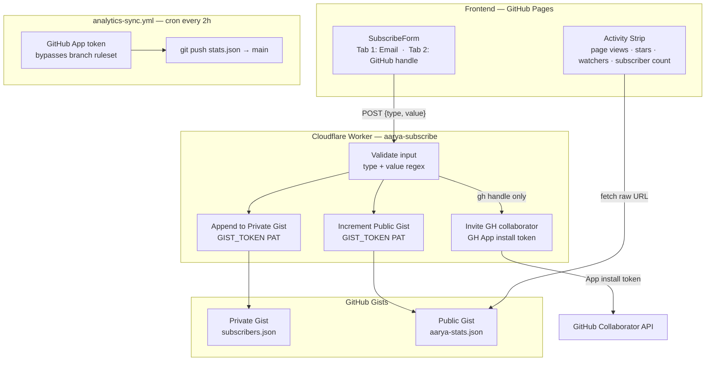

# Subscription Architecture

Aarya uses a fully self-hosted dual-channel subscriber system — no third-party email tools (no Kit, no Mailchimp, no Buttondown). Subscribers are stored in GitHub Gists you own. The only external backend is a Cloudflare Worker. A GitHub App handles repo automation.

## Design Principles

- **Own your data** — subscriber list lives in a private GitHub Gist, not a vendor database
- **No vendor lock-in** — email addresses can be exported and used with any sender at any time
- **Minimal secrets surface** — each credential has the smallest possible scope
- **No branch protection hacks** — GitHub App is an approved bypass actor in the ruleset

## Two Subscribe Channels

| Channel | Input | What happens | Value to subscriber |
|---|---|---|---|
| Email | `user@example.com` | Appended to private Gist | Manually notified when updates are sent |
| GitHub handle | `@username` | Appended to Gist + invited as repo `read` collaborator | GitHub Watch notifications, PR/Discussion access |

> **Note on custom roles:** Custom roles are a GitHub Organization feature. For a personal repo, `read` is the appropriate collaborator permission — it grants Watch notifications, access to private Discussions if enabled, and recognises the user as a community member.

## Infrastructure Components

### GitHub App — `aarya-platform-bot`

Required permissions:

| Permission | Level | Purpose |
|---|---|---|
| Contents | Read & Write | Push `stats.json` to `main` — bypasses branch ruleset |
| Members | Read | Check whether a GH handle is already a collaborator before inviting |
| Administration | Read | Verify bypass actor status (informational) |

> **Critical constraint:** GitHub Apps **cannot** write to Gists. Gists are user-level resources, not repository resources. A separate fine-grained PAT with `gist` scope handles all Gist I/O.

### Gist PAT — `gist` scope only

A fine-grained personal access token with **only** the `gist` scope. Used exclusively by the Cloudflare Worker to read and write the two Gists. Never stored in the repository — only in Cloudflare Worker secrets.

### Two Gists

| Gist | Visibility | Filename | Schema |
|---|---|---|---|
| Subscriber list | **Private** (owner-only) | `subscribers.json` | `[{"type":"email"\|"gh","value":"...","joined":"ISO-date"}]` |
| Public stats | **Public** | `aarya-stats.json` | `{"email_count":0,"gh_count":0,"synced_at":null}` |

The public Gist raw URL is fetched directly by the frontend to show live subscriber counts. No workflow or cron needed for the count — it updates in real-time on each subscribe.

### Cloudflare Worker — `aarya-subscribe`

The sole backend. Deployed on Cloudflare Workers free tier (100k requests/day).

**Endpoint:** `POST /subscribe`

**Request body:**
```json
{"type": "email", "value": "user@example.com"}
{"type": "gh",    "value": "githubusername"}
```

**Processing logic:**
1. Validate `type` is `"email"` or `"gh"`
2. Validate `value` against allowlist regex (OWASP A03):
   - Email: basic RFC 5322 pattern
   - GitHub handle: `/^[a-zA-Z0-9]([a-zA-Z0-9-]{0,37}[a-zA-Z0-9])?$/` (max 39 chars)
3. Read private subscriber Gist — check for duplicate `value`
4. If new: append `{type, value, joined: ISO-timestamp}` to private Gist
5. PATCH public stats Gist — increment `email_count` or `gh_count`
6. If `type === "gh"`: generate GitHub App installation JWT → exchange for installation token → `PUT /repos/ajeetchouksey/ajch_platform/collaborators/{handle}` with `permission: "read"`
7. Return `201` (new subscriber) or `200` (duplicate — no error shown to user)

**Security controls:**
- CORS restricted to `https://ajeetchouksey.github.io`
- Cloudflare IP-based rate limiting
- All error responses are generic `{"error":"internal"}` — internal details never leaked
- Input validated against allowlist regex before any external API call

## Data Flow Diagram



## Frontend Integration

### Activity Strip — `HomeV2.tsx`

Four live data sources:

| Signal | Source | Refresh |
|---|---|---|
| 👁 Page views | `stats.json` → GA4 | Every 2h via `analytics-sync.yml` |
| ⭐ GitHub stars | `fetchGitHubRepo().stars` | Live (5-min `sessionStorage` cache) |
| 👀 GitHub watchers | `fetchGitHubRepo().watchers` | Live (5-min `sessionStorage` cache) |
| 👥 Subscriber count | Public Gist raw URL | Live (updates on each subscribe) |

### SubscribeForm — `src/components/SubscribeForm.tsx`

- **Tab 1 — Email**: validates email, `POST {type:"email", value}` to Worker
- **Tab 2 — GitHub**: validates handle, `POST {type:"gh", value}` to Worker
- Live count: fetches `https://gist.githubusercontent.com/ajeetchouksey/{VITE_STATS_GIST_ID}/raw/aarya-stats.json`
- Returns `null` if `VITE_SUBSCRIBE_WORKER_URL` is unset (safe for local dev)
- `compact` prop preserved for hero/footer use

## analytics-sync Workflow Changes

Replaces `STATS_PAT` (personal token with broad `repo` scope) with a scoped GitHub App installation token:

```yaml
- name: Generate GitHub App token
  id: app-token
  uses: actions/create-github-app-token@v1
  with:
    app-id: ${{ secrets.GH_APP_ID }}
    private-key: ${{ secrets.GH_APP_PRIVATE_KEY }}

- name: Checkout
  uses: actions/checkout@v4
  with:
    token: ${{ steps.app-token.outputs.token }}
```

Push step becomes `git push origin HEAD:main` — the App token is already authenticated and the App is in the ruleset bypass list.

## Secrets Inventory

### GitHub Repository Secrets

| Secret | Used by | Purpose |
|---|---|---|
| `GH_APP_ID` | `analytics-sync.yml` | Generate App installation token |
| `GH_APP_PRIVATE_KEY` | `analytics-sync.yml` | Generate App installation token |
| `GA4_PROPERTY_ID` | `analytics-sync.yml` | GA4 page view fetch |
| `GA4_SERVICE_ACCOUNT_KEY` | `analytics-sync.yml` | GA4 service account auth |

**Removed secrets (revoke after migration):**
- `STATS_PAT` — replaced by GitHub App token
- `KIT_API_SECRET` — Kit removed entirely

### Cloudflare Worker Secrets

| Secret | Scope | Purpose |
|---|---|---|
| `GIST_TOKEN` | `gist` only | Read/write both Gists |
| `SUBSCRIBER_GIST_ID` | N/A | Private subscriber Gist ID |
| `PUBLIC_STATS_GIST_ID` | N/A | Public stats Gist ID |
| `GH_APP_ID` | N/A | Generate App installation JWT |
| `GH_APP_PRIVATE_KEY` | App only | Generate App installation JWT |
| `GH_APP_INSTALLATION_ID` | N/A | Installation ID for `ajch_platform` |

### Frontend Environment Variables

| Variable | Safe to bundle? | Purpose |
|---|---|---|
| `VITE_SUBSCRIBE_WORKER_URL` | ✅ Yes (public endpoint) | Cloudflare Worker URL |
| `VITE_STATS_GIST_ID` | ✅ Yes (public Gist ID only) | Show live subscriber count |
| `VITE_GH_TOKEN` | ✅ Yes (no-scope PAT) | GitHub API rate-limit uplift |

> `VITE_STATS_GIST_ID` is the **public** Gist ID only. The private subscriber Gist ID is never in the frontend.

## Implementation Phases

| Phase | Issue | Prerequisite | Infra needed |
|---|---|---|---|
| 1 — Activity strip | feat(home): GitHub stars + watchers | None | None |
| 2 — SubscribeForm | feat(subscribe): dual-channel form | Gist IDs for count display | Gists (manual) |
| 2 — Kit removal | chore: remove ConvertKit | Phase 2 form work | None |
| 3 — Worker | feat(worker): Cloudflare Worker | GitHub App for GH invite | Cloudflare account |
| 4 — GitHub App | chore(infra): create App | None | GitHub App creation |
| 4 — CI fix | fix(ci): App token in analytics-sync | Phase 4 App creation | GitHub App secrets |
| Docs | docs: subscription-architecture.md | None | None |

## One-Time Setup Checklist

```
Infrastructure
[ ] Create private Gist at gist.github.com
    File: subscribers.json  Content: []
[ ] Create public Gist at gist.github.com
    File: aarya-stats.json  Content: {"email_count":0,"gh_count":0,"synced_at":null}
[ ] Note both Gist IDs from their URLs
[ ] Create fine-grained PAT at github.com/settings/tokens
    Scope: gist only — ALL other permissions: No access
    Save as: GIST_TOKEN (Cloudflare Worker secret)

GitHub App
[ ] Create App at github.com/settings/apps/new
    Name: aarya-platform-bot
    Webhook active: OFF
    Permissions: Contents R/W, Members R, Administration R
[ ] Install App on ajch_platform repo
[ ] Note App ID (shown on App settings page)
[ ] Note Installation ID (from the install URL: .../installations/{id})
[ ] Generate private key → download .pem (never commit)
[ ] Add to ruleset bypass list at settings/rules/17214708
[ ] Add repo secrets: GH_APP_ID, GH_APP_PRIVATE_KEY

Cloudflare Worker
[ ] Create Cloudflare account (free tier)
[ ] Run: wrangler secret put GIST_TOKEN
[ ] Run: wrangler secret put SUBSCRIBER_GIST_ID
[ ] Run: wrangler secret put PUBLIC_STATS_GIST_ID
[ ] Run: wrangler secret put GH_APP_ID
[ ] Run: wrangler secret put GH_APP_PRIVATE_KEY
[ ] Run: wrangler secret put GH_APP_INSTALLATION_ID
[ ] Run: wrangler deploy
[ ] Note deployed Worker URL (*.workers.dev)
[ ] Set VITE_SUBSCRIBE_WORKER_URL in deploy workflow env
[ ] Set VITE_STATS_GIST_ID in deploy workflow env

Cleanup (after all phases merged)
[ ] Revoke STATS_PAT GitHub repo secret
[ ] Revoke KIT_API_SECRET GitHub repo secret
[ ] Delete old Kit form (app.convertkit.com)
```
