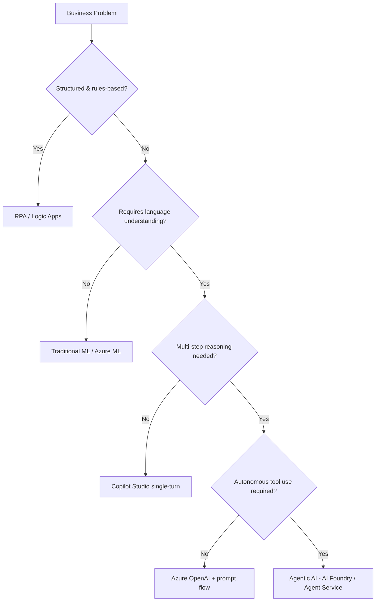
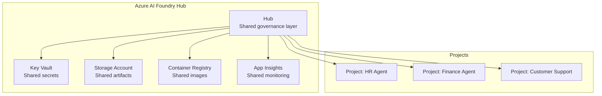
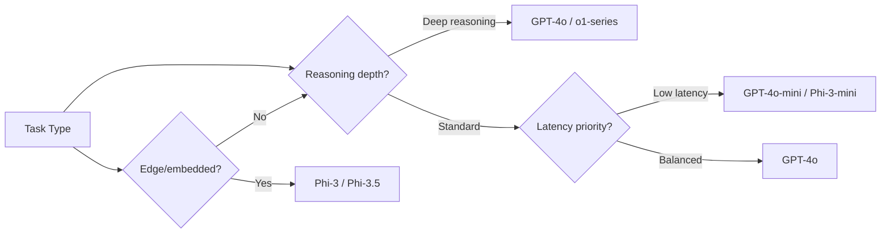
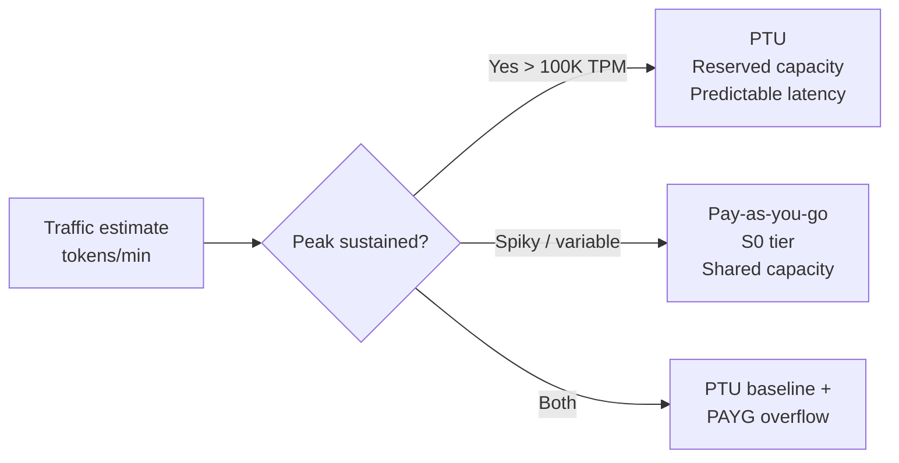
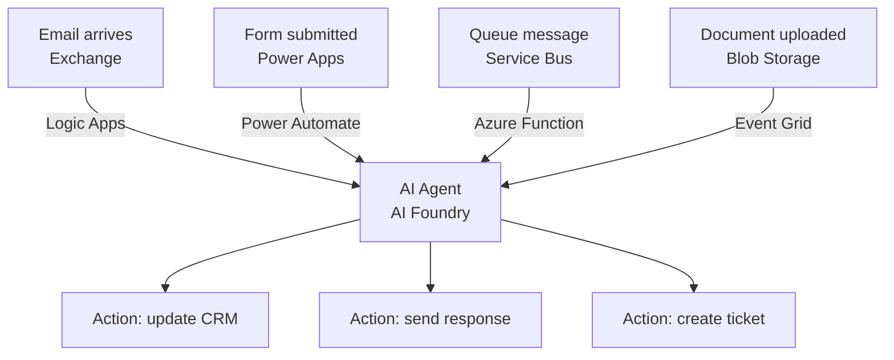

# D1: Plan AI-Powered Business Solutions

> **Exam weight**: 28% · **Questions**: ~17 of 60

## Overview

Domain 1 covers the upfront strategic and architectural decisions for agentic AI initiatives — from identifying the right use cases and mapping them to Azure services, to estimating costs, aligning stakeholders, and satisfying regulatory requirements before a single line of code is written.

---

## Use Case Identification & ROI

### The Agentic AI Decision Framework

Not every automation problem benefits from an AI agent. The decision tree:

### ROI Calculation Factors
- **Cost of current process**: FTE hours × hourly rate × volume
- **Agent cost**: (input tokens × rate) + (output tokens × rate) + Azure AI services
- **Break-even**: typically at >500 repetitive tasks/month
- **Risk discount**: multiply projected savings by (1 - error_rate) for safety margin

### Exam Trap ⚠️

The exam often presents scenarios where Copilot Studio looks like the right answer because it's "no-code." Remember: Copilot Studio is correct for **knowledge worker** tasks with existing Microsoft 365 data. Azure AI Agent Service is correct when you need **custom code execution**, complex multi-agent orchestration, or non-Microsoft data sources.

---

## Azure AI Foundry Architecture

### Hub vs Project

| Concept | Hub | Project |
|---------|-----|---------|
| Scope | Organization-wide | Team/workload |
| Resources | Shared: Key Vault, Storage, ACR | Isolated: endpoints, deployments |
| Access | IT/Governance team | Dev team |
| Cost center | Allocated to projects | Per-project billing |

### Key Hub Services
- **Azure AI Services connection**: one connection = access to all cognitive services
- **Model catalog**: curated list of foundation models (OpenAI, Meta, Mistral, Phi)
- **Compute clusters**: serverless (auto-scale, pay-per-token) vs dedicated (PTU)

---

## Model Selection in AI Foundry

### Model Selection Decision Tree

| Model | Best For | Context | Cost Tier |
|-------|----------|---------|-----------|
| GPT-4o | Complex reasoning, multimodal | 128K | High |
| GPT-4o-mini | High-volume, cost-sensitive | 128K | Low |
| o1-series | Multi-step math/code reasoning | 128K | Very High |
| Phi-3-mini | Edge, low-latency, on-device | 4K | Very Low |
| Phi-3-medium | Balanced local/cloud | 128K | Low |
| Llama 3 | Open-source, fine-tunable | 8K/128K | Variable |

### Make vs Buy: Copilot Studio vs Custom Agent

| Factor | Use Copilot Studio | Use Azure AI Agent Service |
|--------|-------------------|---------------------------|
| Data sources | Microsoft 365, SharePoint, Dataverse | Any (REST, SQL, proprietary) |
| Integration | Power Platform connectors | Azure Functions, custom code |
| Orchestration | Topics-based flow | Code-first, multi-agent |
| Governance | Power Platform DLP | Azure RBAC, custom |
| Code skills | Low-code / no-code | Pro-code required |
| Time to value | Days | Weeks |

### Exam Trap ⚠️

"Copilot Studio uses **topics** (not agents) as its orchestration primitive. If the scenario says 'the solution must call a custom Python function or query a proprietary database,' Copilot Studio's connectors may not be sufficient — Azure AI Agent Service is the right answer."

---

## Capacity Planning

### Provisioned Throughput Units (PTU)

- **PTU**: billed by provisioned unit/hour regardless of usage — best when utilization > 60%
- **PAYG**: billed per 1K tokens — best for dev/test and variable loads
- **Spillover pattern**: PTU primary → PAYG fallback via Azure OpenAI load balancer

### Regional Availability Checklist
- Check model availability per region in AI Foundry model catalog
- EU data residency: use Sweden Central or West Europe
- Asia Pacific: East Asia or Australia East
- Cross-region replication for HA: use Azure Front Door + two regional deployments

---

## Stakeholder Alignment & Compliance

### Responsible AI Checklist (pre-deployment)
1. **Identify** potential harms (use Microsoft RAI Impact Assessment template)
2. **Mitigate** with content filters, human review, rate limits
3. **Document** in a Transparency Note
4. **Monitor** with Azure AI Content Safety + Azure Monitor alerts
5. **Govern** with AI Foundry Hub policies and Azure Policy

### EU AI Act Risk Categories

| Category | Examples | AB-100 Relevance |
|----------|----------|-----------------|
| Unacceptable | Social scoring, real-time biometric surveillance | Out of scope (prohibited) |
| High-risk | HR screening, credit scoring, safety systems | Requires conformity assessment |
| Limited risk | Chatbots, recommendation systems | Transparency obligations |
| Minimal risk | Spam filters, AI in games | No obligations |

### GDPR Considerations for Agents
- Conversation history stored in Cosmos DB must have **TTL policy** (data minimization)
- User data in vector indexes → right to erasure requires **index partitioning by user ID**
- Agent outputs used for profiling → **legitimate interest** or consent required

---

## Integration Patterns

### Event-Driven Agent Trigger Patterns

| Trigger Pattern | Best For | Latency |
|----------------|----------|---------|
| Service Bus queue | High-volume, durable | Seconds |
| Event Grid | File/blob events | Sub-second |
| Logic Apps | Office 365, SaaS | Seconds |
| HTTP direct | Real-time user interactions | <1s |
| Power Automate | Business users, no-code | Seconds |

---

## Cheat Sheet 📋

| Concept | Key Rule |
|---------|----------|
| Hub vs Project | Hub = shared governance; Project = isolated workload |
| PTU vs PAYG | PTU when utilization > 60% and predictable; PAYG for variable/dev |
| Copilot Studio | Use for M365 data + low-code + business users |
| AI Agent Service | Use when custom code, non-Microsoft data, or complex multi-agent |
| EU AI Act HR tool | High-risk → requires conformity assessment |
| Model: GPT-4o-mini | High volume, cost-sensitive, standard reasoning |
| Model: o1-series | Deep reasoning, math/code — NOT for latency-sensitive paths |
| Spillover pattern | PTU primary + PAYG overflow via load balancer |
| Data residency | EU → Sweden Central or West Europe |
| Right to erasure | Partition vector indexes by user ID |

---

## Cloud Adoption Framework — AI Adoption Process

The CAF AI adoption scenario structures enterprise AI adoption into six phases:

| Phase | Key Activities |
|-------|---------------|
| **Strategy** | Define AI vision, identify business outcomes, executive alignment |
| **Plan** | Skills assessment, roadmap, landing zone planning, change management |
| **Ready** | AI Foundry Hub setup, governance policies, shared infrastructure |
| **Adopt** | Pilot use cases, iterate, scale proven patterns |
| **Govern** | Responsible AI policies, cost controls, compliance monitoring |
| **Manage** | Ongoing operations, model refresh, performance monitoring |

> **Exam trap**: CAF is the adoption *journey* framework. Well-Architected Framework governs *workload quality* (reliability, security, etc.) — applied after architectural decisions are made.

---

## Grounding Data Quality — ARTCA Dimensions

When evaluating data for RAG knowledge bases, assess five dimensions:

| Dimension | Description | Key Question |
|-----------|-------------|--------------|
| **Accuracy** | Data correctly represents the real world | Do product descriptions match physical attributes? |
| **Relevance** | Data is pertinent to user queries | Is this content useful for the agent's domain? |
| **Timeliness** | Data is current within acceptable staleness thresholds | How often does this data change? Is today's data required? |
| **Cleanliness** | Data is free of duplicates, errors, encoding issues | Are there HTML artifacts, encoding problems, duplicates? |
| **Availability** | Data is accessible to the retrieval pipeline | Can the indexer reach this source? What are the access controls? |

> **Exam tip**: For real-time data (prices, inventory, stock levels), **Timeliness** is typically the most critical dimension to evaluate first.

---

## AI Center of Excellence (CoE)

The AI CoE owns enterprise-wide AI enablement — distinct from business units that own specific use cases:

**CoE Responsibilities:**
- Define approved AI models and their data classification constraints
- Maintain the enterprise prompt library (versioned, curated templates)
- Own shared infrastructure (AI Foundry Hub, observability, security baselines)
- Establish evaluation frameworks and quality gates
- Run responsible AI reviews and publish Transparency Notes
- Drive AI literacy and training programs

**Business Unit Responsibilities:**
- Define use case requirements and success metrics
- Operate production agents for their domain
- Provide domain-specific training data and review outputs

> **Exam trap**: The CoE does NOT write business requirements for individual use cases — that belongs to the business unit.

---

## Model Router Pattern

A model router is a lightweight classifier that inspects each incoming query and routes it to the most cost-effective model capable of handling that request:

`
User Query → Router (lightweight classifier) → GPT-4o-mini (simple)
                                              → GPT-4o (complex reasoning)
                                              → Phi-3 (code generation)
                                              → Claude Haiku (classification)
`

**Router decision criteria:**
- Query complexity (simple lookup vs. multi-step reasoning)
- Domain (code, legal, medical — specialized models)
- Latency requirements (fast models for real-time, slow for batch)
- Cost budget per query type

> **Exam tip**: The router itself is usually a fast, cheap model or rules-based classifier — NOT an expensive model like GPT-4o.

---

## ROI and TCO Analysis

### ROI Calculation Framework

`
ROI (%) = (Net Benefit over Period / Total Investment over Period) × 100

Net Benefit = Cost Savings + Revenue Uplift - Ongoing Costs
Total Investment = Implementation + Platform + Training + Operations (3-year)
`

### TCO Components for AI Solutions

| Category | Examples |
|----------|---------|
| **Azure infrastructure** | Compute, storage, networking, Key Vault |
| **AI service costs** | OpenAI tokens/PTU, AI Search query units, Content Safety |
| **Licensing** | Copilot Studio per-session, M365 Copilot per-user, D365 |
| **Implementation** | Development, integration, testing (often the largest initial cost) |
| **Training & change management** | User training, documentation, adoption programs |
| **Ongoing operations** | Monitoring, knowledge base refreshes, model updates, evaluation |

> **Exam tip**: Candidates often underestimate implementation and ongoing operations costs. A complete TCO captures all six categories above.

---

## Build-Buy-Extend Decision Framework

| Factor | Build Custom | Buy SaaS | Extend Platform (M365/D365) |
|--------|-------------|---------|---------------------------|
| **Differentiation** | Process is a core competency | Commodity process | Standard process in Microsoft ecosystem |
| **Time-to-value** | 3-12 months | Days-weeks | 1-4 weeks |
| **TCO** | Highest (maintenance burden) | Subscription cost | Medium (licensing + config) |
| **Integration** | Full control | API-limited | Native M365/D365 integration |
| **When to choose** | True differentiator, no solution exists | Standard process, data in SaaS | Process lives in M365/D365 surfaces |

> **Decision rule**: For commodity processes (invoice processing, meeting summarization), prefer Buy or Extend. Build only when differentiation justifies the investment.

---

## Small Language Models (SLMs)

SLMs (e.g., Phi-3-mini, Phi-3-medium, Phi-3.5) are preferable to large general models when:

| Condition | Rationale |
|-----------|-----------|
| **Narrow domain with training data** | Fine-tuned SLM can outperform GPT-4o on specific tasks |
| **Strict latency requirements** | SLMs inference 2-5× faster than large models |
| **Data sovereignty / on-premises** | SLMs run on local hardware — data never leaves the network |
| **Edge deployment** | SLMs fit on constrained devices (laptops, IoT) |
| **Cost sensitivity at scale** | SLMs cost 10-50× less per token than GPT-4o |

> **Exam trap**: SLMs are NOT universally superior. They fail on tasks requiring broad world knowledge or complex multi-step reasoning that was not in their training data.

---

## Prompt Library

An enterprise prompt library is a **centralized, curated, versioned collection** of proven prompt templates maintained by the AI CoE:

**Contents:**
- Task templates (meeting summary, email draft, code review, data analysis)
- Domain-specific templates (legal contract review, HR policy lookup, financial analysis)
- Annotation on what makes each template effective
- Guidelines for adaptation per task variant
- Version history and performance metrics

**Benefits:**
- Democratizes best practices without requiring all users to become prompt engineers
- Reduces inconsistency — same task, same quality across the organization
- Reduces token waste from poorly structured prompts

> **Exam tip**: A prompt library is an organizational asset owned by the AI CoE — not a feature of the Azure platform.

---

## Updated Exam Quick Reference (Domain 1 — July 2026 Syllabus)

| Topic | Key Decision / Rule |
|-------|-------------------|
| CAF AI adoption | Strategy → Plan → Ready → Adopt → Govern → Manage |
| Grounding data | Evaluate ARTCA: Accuracy, Relevance, Timeliness, Cleanliness, Availability |
| AI CoE | Owns standards, shared infra, prompt library — NOT use case BRDs |
| Model router | Lightweight classifier routes by complexity/domain/cost |
| ROI | 3-year TCO includes: infra + AI services + licensing + impl + training + ops |
| Build-Buy-Extend | Commodity process → Buy or Extend; Differentiator → Build |
| SLMs | Prefer when: narrow domain + training data + latency/cost/sovereignty constraints |
| Prompt library | Centralized, versioned, CoE-owned collection of proven templates |
| Multi-agent platforms | M365 Copilot (extend) → Copilot Studio (low-code) → AI Foundry (pro-code) |
