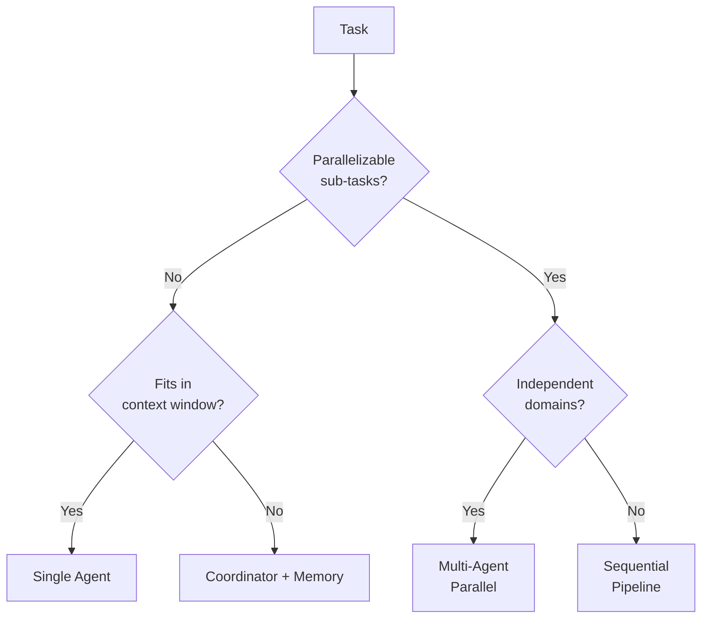
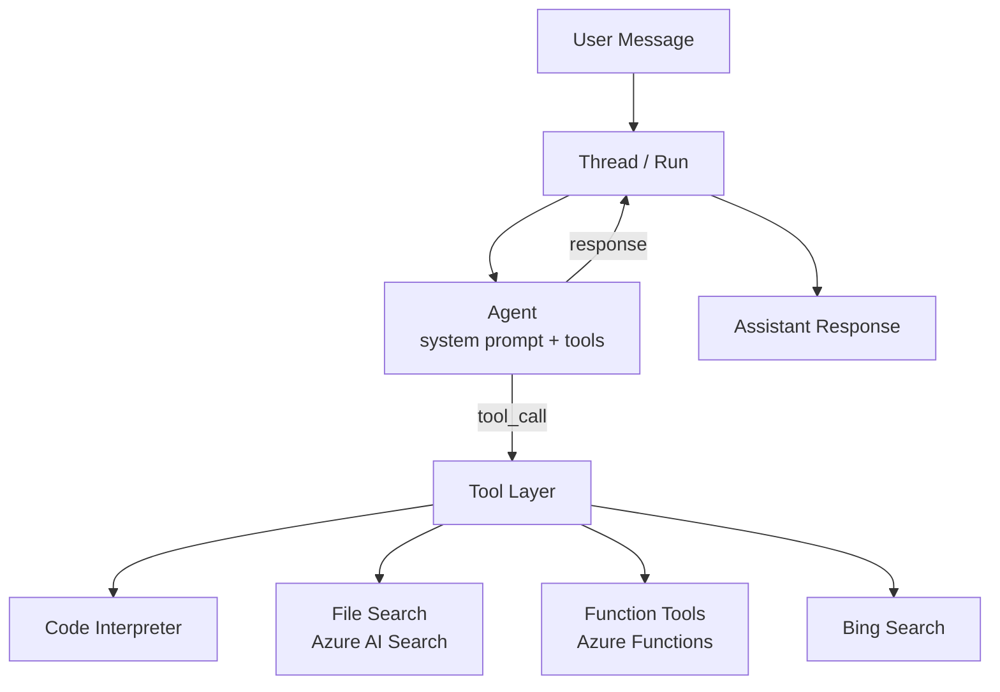
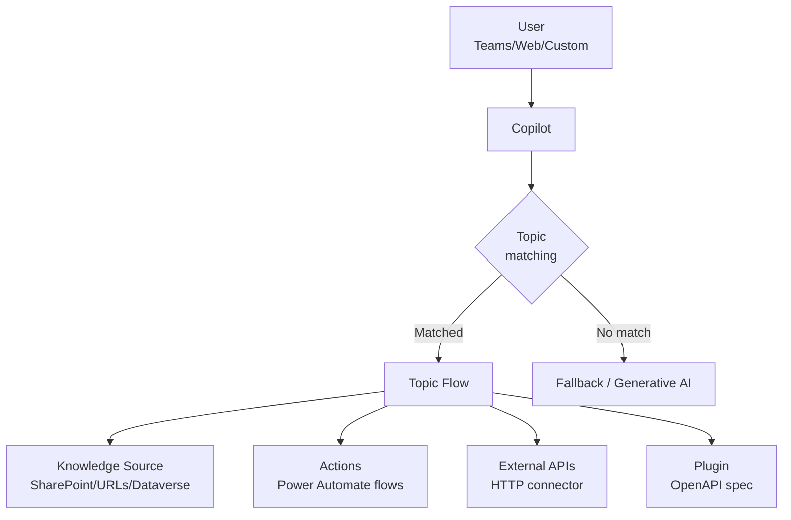
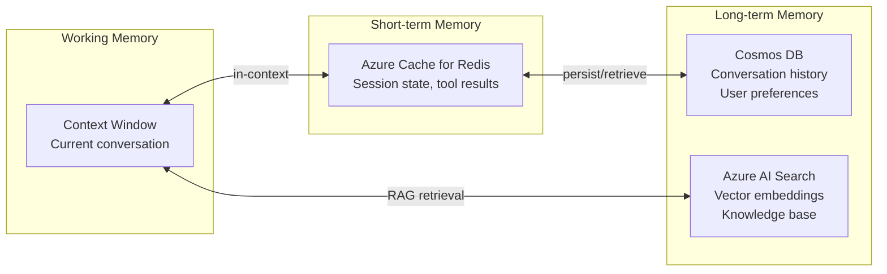
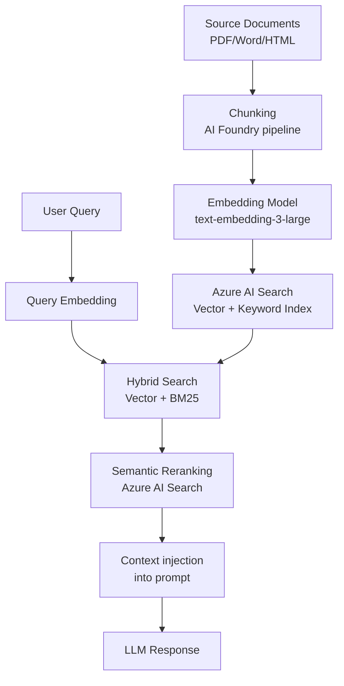
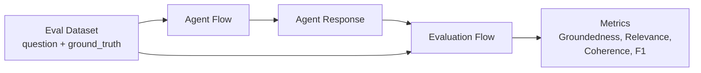

# D2: Design Agentic AI Solutions

> **Exam weight**: 28% · **Questions**: ~17 of 60

## Overview

Domain 2 is the technical design domain — it covers how to architect multi-agent systems using Azure AI Foundry, AI Agent Service, Copilot Studio, and the Microsoft Agent Framework (AutoGen/Magentic-One). It tests your ability to choose orchestration patterns, design memory and tool layers, and wire agents together correctly.

---

## Orchestration Patterns

### Single-Agent vs Multi-Agent Decision



### Multi-Agent Patterns

| Pattern | Structure | When to Use |
|---------|-----------|-------------|
| **Sequential** | A → B → C | Each step depends on previous output |
| **Parallel** | A → [B, C, D] → Merge | Independent subtasks, reduce latency |
| **Hierarchical** | Coordinator → [Specialist A, B] | Domain specialization + routing |
| **Debate** | Agent A ↔ Agent B → Critic | Improve accuracy via adversarial review |
| **Magentic-One** | Orchestrator + [WebSurfer, FileSurfer, Coder, Executor] | Open-ended research tasks |

### Exam Trap ⚠️

<div class="note-trap">
Magentic-One is NOT the same as generic multi-agent. Magentic-One is a **specific Microsoft pattern** for open-ended web/file/code tasks. Use it when the task is: unstructured, requires browsing + coding + file operations. Do NOT use it for structured business workflows — hierarchical coordinator pattern is correct there.
</div>

---

## Azure AI Agent Service

### Agent Service Architecture



### Key Concepts: Threads, Runs, Steps

| Concept | Description | Azure Equivalent |
|---------|-------------|-----------------|
| **Thread** | Conversation history container | Cosmos DB-backed session |
| **Run** | Single agent execution on a thread | Async task with polling |
| **Run Step** | Individual tool call or message | Trace span |
| **File** | Uploaded document for processing | Azure Blob Storage |
| **Vector Store** | Index for file search | Azure AI Search index |

### Built-in Tools

| Tool | What it Does | Max Files |
|------|-------------|-----------|
| **Code Interpreter** | Executes Python in sandbox | 20 per thread |
| **File Search** | Semantic search over uploaded files | 10,000 per vector store |
| **Bing Search** | Real-time web search | N/A |
| **Function calling** | Calls your custom Azure Functions | 128 per agent |

### Creating an Agent (SDK Pattern)

```python
from azure.ai.projects import AIProjectClient

agent = client.agents.create_agent(
    model="gpt-4o",
    name="invoice-processor",
    instructions="You process invoices and extract structured data.",
    tools=[{"type": "code_interpreter"}, {"type": "file_search"}],
    tool_resources={"file_search": {"vector_store_ids": [vs.id]}}
)

thread = client.agents.create_thread()
message = client.agents.create_message(thread.id, role="user", content="Process this invoice")
run = client.agents.create_and_process_run(thread.id, agent_id=agent.id)
```

---

## Copilot Studio Design

### Copilot Studio Architecture



### Topics vs Actions vs Plugins

| Concept | Purpose | Trigger |
|---------|---------|---------|
| **Topic** | Conversation flow for a specific intent | User phrase matching |
| **Action (flow)** | Call Power Automate or external API | Within a topic |
| **Plugin** | Expose external API as tool | AI-driven selection |
| **Knowledge source** | Add docs/URLs to generative answers | Fallback or explicit |
| **Adaptive card** | Rich response in Teams/Web | Within topic |

### Exam Trap ⚠️

<div class="note-trap">
In Copilot Studio, **generative answers** (the fallback AI response) and **topics** (explicit flow) are DIFFERENT. Generative answers search knowledge sources. Topics override generative answers when a phrase is matched. The exam tests whether you know which one activates for a given input.
</div>

---

## Microsoft Agent Framework (AutoGen)

### AgentChat Multi-Agent Setup

```python
from autogen_agentchat.agents import AssistantAgent
from autogen_agentchat.teams import RoundRobinGroupChat
from autogen_ext.models.openai import AzureOpenAIChatCompletionClient

model_client = AzureOpenAIChatCompletionClient(
    model="gpt-4o",
    azure_endpoint=os.environ["AZURE_OPENAI_ENDPOINT"],
    api_key=os.environ["AZURE_OPENAI_KEY"],
)

researcher = AssistantAgent("researcher", model_client=model_client,
    system_message="Search and summarize information.")
writer = AssistantAgent("writer", model_client=model_client,
    system_message="Write clear reports from summaries.")

team = RoundRobinGroupChat([researcher, writer], max_turns=6)
result = await team.run(task="Research and report on Azure AI Foundry")
```

### Selection Strategies

| Strategy | How It Works | Use Case |
|----------|-------------|----------|
| **RoundRobin** | Fixed rotation through agents | Structured pipeline |
| **Selector (LLM)** | LLM picks next speaker | Dynamic routing |
| **Swarm** | Agents hand off directly | Distributed work |

### Termination Conditions

```python
from autogen_agentchat.conditions import MaxMessageTermination, TextMentionTermination

termination = MaxMessageTermination(10) | TextMentionTermination("TASK_COMPLETE")
```

---

## Memory Architecture

### Memory Tiers for Agents



| Memory Type | Azure Service | TTL | Use For |
|-------------|--------------|-----|---------|
| In-context | Token window | Request lifetime | Current turn reasoning |
| Working | Azure Cache for Redis | Minutes | Multi-turn session state |
| Episodic | Cosmos DB (NoSQL) | Days/months | Conversation history |
| Semantic | Azure AI Search (vector) | Persistent | Knowledge retrieval |

---

## RAG Pipeline Design in AI Foundry

### Full RAG Architecture



### Chunking Strategies

| Strategy | Chunk Size | Best For |
|----------|-----------|----------|
| Fixed-size | 512 tokens | Uniform documents |
| Sentence-based | Variable | Prose, documentation |
| Semantic | Variable (topic boundary) | Long technical docs |
| Hierarchical | Parent + child chunks | Summary + detail retrieval |

### Hybrid Search (Recommended)
- **Vector search**: semantic similarity (finds "similar meaning")
- **Keyword (BM25)**: exact term matching (finds "exact words")
- **Semantic reranker**: re-scores top-N results using a cross-encoder model
- Always use hybrid + reranker for production — pure vector search misses exact terminology

---

## Prompt Flow in AI Foundry

### Prompt Flow Node Types

| Node Type | Purpose | Example |
|-----------|---------|---------|
| **LLM node** | Call a model | Extract entities from text |
| **Python node** | Custom code | Parse JSON, call external API |
| **Prompt node** | Template rendering | Build dynamic prompts |
| **Embedding node** | Generate embeddings | Vectorize user input |
| **Vector DB node** | Search vector store | Retrieve relevant chunks |

### Evaluation Flow Pattern



---

## Cheat Sheet 📋

| Concept | Key Rule |
|---------|----------|
| Magentic-One | Open-ended tasks: browse + code + files; NOT for structured workflows |
| Hierarchical pattern | Use when routing decisions require reasoning about task type |
| Thread vs Run | Thread = conversation container; Run = single execution on thread |
| Code Interpreter | Executes Python in a sandbox — use for data analysis, not arbitrary code |
| Copilot Studio trigger | Topics fire on phrase match; generative answers are the fallback |
| RAG: hybrid search | Always use vector + BM25 + semantic reranker for production |
| Chunking: semantic | Best for long technical documents with topic boundaries |
| Memory: Redis | Working memory / session state (minutes TTL) |
| Memory: AI Search | Knowledge base / long-term semantic retrieval |
| RoundRobin vs Selector | RoundRobin = fixed pipeline; Selector = LLM decides who speaks next |


---

## Model Context Protocol (MCP) in Copilot Studio

MCP allows Copilot Studio agents to connect to external systems that expose a standardized MCP server interface:

**How it works:**
1. Deploy an MCP server that wraps an external API or system
2. The MCP server declares its **tools** in a standardized schema (tool name, description, input/output types)
3. Add the MCP server endpoint as an action source in Copilot Studio
4. The agent discovers available tools via MCP discovery and invokes them by name

**When to use MCP vs. custom connector:**
| MCP | Custom Power Platform Connector |
|-----|-------------------------------|
| System has an MCP server already | No MCP server available |
| Multiple agents need to share tools | Single agent, single connector |
| Standardized discovery required | Microsoft-certified connector ecosystem |

> **Exam tip**: MCP is an **open protocol** — not a Microsoft-proprietary feature. It enables interoperability between AI systems and tools across vendors.

---

## Computer Use in Copilot Studio

Computer Use enables a Copilot Studio agent to interact with web browser UIs **without an API**:

**Capabilities:**
- Visual perception: agent takes a screenshot and interprets UI state
- Click buttons, fill form fields, navigate multi-step workflows
- Extract data from pages with no structured API

**When to use:**
- Legacy web portals with no REST API
- Supplier/partner portals that cannot be modified
- Multi-step procurement or compliance workflows on external sites

**Limitations:**
- Slower than API-based actions (vision + interaction latency)
- Brittle to UI layout changes (CSS redesigns break the automation)
- Not suitable for high-frequency transactional tasks

> **Exam tip**: Computer Use is for **last-resort automation** of UI-only workflows. Always prefer an API connector when one is available.

---

## Agent Types — Comparison Table

| Type | Definition | Triggers | Actions | Example |
|------|-----------|---------|---------|---------|
| **Task Agent** | Executes a specific, bounded workflow with fixed steps | User request or event | Predefined tool sequence | Portfolio summary agent |
| **Autonomous Agent** | Perceives environment, makes decisions, acts without continuous prompting | Time, event, or threshold | Dynamic — decides its own actions | Market monitoring + trade execution |
| **Prompt-and-Response Agent** | Responds to user queries, generates structured output | User query | Generate response | Report generation, Q&A |

**Governance implications:**
- Task agents: need workflow validation and error handling
- Autonomous agents: need **human approval gates**, rollback mechanisms, audit trails — highest governance burden
- Prompt-and-response: need content safety, hallucination controls

---

## Agent Behaviors in Copilot Studio

### Reasoning Mode
- Activates **chain-of-thought (CoT)** processing before generating the final response
- Agent generates an internal reasoning trace: breaks problem into steps, evaluates options, then responds
- **Use when**: complex multi-step analysis, legal/financial reasoning, scientific questions
- **Trade-offs**: higher latency, more tokens consumed

### Voice Mode
- Enables speech recognition (input) and text-to-speech synthesis (output)
- **Design rules for voice topics**:
  - No markdown (bullets, tables — do not render in speech)
  - Short, conversational responses
  - Use SSML for pauses, emphasis where needed
  - Test in voice test canvas before deployment
- Configure language models per supported language (multilingual voice requires per-language speech model)

---

## Microsoft Power Platform Well-Architected Framework for AI

The Power Platform WAF provides five pillars for intelligent application workloads:

| Pillar | AI-Specific Concerns |
|--------|---------------------|
| **Reliability** | Agent uptime, Copilot Studio failover, Dataverse capacity |
| **Security** | DLP policies, connector authentication, AI model access controls |
| **Operational Excellence** | ALM for agents, environment strategy, monitoring dashboards |
| **Performance Efficiency** | Copilot Studio session limits, Dataverse query optimization |
| **Experience Optimization** | Conversational UX quality, topic coverage, fallback handling |

> **Exam tip**: WAF is applied **during design** to validate architectural decisions — not after deployment.

---

## D365 Copilot for Sales and Copilot for Service

### Copilot for Sales
- Surfaces in Outlook and Teams
- **Built-in capabilities**: email summarization, reply drafting grounded in CRM data, meeting preparation, opportunity insights
- **Extensibility**: custom connectors add non-Dynamics data sources; configuration controls which insights surface
- **Licensing**: requires M365 Copilot + Copilot for Sales add-on

### Copilot for Service
- Surfaces in D365 Customer Service agent desktop
- **Built-in capabilities**: case summarization, email draft with knowledge base grounding, conversation summary, next-step suggestions
- **Customization**: business terms (tone, prohibited topics), summarization field configuration, additional knowledge sources
- **Key design decision**: configure in D365 admin center — no custom code required for standard scenarios

### D365 Contact Center Integration
- Copilot Studio is the designated AI front-end for D365 Contact Center
- Supports voice (IVR-style), chat, and social messaging channels
- D365 unified routing engine handles escalation — passes conversation context to human agent
- Design the agent for **channel-specific behavior** (voice topics differ from chat topics in formatting)

---

## Updated Exam Quick Reference (Domain 2 — July 2026 Syllabus)

| Topic | Key Decision / Rule |
|-------|-------------------|
| MCP in Copilot Studio | Standardized open protocol — add MCP server as action source |
| Computer Use | Last-resort for UI-only workflows; prefer API connectors |
| Task agent | Fixed workflow, bounded scope |
| Autonomous agent | Self-directed, highest governance burden — needs approval gates |
| Prompt-response agent | Query-driven, generates output |
| Reasoning mode | CoT processing — use for complex multi-step analysis |
| Voice mode | No markdown in voice topics; test in voice canvas |
| Power Platform WAF | 5 pillars: reliability, security, opex, performance, experience |
| Copilot for Sales | M365 Copilot + Outlook/Teams — custom connectors for non-D365 data |
| Copilot for Service | D365 admin config — no code for standard scenarios |
| D365 Contact Center | Copilot Studio = unified AI layer across voice/chat/social |
| MCP vs connector | MCP: standardized discovery; connector: Microsoft-certified ecosystem |
