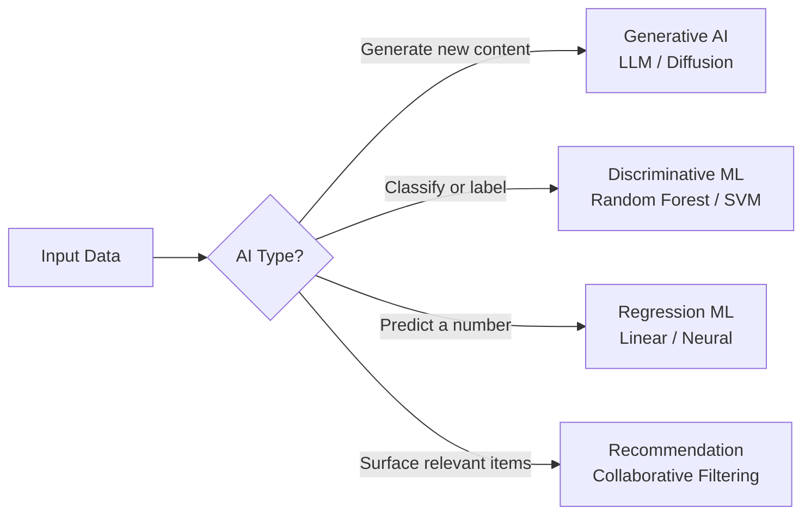
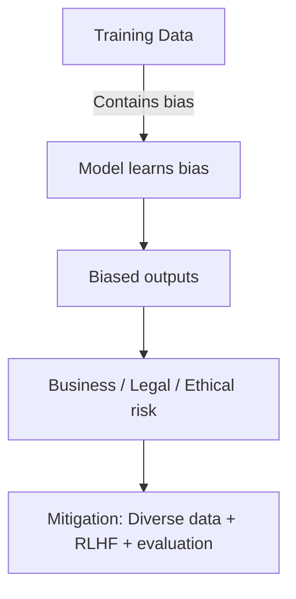
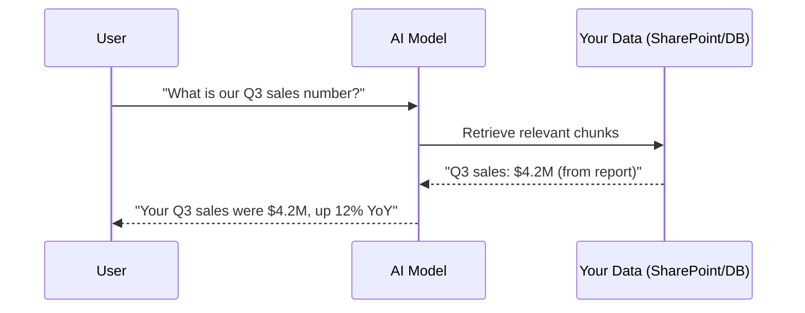
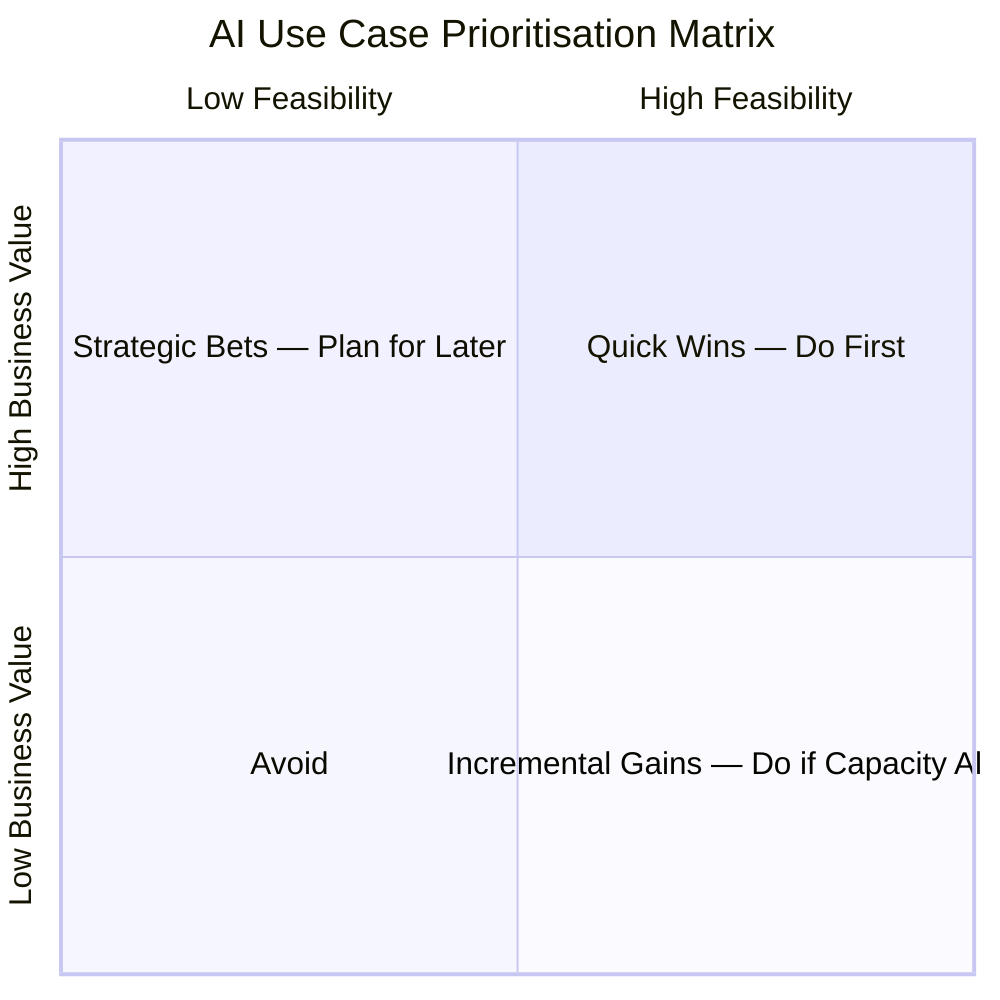

# Domain 1: Business Value of Generative AI
**Exam Weight: 38% — Heaviest Domain (tied)**

---

## 🧠 The Golden Rule

> **"Generative AI CREATES new content. Other AI CLASSIFIES or PREDICTS existing patterns."**

<div class="note-important"><strong>This distinction drives ~30% of D1 questions.</strong> The exam will give you scenarios and ask which AI type is appropriate. If the task is "generate text / images / code / summaries" → generative AI. If it's "classify fraud / predict churn / detect spam" → traditional ML.</div>

**The mental model:** Think of traditional ML as a **doctor reading an X-ray** — pattern recognition in known data. Generative AI is like a **ghost-writer** — it produces net-new content by learning patterns from training data.

<div class="note-scribble">The trick the exam uses: "Generate a summary" is generative AI. "Identify which emails are spam" is classification (traditional ML). Look for the word "generate," "create," "draft," or "compose" as the tell.</div>

---

## 1.1 Generative AI vs Other AI Types

| Type | What it does | Example |
|---|---|---|
| **Generative AI** | Creates new content (text, images, code, audio) | Drafting a proposal, generating code, creating images |
| **Discriminative / Classification** | Puts inputs into categories | Spam detection, sentiment analysis, fraud flag |
| **Predictive / Regression** | Forecasts a numeric outcome | Sales forecasting, demand prediction |
| **Recommendation** | Surfaces relevant items | "Users like you also bought..." |



<mark>Exam shortcut: The word "generate", "draft", "compose", or "create" always points to generative AI.</mark>

---

## 1.2 Pretrained vs Fine-tuned Models

**Pretrained model** — trained on massive general datasets (the whole internet, books, code). Ready to use out of the box.

**Fine-tuned model** — a pretrained model that has been additionally trained on a smaller, domain-specific dataset to specialise it.

| | Pretrained | Fine-tuned |
|---|---|---|
| **Cost** | Lower | Higher (training cost) |
| **Setup time** | Immediate | Weeks to months |
| **Best for** | General tasks | Specialised domain (legal, medical, brand voice) |
| **Requires** | Prompt engineering | Labelled training data |

<div class="note-important"><strong>Exam trap:</strong> Fine-tuning is NOT the first thing you reach for. The exam tests whether you know to try prompt engineering + RAG FIRST before spending money on fine-tuning. Fine-tune only when the domain vocabulary is so specialised that a base model cannot learn it from context.</div>

<div class="note-scribble">Think of a pretrained model as hiring a Harvard MBA generalist. Fine-tuning is sending them to a 3-month specialised bootcamp in derivatives trading. Both useful — but the bootcamp costs money and time. First try just telling the generalist what they need to know (prompting).</div>

---

## 1.3 Cost Drivers: Tokens & ROI

### Tokens
- The basic unit of text an LLM processes — roughly ¾ of a word, or ~4 characters
- **You pay for tokens IN (prompt) and tokens OUT (response)**
- Longer prompts = higher cost; longer responses = higher cost

| Cost lever | How to optimise |
|---|---|
| Prompt length | Be concise; avoid repeating context unnecessarily |
| Response length | Ask for summaries, not exhaustive responses |
| Model size | Use smaller models for simple tasks, large models for complex reasoning |
| Cache/reuse | Reuse common system prompt context where possible |

### ROI Considerations
For a business leader, ROI = (Value saved / generated) ÷ Cost of AI usage

<div class="note-important"><strong>Three ROI lenses:</strong><br/>1. <strong>Time savings</strong> — hours saved on repetitive tasks × hourly rate<br/>2. <strong>Quality lift</strong> — fewer errors, higher output quality<br/>3. <strong>Scalability</strong> — same headcount, more output (AI doesn't get tired)</div>

---

## 1.4 Challenges of Generative AI

### Fabrications (Hallucinations)
The model confidently generates plausible-sounding but **factually incorrect** content.

**Why it happens:** LLMs predict the next likely token — they don't have a fact-checker. They optimise for coherent text, not factual accuracy.

**Mitigation:** Grounding (RAG), retrieval from verified sources, human-in-the-loop review for high-stakes outputs.

<div class="note-scribble">The exam loves the word "hallucination" vs "fabrication." Microsoft documentation uses "fabrication." Same thing.</div>

### Reliability
AI outputs can vary for the same input (temperature/randomness) and may degrade on edge cases. Not guaranteed deterministic.

### Bias
Training data reflects real-world human biases. If the training data over-represents certain demographics, viewpoints, or languages, the model will too.

**Types to know:**
- **Historical bias** — past data encodes past discrimination (e.g., hiring data that favoured one group)
- **Representation bias** — some groups under-represented in training data
- **Measurement bias** — data collected inconsistently across groups



---

## 1.5 When Generative AI Adds Business Value

### Scalability
AI can handle **volume that humans cannot**. A human can write 5 personalised emails/hour; Copilot can generate 500. Same for summarising 1,000 support tickets or translating documents into 10 languages.

### Automation
AI can take over **repetitive cognitive tasks** that previously required human time:
- First-draft generation (proposals, reports, emails)
- Summarisation (meeting notes, research papers)
- Code assistance (boilerplate, unit tests)
- Data extraction (pulling structured data from unstructured text)

<div class="note-important"><strong>High-value scenarios for the exam:</strong><br/>✅ Summarising large documents<br/>✅ Drafting communications at scale<br/>✅ Accelerating code review<br/>✅ Answering common employee/customer questions<br/>✅ Extracting insights from data<br/><br/>❌ Low-value / risky scenarios:<br/>❌ High-stakes medical / legal decisions without human review<br/>❌ Real-time safety-critical systems<br/>❌ Tasks requiring 100% accuracy (payroll calculations)</div>

---

## 1.6 Prompt Engineering

Prompt engineering = **crafting the input to get the output you need** without changing the model.

### Core Techniques

| Technique | What it does | Example |
|---|---|---|
| **Zero-shot** | Ask directly, no examples | "Summarise this contract in 3 bullets" |
| **Few-shot** | Give 2-5 examples before the task | Show 2 sample summaries, then ask for a third |
| **Chain-of-thought** | Ask the model to reason step-by-step | "Think step by step before answering..." |
| **Role prompting** | Give the model a persona | "You are a senior legal counsel..." |
| **System prompt** | Set persistent context / rules | Instructions that apply to all turns |

<div class="note-important"><strong>Business impact:</strong> A well-engineered prompt can 10× output quality without any model changes or additional cost. This is why prompt engineering is a skill, not just typing.</div>

<div class="note-scribble">Exam question pattern: "A user is getting inconsistent quality from Copilot. What should they do first?" → Answer is usually: improve the prompt (be more specific, give context/examples). NOT: fine-tune the model. NOT: switch to a different tool.</div>

---

## 1.7 Grounding and RAG (Retrieval-Augmented Generation)

### The Problem
A pretrained model's knowledge has a **cutoff date** and doesn't know about your organisation's private data.

### The Solution: RAG



**Grounding** = connecting the model's responses to authoritative, verified data sources so it doesn't fabricate.

**Benefits of grounding:**
- Reduces hallucinations dramatically
- Keeps answers current (no knowledge cutoff)
- Cites sources (verifiable)
- Doesn't require model retraining

<mark>RAG vs Fine-tuning: RAG = give the model the answer book at runtime. Fine-tuning = teach the model new skills during training. RAG is cheaper, faster, and updatable.</mark>

---

## 1.8 Data Quality and AI Solutions

> **Garbage in, garbage out** — still the most important rule in AI.

| Data factor | Impact |
|---|---|
| **Data type** | Text, images, structured (tables), audio — model must match data type |
| **Data quality** | Errors, duplicates, inconsistencies propagate into AI outputs |
| **Representative datasets** | If training data excludes a group, the model will perform poorly for that group |
| **Data recency** | Stale data produces outdated insights |

---

## 1.9 Security Considerations for AI

The exam tests that you know AI introduces **new** attack surfaces beyond traditional software:

| Threat | Description |
|---|---|
| **Prompt injection** | Malicious input that overrides the system's intended instructions |
| **Data poisoning** | Corrupted training data manipulates model behaviour |
| **Model extraction** | Attacker probes the model to replicate it |
| **Sensitive data leakage** | Model outputs training data or user data from previous sessions |

---

## 1.10 AI Agents — Agentic AI vs Copilot

> **Copilot assists. Agents act.**

| | Microsoft Copilot | AI Agent |
|---|---|---|
| **Mode** | Assistive — responds when prompted | Autonomous — takes initiative, acts without being asked each step |
| **Actions** | Text generation, summarisation, analysis | Multi-step workflows, tool use, triggering business processes |
| **Memory** | Single-session context | Can maintain state and context across sessions and tasks |
| **Examples** | Draft this email | Monitor my inbox, extract action items, update the CRM, send a summary |

### How agents work

```mermaid
flowchart LR
    G[Goal<br/>"Process all new contracts"] --> P[Plan<br/>Agent breaks into steps]
    P --> A1[Step 1: Retrieve contract from SharePoint]
    A1 --> A2[Step 2: Extract key terms]
    A2 --> A3[Step 3: Flag non-standard clauses]
    A3 --> A4[Step 4: Update tracking spreadsheet]
    A4 --> O[Output: Summary report sent to legal]
```

**M365 agent examples:**
- **Researcher agent** — autonomously researches a topic across web + your org data, synthesises a report
- **Analyst agent** — writes and runs Python code to analyse data, generates charts and insights
- **Custom agents** built in Copilot Studio — automate specific business workflows

<div class="note-important"><strong>Exam trap:</strong> "Which should be used to automatically categorise and route 500 support tickets per day without human prompting at each step?" → An <strong>AI agent</strong>, not Copilot. Copilot requires a human to prompt each interaction. Agents operate autonomously over a defined goal.</div>

<div class="note-scribble">Think of Copilot as your AI assistant — you ask, it helps. Think of an agent as an AI employee — you give it a goal, it figures out the steps and executes them. The "agentic" trend is the biggest shift in enterprise AI right now.</div>

---

## 1.11 AI Use Case Prioritisation — Value × Feasibility

Not all AI use cases are worth doing first. Prioritise using three dimensions:

1. **Business value** — revenue impact, cost savings, customer experience improvement, employee productivity
2. **Implementation feasibility** — data availability, technical complexity, change management effort required
3. **Time to value** — how quickly you can see measurable results

### The Value × Feasibility Matrix



| Quadrant | Value | Feasibility | Action |
|---|---|---|---|
| **Quick Wins** | High | High (easy) | Do first — fast ROI, builds confidence |
| **Strategic Bets** | High | Low (hard) | Plan carefully — high reward but needs investment |
| **Incremental Gains** | Low | High (easy) | Do if time permits |
| **Avoid** | Low | Low (hard) | Don't invest time or resources |

### KPIs to measure AI success

| KPI | What it measures |
|---|---|
| **Adoption rate** | % of target users actively using the tool weekly |
| **Time saved** | Hours per week reclaimed from manual tasks |
| **Error reduction** | % decrease in errors compared to pre-AI baseline |
| **Cost per task** | Before vs after AI — total cost to complete a task |
| **User satisfaction** | NPS or survey score from employees / customers |

<div class="note-important"><strong>Exam pattern:</strong> "What should be measured to determine if an AI pilot was successful?" → KPIs like time saved, adoption rate, error reduction, cost per task. NOT "number of AI features deployed" or "how much the technology impressed users."</div>

<div class="note-scribble">Quick wins matter because they build organisational confidence and executive trust. Even a small pilot that saves 2 hours/week across 50 people creates visible ROI (100 hours/week = £X saved) that funds the next, bigger investment.</div>

---

## 🎯 Domain 1 Exam Traps

| Trap | Correct answer |
|---|---|
| "Generate" or "create" in scenario | → Generative AI |
| "Classify", "categorise", "detect" | → Traditional ML / discriminative AI |
| "Predict a number" | → Predictive ML / regression |
| "Improve output quality — cheapest fix?" | → Prompt engineering first, before RAG or fine-tuning |
| "Knowledge cutoff / private data" | → RAG, not fine-tuning |
| "Frequently-changing facts" | → RAG (updateable without retraining) |
| "Specialised domain vocabulary" | → Fine-tuning (when prompt + RAG can't bridge the gap) |
| "Copilot vs Agent" | → Copilot = assistive (prompted). Agent = autonomous (acts on goals) |
| "Pilot success metric" | → KPIs: time saved, adoption rate, error reduction |

**Application security:** Validate and sanitise inputs. Use access controls. Don't pass raw user input directly to the model with full privileges.

**Authentication requirements:** Users should be authenticated before accessing AI features connected to sensitive org data (e.g., Copilot + Microsoft Graph).

<div class="note-important"><strong>Microsoft's approach:</strong> Microsoft 365 Copilot respects existing M365 permissions. A user can only access data through Copilot that they could already access directly. The AI doesn't bypass security boundaries.</div>

---

## 🎯 Domain 1 Exam Traps

| Trap | What the exam tests |
|---|---|
| "Generate" vs "classify" | Gen AI creates; ML classifies. Don't confuse. |
| Fine-tune vs RAG | Try RAG first. Fine-tune only for specialised domain vocabulary. |
| Hallucination mitigation | RAG + human review, NOT just better prompts |
| ROI calculation | Think time savings + quality + scalability |
| Bias types | Know historical, representation, and measurement bias by name |
