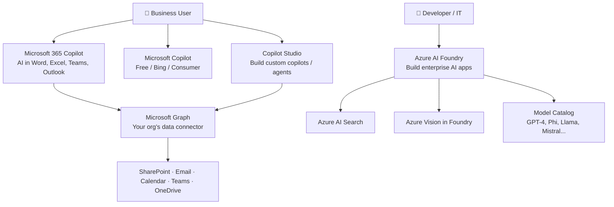
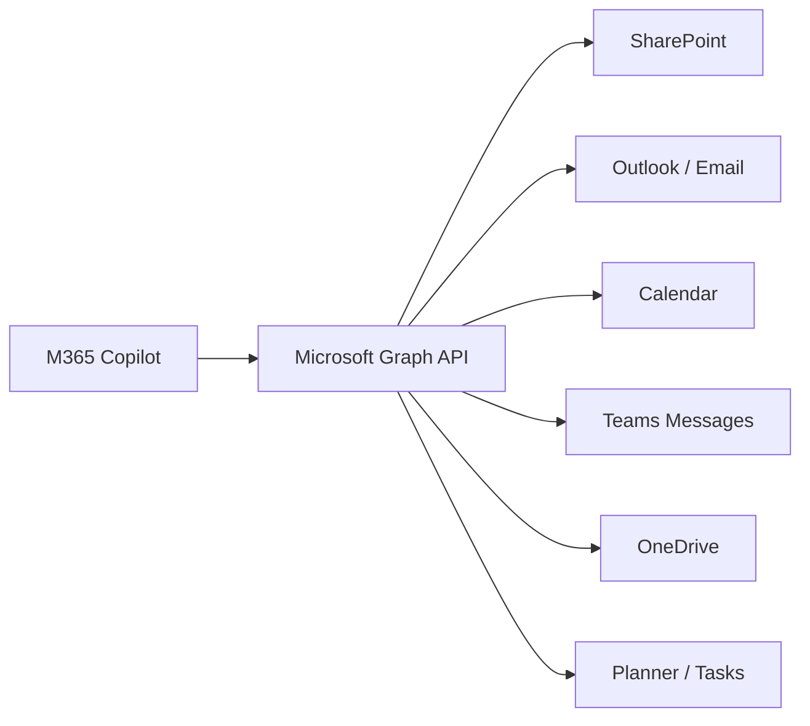
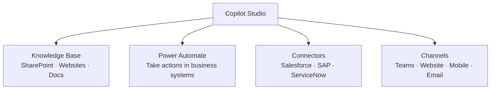

# Domain 2: Microsoft AI Apps & Services
**Exam Weight: 38% — Heaviest Domain (tied)**

---

## 🧠 The Golden Rule

> **"Microsoft 365 Copilot = AI embedded in your daily work apps. Foundry Tools = AI you build custom solutions with."**

<strong>Core distinction:</strong> If the scenario is about a business user in Word / Excel / Teams / Outlook getting AI help → M365 Copilot. If the scenario is about building a custom AI application, agent, or service → Foundry Tools / Azure AI Foundry. Copilot Studio sits in between — it lets non-developers build custom agents using M365 data.

---

## 2.1 The Microsoft AI Stack

---

## 2.2 Microsoft Copilot vs Microsoft 365 Copilot

<strong>This is a favourite exam trap.</strong> These are two different products.

| | **Microsoft Copilot** | **Microsoft 365 Copilot** |
|---|---|---|
| **Audience** | Anyone (consumer + business) | M365 subscribers (paid add-on) |
| **Powered by** | Bing + GPT | GPT + **Microsoft Graph** (your org data) |
| **Access to org data** | ❌ No | ✅ Yes — emails, docs, Teams chats, calendar |
| **Licence** | Free (Copilot) or included | Paid add-on (~$30/user/month) |
| **Use case** | General web research, tasks | Work productivity with YOUR org data |

The key differentiator: Microsoft Graph. M365 Copilot can answer "Summarise last week's emails about Project X" because it reads YOUR Graph data. Free Microsoft Copilot cannot do this.

---

## 2.3 Microsoft Graph — The Data Connector

Microsoft Graph is the **API layer that connects Copilot to your organisation's data** stored in Microsoft 365 services.

**Why it matters for Copilot:**
- When you ask Copilot "What are my action items from today's meetings?" — Graph pulls your Teams transcripts and calendar
- Copilot **respects existing permissions** — you only see data you're already authorised to see
- No data is shared across tenants

<mark>Exam key point: Microsoft Graph is WHY M365 Copilot knows about your specific org. Without Graph, Copilot would only know public internet information.</mark>

---

## 2.4 Copilot in Microsoft 365 Apps

| App | Key Copilot capabilities |
|---|---|
| **Word** | Draft, rewrite, summarise documents; generate from outline |
| **Excel** | Analyse data, generate formulas, create charts, highlight trends |
| **PowerPoint** | Generate presentations from a Word doc or prompt; add slides; design suggestions |
| **Outlook** | Draft emails, summarise threads, schedule meetings, coaching on tone |
| **Teams** | Meeting transcription + summary, action items, live translation, chat summaries |
| **OneNote** | Organise notes, generate summaries, create to-do lists |
| **Loop** | Collaborative workspaces with AI-generated content that stays in sync |

<strong>Exam pattern:</strong> "A manager needs to quickly catch up on a 2-hour meeting they missed. Which Copilot feature is most appropriate?" → Teams Copilot meeting recap / summary.

---

## 2.5 Copilot Chat (Web & Mobile)

**Copilot Chat** is the chat interface available at copilot.microsoft.com and in the Microsoft 365 mobile apps.

- Available to M365 users as part of their subscription (or free tier for consumer)
- Supports **web search** (grounded in Bing) + **work data** (via Graph, for M365 users)
- Supports **file uploads** for analysis
- Can generate images (via DALL·E integration)

**Work vs Web toggle:** In the M365 Copilot Chat interface, users can toggle between searching the web or searching their work data. This is a common exam concept.

---

## 2.6 Researcher and Analyst in Copilot

Two specialised **Copilot agents** available in Microsoft 365:

| Agent | Purpose | Best for |
|---|---|---|
| **Researcher** | Deep research using the web + your org data | Building comprehensive reports, competitive analysis, literature review |
| **Analyst** | Data analysis, running Python code, generating visualisations | Analysing spreadsheets, surfacing trends, creating charts from data |

Researcher = web + docs research. Analyst = data crunching. If the exam gives a scenario about analysing a sales CSV → Analyst. If it's about researching market trends → Researcher.

---

## 2.7 Microsoft Copilot Studio

**What it is:** A low-code/no-code platform to **build custom AI agents and copilots** connected to your organisation's data and processes.

**Who uses it:** IT professionals, power users, business analysts — no coding required.

**Key capabilities:**
- Create custom copilots with specific knowledge bases (SharePoint, websites, documents)
- Add to Teams, websites, mobile apps
- Integrate with Power Platform (Power Automate for actions)
- Connect to third-party systems via connectors
- Create custom agents for specific business functions (HR bot, IT helpdesk, sales assistant)

<strong>Build vs Buy vs Extend:</strong> <strong>Buy</strong> = Use M365 Copilot out-of-the-box (no customisation) <strong>Extend</strong> = Use Copilot Studio to customise/extend M365 Copilot <strong>Build</strong> = Use Azure AI Foundry to build a custom AI application from scratch

---

## 2.8 M365 Copilot Extensibility Framework

When out-of-the-box Copilot isn't enough, you can extend it:

| Extension type | What it does | Who builds it |
|---|---|---|
| **Plugins** | Give Copilot new capabilities (e.g., call your CRM API) | Developers |
| **Connectors** | Bring external data into Microsoft Graph | IT/Developers |
| **Declarative agents** | Copilot agents scoped to specific knowledge/tasks | Copilot Studio / Developers |
| **Custom engine agents** | Full custom AI agents using Azure AI Foundry | Developers |

<mark>Exam pattern: "A company wants Copilot to answer questions from their internal knowledge base in Confluence. What's the best approach?" → Build a declarative agent in Copilot Studio with the Confluence data.</mark>

---

## 2.9 Azure AI Foundry and Foundry Tools

**Azure AI Foundry** is Microsoft's platform for building, deploying, and managing enterprise AI solutions.

### What's in Foundry Tools

| Tool | What it does |
|---|---|
| **Microsoft Foundry** | End-to-end AI project hub — model selection, prompt flows, evaluation, deployment |
| **Azure AI Search** | Vector + semantic search — the retrieval layer for RAG solutions |
| **Azure Vision in Foundry Tools** | Computer vision — image analysis, OCR, object detection, face analysis |
| **Model Catalog** | Access to hundreds of models: OpenAI (GPT-4o), Microsoft (Phi), open source (Llama, Mistral) |

### Benefits of Foundry Tools
- **Scalability** — scales from prototype to millions of users on Azure infrastructure
- **Security** — enterprise-grade access control, private networking, content filters
- **Choice** — use any model from the catalog, not locked to one vendor
- **Governance** — built-in responsible AI tooling, content safety filters, evaluations

<strong>Business scenario → Tool mapping:</strong> 📄 Understand documents from photos → Azure Vision (OCR) 🔍 Search across thousands of internal documents → Azure AI Search 🤖 Build a custom customer service bot → Microsoft Foundry + Copilot Studio 📊 Analyse images from a factory floor → Azure Vision in Foundry Tools

---

## 2.10 Matching AI Models to Business Needs

Not all models are equal. The exam tests your ability to match:

| Business need | Model characteristic to look for |
|---|---|
| Real-time chat with customers | Low latency, cost-effective (smaller model e.g. Phi) |
| Complex legal document analysis | High accuracy, large context window (GPT-4o) |
| Code generation at scale | Code-specialised model |
| Multilingual customer support | Strong multilingual capabilities |
| Image understanding | Multimodal model (vision + text) |
| On-premise deployment | Small, deployable model (Phi-3 mini) |

The exam won't ask you to memorise specific model benchmarks. It tests the concept: bigger/more expensive model ≠ always better. Match capability to task. Phi-3 for simple tasks, GPT-4o for complex reasoning.

---

## 🎯 Domain 2 Exam Traps

| Trap | Correct answer |
|---|---|
| "Copilot" vs "M365 Copilot" | M365 Copilot has Microsoft Graph access; base Copilot does not |
| "Build vs Extend" | Try Copilot Studio extension before building from scratch in Foundry |
| "Researcher vs Analyst" | Researcher = web/doc research; Analyst = data analysis with code |
| "Azure AI Search" | It's the retrieval/search layer for RAG — not just a search engine |
| "Copilot sees all data" | Copilot respects existing M365 permissions — can't access what user can't access |
