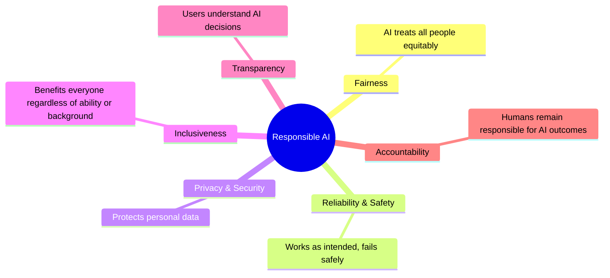
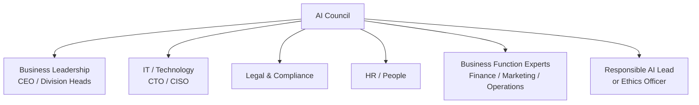
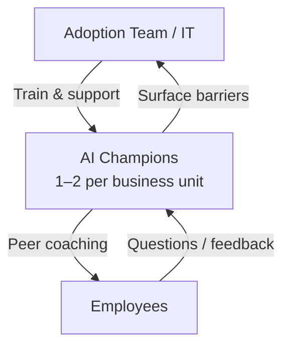
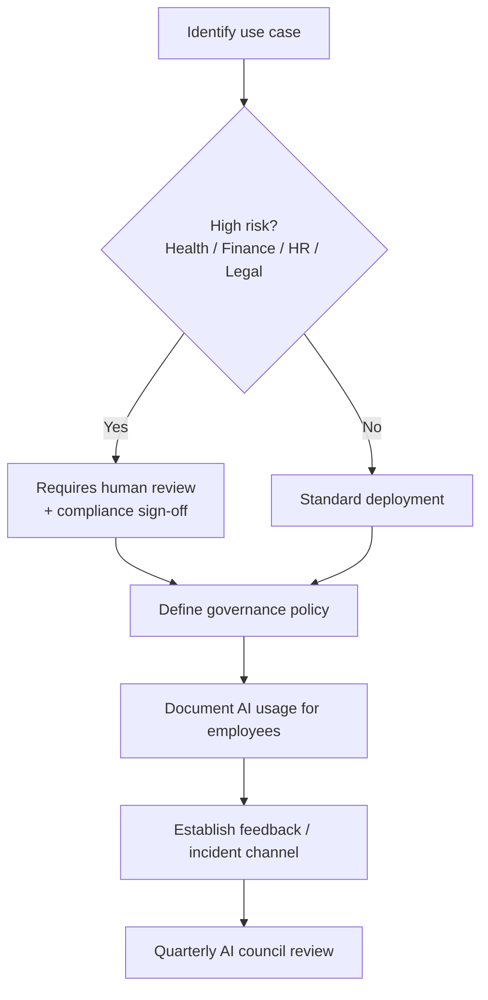

# Domain 3: Implementation & Adoption Strategy
**Exam Weight: 24%**

---

## 🧠 The Golden Rule

> **"AI adoption fails from culture and governance, not technology. The exam tests the people and process side, not the technical side."**

<strong>This domain is about leading change, not building software.</strong> Questions will be about forming governance bodies, removing adoption barriers, championing responsible AI, and managing licences. No technical implementation required.

---

## 3.1 Microsoft's Responsible AI Principles

Microsoft defines **6 core principles** plus 2 that are sometimes listed separately. Know all 8:

| Principle | What it means for the exam |
|---|---|
| **Fairness** | AI shouldn't discriminate based on race, gender, age, disability |
| **Reliability** | AI should work consistently; failures should be predictable and safe |
| **Safety** | AI should not cause harm; safety must be built in, not bolted on |
| **Privacy** | Personal data must be protected; data minimisation |
| **Security** | AI systems must be protected from attack and misuse |
| **Inclusiveness** | AI should work for everyone, including people with disabilities |
| **Transparency** | Users should know when they're interacting with AI and how it works |
| **Accountability** | Humans must remain answerable for AI decisions — AI doesn't absolve responsibility |

The exam will give you a scenario and ask which responsible AI principle is being violated or upheld. The most common traps are: Fairness (bias scenarios), Transparency (hidden AI), and Accountability (blaming the AI for a decision).

---

## 3.2 AI Governance: Establishing Principles

Good AI governance means having **written policies** before deploying AI — not figuring it out after problems occur.

### Governance Checklist

- ✅ **Acceptable use policy** — what can employees use AI for, and what's off-limits
- ✅ **Data handling policy** — what data can be fed into AI systems
- ✅ **Output review policy** — which AI outputs require human review before action
- ✅ **Incident response plan** — what to do when AI produces harmful output
- ✅ **Audit trail** — logging AI usage for compliance

<strong>Exam pattern:</strong> "A company is deploying M365 Copilot. What should they establish BEFORE rollout?" → Acceptable use policy and data governance policy. Not: wait for issues to arise.

---

## 3.3 AI Council

An **AI Council** (sometimes called an AI steering committee or AI governance board) is a cross-functional team that:

- **Sets AI strategy** for the organisation
- **Reviews and approves** AI use cases before deployment
- **Monitors** ongoing AI usage for compliance and risk
- **Ensures** alignment with business goals and responsible AI principles

### Composition of an AI Council

Exam trick: the AI Council is cross-functional — it's NOT just IT. A council that's only IT misses the business, legal, and HR perspectives. The exam will make a "wrong" answer where the council is only technical people.

---

## 3.4 Planning AI Adoption

### Step 1: Establish an Adoption Team

The **adoption team** owns the rollout — not IT alone, not management alone.

| Role | Responsibility |
|---|---|
| **Executive Sponsor** | Provides funding, removes political blockers, signals "this matters" |
| **Adoption Lead** | Day-to-day programme management |
| **IT/Security** | Technical deployment, licence management, security controls |
| **Change Management** | Training, communication, feedback loops |
| **AI Champions** | Peer advocates embedded in business units (see 3.5) |

### Step 2: Identify Common Barriers to Adoption

<strong>These barriers appear directly in exam questions:</strong> 🚧 <strong>Fear of job loss</strong> — address through communication and reskilling 🚧 <strong>Lack of trust</strong> — address through transparency and showing ROI 🚧 <strong>Skills gap</strong> — address through training and champions 🚧 <strong>Data quality</strong> — AI is only as good as your data; fix data first 🚧 <strong>Security / compliance concerns</strong> — address through governance policies 🚧 <strong>Change fatigue</strong> — prioritise use cases, don't do everything at once

---

## 3.5 AI Champions Programme

An **AI champions programme** identifies enthusiastic early adopters in each business unit who:

- Are trained deeply on AI tools
- Serve as **peer coaches** for their colleagues (more trusted than IT/management)
- Collect and escalate **feedback** from their teams
- **Demonstrate** real use cases in their own work
- Drive grassroots adoption bottom-up

Champions are peers, not managers. People learn from their colleagues more readily than from top-down mandates. This is the single most effective adoption lever the exam tests.

---

## 3.6 Data, Security, Privacy, and Cost Impacts

Before rolling out AI, a business leader must understand:

| Impact area | What to assess |
|---|---|
| **Data** | What data will Copilot/AI access? Is it classified? Are permissions correct? |
| **Security** | Who can use AI features? What audit logging is in place? Prevent prompt injection. |
| **Privacy** | Does AI usage comply with GDPR / regional data laws? Where is data processed? |
| **Cost** | Licence cost + compute cost + training cost. Model token costs if using custom solutions. |

<strong>M365 Copilot data boundary:</strong> Microsoft 365 Copilot processes data within your Microsoft 365 tenant boundary. Your data is not used to train foundation models. This is a common exam reassurance question.

---

## 3.7 Copilot Licence Types

The exam tests **three Copilot licence models**:

| Licence type | Description | Best for |
|---|---|---|
| **Included with Microsoft 365** | Basic Copilot features bundled (varies by M365 plan) | Small / existing M365 customers |
| **Microsoft 365 Copilot (monthly subscription)** | Full M365 Copilot with Graph integration — per-user per-month | Committed org-wide rollout |
| **Pay-as-you-go** | Metered usage via Azure (for Copilot extensibility / agents) | Variable workloads, pilot programmes |

Know the pattern: monthly subscription = predictable cost for known users. Pay-as-you-go = flexible, scales with usage, better for pilots or bursty demand.

---

## 3.8 Foundry Tools Subscription Models

| Model | Description | Best for |
|---|---|---|
| **Pay-as-you-go** | Pay for tokens/API calls actually used, no commitment | Pilots, prototyping, variable workloads |
| **Commitment tiers (Provisioned Throughput)** | Reserve capacity at a discounted rate per hour | Production workloads with predictable volume |

<strong>Key business logic:</strong> Start with pay-as-you-go for piloting. Once you have predictable usage patterns, move to commitment tiers to reduce per-unit cost. The exam tests that you know this progression.

---

## 3.9 Responsible AI in Practice: Implementation Checklist

Before deploying any AI solution, a leader should verify:

---

## 🎯 Domain 3 Exam Traps

| Trap | Correct answer |
|---|---|
| "AI Council = IT only" | Cross-functional: Legal, HR, Business, IT, Ethics |
| "What to do BEFORE rollout" | Establish acceptable use policy and data governance FIRST |
| "Best adoption lever" | AI Champions programme — peer advocates per business unit |
| "Monthly vs pay-as-you-go" | PAYG for pilots/variable; monthly for committed org rollout |
| "Data used to train GPT?" | No — M365 Copilot does NOT use your data to train foundation models |
| "Who is accountable for AI decisions?" | Humans — not the AI. Accountability is always with people (Responsible AI principle) |
| "Commitment tiers" | Foundry Tools only — reserved throughput for production workloads |
