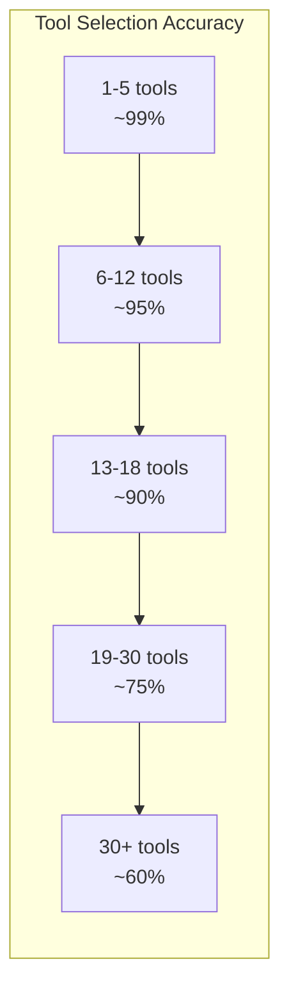
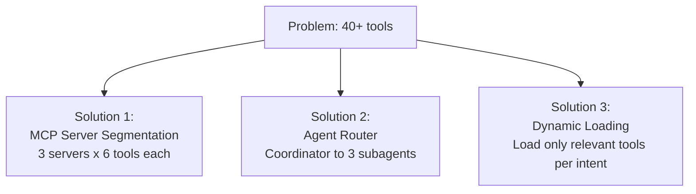
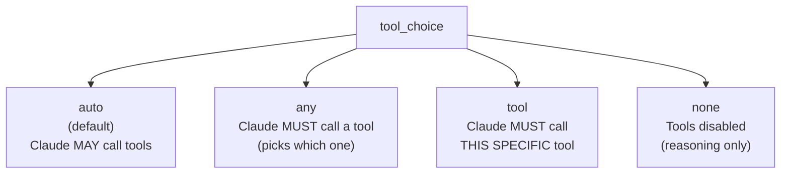
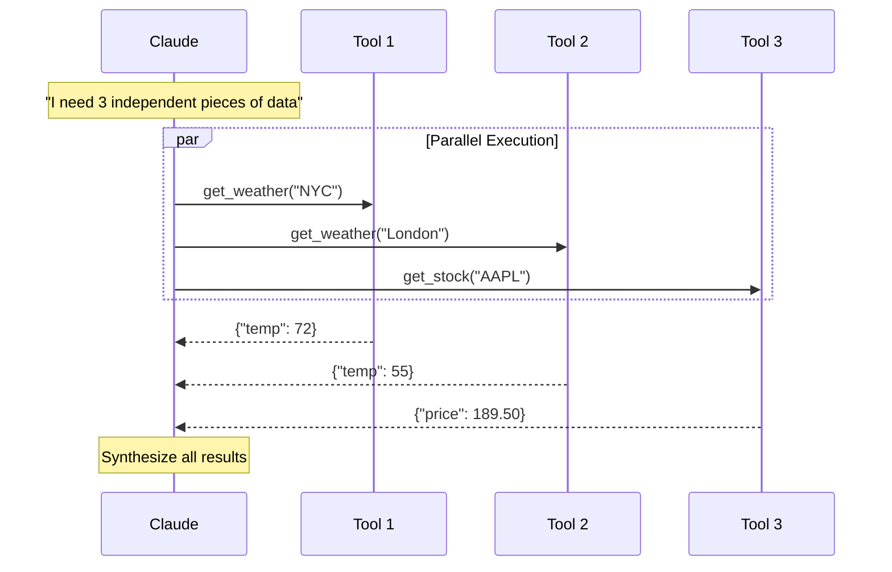
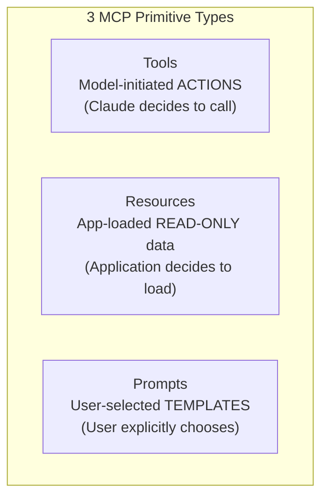
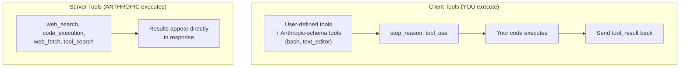
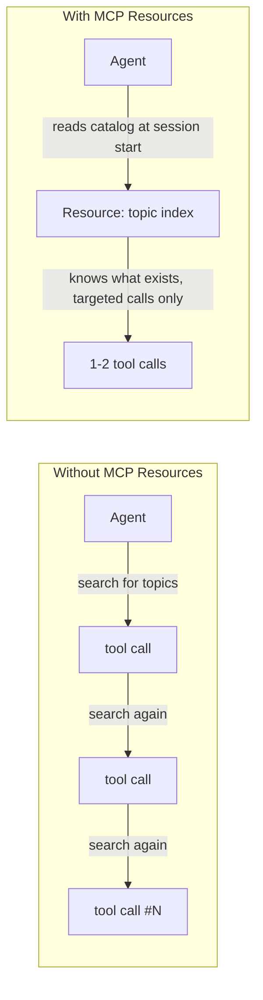

# Domain 4: Tool Design & MCP (Model Context Protocol)
**Exam Weight: 18%**

---

## Core Principle

> **"Fewer, well-described tools beat many poorly-described tools. Under 18 tools, every time."**

---

## 4.1 The 18-Tool Cliff

Your agent has 42 tools. The PM says "just add one more." You watch the logs: Claude calls `update_customer_address` when the user asks to cancel an order. Another request, Claude calls `search_orders` instead of `search_customers`. Same naming patterns, descriptions that all start with "This tool handles..."---and now the model is basically guessing.

<div class="note-important"><strong>The 18-Tool Cliff is the most cited accuracy boundary in Anthropic's documentation.</strong> Past 18 tools, selection accuracy degrades from ~90% to below 75%.</div>



### Why It Happens

Each tool adds **name + description + schema** to the context. Past ~18 tools:
- Similar descriptions blur together
- Claude "compares" all tools before choosing---more comparisons, more confusion
- Selection becomes semi-random for tools with overlapping phrasing

<div class="note-scribble">Mental model: 18 tools = 18 job postings on a board. Would YOU pick the right one if 40 postings all said "handles customer stuff"?</div>

### Use Case: "The 40-Tool Disaster"

Your enterprise team built a monolith MCP server. 40 tools. One namespace. Every third request, Claude picks the wrong one. Three solutions exist---all tested in production:



**Solution 1: Multiple MCP Servers** --- Split by domain, each stays well under 18.

```json
{
  "mcpServers": {
    "database": { "command": "node", "args": ["./mcp/db.js"] },
    "deploy": { "command": "python", "args": ["./mcp/deploy.py"] },
    "monitor": { "command": "node", "args": ["./mcp/monitor.js"] }
  }
}
```

**Solution 2: Agent Router** --- Coordinator sees meta-tools, not 40 individuals.

```python
# Coordinator sees 3 meta-tools (not 40 individual tools)
coordinator_tools = [
    {"name": "database_agent", "description": "ALL data tasks"},
    {"name": "deploy_agent", "description": "ALL deployment tasks"},
    {"name": "monitor_agent", "description": "ALL observability tasks"},
]
# Each subagent has its own focused 5-10 tools
```

**Solution 3: Dynamic Loading** --- Load tools per classified intent.

```python
def get_tools_for_intent(message: str) -> list:
    intent = classify_intent(message)
    if intent == "database": return db_tools       # 6 tools
    elif intent == "deploy": return deploy_tools   # 5 tools
    else: return base_tools                        # 4 tools
```

<div class="note-trap"><strong>TRAP:</strong> The exam may suggest "just add better descriptions" as a fix for 40 tools. Descriptions help, but the 18-tool cliff is a structural limit---you MUST reduce the number visible per turn.</div>

---

## 4.2 Tool Description Engineering

Your agent picked `search_orders` instead of `search_customers` for the fifth time today. Same tool name pattern, nearly identical descriptions: "Search for things in the system." Both return JSON. Both take a `query` string. Claude had *no signal* to differentiate them.

<mark>Tool descriptions are like job postings --- if two sound the same, candidates apply to the wrong one.</mark>

### The 3-Element Rule

Every tool description MUST have these three components, no exceptions:

```
1. WHAT it does (purpose)
2. WHEN to use it (positive trigger)
3. WHEN NOT to use it (negative --- prevents confusion)
```



<div class="note-important"><strong>The WHEN NOT section is the most impactful element.</strong> Without it, Claude has no negative signal to reject a tool that looks 80% correct.</div>

```mermaid
graph TD
    D["Tool Description"] --> W["WHAT: Primary purpose"]
    D --> Y["WHEN: Use triggers"]
    D --> N["WHEN NOT: Disambiguation"]
    
    style N fill:#1e293b,stroke:#ef4444
```

### Use Case: "The Tool That Cried Wolf"

Two tools: `search_knowledge_base` and `get_customer`. Both vaguely "search for info." Without negative descriptions, Claude calls `search_knowledge_base` for account lookups because the word "search" matches. The fix:

```python
# BAD --- Claude doesn't know what, when, or when not
@mcp.tool()
def search(query: str) -> str:
    """Search for things."""

# GOOD --- All 3 elements present
@mcp.tool()
def search_knowledge_base(query: str) -> dict:
    """Search the internal product knowledge base for support articles.
    
    Use when: Customer asks about product features, pricing, or 
    troubleshooting steps covered in help documentation.
    
    Do NOT use when:
    - Looking up customer account data (use get_customer instead)
    - Checking order status (use get_order instead)  
    - Company policy questions (use get_policy instead)
    
    Returns: Top 5 matching articles with titles and excerpts.
    """
```

<div class="note-scribble">The "Do NOT use when" section is doing 80% of the disambiguation work. It's the most underrated part of tool design.</div>

### Another Strong Example

```python
@mcp.tool()
def create_ticket(title: str, description: str, priority: str) -> dict:
    """Create a new support ticket in the ticketing system.
    
    Use when: Issue requires tracking or follow-up beyond current conversation.
    
    Do NOT use when:
    - Issue resolved in this conversation (no ticket needed)
    - Ticket already exists (use update_ticket instead)
    - It's a feature request (use submit_feature_request instead)
    
    Priority: "critical" (system down), "high" (major broken), 
    "medium" (minor broken), "low" (questions/nice-to-haves)
    """
```

<div class="note-trap"><strong>TRAP:</strong> The exam may show a description with only "what" and "when." That's still a bad description. All THREE elements are required for production-quality tool design.</div>

---

## 4.3 tool_choice Modes

It's Friday afternoon. Your PM says: "Claude keeps chatting instead of calling the classifier. Just make it call the tool." You set `tool_choice: {"type": "tool", "name": "classify_intent"}`. Claude now **cannot refuse**---it must produce valid JSON matching that tool's schema. Problem solved. Ship it.



### When to Use Each

| Mode | API Code | Use Case |
|------|----------|----------|
| `auto` | `{"type": "auto"}` | General chat that MAY need tools |
| `any` | `{"type": "any"}` | Every response MUST produce structure |
| `tool` (forced) | `{"type": "tool", "name": "X"}` | **Guaranteed** specific JSON output |
| `none` | `{"type": "none"}` | Planning step (no execution) |

### Use Case: "The Guaranteed Schema Machine"

<mark>Forced tool = the most reliable way to get structured output from Claude.</mark> When you force a tool, Claude cannot respond with text, cannot refuse, cannot add caveats. It MUST fill the schema.

```python
response = client.messages.create(
    model="claude-sonnet-4-20250514",
    tools=tools,
    tool_choice={"type": "tool", "name": "classify_intent"},  # MUST call this
    messages=[{"role": "user", "content": customer_message}]
)
# Claude CANNOT refuse or respond with text --- must produce valid schema
result = response.content[0].input  # {"intent": "complaint", "confidence": 0.92}
```

<div class="note-important"><strong>tool_choice controls WHETHER a tool is called. strict: true controls WHETHER the output matches schema exactly.</strong> They solve different problems and stack together.</div>

<div class="note-scribble">Mental model: tool_choice = "you MUST fill this form." strict: true = "and every field must match the type declarations perfectly."</div>

<div class="note-trap"><strong>TRAP:</strong> The exam will test the difference between tool_choice (forces the call) and strict: true (guarantees schema). They are NOT the same thing. Forced tool_choice alone doesn't guarantee schema---it just guarantees the call happens.</div>

---

## 4.4 Parallel Tool Calls

Claude is helping a user plan a trip. It needs the weather in NYC, the weather in London, and the AAPL stock price. These are *independent* --- no result depends on another. So Claude fires all three in a single response, as parallel `tool_use` blocks. Your code must handle all of them and send results back in one message.



### Your Code Must Handle Multiple Results

```python
# Claude's response contains multiple tool_use blocks
tool_results = []
for block in response.content:
    if block.type == "tool_use":
        result = execute_tool(block.name, block.input)
        tool_results.append({
            "type": "tool_result",
            "tool_use_id": block.id,  # MUST match!
            "content": json.dumps(result)
        })

# Send ALL results back in ONE message
messages.append({"role": "assistant", "content": response.content})
messages.append({"role": "user", "content": tool_results})
```

<div class="note-important"><strong>tool_use_id MUST match between the tool call and the result.</strong> Mismatched IDs = broken conversation state.</div>

### Parallel vs Sequential Decision

| Parallel | Sequential |
|---|---|
| Independent data fetches | Step B needs Step A's output |
| Multiple analyses of same input | Conditional logic (if A then B else C) |
| Same tool, different params | Stateful operations (write then verify) |

<div class="note-scribble">If you can draw the calls side-by-side with no arrows between them, it's parallel. If there's a "then" relationship, it's sequential.</div>

---

## 4.5 Graceful Tool Failure

Your `get_customer` tool crashes with an unhandled `ConnectionRefusedError`. The tool returns `None`. Claude sees... nothing useful. So it does what any model would do with missing data: it makes something up. The user gets a confident answer about a customer that doesn't exist. Welcome to "The Null That Hallucinated."

```mermaid
graph TD
    T[Tool Executes] --> R{Result?}
    R -->|"Success"| S["OK: {success: true, data: {...}}"]
    R -->|"Known error"| E["Error: {error: not_found, suggestion: ...}"]
    R -->|"Crash"| F["CRASH: Generic error or None"]
    
    S --> CU[Claude uses data]
    E --> CD[Claude follows suggestion]
    F --> CC[Claude confused, may hallucinate]
    
    style F fill:#1e293b,stroke:#ef4444
    style CC fill:#1e293b,stroke:#ef4444
```

<mark>A tool crash or None return is the number one cause of Claude hallucinating factual data in agentic systems.</mark>



### Use Case: "The Null That Hallucinated"

The user asks "What's the status of order ORD-999?" Your tool throws an exception and returns nothing. Claude responds: "Your order ORD-999 is currently in transit, expected delivery Thursday." Completely fabricated. The fix: **always return structured errors with guidance.**

```python
@mcp.tool()
def get_customer(customer_id: str) -> dict:
    """Look up customer by ID."""
    try:
        customer = db.find(customer_id)
        if not customer:
            return {
                "error": "customer_not_found",
                "message": f"No customer '{customer_id}'. Format: CUS-XXXXX.",
                "suggestion": "Try search_customer_by_email instead."
            }
        return {"success": True, "data": serialize(customer)}
    except DatabaseTimeoutError:
        return {
            "error": "database_timeout",
            "message": "DB timed out (5s). Usually transient.",
            "suggestion": "Retry in a moment."
        }
```

### What Claude Does With Each Return Type

| Return | Claude's Behavior |
|--------|------------------|
| `{"success": true, "data": {...}}` | Uses data normally |
| `{"error": "not_found", "suggestion": "..."}` | Follows suggestion |
| `{"error": "timeout", "suggestion": "retry"}` | May retry |
| Tool crashes / returns `None` | **May hallucinate data!** |

<div class="note-trap"><strong>TRAP:</strong> The exam loves testing what happens on None/crash returns. The answer is ALWAYS "Claude may hallucinate." Structured error returns are the fix. Never let a tool return nothing.</div>

<div class="note-scribble">Think of structured errors as "redirects" for Claude. You're saying "go HERE instead" rather than leaving it lost in a dead end with no signal.</div>

---

## 4.6 MCP Primitives

Your team is designing an MCP server and someone asks: "Should we make the refund policy a tool or a resource?" Another person says: "And what about the escalation template?" These three things *feel* similar --- they all provide info --- but MCP distinguishes them by **who initiates the interaction.**

<mark>MCP Primitives: Tools = employee actions, Resources = reference books on the shelf, Prompts = forms the user fills out.</mark>



### The Initiation Model (Exam-Critical)

| Primitive | Initiated By | Analogy | Example |
|-----------|:---:|---|---|
| **Tool** | Model | Employee does a task | `send_email()`, `run_query()` |
| **Resource** | Application | Book on the shelf, app grabs it | `customer://123/profile` |
| **Prompt** | User | Form the user picks and fills | `/escalation_template` |

<div class="note-important"><strong>Who initiates each primitive is THE exam question for MCP.</strong> Tools = model. Resources = application. Prompts = user. Memorize this.</div>

### Code Examples

```python
# TOOL --- Claude decides when to call (model-initiated)
@mcp.tool()
def send_email(to: str, subject: str, body: str) -> dict:
    """Send email. Use when: customer requests confirmation."""
    return {"sent": True, "message_id": "msg_123"}

# RESOURCE --- Application pre-loads into context (app-initiated)
@mcp.resource("support://policies/refund")
def refund_policy() -> str:
    """Current refund policy. Loaded when support session starts."""
    return "Full refund within 30 days..."

# PROMPT --- User explicitly selects (user-initiated, like a slash command)
@mcp.prompt()
def escalation_template(severity: str) -> list:
    """Template for escalating to engineering."""
    return [{"role": "user", "content": f"Draft {severity} escalation..."}]
```

<div class="note-scribble">If the exam says "application loads data at session start" --- that's a Resource. If "Claude decides to do something" --- Tool. If "user picks a template from a menu" --- Prompt.</div>

<div class="note-trap"><strong>TRAP:</strong> Resources are READ-ONLY. If the exam describes writing/mutating data, that's a Tool, not a Resource --- regardless of what the data looks like.</div>

---

## 4.7 FastMCP Server (Complete Example)

You've been asked to build a customer support MCP server. It needs: a tool to look up orders, a resource for the refund policy (loaded at session start), and it needs to run on stdio transport for local development. Here's the complete implementation:

```python
from fastmcp import FastMCP

mcp = FastMCP("customer-support", description="Support tools")

@mcp.tool()
def lookup_order(order_id: str) -> dict:
    """Look up order details by ID.
    
    Use when: Customer asks about order status or shipping.
    Do NOT use when: General questions not about a specific order.
    Format: ORD-XXXXXXXX (8 alphanumeric after prefix)
    """
    if not order_id.startswith("ORD-") or len(order_id) != 12:
        return {"error": "invalid_format", "message": "Expected: ORD-XXXXXXXX"}
    
    order = db.orders.find(order_id)
    if not order:
        return {"error": "not_found", "message": f"No order {order_id}"}
    
    return {
        "order_id": order.id,
        "status": order.status,
        "items": [{"name": i.name, "qty": i.qty} for i in order.items],
        "eta": order.estimated_delivery.isoformat()
    }

@mcp.resource("support://policies/refund")
def refund_policy() -> str:
    """Refund policy loaded at session start."""
    return "Full refund <30 days. 50% refund 31-60 days. No refund >60 days."

if __name__ == "__main__":
    mcp.run()  # stdio transport (default)
```

### Wire It Up

```json
{
  "mcpServers": {
    "customer-support": {
      "command": "python",
      "args": ["./mcp-servers/support.py"],
      "transport": "stdio"
    }
  }
}
```

<div class="note-scribble">Notice: the tool has all 3 description elements, validates input format, returns structured errors on failure. This is the pattern to internalize for the exam.</div>

---

## 4.8 JSON Schema for Tool Parameters

Claude reads your tool's JSON Schema to know what params to fill. Vague schemas produce vague calls. Your schema IS your documentation for the model.

### Use Case: "The Ambiguous Parameter"

Tool: `search_products(query, limit, status)`. No format hints. Claude sends `limit: "ten"` (string) and `status: "ACTIVE"` (wrong case). Your tool crashes. The fix: constrain everything in the schema.

### Key Practices

| Practice | Example |
|----------|---------|
| Specify format | `"description": "ISO date (YYYY-MM-DD)"` |
| Declare defaults | `"default": 10` |
| Set ranges | `"minimum": 1, "maximum": 100` |
| Use enums | `"enum": ["active", "archived", "all"]` |
| Mark required | `"required": ["query"]` |

```json
{
  "type": "object",
  "properties": {
    "query": {"type": "string", "description": "Search query. Max 200 chars."},
    "limit": {"type": "integer", "default": 10, "minimum": 1, "maximum": 100},
    "status": {"type": "string", "enum": ["active", "archived", "all"], "default": "active"}
  },
  "required": ["query"]
}
```

<div class="note-important"><strong>Enums + ranges + descriptions in the schema = Claude sends correct types every time.</strong> Vague schemas produce garbage inputs.</div>

<div class="note-scribble">Think of the schema as the "form validation rules" Claude sees before it fills in the form. More constraints = fewer mistakes.</div>

---

## 4.9 Claude 101 — Tool Use Fundamentals (2026)

You integrate tool use for the first time. You define a `web_search` tool in your API call. Claude returns a result... but you never executed anything. Wait — `web_search` is a **server tool**. Anthropic executed it for you on their side. Your custom tools? Those are **client tools** — you must execute them yourself and send back results.

### Two Categories of Tools



<div class="note-important"><strong>Server tools need NO tool_result from you.</strong> The results are embedded in Claude's response. Client tools require your code to execute them and send a tool_result message.</div>

### Server Tools (No Execution Needed)

```python
# Server tool — Anthropic handles execution
response = client.messages.create(
    model="claude-opus-4-7",
    max_tokens=1024,
    tools=[{"type": "web_search_20260209", "name": "web_search"}],
    messages=[{"role": "user", "content": "What's the latest on Mars rover?"}],
)
# Results are IN the response — no tool_result needed from you
```

### Strict Tool Use (Schema Guarantees)

Add `strict: true` to ensure Claude's tool calls **always** match your schema exactly:

```python
tools = [{
    "name": "extract_data",
    "description": "Extract structured data from text",
    "strict": True,  # GUARANTEES schema conformance
    "input_schema": {
        "type": "object",
        "properties": {
            "name": {"type": "string"},
            "age": {"type": "integer", "minimum": 0}
        },
        "required": ["name", "age"]
    }
}]
```

<div class="note-trap"><strong>TRAP:</strong> strict: true on tool definitions guarantees schema compliance at the API level. This is DIFFERENT from tool_choice which controls WHETHER a tool is called, not whether the output conforms. The exam WILL test this distinction.</div>

### Tool Use Pricing

Tools add tokens to your request. Per-model overhead for enabling tools:

| Config | Additional System Tokens |
|--------|------------------------|
| `tool_choice: auto` or `none` | ~346 tokens |
| `tool_choice: any` or `tool` | ~313 tokens |

Plus: tool definitions (names + descriptions + schemas) + tool_use blocks + tool_result blocks all count as input/output tokens.

<div class="note-scribble">More tools = more tokens = more cost, even if they're never called. Another reason to keep it under 18.</div>

### Complete Agentic Tool Loop

This is the canonical pattern. If the exam shows an agentic loop and asks what's wrong, you need this structure memorized:

```python
messages = [{"role": "user", "content": user_input}]

while True:
    response = client.messages.create(
        model="claude-sonnet-4-20250514",
        max_tokens=4096,
        tools=tools,
        messages=messages,
    )
    
    # Check if Claude wants to use tools
    if response.stop_reason == "end_turn":
        break  # Done — final text response
    
    # Process ALL tool calls (may be parallel)
    tool_results = []
    for block in response.content:
        if block.type == "tool_use":
            result = execute_tool(block.name, block.input)
            tool_results.append({
                "type": "tool_result",
                "tool_use_id": block.id,
                "content": json.dumps(result)
            })
    
    # Append assistant response + tool results
    messages.append({"role": "assistant", "content": response.content})
    messages.append({"role": "user", "content": tool_results})
```

<div class="note-important"><strong>The agentic loop continues until stop_reason == "end_turn".</strong> If stop_reason == "tool_use", Claude needs you to execute tools and return results. Breaking on the wrong condition = broken agent.</div>

<div class="note-trap"><strong>TRAP:</strong> The tool_results go in a message with role "user" — NOT "tool" or "system". The assistant's response (including its tool_use blocks) must also be appended BEFORE the results. Skipping either breaks the loop.</div>

---

## 📋 Domain 4 Cheat Sheet

| Concept | Key Fact |
|---------|----------|
| Tool limit | <mark>~18 tools before accuracy drops significantly</mark> |
| Tool description | MUST have: what + when to use + when NOT to use |
| Guaranteed JSON | `tool_choice: {"type": "tool", "name": "X"}` |
| Schema guarantee | `strict: true` on tool definition (different from tool_choice!) |
| Parallel calls | Independent tools called in same response, matched by `tool_use_id` |
| Error returns | Structured `{error, message, suggestion}` — never None/crash |
| MCP Tools | Model-initiated (Claude decides) |
| MCP Resources | App-initiated (loaded at session start, read-only) |
| MCP Prompts | User-initiated (user explicitly selects) |
| MCP transport | stdio for local dev tools |
| Server tools | No `tool_result` needed — Anthropic executes them |
| Client tools | YOU execute and send `tool_result` back |
| Tool confusion fix | Reduce tools OR improve "Do NOT use when" descriptions |
| Agentic loop exit | `stop_reason == "end_turn"` (NOT `"tool_use"`) |
| Tool pricing | ~313-346 token overhead just for enabling tools |

<div class="note-scribble">If you remember ONE thing from Domain 4: under 18 tools, 3-element descriptions, structured error returns. That's 60% of the questions right there.</div>

---

## 4.6 MCP Resources vs Tools

<div class="note-important"><strong>Explicitly in exam guide appendix.</strong> Resources are the mechanism to expose content catalogs — distinct from tools.</div>

### The Three MCP Primitives

| Primitive | Who Initiates | Purpose | Example |
|---|---|---|---|
| **Tools** | Claude (model) | Execute actions | `search_issues`, `create_ticket` |
| **Resources** | Application | Expose read-only content catalogs | Issue list, DB schema, doc hierarchy |
| **Prompts** | User | User-selectable prompt templates | `/review`, `/summarise` |

### Why Resources Matter for Exams

Without resources, an agent exploring a knowledge base must call tools repeatedly (exploratory tool calls) just to discover what content exists. Resources give the agent **visibility upfront**.



<div class="note-trap"><strong>TRAP:</strong> Question asks how to reduce exploratory tool calls. Answer involves exposing a content catalog as an MCP resource — NOT adding more tools.</div>

---

## 4.7 The isError Flag & Structured Error Taxonomy

The `isError` flag is the MCP-native way to signal tool failures back to the agent **without throwing exceptions**.

```typescript
// ✅ Correct MCP error return
return {
  isError: true,
  content: [{
    type: "text",
    text: JSON.stringify({
      errorCategory: "transient",   // transient | validation | permission | business
      isRetryable: true,
      message: "Database connection timeout after 5s",
      attemptedQuery: "SELECT * FROM orders WHERE id = ?",
      suggestion: "Retry in 2-3 seconds"
    })
  }]
}
```

### Error Category Taxonomy

| Category | isRetryable | Agent Action |
|---|---|---|
| `transient` | `true` | Retry with exponential backoff |
| `validation` | `false` | Fix input parameters and retry |
| `permission` | `false` | Escalate to human / surface to user |
| `business` | `false` | Explain policy to user, don't retry |

### Edit Tool Fallback Pattern

When the `Edit` built-in tool fails because anchor text is non-unique:

```
Edit tool error: "Found multiple matches for anchor text"
→ Fall back to: Read (full file) → Write (full file with changes)
```

<div class="note-trap"><strong>TRAP:</strong> Questions ask "Edit failed with non-unique match — what next?" Answer: Read + Write fallback. NOT: try Edit again with different anchor text.</div>
